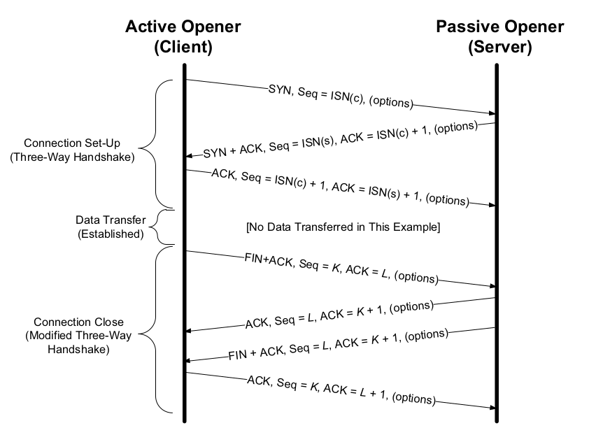
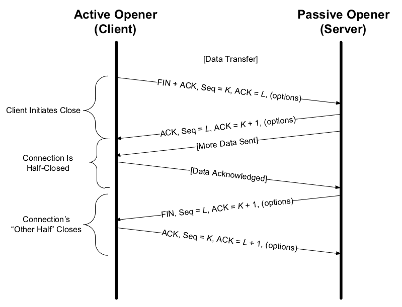
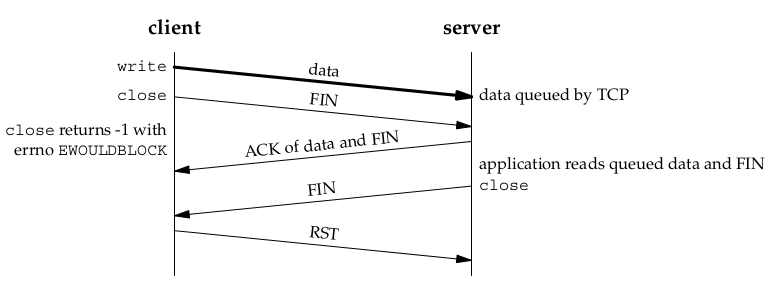
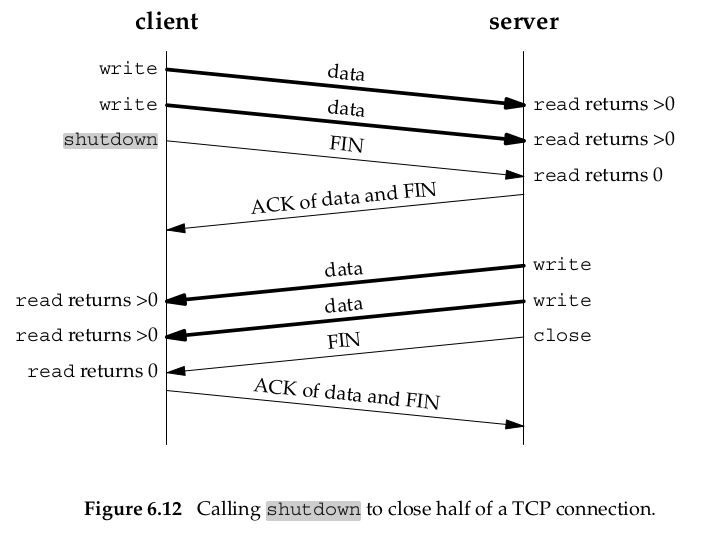

# Socket Close/Shutdown

Socket 的关闭，听起来是再简单不过的事情，不就是一个 `close(fd)` 的调用吗？ 下面慢慢道来。


## Socket 关闭相关模型

在开始分析一个事情前，我习惯先为事件相关方建立模型，然后边分析，边完善模型。这样分析逻辑时，就可以比较全面，且前后因果逻辑可以推演和检查。关键是，模型可以重用。
研究 Socket 关闭也不例外。

:::{figure-md} 图：Socket 关闭相关模型
:class: full-width


*图：Socket 关闭相关模型*  
:::
*[用 Draw.io 打开](https://app.diagrams.net/?ui=sketch#Uhttps%3A%2F%2Fdevops-insider.mygraphql.com%2Fzh_CN%2Flatest%2F_images%2Fsocket-close.drawio.svg)*


上图是 `机器A` 与 `机器B` 建议了 TCP socket 的情况。以 `机器A`  为例，分析一个模型：

自底向上层有：

- sott-IRQ/进程内核态 处理 IP 包接收
- socket 对象
- socket 对象相关的 send buffer
- socket 对象相关的 recv buffer
- 进程不直接访问 socket 对象，而是有个 VFS 层，以 `File Descriptor(fd)` 为句柄读写 socket
  - 一个 socket 可以被多个 fd 引用
- 进程以一个整数作为 fd 的 id ，在操作(调用kernel) 时带上这个 id 作为调用参数。
  - 每个 fd 均有可独立关闭的 read channel 和 write channel


看完模型的静态元素后，说说模型的一些规则，这些规则在 kernel 程序中执行。且在下文中引用：

- socket FD read channel 关闭
  - socket FD read channel  关闭时，如果发现 `recv buffer` 中有已经 ACK 的数据，未被应用(user-space)读取，将向对端发送 `RST`。详述在这：{ref}`kernel/network/kernel-tcp/tcp-reset/tcp-reset:TCP RST and unread socket recv buffer`
  - socket FD read channel 关闭后，如果还收到对端的数据，将丢弃，且无情地以 `RST` 回应。

## 相关的 TCP 协议知识

这里只想说说关闭相关的部分。


:::{figure-md} 图：TCP 一般关闭流程
:class: full-width



*图：TCP 一般关闭流程 - from [TCP.IP.Illustrated.Volume.1.The.Protocols]*  
:::


### TCP Half-Close

TCP 是全双工连接。从协议设计上，是支持长期的，关闭一方 stream 的情况，保留另一方 stream 的情况的。还有个专门的术语：`Half-Close`。


:::{figure-md} 图：TCP Half-Close 流程
:class: full-width



*图：TCP Half-Close 流程 - from [TCP.IP.Illustrated.Volume.1.The.Protocols]*  
:::


说白了，就是一方觉得自己不会再发数据了，就可以先 Close 了自己的 write stream，发 FIN 给对端，告诉它，我不会再发数据了。


## socket fd 的关闭

[W. Richard Stevens, Bill Fenner, Andrew M. Rudoff - UNIX Network Programming, Volume 1] 一书中，说 socket fd 有两种关闭函数：

- close(fd)
- shutdown(fd)

### close(fd)

> [W. Richard Stevens, Bill Fenner, Andrew M. Rudoff - UNIX Network Programming, Volume 1]  - 4.9 close Function
>
> Since the reference count was still greater than 0, this call to close did not
> initiate TCP’s four-packet connection termination sequence. 

意思是， socket 是有 fd 的引用计数的。close 会减少引用计数。只在引用计数为 0 时，发会启动连接关闭流程（下面描述这个流程）。

> The default action of close with a TCP socket is to mark the socket as closed and return to the process immediately. <mark>The fd is no longer usable by the process: It cannot be used as an argument to read or write</mark>. But, TCP will try to send any data that is already queued to be sent to the other end, and after this occurs, the normal TCP connection termination sequence takes place.
> we will describe the `SO_LINGER` socket option, which lets us change this default action with a TCP socket. 

意思是：这个函数默认会立即返回。关闭了的 fd ，将不可以再读写。kernel 在后台，会启动连接关闭流程，在所有 socket send buffer 都发送完后，最后发 FIN 给对端。

这里暂时不说 `SO_LINGER`。


`close(fd)` 其实是同时关闭了 fd 的 `read channel` 与 `write channel`。所以根据上面的模型规则：

> socket FD read channel 关闭后，如果还收到对端的数据，将丢弃，且无情地以 `RST` 回应。

如果用 `close(fd)` 方法关闭了一个 socket后（调用返回后），对端因未收到 FIN，或虽然收到 FIN 但认为只是 Half-close TCP connection 而继续发数据过来的话，kernel 将无情地以 `RST` 回应：


:::{figure-md} 图：关闭的 socket 收到数据，以 RST 回应
:class: full-width



*图：关闭的 socket 收到数据，以 RST 回应 - from [UNIX Network Programming, Volume 1] - SO_LINGER Socket Option*  
:::


这是 TCP 协议设计上的一个“缺陷”。FIN 只能告诉对端我要关闭`出向流`，却没方法告诉对端：我不想再收数据了，要关闭`入向流`。但内核实现上，是可以关闭`入向流`的，且这个关闭在 TCP 层面无法通知对方，所以就出现误会了。

### shutdown(fd)

作为程序员，先看看函数文档。

```c
#include <sys/socket.h>
int shutdown(int sockfd, int howto);
```

> [UNIX Network Programming, Volume 1]  - 6.6 shutdown Function

The action of the function depends on the value of the howto argument.

- SHUT_RD
  The read half of the connection is closed—No more data can be
  received on the socket and <mark>any data currently in the socket receive buffer is discarded</mark>. The process can no longer issue any of the read functions on the socket. <mark>Any data received after this call for a TCP socket is acknowledged and then silently discarded</mark>. 

- SHUT_WR
  The write half of the connection is closed—In the case of TCP, this is
  called a `half-close` (Section 18.5 of TCPv1). <mark>Any data currently in the socket send buffer will be sent, followed by TCP’s normal connection termination sequence</mark>. As we mentioned earlier, this closing of the write half is done regardless of whether or not the socket descriptor’s reference count is currently greater than 0. The process can no longer issue any of the write functions on the socket.

- SHUT_RDWR

  The read half and the write half of the connection are both closed — This is equivalent to calling shutdown twice: first with `SHUT_RD` and then with `SHUT_WR`.


> [UNIX Network Programming, Volume 1]  - 6.6 shutdown Function
>
> The normal way to terminate a network connection is to call the `close` function. But,
> there are two limitations with close that can be avoided with shutdown:
>
> 1. `close` decrements the descriptor’s reference count and closes the socket only if
>     the `count` reaches 0. We talked about this in Section 4.8. 
>
>   With `shutdown`, we can initiate TCP’s normal connection termination sequence (the four segments
>   beginning with a FIN), regardless of the `reference count`.
>
> 2. `close` terminates both directions of data transfer, reading and writing. Since a TCP connection is full-duplex, <mark>there are times when we want to tell the other end that we have finished sending, even though that end might have more data to send us</mark>(即系 Half-Close TCP connection). 

意思是：`shutdown(fd)` 可以选择双工中的一个方向关闭 fd。一般来说有两种使用场景：

- 只关闭出向(write)的，实现 `Half close TCP`
- 同时关闭出向与入向(write&read)


:::{figure-md} 图：TCP Half-Close shutdown(fd) 流程
:class: full-width



*图：TCP Half-Close shutdown(fd) 流程 - from [UNIX Network Programming, Volume 1]*  
:::


### SO_LINGER

> [UNIX Network Programming, Volume 1]  - `SO_LINGER` Socket Option
>
> This option specifies how the `close` function operates for a connection-oriented proto-
> col (e.g., for TCP and SCTP, but not for UDP). **By default, close returns immediately, but if there is any data still remaining in the socket send buffer, the system will try to deliver the data to the peer.** 默认的 `close(fd)` 的行为是：
>
> - 函数立刻返回。kernel 后台开启正常的关闭流程：异步发送在 socket send buffer 中的数据，最后发送 FIN。
> - 如果 socket receive buffer 中有数据，数据将丢弃。


`SO_LINGER` ，顾名思义，就是 “徘徊” 的意思。

`SO_LINGER` 是一个 socket option，定义如下：

```c
 struct linger {
int l_onoff; /* 0=off, nonzero=on */
int l_linger; /* linger time, POSIX specifies units as seconds */
};
```

`SO_LINGER` 如下影响 `close(fd)` 的行为：


1. If `l_onoff` is 0, the option is turned off. The value of `l_linger` is ignored and
  the previously discussed TCP default applies: `close` returns immediately. 这是协默认的行为。

2. If `l_onoff` is nonzero 

  - `l_linger` is zero, TCP aborts the connection when it is closed (pp. 1019 – 1020 of TCPv2). That is, TCP discards any data still remaining in the `socket send buffer` and sends an `RST` to the peer, not the normal four-packet connection termination sequence . This avoids TCP’s `TIME_WAIT` state, but in doing so, leaves open the possibility of another incarnation of this connection being created within 2MSL seconds  and having old duplicate segments from the just-terminated connection being incorrectly delivered to the new incarnation.（即，通过 RST 实现本地 port 的快速回收。当然，有副作用）

  - `l_linger` is nonzero, then the kernel will linger when the socket is closed (p. 472 of TCPv2). That is, if there is any data still remaining in the `socket send buffer`, the process is put to sleep until either: (即，进程在调用 `close(fd)` 时，会等待发送成功ACK 或 timeout)

    - all the data is sent and acknowledged by the peer TCP 
    - or the linger time expires. 

    If the socket has been set to nonblocking, it will not wait for the `close` to complete, even if the linger time is nonzero. 

    When using this feature of the `SO_LINGER` option, it is important for the application to check the return value from `close`, because if the linger time expires before the remaining data is sent and acknowledged, `close` returns `EWOULDBLOCK` and any remain ing data in the `send buffer` is discarded.(即开启了后，如果在 timeout 前还未收到 ACK，socket send buffer 中的数据可能丢失)

#### shutdown 与 SO_LINGER 小结

> [UNIX Network Programming, Volume 1]  - `SO_LINGER` Socket Option

| Function | Description |
| -------- | ----------- |
|          |             |
|          |             |
|          |             |
|          |             |
|          |             |


