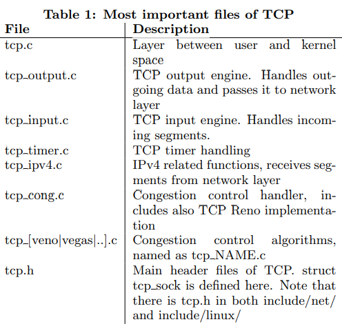
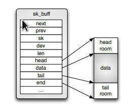

# Implementation of Transmission Control Protocol in Linux

> [https://wiki.aalto.fi/download/attachments/70789052/linux-tcp-review.pdf](https://wiki.aalto.fi/download/attachments/70789052/linux-tcp-review.pdf)

{download}`下载：linux-tcp-review.pdf </kernel/network/socket/socket-tcp/tcp-implementation/ref/linux-tcp-review.assets/linux-tcp-review.pdf>`

## ABSTRACT
Transmission Control Protocol is the most used transmission layer protocol in the Internet. In addition to reliable
and good performance in transmission between two nodes, it provides congestion control mechanism that is a major reason why Internet has not collapsed. Because of its complicated nature, implementations of it can be challenging to understand. This paper describes fundamental details of Transmission Control Protocol implementation in Linux kernel. Focus is on clarifying data structures and segments route through TCP stack.

## 1. INTRODUCTION

In May 1974 Vint Cerf and Bob Kahn published paper where
they described an inter-networked protocol, which central
control component was Transmission Control Program [3,
2].Later it was divided into modular architecture and in 1981
Transmission Control Protocol (TCP), as it is know today,
was specified in RFC 793 [7].
Today, TCP is the most used transmission layer protocol
in the Internet [4] providing reliable transmission between
two hosts through networks [7]. In order to gain good performance for communication, implementations of TCP must
be highly optimized. Therefore, TCP is one of the most complicated components in Linux networking stack. In kernel
3.5.4, it consists of over 21000 lines of code under net/ipv4/
-directory (all tcp*.c files together), while IPv4 consist of
less than 13000 lines of code (all ip*.c files in the same directory). This paper explains the most fundamental data
structures and operations used in Linux to implement TCP.
TCP provides reliable communication over unreliable network by using acknowledgment messages. In addition to
provide resending of the data, TCP also controls its sending
rate by using so-called ’windows’ to inform the other end
how much of data receiver is ready to accept.
As parts of the TCP code are dependent on network layer
implementation, the scope of this paper is limited to IPv4
implementation as it is currently supported and used more
widely than IPv6. However, most of the code is shared between IPv4 and IPv6, and tcp ipv6.c is the only file related
to TCP under net/ipv6/. In addition, TCP congestion control will be handled in a separate paper, so it will be handled
very briefly. If other assumptions is made it is mentioned in
the beginning of the related section.

Table 1: Most important files of TCP

Paper structure will be following: First section “Overview of implementation” will cover most important files and basic data structures used by TCP (sk buff, tcp sock), how data is stored inside these structures and how different queues are implemented, what timers TCP is using and how TCP sockets are kept in memory. Then socket initialization and data flows through TCP is discussed. Section “Algorithms, optimizations and options” will handle logic of TCP state machine, explain what is TCP fast path and discuss about socket options that can be used to modify behaviour of TCP.

## 2. OVERVIEW OF IMPLEMENTATION

In this section basic operation of TCP in Linux will be explained. It covers the most fundamental files and data structures used by TCP, as well as functions used when we are sending to or receiving from network. 

The most important files of implementation are listed in table 1. In addion to net/ipv4/ where most TCP files are located, there are also few headers located in include/net/ and include/linux/ -directories

Figure 1: Data storage inside structure sk buff

## 2.1 Data structures

Data structures are crucial sections of any software in order of performance and re-usability. As TCP is a highly optimized and remarkably complex entirety, robust understanding of data structures used is mandatory for mastering the implementation. 

### 2.1.1 struct sk_buff

struct sk buff (located in include/linux/skbuff.h) is used widely in the network implementation in Linux kernel. It is a socket buffer containing one slice of the data we are sending or receiving. In Figure 1 we see how data is stored inside structure. Data is hold in the continuous memory area surrounded by empty spaces, head and tail rooms. By having these empty spaces more data can be added to before or after current data without needing to copy or move it, and minimize risk of need to allocate more memory. However, if the data does not fit to space allocated, it will be fragmented to smaller segments and saved inside struct skb shared info that lives at the end of data (at the end pointer). 

All the data cannot be held in one large segment in the memory, and therefore we must have several socket buffers to be able to handle major amounts of data and to resend data segment that was lost during transmission to receiver. Because of that need of network data queues is obvious. In Linux these queues are implemented as ring-lists of sk buff structures (Figure 2). Each socket buffer has a pointer to the previous and next buffers. There is also special data structure to represent the whole list, known as struct sk buff head. More detailed information about the data queues is in section 2.1.3. 

In addition data pointers, sk buff also has pointer to owning socket, device from where data is arriving from or leaving by and several other members. All the members are documented in skbuff.h.

Figure 2: Ring-list of sk buffs

