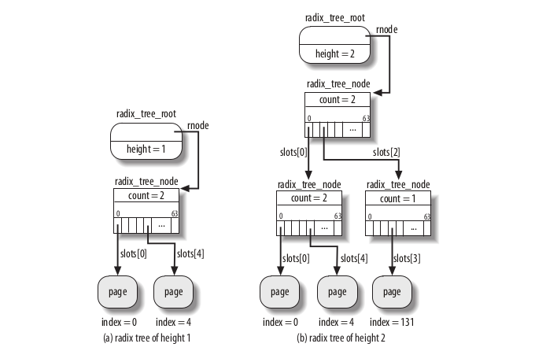
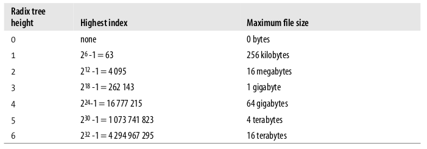
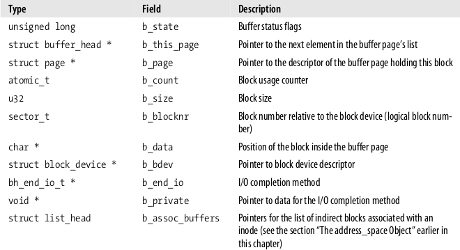

## address_space 数据结构

Page cahce 的核心数据结构是 `addrees_space`。一般来说，每个 `inode` （Kernel 用来存放文件元信息的内存中的数据结构，可以视为一个文件的描述信息）中包含一个 `addrees_space` 。

`addrees_space` 记录了对应文件的 Page Cache 的元信息。这些元信息以 radix tree（基数树）的数据结构存储，以方便以文件的 index(offset) 快速查找到Page Cache 的元信息。

`addrees_space` 也保存了指向 page cache 读写落盘实现的函数指针，如 writepage readpage 。

## Radix Tree 基数树

上面说到，一个文件的 page cache 元信息，是以基数树数据结构保存的。这里不打算细说基数树，有兴趣就自行搜索吧。对于非内核开发者来说，知道其性能参数足矣。

<em>图出处：Understanding The Linux Kernel 3rd Edition</em>

树的高度和文件的大小有关：

<em>图出处：Understanding The Linux Kernel 3rd Edition</em>

## Page Cache 的查找与维护

### 找：如何用一个文件的 Offset 找到 Page

页面的查找是通过 find_get_page(address_space* as, long offset) 函数实现的。在开始查找前，会先获取 address_space 的 spin lock，然后调用 radix_tree_lookup() 函数在上面的 Radix Tree 中查找。

需要注意的是，find_get_page() 在找到 Page 后，会增加 Page 的 Usage Count。

另外还有 find_get_pages() 方法用于一次查找一个连续 offset range 的多个 page。

如果进程想独占 Page ，可以调用 lock_page() 函数，这个函数会打开 Page 的 PG_locked 标记。如果一个进程 A 尝试 lock 一个已经被其它进程 Lock 了的 Page，进程 A会进入 TASK_UNINTERRUPTIBLE 状态，将进程的 descriptor 加到待会队列中，并最终会调用  schedule() 函数以挂起本进程，直到 PG_locked 标记被其它进程打开时进程 A 才会被唤醒。

### 按 TAG 分类快速查找 Page

内核时常要按一些 Page 的性能索引 Page。如，做 dirty page write back 时，需要快速找到相关的 dirty pages。遍历的性能很差。

## 在 Page Cache 中保存 Blocks -- Buffer Pages

一个 Buffer Page 就是一个 Page 的数据，被 `bufer heads`关联。 `bufer heads`主要作用是快速找到 Page 中的 Block 的磁盘地址。

`bufer heads` 的结构：

`buffer heads`有专用的 slab allocator cache 。

### Buffer Pages

当内核需要直接访问 Block 时，它使用 buffer page， 且检查相关的 `buffer head`。 

有两种情况下，内核需要创建 `Buffer Pages`

* 读写在磁盘上不连续的文件
* 直接访问block。如 superblock 或 inode block

## Dirty Pages 回写

之前我们了解了，当进程写 Page 时，Page 会标记为 PG_dirty 。

Linux 采用延迟写的策略：

* 系统请求分配新的 Page ，而 Page Cache 太大，或 Dirty Page 数量太多
* Page 在 Dirty 状态的时间超时
* 进程发出 flush 相关指令

### pdflush 内核线程

一条或以上的 pdflush 内核线程负责回写磁盘。因为线程在写时会 block，所以需要不只一条线程。线程的数量是自动动态调整的。线程可以由其它程序唤醒。

### 查找要回写的 Dirty Pages

wakeup_bdflush( ) 函数在内存紧张或应用请求 flush 时调用。

* 应用调用 sync() systemc call
* grow_buffers( )
* page frame 回收算法调用 free_more_memory() 或 try_to_free_pages()
* mempool_alloc() 分配新 memory pool 失败

另外，在进程写 page 时，如果发现 dirty pages 的占比超过 `dirty background threshold`，也会唤醒  pdflush 内核线程。 `dirty background threshold` 默认配置为 10%，可以通过 /proc/sys/vm/dirty_background_ratio 文件修改。

#### proc/sys/vm/dirty_ratio

### 获取和回写超时的 Dirty Page

由 pdflush 内核线完成。线程设置了一个 wb_timer，timer 的默认间隔是500个百分一秒（centisecs)，可以修改配置文件 ：/proc/sys/vm/dirty_writeback_centisecs。

 

## 参考

[Understanding The Linux Kernel 3rd Edition]