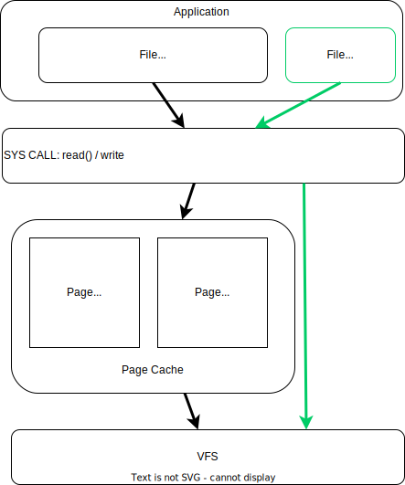

## 简介

### page cache 存放的数据的类型

* 普通的文件
* 目录数据
* 直接读取自 block device file 的数据
* 已经被swap out的用户进程内存的数据（可以强制内核在page cahce中保留一些已经被swap out的数据）
* 归属于一些特殊 filesystem 的内存 page，如用于进程间通讯的 shm filesystem

### page cache 的标识体系

page cache 中的每个 page 均归属于文件. 这个文件 — 或更精确来说，是文件的 inode 被称为 page 的`owner`.

每个 page均有其唯一标识(id)，这个标识由 page 的 `owner`和在`onwer`的 index(编号) 组成。一般，就是`indode`和相关文件`offset`。

几乎所有对文件的 read() 和 write() 都通过 page cache。只有一个例外，就是用 O_DIRECT 方式打开文件时，系统会绕过 page cache，直接使用了用户态的buffer。如 qemu/kvm 就可以使用 O_DIRECT 直接读写 vm 的 image 文件。

### page cache 的设计考虑

内核设计者在设计page cache时，考虑到以下几方面：

* 指定一个`owner`（文件）可以快速找到相关的 page 
* 记录每个 page 的操作的实现（通过函数指针）。如，都是一个 page 的 read 操作，根据不同的page owner 类型（如普通文件、block device file、swap area ）有不同的实现。

## 参考

[Understanding The Linux Kernel 3rd Edition]