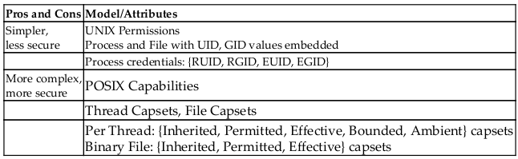
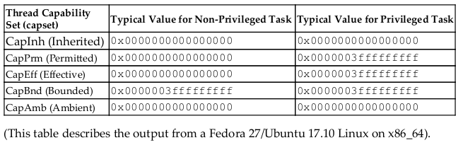
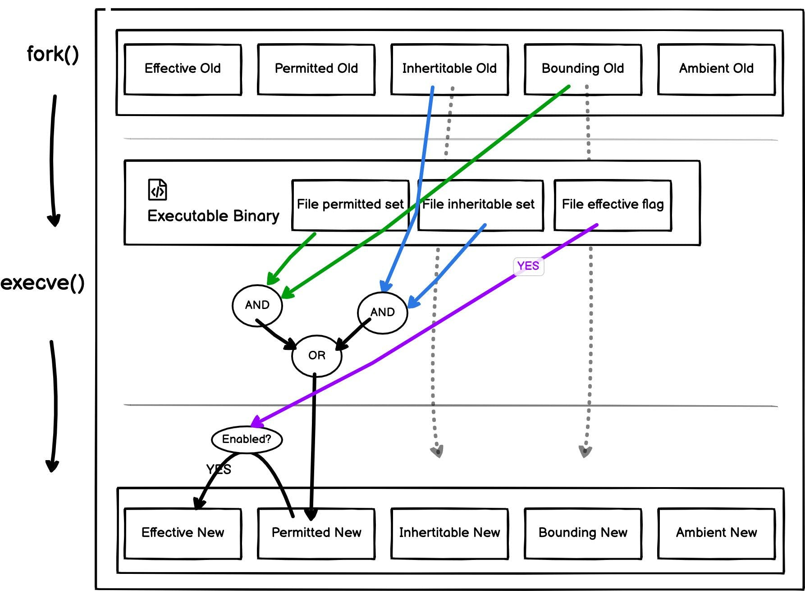
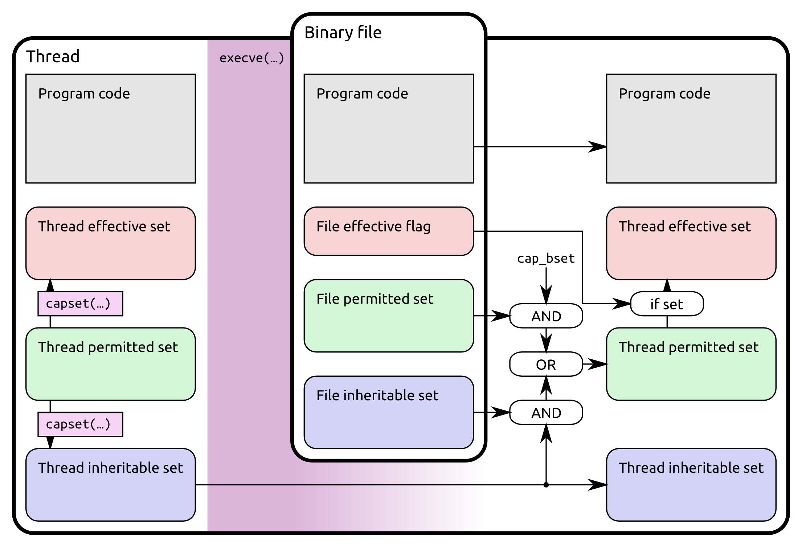
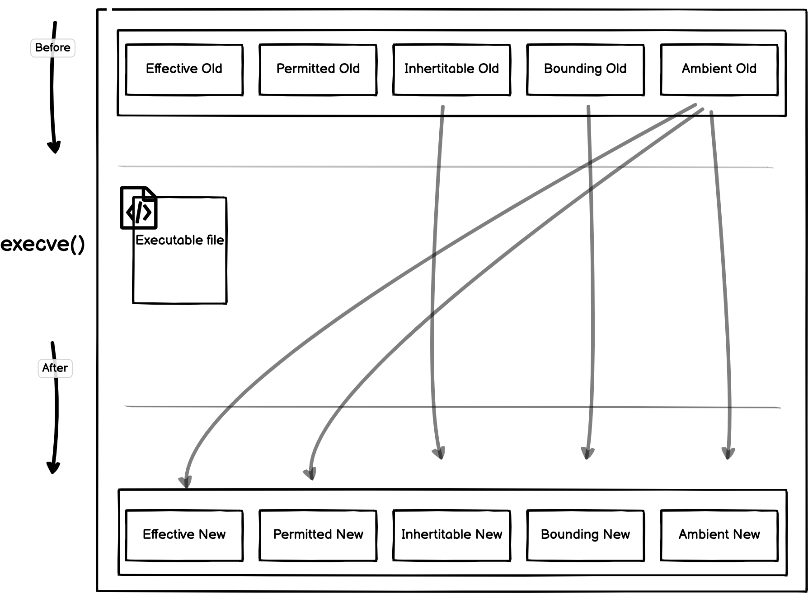
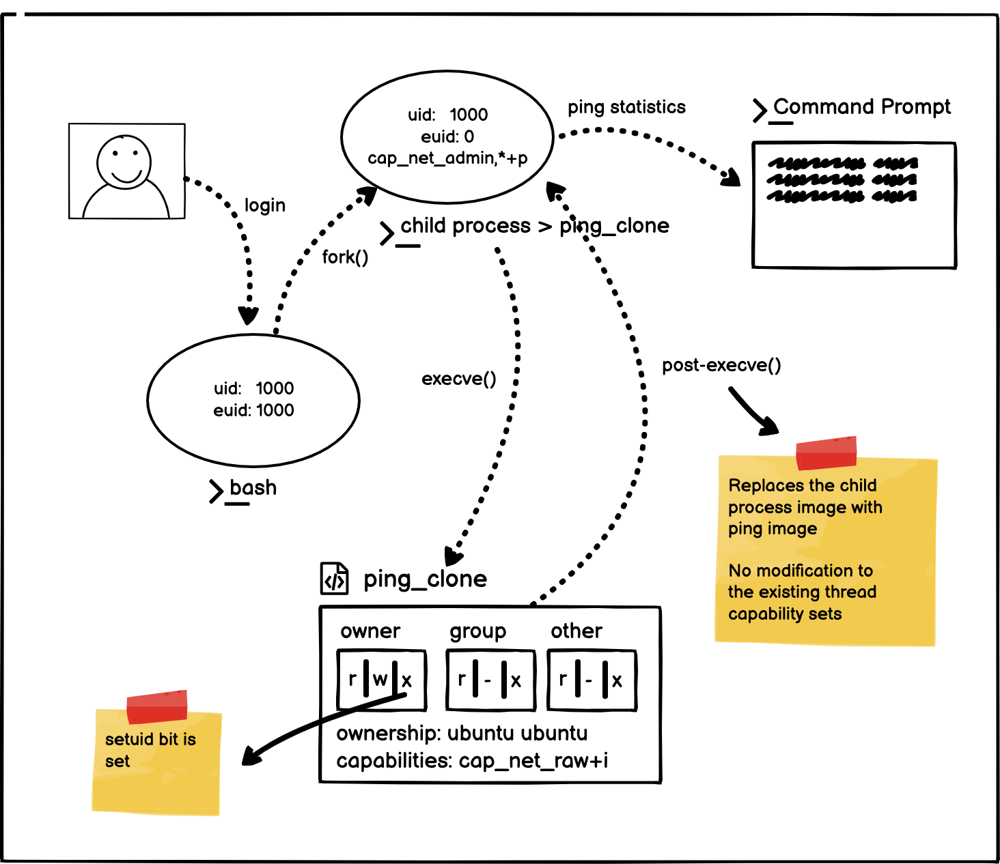

## Linux Capabilities 的设计目标

> https://hackernoon.com/whats-the-big-deal-with-linux-capabilities

**Privileged processes** 是指 **Effective User ID == 0** 的进程。

DAC (Discretionary Access Control) is installed by default on the Linux File System (Files/Directories/Devices) to permit others to control access. Owners of files or directories have absolute ownership over who has access to their files and what activities they can perform.

When an **Unprivileged Process (Effective User ID!= 0)** requests access to the system, the Linux kernel conducts access control checks based on the user's privileged access.

**Drawback of DAC**

- Users having root privileges do not adhere to the Linux Security Model.
- Root users receive full access to the system by skipping all security checks in the kernel.

### Split Root Permissions

Capabilities in Linux are used to provide fine-grained access to kernel resources that was previously unavailable to unprivileged processes. Instead of granting full access to the targeted process at once, the Linux kernel splits root permissions into smaller bits that can be distributed individually on a thread-by-thread basis.


The capability handbook page [1] has a comprehensive list of all available capabilities.


```bash
# A complete list of all available capabilities is present 
# in the capability manual page [1]. 
$ man capabilities 

# -------------------- #
# Alternative would be
# -------------------- #

# Capability supported by your kernel
$ cat /proc/sys/kernel/cap_last_cap
37
```


The Linux Privilege Model divides root privilege into **38+ capabilities** which non-root users can use to execute privileged actions (like system calls or data manipulation).

- Processes and files can have privileges enabled.
- Each privilege operation is always verified against relevant capabilities (not on EUID == 0).
- With UID 0, all capabilities are enabled by default. For all privileged operations, the kernel must check whether the thread has the required capability in its effective set.
- The kernel must provide system calls for modifying and returning a thread's capability sets.
- The filesystem must support attaching capabilities to an executable file so that a process gains those capabilities when the file is executed.

### Motivation


## POSIX capabilities

> [book - Kaiwan N Billimoria - Hands-On System Programming]

Enter the POSIX Capabilities model: In this model, instead of giving a process blanket
access as a root (or other) user, there is a way to embed particular capabilities into both the
process and/or binary file. The Linux kernel supports the POSIX capabilities model from
very early on—the 2.2 Linux kernels (at the time of writing, we are now in the 4.x
kernel series). From a practical viewpoint, the features we describe as follows are
available from Linux kernel version 2.6.24 (released January 2008) onward.

This is how it works in a nutshell: Every process—in fact, every thread—as part of its
OS metadata, contains a bitmask. These are called the capability bits or the capability
set, because each bit represents a capability. By carefully setting and clearing bits, the
kernel (as well as the user space, if it has the capability) can therefore set fine
granularity permissions on a per-thread basis (we will cover multithreading in detail in
later Chapter 14 , Multithreading with Pthreads Part I - Essentials, for now, treat the term
thread as interchangeable with process).

### OS support

Capability bitmask(s) are often referred to as capability sets—we abbreviate this
term to capset.

To work with the power of the POSIX capabilities model, in the first place, the OS
itself must provide "life support" for it; full support implies the following:

- Whenever a process or thread attempts to perform some operation, the
  kernel is able to check whether the thread is allowed to do so (by checking
  for the appropriate bit being set in the thread's effective capset—see the
  next section).

- System calls (and usually wrapper library APIs) must be provided such
  that a thread can query and set its capsets.

- Linux kernel filesystem code must have a facility such that capabilities can
  be embedded (or attached) into a binary-executable file (so that when the
  file "runs", the process acquires those capabilities).

Modern Linux (particularly Kernel Version 2.6.24 onward) supports all three, and
thus fully supports the capabilities model.

## Permission models layering

>[book - Kaiwan N Billimoria - Hands-On System Programming]

Now that we have seen details on both models—the traditional UNIX permissions in
the previous chapter and the modern POSIX capabilities one in this one, we take a
bird's-eye view of the same. The reality of a modern Linux kernel is that the legacy
model is actually layered on top of the newer capabilities model; the following table
shows this "layering":



A few observations to note due to this layering, as follows:

- At the upper layer: What appears as a single integer, the process UID and
  GID, is actually two integers under the hood—the real and effective user |
  group IDs.

- Mid layer: Giving rise to the four process credentials: {RUID, EUID, RGID,
  EGID}.

- Bottom layer: Which in turn is integrated on modern Linux kernels into the
  POSIX capabilities model:

  - **All kernel subsystems and code now use the capabilities**
    **model to control and determine access to an object**.

  - Now root - the "new" root, really—is predicated on the
    (overloaded) capability bit CAP_SYS_ADMIN being set.(基于
    （重载）能力位 CAP_SYS_ADMIN 被设置。

    - > [CAP_SYS_ADMIN: the new root](https://lwn.net/Articles/486306/)

  - the set*id() system calls can be arbitrarily used to set
    real/effective IDs once the CAP_SETUID capability is present:
    thus, you can make EUID = 0, and so on.


## Concept


> https://blog.container-solutions.com/linux-capabilities-why-they-exist-and-how-they-work


- Normal processes have (and need) *zero* capabilities. This surprised me a little, as every process needs to talk to the kernel in order to access memory, disk, devices, etc., but this is primarily controlled by traditional file privileges. Capabilities are generally only needed for system-level tasks.

- I've written ‘process’ in this article to date. Whilst correct, it hides some details that are important in this case. 

  - Clone 
    - In Linux, we have processes and threads, both of which get created by the clone kernel call, using different arguments which control how much is shared with the calling process (so a [process is more independent than a thread](https://www.slashroot.in/difference-between-process-and-thread-linux)). 
  - exec
    - Whilst clone can create a new process, it doesn't change the code that is being run; to run a new program you have to call one of the exec family of functions. These functions replace the code being run with a new executable. 

  Capabilities are important at both stages(`Clone` & `exec`).

- Files (executables) can have capabilities as well as processes/threads. This is dependent on the file system supporting extended attributes, which in all probability it does. When the file is executed, the thread may be able to gain those capabilities, according to the rules described below.

### Thread Capability sets

There are five different capability sets that can be enabled to each process(thread) and each is represented by a 64-bit number and can have zero or more capabilities.

- bounding
  - capability bounding set acts as a limiting superset for the capabilities that a thread can add to its inheritable set using capset(2).
- inheritable
  - The inheritable capabilities are the capabilities of the current process that should be inherited by a program executed by the current process.
- permitted
  - The Permitted set indicates what capabilities a process can use and limits what can be in effective set.
- effective
  - The Effective set helps the kernel to know final permissions of a process.
- ambient
  - ambient capabilities where all child processes inherit the capabilities implicitly


#### Effective Capabilities Set

The Effective set helps the kernel to know final permissions of a process.


When a process attempts a privileged operation, the kernel verifies that the relevant bit in the effective set is set. When a process requests to set the monoatomic clock, for example, the kernel first verifies that the **CAP_SYS_TIME** bit in the process effective set is set.

#### Permitted Capabilities Set

The Permitted set indicates what capabilities a process can use and limits what can be in effective set.


A process can have capabilities that are set in the "permitted set" but not in the effective set. This indicates that the process has temporarily disabled this capability. <mark>A process can only set its effective set bit if it is included in the permitted set.</mark>

#### Inheritable Capabilities Set

The inheritable capabilities are the capabilities of the current process that should be inherited by a program executed by the current process.


The permitted set of a process is <mark>masked</mark> against the inheritable set during **exec()**, while child processes and threads are given an exact copy of the capabilities of the parent process. Also note that **‘inheriting’** a capability does not necessarily automatically give any thread effective capabilities. **‘inherited’ capabilities** only <mark>directly influence the new thread permitted set.</mark>

#### Bounding Capabilities Set

It is possible to limit the capabilities that a process may ever obtain using "bounding set."


Only capabilities found in the bounding set will be permitted in the inheritable and permitted sets. It is used to limit a program's capabilities. You cannot have any capability in other capability sets unless it is present in the bounding set.

#### Ambient Capabilities Set

The ambient capability set is applied to all non-SUID binaries that do not have file capabilities.


The ambient capability are retained capabilities during **execve()**. However, not all capabilities in the ambient set may be kept since they are dropped if they are not included in either the inheritable or permitted capability set.

### Typical Capability sets

> [book - Kaiwan N Billimoria - Hands-On System Programming]



### Source

#### Processes

Now for the complicated bit. In order to be able to assign capabilities to threads, we have the idea of ‘capability sets’. There are **five sets for processes**, **two of which can also be applied to files**.

- `effective set`

The `effective set` is the set that is checked by the kernel to allow or disallow calls. 

The other sets control how and what capabilities <mark>can</mark> get added or removed from the `effective set`. The other sets are 

- *inheritable*
- *permitted* 
- *ambient* 
- *bounding*

#### Executables

There are **three distinct capability sets** that can be associated with an executable file. The kernel assesses the capabilities of the new process in **conjunction with the current Process Capability and File (Binaries) Capabilities**.

##### File capabilities - extended attribute (xattr)

`Executables` file also has:

- `permitted` 
  - These capabilities are added to the process `permitted set` on execution.
- `inheritable`
  - After the **execve()**, the intersection (logical AND) of the thread inheritable and file inheritable sets are added to the thread `permitted set`.
- an  `effective bit` which can be set.
  - In contrast to other file capability sets, it is only a flag. When the flag is set, the process effective set following `execve()` is set to the new process permitted set; otherwise, it is empty.

> https://k3a.me/linux-capabilities-in-a-nutshell/
>
> That gives too many privileges to the binary, so POSIX capabilities implemented a concept called “file capabilities”. They are stored as a [extended file attribute](http://man7.org/linux/man-pages/man7/xattr.7.html) called “security.capability” so you need a capable filesystem (ext*, XFS, Raiserfs, Brtfs, overlay2, …). For a process to write to this attribute, CAP_SETFCAP capability is needed (be in process’ effective set).
>
> ```bash
> $ getfattr -m - -d `which ping`
> # file: usr/bin/ping
> security.capability=0sAQAAAgAgAAAAAAAAAAAAAAAAAAA=
> 
> $ getcap `which ping`  
> /usr/bin/ping = cap_net_raw+ep
> ```

### Execve logic

The easiest way to explain these sets is to refer to the logic that gets applied to assign capabilities to the new process on an `execve` call. The following is taken verbatim from the capabilities man page:

```
    P'(ambient)     = (file is privileged) ? 0 : P(ambient)

    P'(permitted)   = (P(inheritable) & F(inheritable)) |
                      (F(permitted) & cap_bset) | P'(ambient)

    P'(effective)   = F(effective) ? P'(permitted) : P'(ambient)

    P'(inheritable) = P(inheritable) [i.e., unchanged]

where:

    P denotes the value of a thread capability set before the execve(2)

    P' denotes the value of a thread capability set after the execve(2)

    F denotes a file capability set

    cap_bset is the value of the capability bounding set.
```


#### Explanation 1

> https://hackernoon.com/whats-the-big-deal-with-linux-capabilities
>
> 


> https://blog.ploetzli.ch/2014/understanding-linux-capabilities/
>
> 

- **ambient:** The ambient capabilities has no role in capabilities transition and are set to zero.

- **inheritable & bounding:** There will be no change in the inheritable & bounding set.

- **permitted:** The logic to determine the final state of permitted set is complicated. It all depends on old inheritable capabilities and file capabilities and follows the given transition logic

  - File permitted set and old bounding set (before **execve()**) are logically ANDed.

    *P1 = Bounding Old & File Permitted Set*

  - File inheritable set and old inheritable set (before **execve()**) are logically ANDed.

    P2 = Inheritable Old & File Inheritable Set

  - Final state of permitted set is calculated by doing logical OR P1 and P2.

    P = P1 | P2

- **effective:** Transition logic is as follows

  - **Capabilities Aware Application has the luxury to activate/deactivate a capability** in permitted set as effective capability whenever required.
  - **File effective flag/bit is introduced for Capabilities Unaware Applications** (Dump applications) to control the auto enforcement of permitted set as effective set after **execve()**.


#### Explanation 2


Let’s start with what this means for our ping example. If we put `CAP_NET_RAW` into the *`permitted`* set for the ping binary (`F(permitted)` above), it will be added to the permitted set for the process (`P'(permitted)`). As the ping binary is ‘capabilities aware’, it will then <mark>make a call</mark> to add the `CAP_NET_RAW` into the `effective set`.

Alternatively, if the binary hadn’t been ‘capabilities aware’, we could have set the `effective bit` (`F(effective)` above), which would have automatically added the  capability into the `effective set`. A ‘capabilities aware’ binary is more secure, as it’s possible to limit the amount of time for which the process acquires the capability.

We can also add capabilities to the *`inheritable`* set on a file. This allows us to say ‘grant these capabilities only if they are in the executable inheritable set <mark>and also in the inheritable set for the process</mark>’, which means we can control the environments in which the executable can be used.

This makes sense, but there is a problem: when using ordinary executables without inheritable capabilities set, then `F(inheritable)` = 0, meaning `P(inheritable)` is ignored. As this is the case for the vast majority of the executables, the usability of inheritable capabilities was limited.

We can’t create a semi-privileged process tree with a subset of capabilities that are automatically inherited unless we also update the executables. In other words, even if your thread had extra capabilities, you couldn't run a helper script and let it use those capabilities unless the script was also capabilities-aware.

This situation was remedied by the addition of the `ambient` set, which again is inherited from the parent, but is also automatically added into the new `permitted set`. So now, if you're in an environment which has CAP_NET_RAW in the ambient set, the ping executable should work even if it is a ‘normal’ file (without capabilities *or* setuid/setgid bits set).

There are also some important rules for adding/removing capabilities from the `ambient` set. A capability can never be in a thread’s `ambient` set if it is not also in the `inheritable` *and* `permitted` sets. Dropping a capability from either of those sets also removes it from the `ambient` set. Non-root threads can add capabilities from their `permitted set` to the `ambient set`, which will allow their children to also use that capability with normal files.

The `bounding` and `permitted sets` also sound straightforward, but still hide some complexities. The `bounding set` is roughly intended to control which capabilities are available within a process tree. A capability can be added to the `permitted set` if the current thread has the `CAP_SETPCAP` capability and the capability is within the `bounding set`.


##### Environment variables removed

> https://churchman.nl/2019/03/14/granting-capabilities-using-capsh/

Using `setcap`, we might add a capability to a file as follows:

```
$ sudo setcap cap_net_raw+epi /path/to/wine 
```

However, for security reasons, when a file has capabilities set, all insecure environment variables are removed upon executing it. This includes variables such as `LD_LIBRARY_PATH`. Binaries depending on this variable to find dynamic libraries will fail to execute. This is often the case with OpenGL drivers.

This can be fixed ad-hoc by patching the binary with `patchelf` and adding the OpenGL library location, for example:

```bash
$ patchelf --print-rpath /path/to/wine
/some/lib:/some/other/lib

$ echo $LD_LIBRARY_PATH
/run/opengl-driver/lib:/run/opengl-driver-32/lib

$ patchelf --set-rpath "/run/opengl-driver/lib:/run/opengl-driver-32/lib:/some/lib:/some/other/lib" /path/to/wine
```


### Capability Aware Applications

> https://hackernoon.com/whats-the-big-deal-with-linux-capabilities-part-2#:~:text=Capability%20Aware%20Applications

Capability-aware applications can manipulate their capability set with system calls (**capset, capget, prctl**) after load. At some point during execution when an application doesn't need certain capabilities, it can drop some capabilities from its effective set to limit exposure to privileged tasks. As long it has a capability in the permitted set, it always brings back that capability to its effective set.

e.g `runc`, `ping` etc.

## Under the hood, at the level of the Kernel

Within the Linux kernel, all task (process and thread) metadata is kept within a data
structure called the `task_struct` (also known as the process descriptor). The information
on what Linux calls the `security context` of a task is kept within this task structure,
embedded inside another data structure called `cred` (short for credentials). This
structure, `cred`, contains everything we've discussed: The modern `POSIX capabilities
bitmasks` (or capability sets) as well as the traditional-style process privileges: the
RUID, EUID, RGID, EGID (as well as the `set[u|g]id` and `fs[u|g]id` bits).

The procfs method we saw earlier actually looks up the credential information from
here. Hackers are obviously interested in accessing the `cred` structure and being able
to modify it on the fly: filling it with zeros in the appropriate places gets them root!
Does this sound far-fetched? Check out the (Some) Linux Kernel Exploits in the Further
reading section on the GitHub repository. Unfortunately, it happens more often than
anyone would like.

### Kernel Source Code

> https://elixir.bootlin.com/linux/v5.18/source/include/linux/cred.h#L110

## Practice

### View Process Capabilities

> https://hackernoon.com/whats-the-big-deal-with-linux-capabilities#:~:text=View%20Process%20Capabilities

#### **#1- The proc filesystem (procfs)**

To see the capabilities of a particular process, use the status file in the **/proc/<PID>/** directory.

Process capabilities are expressed in hexadecimal format.

**CapInh** = Inherited capabilities

**CapPrm** = Permitted capabilities

**CapEff** = Effective capabilities

**CapBnd** = Bounding set

**CapAmb** = Ambient capabilities set

#### #**2- Use getpcaps command**

An alternative would be to use **getpcaps** **utility** to display the capabilities of a particular process.


**getpcaps** resolves capabilities into proper names

NoneBashCSSCC#GoHTMLObjective-CJavaJavaScriptJSONPerlPHPPowershellPythonRubyRustSQLTypeScriptYAMLCopy

```bash
# suppress the output and get process id
~$ ping 127.0.0.1 > /dev/null &
[1] 21002
~$ getpcaps 21002 
Capabilities for `21002': = cap_net_admin,cap_net_raw+p 
```

#### #**3- Use pscap Utility**

Similarly, using **pscap utility**, we can generate a report of all running processes' capabilities.

```bash
$ pscap -a
ppid  pid   name        command           capabilities
0     1     root        systemd           full
1     419   root        systemd-journal   chown, dac_override, dac_read_search, fowner, setgid, setuid, sys_ptrace, sys_admin, audit_control, mac_override, syslog, audit_read
1     447   root        lvmetad           full
1     457   root        systemd-udevd     full
1     589   systemd-timesync  systemd-timesyn   sys_time
```

#### #4 capsh

> https://blog.container-solutions.com/linux-capabilities-in-practice

Let's jump into the deep end and see how we can work with capabilities in practice. The first tool most people will come across when working with caps is [capsh](http://man7.org/linux/man-pages/man1/capsh.1.html). Running capsh as my normal user on Ubuntu 18.04 gives the following output:

```bash
$ capsh --print
Current: =
Bounding set =cap_chown,cap_dac_override,cap_dac_read_search,cap_fowner,cap_fsetid,cap_kill,cap_setgid,cap_setuid,cap_setpcap,cap_linux_immutable,cap_net_bind_service,cap_net_broadcast,cap_net_admin,cap_net_raw,cap_ipc_lock,cap_ipc_owner,cap_sys_module,cap_sys_rawio,cap_sys_chroot,cap_sys_ptrace,cap_sys_pacct,cap_sys_admin,cap_sys_boot,cap_sys_nice,cap_sys_resource,cap_sys_time,cap_sys_tty_config,cap_mknod,cap_lease,cap_audit_write,cap_audit_control,cap_setfcap,cap_mac_override,cap_mac_admin,cap_syslog,cap_wake_alarm,cap_block_suspend,cap_audit_read
Securebits: 00/0x0/1'b0
secure-noroot: no (unlocked)
secure-no-suid-fixup: no (unlocked)
secure-keep-caps: no (unlocked)
uid=1000(amouat)
gid=1000(amouat)
groups=4(adm),24(cdrom),27(sudo),30(dip),46(plugdev),113(lpadmin),128(sambashare),134(libvirtd),134(libvirtd),999(docker),1000(amouat)
```

> https://k3a.me/linux-capabilities-in-a-nutshell/
>
> - **Current** – displays effective, inheritable and permitted capabilities of capsh process in [**cap_to_text(3)**](http://man7.org/linux/man-pages/man3/cap_to_text.3.html) **format**. Again, it displays it in cap_to_text format which lists capabilities basically as capability[,capability…]+(e|i|p) groups, where ‘e’ means effective, ‘i’ inheritable and ‘p’ permitted. The list is not separated by ‘,’ as you would guess (cap_setgid+eip,cap_setuid+eip). The ‘,’ separates capabilities in a single +… (action) group. The actual list of action groups is then separated by spaces. So another example with two action groups would be “= cap_sys_chroot+ep cap_net_bind_service+eip”. And also these two action groups “= cap_net_bind_service+e cap_net_bind_service+ip” would encode the same meaning as a single “cap_net_bind_service+eip”.
> - **Bounding set/Ambient set**. To make things even more confusing, these two lines contain just a list of capabilities set in those sets, separated by spaces. No cap_to_text format is used here because it is not listing permitted, effective, inheritable sets together but just a single (bounding/ambient) set.
> - **Securebits**: displays task’s [securebits](https://elixir.bootlin.com/linux/latest/source/include/linux/cred.h#L133) integer in as decimal/hex/fancy-verilog-convention-for-binary-strings (yes, everyone would expect it here and it’s totally clear by ‘b because every sysadmin programs its own FPGAs and ASICs). The state of securebits follows. The actual bits are defined as SECBIT_* in [securebits.h](https://elixir.bootlin.com/linux/latest/source/include/uapi/linux/securebits.h#L22) and also described in [capabilities(7)](http://man7.org/linux/man-pages/man7/capabilities.7.html).
> - The tool lacks the one important state and that is the “**NoNewPrivs**” which can be also seen by inspecting /proc/<pid>/status. That is described in [prctl(2)](http://man7.org/linux/man-pages/man2/prctl.2.html) only, even though it directly affects capabilities when used in conjunction with file capabilities (more later). NoNewPrivs is described as “*With no_new_privs set to 1, execve(2) promises not to grant privileges to do anything that could not have been done without the execve(2) call (for example, rendering the set-user-ID and set-group-ID mode bits, and file capabilities non-functional). Once set, this the no_new_privs attribute cannot be unset. The setting of this attribute is inherited by children created by fork(2) and clone(2), and preserved across execve(2).*“. This is the flag which Kubernetes sets to 1 when allowPrivilegeEscalation is set to false in pod’s securityContext.


So we can see that a normal user process doesn't have any capabilities by default, but pretty much everything is in the bounding set. Nothing surprising there. But what about all the different sets, like ambient and inheritable, that we've been looking at? Unfortunately the released version of capsh isn’t up-to-date with these, despite [support being in source since 2016](https://git.kernel.org/pub/scm/linux/kernel/git/morgan/libcap.git/).

For the moment, the most portable solution is to go straight to the /proc status file:

```bash
$ grep Cap /proc/$BASHPID/status
CapInh: 0000000000000000
CapPrm: 0000000000000000
CapEff: 0000000000000000
CapBnd: 0000003fffffffff
CapAmb: 0000000000000000
```

As you've probably guessed, the hex digits represent the capabilities in the set. We can decode this with our friend capsh:

```bash
$ capsh --decode=0000003fffffffff
0x0000003fffffffff=cap_chown,cap_dac_override,cap_dac_read_search,cap_fowner,cap_fsetid,cap_kill,cap_setgid,cap_setuid,cap_setpcap,cap_linux_immutable,cap_net_bind_service,cap_net_broadcast,cap_net_admin,cap_net_raw,cap_ipc_lock,cap_ipc_owner,cap_sys_module,cap_sys_rawio,cap_sys_chroot,cap_sys_ptrace,cap_sys_pacct,cap_sys_admin,cap_sys_boot,cap_sys_nice,cap_sys_resource,cap_sys_time,cap_sys_tty_config,cap_mknod,cap_lease,cap_audit_write,cap_audit_control,cap_setfcap,cap_mac_override,cap_mac_admin,cap_syslog,cap_wake_alarm,cap_block_suspend,cap_audit_read
```

Unsurprisingly, it matches the output from the earlier capsh command. If you try running as the root user, you should find the output becomes:

```bash
CapInh: 0000000000000000
CapPrm: 0000003fffffffff
CapEff: 0000003fffffffff
CapBnd: 0000003fffffffff
CapAmb: 0000000000000000
```

In other words all caps are in the permitted, effective and bounding sets. Therefore the root user can make any kernel call, which is as we expect.


### Drop Process Capabilities

> https://hackernoon.com/whats-the-big-deal-with-linux-capabilities#:~:text=Drop%20Process%20Capabilities

The **capsh** **utility** can be used to drop a capability by passing either --drop or --uid.

> **UID** argument causes the thread to lose all capabilities.

```bash
~$ sudo capsh --caps="cap_setpcap,cap_setuid,cap_setgid+ep" \ 
--drop="cap_net_admin,cap_net_raw" --keep=1 --uid=1001 \ 
--print -- -c "ping localhost"
Current: = cap_setgid,cap_setuid,cap_setpcap+p Bounding set = 
Securebits: 020/0x10/5'b10000 
secure-noroot: no (unlocked) 
secure-no-suid-fixup: no (unlocked) 
secure-keep-caps: yes (unlocked) uid=1001(test1) gid=0(root) groups=0(root) 
ping: socket: Operation not permitted Super-powers are granted randomly so please submit an issue if you're not happy with yours.

# -------------------- #
# Alternative would be
# -------------------- #

$ sudo capsh --drop=cap_net_raw --print -- -c "/bin/ping -c 1 localhost"                                               
Current: = cap_chown,cap_dac_override,cap_dac_read_search,cap_fowner,cap_fsetid,cap_kill,cap_setgid,cap_setuid,cap_setpcap,cap_linux_immutable,cap_net_bind_service,cap_net_broadcast,cap_net_admin,cap_net_raw,cap_ipc_lock,cap_ipc_owner,cap_sys_module,cap_sys_rawio,cap_sys_chroot,cap_sys_ptrace,cap_sys_pacct,cap_sys_admin,cap_sys_boot,cap_sys_nice,cap_sys_resource,cap_sys_time,cap_sys_tty_config,cap_mknod,cap_lease,cap_audit_write,cap_audit_control,cap_setfcap,cap_mac_override,cap_mac_admin,cap_syslog,35,36,37+ep
Bounding set =cap_chown,cap_dac_override,cap_dac_read_search,cap_fowner,cap_fsetid,cap_kill,cap_setgid,cap_setuid,cap_setpcap,cap_linux_immutable,cap_net_bind_service,cap_net_broadcast,cap_net_admin,cap_ipc_lock,cap_ipc_owner,cap_sys_module,cap_sys_rawio,cap_sys_chroot,cap_sys_ptrace,cap_sys_pacct,cap_sys_admin,cap_sys_boot,cap_sys_nice,cap_sys_resource,cap_sys_time,cap_sys_tty_config,cap_mknod,cap_lease,cap_audit_write,cap_audit_control,cap_setfcap,cap_mac_override,cap_mac_admin,cap_syslog,35,36,37
Securebits: 00/0x0/1'b0
 secure-noroot: no (unlocked)
 secure-no-suid-fixup: no (unlocked)
 secure-keep-caps: no (unlocked)
uid=0(root)
gid=0(root)
groups=0(root)
ping: socket: Operation not permitted
```


### Search Binary Capabilities

#### #**1- Use getcap Utility**

To find all files with file capabilities set, use **getcap -r**.

A malicious user can use **getcap -r** find an exploitable executable binary on the system.

```bash
$ getcap -r / 2>/dev/null
/home/ubuntu/environment/cat_clone = cap_setuid+ep
/home/ubuntu/environment/top_clone = cap_chown+ep
/home/ubuntu/environment/ping_clone = cap_net_raw+p
/usr/bin/mtr-packet = cap_net_raw+ep
```


### Assigning Capabilities to Executables

#### File Inheritable Set

Add **cap_net_raw** to the file inheritable set.

```
# Privileged ping binary
~# setcap cap_net_raw+i ping_clone
~$ getcap ping_clone
ping_clone = cap_net_raw+i
```

#### File Permitted Set

Add **cap_net_raw, cap_net_admin** to the file permitted set.

```
# Privileged ping binary
~# setcap cap_net_raw,cap_net_admin+p ping_clone
~$ getcap ping_clone
ping_clone = cap_net_raw,cap_net_admin+p
```

#### File Effective Bit/Flag

Enabling the file effective flag causes the thread permitted set to be automatically enforced to the thread effective set.

```
# Privileged ping binary
~# setcap ping_clone
ping_clone = cap_net_raw,cap_net_admin+ep
~$ getcap ping_clone
ping_clone = cap_net_raw,cap_net_admin+ep
```


#### Example

```bash
$ setcap 'cap_net_raw+p' ./ping
unable to set CAP_SETFCAP effective capability: Operation not permitted
$ sudo setcap 'cap_net_raw+p' ./ping
$ getcap ./ping
./ping = cap_net_raw+p
$ ./ping google.com -c 1
PING google.com (216.58.204.78) 56(84) bytes of data.
64 bytes from lhr25s13-in-f78.1e100.net (216.58.204.78): icmp_seq=1 ttl=53 time=22.1 ms
--- google.com ping statistics ---
1 packets transmitted, 1 received, 0% packet loss, time 0ms
rtt min/avg/max/mdev = 22.110/22.110/22.110/0.000 ms
```

Note that I couldn't use `setcap` as a normal user and had to fall back to `sudo`—the calling process needs to have `CAP_SETFCAP` in the `permitted set`.


We can look at the capabilities of the ping process:

```
$ ./ping google.com > /dev/null&
[2] 24814
$ grep Cap /proc/24814/status
CapInh: 0000000000000000
CapPrm: 0000000000002000
CapEff: 0000000000000000
CapBnd: 0000003fffffffff
CapAmb: 0000000000000000
$ capsh --decode=0000000000002000
0x0000000000002000=cap_net_raw
```

`CAP_NET_RAW` is there, but only in the `permitted set`. A call to open the ICMP socket won’t succeed unless the capability is in the `effective set`, so how is ping working?

It turns out the <mark>ping binary itself requests that the capability is added to the effective set, then drops it after opening the socket</mark> (so by the time we ran grep, it had already been dropped). We can see the relevant system calls if we run using strace:

```bash

$ sudo strace ./ping -c 1 google.com
...
capget({version=_LINUX_CAPABILITY_VERSION_3, pid=0}, NULL) = 0
capget({version=_LINUX_CAPABILITY_VERSION_3, pid=0}, {effective=0, permitted=1<<CAP_NET_ADMIN|1<<CAP_NET_RAW, inheritable=0}) = 0
capset({version=_LINUX_CAPABILITY_VERSION_3, pid=0}, {effective=1<<CAP_NET_RAW, permitted=1<<CAP_NET_ADMIN|1<<CAP_NET_RAW, inheritable=0}) = 0
socket(AF_INET, SOCK_DGRAM, IPPROTO_ICMP) = -1 EACCES (Permission denied)
socket(AF_INET, SOCK_RAW, IPPROTO_ICMP) = 3
socket(AF_INET6, SOCK_DGRAM, IPPROTO_ICMPV6) = -1 EACCES (Permission denied)
socket(AF_INET6, SOCK_RAW, IPPROTO_ICMPV6) = 4
capget({version=_LINUX_CAPABILITY_VERSION_3, pid=0}, NULL) = 0
capget({version=_LINUX_CAPABILITY_VERSION_3, pid=0}, {effective=1<<CAP_NET_RAW, permitted=1<<CAP_NET_ADMIN|1<<CAP_NET_RAW, inheritable=0}) = 0
capset({version=_LINUX_CAPABILITY_VERSION_3, pid=0}, {effective=0, permitted=1<<CAP_NET_ADMIN|1<<CAP_NET_RAW, inheritable=0}) = 0
...
```

The first capset line shows the CAP_NET_RAW capability being added to the effective set. The next line tries to create an IPV4 [ping socket](https://github.com/torvalds/linux/commit/c319b4d76b9e583a5d88d6bf190e079c4e43213d), which fails as this is gated by the ping_group_range kernel config parameter. It then successfully creates a raw IPV4 network socket instead. The process is repeated for IPV6. The last step is to clear the effective set as ping no longer needs the capabilities once the socket is open.

If the ping binary hadn’t been ‘`capability aware`’—i.e., didn’t make the `capset` and `capget` calls—we still could have used capabilities but would have needed to set the ‘`effective bit`’ on the file, which **automatically adds permitted capabilities to the `effective set`**. This would have been a one-character change to the previous command:

````bash
$ setcap 'cap_net_raw+ep' ./ping
````

The syntax is a bit confusing; the ‘e' isn’t adding the capability to the effective set, it’s setting the effective bit on the binary. As you can see by referring to the table at the start of the post, setting the effective bit will copy all capabilities from the permitted set into the effective set when the process starts. This is slightly less secure than doing capset in the executable, as the capabilities are ‘live’ for longer, but it means that we can apply capabilities to binaries that know nothing about them and avoid giving them full setuid privileges.

### 使用 ambient 建立半特权(Semi-Privileged) 环境 1

OK, so what about the ambient and inheritable sets? The idea behind these is to allow us to create *environments* (in the sense of process trees or namespaces) that allow certain capabilities to be used.

For example, we should be able to create a ‘webserver’ environment that can bind to port 80 by putting CAP_NET_BIND_SERVICE in the ambient capabilities, without requiring any other capabilities or running as the root user (note that there other solutions to this problem, such as using [sysctl net.ipv4.ip_unprivileged_port_start](https://www.kernel.org/doc/Documentation/networking/ip-sysctl.txt)). The webserver can be started from an interpreter or helper script and won’t require the setting of file privileges.

Let’s take a look at how to do this. I’ve created a short program [set_ambient](https://github.com/ContainerSolutions/capabilities-blog/blob/master/set_ambient.c) that simply uses the [cap-ng library](https://people.redhat.com/sgrubb/libcap-ng/index.html) to add the CAP_NET_BIND_SERVICE capability to the ambient set of a new process. Once compiled, we need to give it file privileges so that it has the correct capability:

```bash
$ sudo setcap cap_net_bind_service+p set_ambient
$ getcap ./set_ambient
./set_ambient = cap_net_bind_service+p
```

We can see how it works:

```bash
$ ./set_ambient /bin/bash
Starting process with CAP_NET_BIND_SERVICE in ambient
$ grep Cap /proc/$BASHPID/status
CapInh: 0000000000000400
CapPrm: 0000000000000400
CapEff: 0000000000000400
CapBnd: 0000003fffffffff
CapAmb: 0000000000000400
$ capsh --decode=0000000000000400
0x0000000000000400=cap_net_bind_service
$ exit
```

Note that for a capability to be in the ambient set, it must also be in the permitted and inheritable sets.

I’ve also created a [simple Go web server](https://github.com/ContainerSolutions/capabilities-blog/blob/master/server.go) that binds to port 80. We won’t give this executable file capabilities or run it as root. If we run it normally:

```bash
$ ./server
2019/09/09 13:42:06 listen tcp :80: bind: permission denied
```

It fails as it does not have privileges to bind low numbered ports. Let’s try again in our ‘webserver’ environment:

```bash
$ ./set_ambient /bin/bash
Starting process with CAP_NET_BIND_SERVICE in ambient
$ ./server &
[1] 2360
$ curl localhost:80
Successfully serving on port 80
$ kill 2360
$ exit
```

Success! We could have called `./set_ambient server` directly, but I wanted to make the point that child processes also automatically inherit the capability. The bash shell with ambient capabilities effectively becomes a semi-privileged environment, where we can not only run webservers but also supporting scripts and programs, etc., which may in turn launch the webserver.

This is important for interpreted languages such as Python; in this case we don’t want to give the Python executable elevated file capabilities, and we can work around this by launching the interpreter from an environment with ambient capabilities, such as:

```bash
$ python3 -m http.server 80
Traceback (most recent call last):
...
PermissionError: [Errno 13] Permission denied
$ ./set_ambient /usr/bin/python3 -m http.server 80
Starting process with CAP_NET_BIND_SERVICE in ambient
Serving HTTP on 0.0.0.0 port 80 (http://0.0.0.0:80/) ...
```

Regarding the difference between inheritable and ambient, we would have needed to set the inheritable capabilities and effective bit on the Go webserver executable for it to be usable by a process with CAP_NET_BIND_SERVICE in inheritable. As we generally want to be able to work with arbitrary binaries (that don’t have capabilities set) and without root privileges, the inheritable set is of limited use to us.

### 使用 ambient 建立半特权(Semi-Privileged) 环境 2

> https://churchman.nl/2019/03/14/granting-capabilities-using-capsh/

The Linux kernel allows ambient capabilities where all child processes inherit the capabilities implicitly, removing the need to set them on binaries. Using `capsh` we can get a shell with ambient capabilities set:

```bash
$ sudo capsh --caps="cap_net_raw+eip cap_setpcap,cap_setuid,cap_setgid+ep" --keep=1 --user=thomas --addamb=cap_net_raw --
bash: /root/.bashrc: Permission denied

$ capsh --print
capsh --print
Current: = cap_net_raw+eip
Bounding set =...
Ambient set =cap_net_raw
Securebits: 00/0x0/1'b0
 secure-noroot: no (unlocked)
 secure-no-suid-fixup: no (unlocked)
 secure-keep-caps: no (unlocked)
 secure-no-ambient-raise: no (unlocked)
uid=1000(thomas)
gid=100(users)
groups=1(wheel),57(networkmanager),100(users)

$ whoami
thomas

$ echo $USER
root
```


### Ping 的临时 Effective

> https://hackernoon.com/whats-the-big-deal-with-linux-capabilities#:~:text=1%2D%20The%20proc%20filesystem%20(procfs)

Let's have a look at the **Ping** utility's process capabilities. You could be wondering why effective capabilities are set to zeroes. The simplest answer would be that ping is a **Capability Aware Application**, which means it may drop some or all effective capabilities once they're no longer be required to reduce exposure. It can still reinstate a capability to Effective Capabilities Sets as long as it has a capability in Permitted Capabilities Sets.


NoneBashCSSCC#GoHTMLObjective-CJavaJavaScriptJSONPerlPHPPowershellPythonRubyRustSQLTypeScriptYAMLCopy

```
# Mute the output and get process id
~$ ping 127.0.0.1 > /dev/null &
[1] 21002
~$ cat /proc/21002/status | grep Cap
CapInh: 0000000000000000
CapPrm: 0000000000003000
CapEff: 0000000000000000
CapBnd: 0000003fffffffff
CapAmb: 0000000000000000
```


## Special setuid/setgid Rules

One thing you will notice is the ‘securebits flags’ that are set per thread and control how capabilities are inherited when changing from or to UID 0. A full explanation is in the [man capabilities](http://man7.org/linux/man-pages/man7/capabilities.7.html) page.

### securebits

"securebits" flags that control how uid 0 (root) threads are handled

> [Kubernetes should configure the ambient capability set #56374](https://github.com/kubernetes/kubernetes/issues/56374)
>
> [`containerd` Erase ambient capabilities. #808](https://github.com/containerd/cri/pull/808)


### Capabilities 与 Privileged Process 是如何兼容到一起的

> Understanding The Linux Kernel

Each time a process sets the `euid` and `fsuid` fields to `0` (either by
invoking one of the system calls listed in Table 20-2 or by executing a setuid pro-
gram owned by the superuser), the <mark>kernel sets all process capabilities so that all
checks will succeed</mark>. 

### keep_capabilities

When the process resets the `euid` and `fsuid` fields to the `real UID` of the process owner, the kernel checks the `keep_capabilities` flag in the process descriptor and drops all capabilities of the process **if the flag is set**. A process can set and reset the `keep_capabilities` flag by means of the Linux-specific `prctl()` system call.

> https://k3a.me/linux-capabilities-in-a-nutshell/
>
> - If a process with **non-0 UID performs an execve**(2) then any capabilities that are present in its **permitted and effective sets** will be **cleared**.
> - Unless SECBIT_KEEP_CAPS (or more broader SECBIT_NO_SETUID_FIXUP) is set, **changing UID from 0 to non-0 clears all capabilities from permitted, effective, and ambient sets**.

## no-new-privilege

> https://www.kernel.org/doc/html/latest/userspace-api/no_new_privs.html

The execve system call can grant a newly-started program privileges that its parent did not have. The most obvious examples are setuid/setgid programs and file capabilities. To prevent the parent program from gaining these privileges as well, the kernel and user code must be careful to prevent the parent from doing anything that could subvert the child. For example:

> - The dynamic loader handles `LD_*` environment variables differently if a program is setuid.
> - chroot is disallowed to unprivileged processes, since it would allow `/etc/passwd` to be replaced from the point of view of a process that inherited chroot.
> - The exec code has special handling for ptrace.

These are all ad-hoc fixes. The `no_new_privs` bit (since Linux 3.5) is a new, generic mechanism to make it safe for a process to modify its execution environment in a manner that persists across execve. Any task can set `no_new_privs`. Once the bit is set, it is inherited across fork, clone, and execve and cannot be unset. With `no_new_privs` set, `execve()` promises not to grant the privilege to do anything that could not have been done without the execve call. For example, the setuid and setgid bits will no longer change the uid or gid; file capabilities will not add to the permitted set, and LSMs will not relax constraints after execve.

To set `no_new_privs`, use:

```c
prctl(PR_SET_NO_NEW_PRIVS, 1, 0, 0, 0);
```

> https://k3a.me/linux-capabilities-in-a-nutshell/
>
> - **setuid file bit and file capabilities are ignored if NoNewPrivs is set** or filesystem is mounted nosuid or the process calling execve is being ptraced. The file capabilities are also ignored when the kernel is booted with no_file_caps.

### Container and no-new-privilege

There’s also an option in Docker to prevent users from gaining new capabilities, which may be useful if you’re not dropping capabilities but your containers are running as a non-root user. It would effectively stop attackers from being able to take advantage of `setuid binaries`(例如：sudo/su/passwd) to increase their privileges in the container. It also stops us from using the *set_ambient* utility:

```bash
$ docker run -p 8000:80 --security-opt=no-new-privileges:true \
--user nobody amouat/caps /set_ambient /server
Cannot set cap: Operation not permitted
```

A full explanation of this option can be found on [Raesene’s Docker Capabilities and no-new-privileges blog](https://raesene.github.io/blog/2019/06/01/docker-capabilities-and-no-new-privs/).

If you’re using containers today, I recommend trying to drop all capabilities and run as a non-root user. As you can see, it is possible to use ambient and/or file capabilities to run a container with a non-root user that has a limited set of capabilities, but it’s not as easy as it should be. We shouldn’t need to use helper programs like set_ambient.

> [Docker Capabilities and no-new-privileges](https://raesene.github.io/blog/2019/06/01/docker-capabilities-and-no-new-privs/)

## 容器环境

> [book - Kaiwan N Billimoria - Hands-On System Programming]

Containers: a "hot" fairly recent technology (essentially, containers are
lightweight virtual machines in a sense), they are quoted as "safe" as they
help isolate running code. However, the reality is not so rosy: Container
deployment is often done with little or no thought toward security,
resulting in highly insecure environments. You can greatly benefit security-
wise from the wise use of the POSIX capabilities model. An interesting
RHEL blog on how you can ask Docker (a popular container technology
product) to drop capabilities and thus greatly increase security is detailed
here: https://rhelblog.redhat.com/2016/10/17/secure-your-containers-with-this-one-weird-trick/ .


### Container in practice

If we consider the previous point about creating a semi-privileged environment, we can see that capabilities and containers should go hand-in-hand. And indeed they do, at least to a certain extent.

I’ve created a simple image for testing capabilities that has capsh and the previous programs installed. The [code is available on GitHub](https://github.com/ContainerSolutions/capabilities-blog) if you want to follow along. Note that capabilities need to be set explicitly in a RUN instruction as they don’t persist over a COPY.

If we run the container normally:

```bash
$ docker run -it amouat/caps
root@cfeb81ec0fab:/# capsh --print
Current: = cap_chown,cap_dac_override,cap_fowner,cap_fsetid,cap_kill,cap_setgid,cap_setuid,cap_setpcap,cap_net_bind_service,cap_net_raw,cap_sys_chroot,cap_mknod,cap_audit_write,cap_setfcap+eip
Bounding set =cap_chown,cap_dac_override,cap_fowner,cap_fsetid,cap_kill,cap_setgid,cap_setuid,cap_setpcap,cap_net_bind_service,cap_net_raw,cap_sys_chroot,cap_mknod,cap_audit_write,cap_setfcap
Securebits: 00/0x0/1'b0
secure-noroot: no (unlocked)
secure-no-suid-fixup: no (unlocked)
secure-keep-caps: no (unlocked)
uid=0(root)
gid=0(root)
groups=
root@cfeb81ec0fab:/# grep Cap /proc/$BASHPID/status
CapInh: 00000000a80425fb
CapPrm: 00000000a80425fb
CapEff: 00000000a80425fb
CapBnd: 00000000a80425fb
CapAmb: 0000000000000000
```

There are a few things here. Root in a container has a lot of privileges, but not all of them. For example, the SYS_TIME privilege is missing by default, as the system time is namespaced, so if it is changed in a container, it will also be changed on the host and in all other containers.

Also, note that the ambient set is empty. **Currently it’s not possible to configure the `ambient set` in Docker or Kubernetes**, although it is possible in the underlying [runc runtime](https://github.com/opencontainers/runc). A [discussion about how to expose ambient capabilities safely in Kubernetes](https://github.com/kubernetes/kubernetes/issues/56374) is currently ongoing.

If we start the container with a given user, we get an interesting result:

```bash
$ docker run -it --user=nobody amouat/caps
$ grep Cap /proc/$BASHPID/status
CapInh: 00000000a80425fb
CapPrm: 0000000000000000
CapEff: 0000000000000000
CapBnd: 00000000a80425fb
CapAmb: 0000000000000000
```

So the capabilities are placed in the inheritable set, but not the others (I believe this is due to the ‘special root rules’ mentioned earlier which clear the permitted and effective sets when the change of user occurs). Following the rules at the top of this post, this means we should be able to set the capability in the inheritable set and the effective bit on our webserver, and it will work as before. The amouat/caps image includes a copy of the server executable with inheritable capabilities set, which we can use to test this:

```bash
$ docker run --user nobody amouat/caps getcap /inh_server
/inh_server = cap_net_bind_service+ei
$ docker run -d -p 8000:80 --user nobody amouat/caps /inh_server
d8f13e6990c5802e2beb6e435dd74bcae7959b94c1293349d33d9fe6c053c0fe
$ curl localhost:8000
Successfully serving on port 80
```

I’m not sure when this is useful, as if you can modify the inheritable set, you may as well modify the permitted set.

To get a working environment where you’re non-root and can still make use of capabilities still requires a helper utility. First, without the set_ambient utility:

```bash
$ docker run -p 8000:80 --user nobody amouat/caps /server
2019/09/09 19:14:13 listen tcp :80: bind: permission denied
```

And now with it:

```bash
$ docker run -d -p 8000:80 --user nobody amouat/caps /set_ambient /server
de09fe34a623c3bf40c2eea7229696acfa8d192c19adfa4065a380a583372907
$ curl localhost:8000
Successfully serving on port 80
```

In this case, it would be easier to set file capabilities on /server, but using /set_ambient will also work with child processes (so the server could be started by a helper script or interpreter) and binaries that don’t have capabilities set for whatever reason.

The easiest and certainly the most common way to restrain capabilities in a container is via the --cap-drop and --cap-add arguments (and their equivalents in Kubernetes specs). These arguments affect the bounding set of all users, including the root user. Typically, it’s best to drop all capabilities and just add back the limited ones needed. For instance:

```bash
$ docker run --cap-drop all --cap-add NET_BIND_SERVICE -it amouat/caps capsh --print
Current: = cap_net_bind_service+eip
Bounding set =cap_net_bind_service
Securebits: 00/0x0/1'b0
secure-noroot: no (unlocked)
secure-no-suid-fixup: no (unlocked)
secure-keep-caps: no (unlocked)
uid=0(root)
gid=0(root)
groups=
```

We can then run our server program as root, or even better, we can use a named user in conjunction with file or ambient capabilities as previously:

```bash
$ docker run --cap-drop all --cap-add NET_BIND_SERVICE \
-d -p 8000:80 --user nobody amouat/caps /set_ambient /server
9c176555ea86add95839d02b6c2c5ae7d8a3fd79e36f484852b8f8641104aac1
$ curl localhost:8000
Successfully serving on port 80
$ docker top 9c17
UID ... CMD
nobody ... /server
```

So now we are running in a container that only has the single NET_BIND_SERVICE capability and we are running as non-root. Running as non-root still has security benefits even when capabilities are dropped; notably if the server process is hacked, the attacker will have limited filesystem privileges. Whilst binding port 80 is a somewhat contrived example—it would be better to run the server on a different port so that the container doesn’t require any capabilities—it still serves to demonstrate the principle.

> https://raesene.github.io/blog/2019/06/01/docker-capabilities-and-no-new-privs/)


# Use case

> https://hackernoon.com/whats-the-big-deal-with-linux-capabilities-part-2


## Unprivileged Program Binary

Unprivileged Program Binary is when no **File Capabilities** are enabled on the executable. When we load an unprivileged program binary (e.g., ls, cat), the capability sets of the thread (parent) in conjunction with file SETUID bit are used to determine the capabilities of that thread after execve(2).


In the case of Unprivileged Program Binary, the ambient capabilities are critical in determining the thread's capabilities.


Let's have a look at how capability sets are determined for an Unprivileged Program Binary after execve(2) under certain conditions.

### Capabilities Transition





#### Explanation

- **inheritable & bounding:** There will be no change in the inheritable & bounding set.
- **effective & permitted:** These capabilities are lost during execve() and are recalculated based on ambient capabilities.
- **ambient:** The ambient capabilities are introduced to reinforce lost capabilities ineffective & permitted set.

> Ambient capabilities must exist in a bounding set.


## Use Case #1:  Unprivileged Bash Process

A unprivileged user (bash process) pings a local server using a privileged ping binary.


**Criteria:**

- **File Ownership:** setuid bit != set && owner != root.
- **Parent Process:** Unprivileged bash process (no or limited capabilities)
- **Executable Binary:** Privileged ping binary (file capabilities are set using **capset()**)

### Schematic Diagram




# Ref

> https://raesene.github.io/blog/2017/08/27/Linux-capabilities-and-when-to-drop-all/
>
> 容器安全 Blog： https://raesene.github.io/
>
> 

