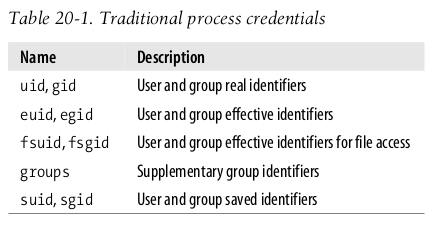
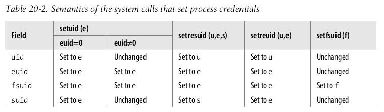

# Process Credentials

> [book - Kaiwan N Billimoria - Hands-On System Programming]

## The traditional Unix permissions model

> Understanding the Linux kernel 3rd Edition



A UID of 0 specifies the superuser (root), while a user group ID of 0 specifies the root
group. If a process credential stores a value of 0, the kernel bypasses the permission
checks and allows the privileged process to perform various actions, such as those
referring to system administration or hardware manipulation, that are not possible to
unprivileged processes.

### Real and effective IDs


If we look deeper, we find that each process UID is actually not a single integer value,
but two values:

- The Real User ID (RUID)

- The Effective User ID (EUID)

Similarly, the group information is not one integer GID value, rather it's two integers:

- The Real Group ID (RGID)
- The Effective Group ID (EGID)

So, with respect to privileges, each process has four integer values associated with it:
`{RUID, EUID, RGID, EGID}`; these are called the `process credentials`.


#### real IDs

The real IDs are the original values associated with the user who logged in; in effect,
they are nothing but the UID:GID pair from the /etc/passwd record for that user.
Recall that the id(1) command reveals precisely this information:

```
$ id
uid=1000(seawolf) gid=1000(seawolf) groups=1000(seawolf),4(adm), [...]
```

The uid and gid values displayed are obtained from the `/etc/passwd` record
for seawolf. In reality, the uid/gid values become the running process's `RUID/RGID`
values respectively!

The real numbers reflect who you originally are—your login account information in
the form of integer identifiers. Another way to put it: **the real numbers reflect who**
**owns the process**.

#### effective IDs

The effective values are to inform the OS as to effectively (at this moment) what
privileges (user and group) the process is running under. Here are a couple of key
points:

- When performing permission checks, the OS uses the process's effective
  values, not the real (original) values.
- EUID = 0 is what the OS actually checks for to determine whether the
  process has root privilege.


## how can a regular user change their password

```bash
➜  ~ ll /usr/bin/passwd 
-rwsr-xr-x 1 root root 67K 7月  15  2021 /usr/bin/passwd
```

A program such as `/usr/bin/passwd` , inherits root access by virtue of the `setuid bit`
and the fact that the file owner is root: these kinds of programs are called `setuid root
binaries` (they're also called `set-user-ID-root` programs).

## The setuid and setgid special permission bits

- A binary executable file with the owner execute bit set to s is called a
  `setuid binary`.
- If the owner of said executable file is root, then it's called a `setuid-root`
  binary.

When the process executes a `set-uid` program—that is, an executable file whose `setuid` flag is on—the `euid` and `fsuid` fields are set to the identifier of the file’s owner. Almost all checks involve one of
these two fields: `fsuid` is used for file-related operations, while `euid` is used for all
other operations. Similar considerations apply to the gid , egid , fsgid , and sgid fields
that refer to group identifiers.

### 最小化 setuid 在程序中的使用范围

Unix’s long history teaches the lesson that setuid programs—programs that have the
setuid flag set—are quite dangerous: malicious users could trigger some program-
ming errors (bugs) in the code to force setuid programs to perform operations that
were never planned by the program’s original designers. In the worst case, the entire
system’s security can be compromised. To minimize such risks, Linux, like all mod-
ern Unix systems, allows processes to acquire setuid privileges only when necessary
and drop them when they are no longer needed. This feature may turn out to be use-
ful when implementing user applications with several protection levels. The process
descriptor includes an `suid` field, which stores the values of the effective identifiers
( euid and fsuid ) at the setuid program startup. The process can change the effective
identifiers by means of the` setuid( )` , setresuid( ) , setfsuid( ) , and setreuid( ) system calls. 

非特权进程只能设置几个 uid

> Understanding the Linux kernel 3rd Edition

Table 20-2 shows how these system calls affect the process’s credentials. Be warned
that if the calling process does not already have superuser privileges—that is, if its
euid field is not null—these system calls can be used only to set values already
included in the process’s credential fields. For instance, an average user process can
store the value 500 into its fsuid field by invoking the `setfsuid()` system call, but
only if one of the other credential fields already holds the same value.



### setuid 使用场景

To understand the sometimes complex relationships among the four user ID fields,
consider for a moment the effects of the setuid( ) system call. The actions are differ-
ent, depending on whether the calling process’s euid field is set to 0 (that is, the pro-
cess has superuser privileges) or to a normal UID.

- If the euid field is 0, 

  the system call sets all credential fields of the calling process
  ( uid , euid , fsuid , and suid ) to the value of the parameter e . A superuser process can
  thus drop its privileges and become a process owned by a normal user. This hap-
  pens, for instance, when a user logs in: the system forks a new process with super-
  user privileges, but the process drops its privileges by invoking the setuid( ) system
  call and then starts executing the user’s login shell program.

- If the euid field is not 0, 

  the setuid() system call modifies only the value stored in
  euid and fsuid , leaving the other two fields unchanged. This behavior of the system
  call is useful when implementing a setuid program that scales up and down the effective process’s privileges stored in the `euid` and `fsuid` fields.


### Setting the setuid and setgid bits with chmod

| chmod via:        | Notation for setuid   | Notation for setgid   |
| ----------------- | --------------------- | --------------------- |
| symbolic notation | u+s                   | g+s                   |
| octal notation    | 4<octal #> (eg. 4755) | 2<octal #> (eg. 2755) |

## System calls

### Querying the process credentials

```c
#include <unistd.h>
#include <sys/types.h>
uid_t getuid(void);
uid_t geteuid(void);
gid_t getgid(void);
gid_t getegid(void);
```

- getuid(2) returns the real UID; geteuid(2) returns the effective UID

- getgid(2) returns the real GID; getegid(2) returns the effective GID

- `uid_t` and `gid_t` are glibc typedefs for an `unsigned integer`

## Sudo – how it works

```bash
$ ls -l $(which sudo)
-rwsr-xr-x 1 root root 145040 Jun 13 2017 /usr/bin/sudo
```

We note that the binary executable **sudo is really a setuid-root program**! So think
about it: whenever you run a program with sudo, the sudo process runs with a root
privilege straight away—no password, no fuss. But, of course, for security, the user
must enter the password; once they enter it correctly, sudo continues execution and
executes the command you want it to—as root. If the user fails to enter the password
correctly (within three attempts typically), sudo aborts execution.

### What is a saved-set ID?

The so-called saved-set IDs are a convenience feature; the OS is able to save the
process's initial effective user id (EUID) value. How does it help? This allows us to
switch from the original EUID value the process starts with to, say, an unprivileged
normal value (we'll cover how exactly in a moment), and then from the current
privileged state back to that saved EUID value (via the seteuid(2) system call);
thus, the initially saved EUID is called the `saved-set ID`.

In effect, we can on demand switch back and forth between a privileged and
unprivileged state for our process!
After we cover a bit more material, an example will help make things clear.

## Setting the process credentials

```bash
$ sudo -u mail id
[sudo] password for seawolf: xxx
```

As expected, once we provide the correct password, sudo runs the id program as the
mail user, and the output of id now shows us that the (real) user and group IDs are
now that of the mail user account! (not seawolf), precisely the effect expected.

But how did sudo(8) do this? We understood from the previous section that, when
you run sudo (with whatever parameters), it, initially at least, always runs as root.
Now the question is, how does it run with the credentials of another user account?

The answer: several system calls exist that let you change the process privileges (the
RUID, EUID, RGID, EGID): setuid(2) , seteuid(2) , setreuid(2) , setresuid(2)
and all their analogs for the GID.

The `setuid(2)` system call allows a process to set its `EUID` to the value passed. If the
process has root privileges (later in the next chapter, we shall qualify statements such
as this a lot better, when we learn about the POSIX capabilities model), then the `RUID`
and `saved-setuid` (explained shortly) are also set to this value.

## Giving up privileges

From the previous discussion, it seems as if the `set*id()` system calls ( setuid(2) ,
seteuid(2) , setreuid(2) , setresuid(2) ) are only useful to root, as only with
root privileges can we use the system calls to change the process credentials. Well,
that's not really the full truth; there's another important case, for non-privileged
processes.

Consider this scenario: our program specification requires the initialization code to
run with root privileges; the rest of the code does not. Obviously, we don't want to
give the end user root access just to run our program. How do we solve this?

Making the program setuid-root would nicely do the trick. As we've seen, a `setuid-root` process will always run as root; but after the initialization work is done, we can
switch back to the unprivileged normal state. How do we do this? Via the
`setuid(2)` : recall that `setuid` for a **privileged process** sets both the `EUID` and `RUID`
`to` the value passed; so we pass it the process's `RUID`, which we obtain via the getuid:

```c
setuid(getuid()); // make process unprivileged
```

This is a useful semantic (often, the seteuid(getuid() ) is all we require). We use
this semantic to become our true selves again—quite philosophical, no?

## The setres[u|g]id(2) system calls

```c
#define _GNU_SOURCE
#include <unistd.h>
/* See feature_test_macros(7) */
int setresuid(uid_t ruid, uid_t euid, uid_t suid);
int setresgid(gid_t rgid, gid_t egid, gid_t sgid);
```

This pair of system calls is like a superset of the earlier set*id() APIs. With the
`setresuid(2)` system call, a process can set the `RUID`, `EUID`, and `saved-set-id` all at
once, with a single system call (the res in the system call name stands for real,
effective, and saved-set-ID, respectively).

A `non-privileged` (meaning, non-root) process can only use this system call to set the
three IDs to one of the current `RUID`, the current `EUID`, or the current `saved-set UID`,
nothing else (the usual security principle at work). Passing -1 implies to leave the
corresponding value unchanged.

A `privileged` (root) process can use the call to set the
three IDs to any values, of course. (As usual, the setresgid(2) system call is
identical except that it sets group credentials).

Some real-world OSS projects indeed use this system call; good examples are the
OpenSSH project (the Linux port is called OpenSSH-portable) and the well-
known sudo(8) utility.

```bash
$ id mail
uid=8(mail) gid=8(mail) groups=8(mail)
$ sudo strace -e trace=setuid,setreuid,setresuid sudo -u mail id
[...]
setresuid(-1, 0, -1)
= 0
setresuid(-1, -1, -1)
= 0
setresuid(-1, 8, -1)
= 0
setresuid(-1, 0, -1)
= 0
[...]
```

Clearly, sudo uses the setresuid(2) system call to set permissions, credentials,
really, as appropriate (in the preceding example, the process `EUID` is being set to that
of the mail user, the `RUID` and `saved-set-id` are being left unchanged).


## File Permissions

```
$ grep seawolf /etc/passwd
seawolf:x:1000:1000:Seawolf,,,:/home/seawolf:/bin/bash
```

The passwd entry is a row with seven columns that are colon-delimited fields; they
are as follows:

```
username:<passwd>:UID:GID:descriptive_name:home_dir:program
```

#### Determining the access category

```basic
if process_UID == file_UID
then
	access_category = U
else if process_GID == file_GID
then
	access_category = G
else
	access_category = O
fi
```

Actually, it's a bit more complex: **a process can belong to several groups**
**simultaneously**. So, at permission checking time, the **kernel checks all groups**; if the
process belongs to any one of them, the access category is set to G.
Finally, for that access category, check the permission bitmask (rwx); if the relevant
bit is set, the process will be allowed the operation; if not, it won't be.

