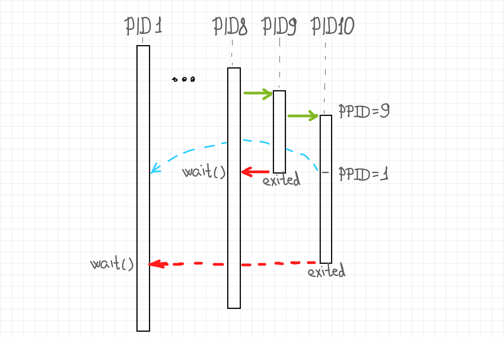
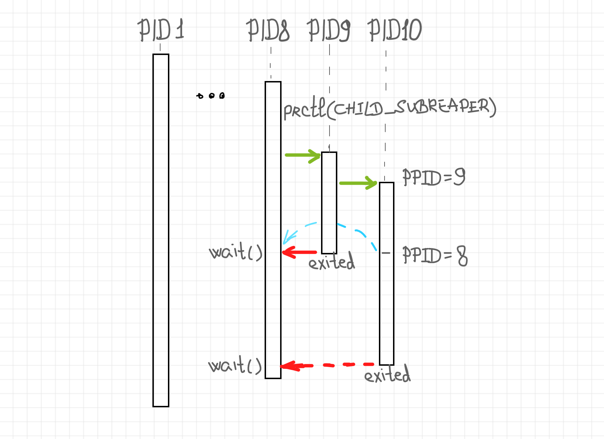

# process reparent

> https://iximiuz.com/en/posts/dealing-with-processes-termination-in-Linux/#awaiting-a-grandchild-process-termination


## Awaiting a grandchild process termination

Ok, here is a tricky one. We already know that every process has to wait for its children's termination to prevent the zombie apocalypse. But what happens if we forked a child process, which in turn forked another process and then suddenly died. Huh, seems like we have a grandchild now. But it can easily be, that we haven't even heard about our grandchild. So, what is the grandchild's parent id after its actual parent death? And who is going to await this apparently abandoned process?



Right, the *PID 1*! Linux doesn't allow orphan processes. Historically, in situations similar to the described above, the grandchild processes would be reparented to the *init* process, the ancestor of all the processes. Although it’s not necessarily the case starting from the Linux 3.4 kernel, we will get back to it in a minute.


To prevent the reparenting of the orphan process to the *init* process, we need to mark one of its more close ancestors (for instance, our main process) as a [**subreaper**](https://linux.die.net/man/2/prctl#PR_SET_CHILD_SUBREAPER)!



The implementation of this trick is as simple as a single [`prctl()`](https://linux.die.net/man/2/prctl) invocation. This system call is an almighty tool when it comes to process behavior tuning. 


```rust
use std::process::{exit};
use std::thread::{sleep};
use std::time::Duration;

use libc::{prctl, PR_SET_CHILD_SUBREAPER};
use nix::sys::wait::waitpid;
use nix::unistd::{fork, ForkResult, getpid, getppid, Pid};

fn main() {
    println!("[main] Hi there! My PID is {}.", getpid());
    println!("[main] Making myself a child subreaper.");
    unsafe {
        prctl(PR_SET_CHILD_SUBREAPER, 1, 0, 0, 0);
    }

    match fork() {
        Ok(ForkResult::Child) => {
            //////////////////////
            //      child 1     //
            //////////////////////
            println!("[child 1] I'm alive! My PID is {} and PPID is {}.", getpid(), getppid());

            match fork() {
                Ok(ForkResult::Child) => {
                    //////////////////////
                    //      child 2     //
                    //////////////////////
                    for _ in 0..6 {
                        println!("[child 2] I'm alive! My PID is {} and PPID is {}.", getpid(), getppid());
                        sleep(Duration::from_millis(500));
                    }
                    println!("[child 2] Bye Bye");
                    exit(0);
                }

                Ok(ForkResult::Parent { child, .. }) => {
                    println!("[child 1] I forked a grandchild with PID {}.", child);
                }

                Err(err) => panic!("[child 1] fork() failed: {}", err),
            };

            println!("[child 1] I'm gonna sleep for a while and then just exit...");
            sleep(Duration::from_millis(1500));
            exit(0);
        }

        Ok(ForkResult::Parent { child, .. }) => {
            println!("[main] I forked a child with PID {}.", child);
        }

        Err(err) => panic!("[main] fork() failed: {}", err),
    };

    println!("[main] I'll be waiting for the child termination...");
    match waitpid(Pid::from_raw(-1), None) {
        Ok(status) => println!("[main] Child exited with status {:?}", status),
        Err(err) => println!("[main] waitpid() failed: {}", err),
    }

    println!("[main] I'll be waiting for the grandchild termination as well...");
    sleep(Duration::from_millis(500));  // just in case
    match waitpid(Pid::from_raw(-1), None) {
        Ok(status) => println!("[main] Grandchild exited with status {:?}", status),
        Err(err) => println!("[main] waitpid() failed: {}", err),
    }
    println!("[main] Bye Bye!");
}
```


The idea is pretty simple again. The main process forks a child which, in turn, forks its own child, i.e. a grandchild of the main process. The grandchild continuously reports its parent id. In a while, the child process exits and since the main process marked itself a subreaper, the grandchild gets reparented to the main process instead of the init process. 


