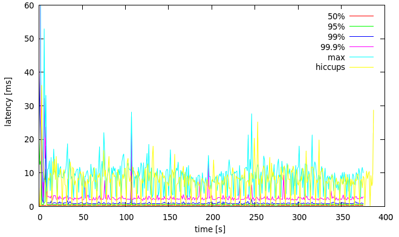
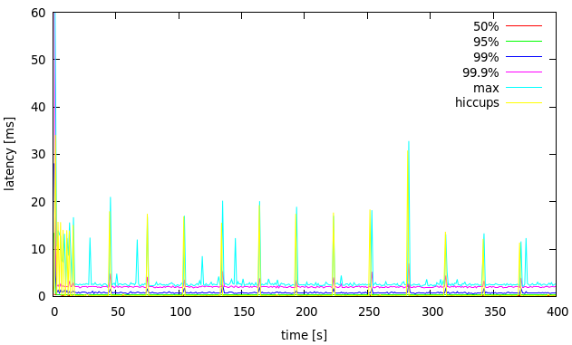
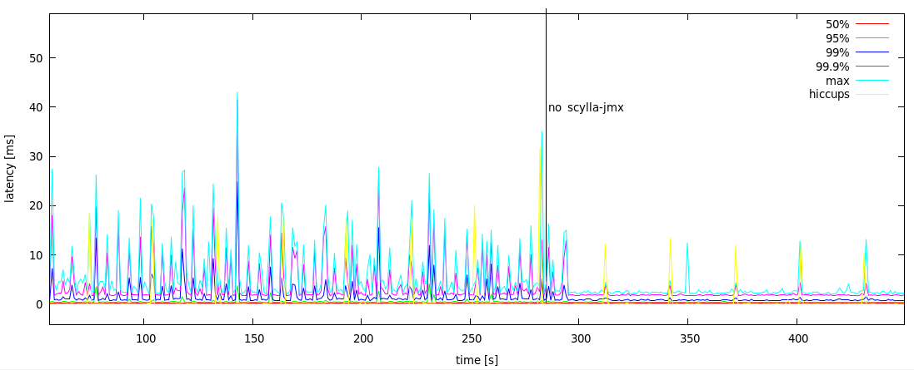
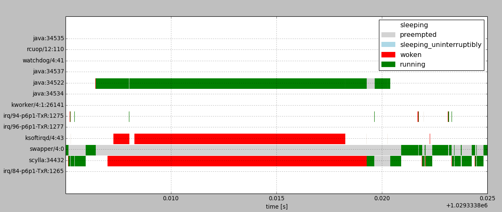
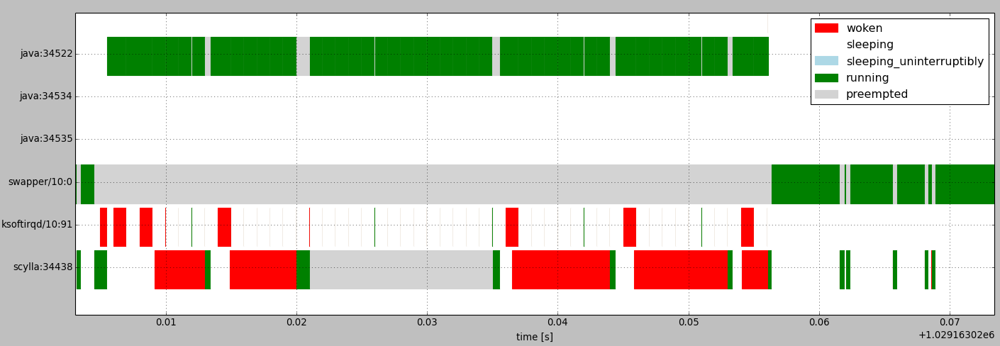
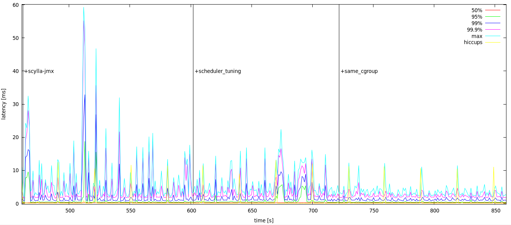
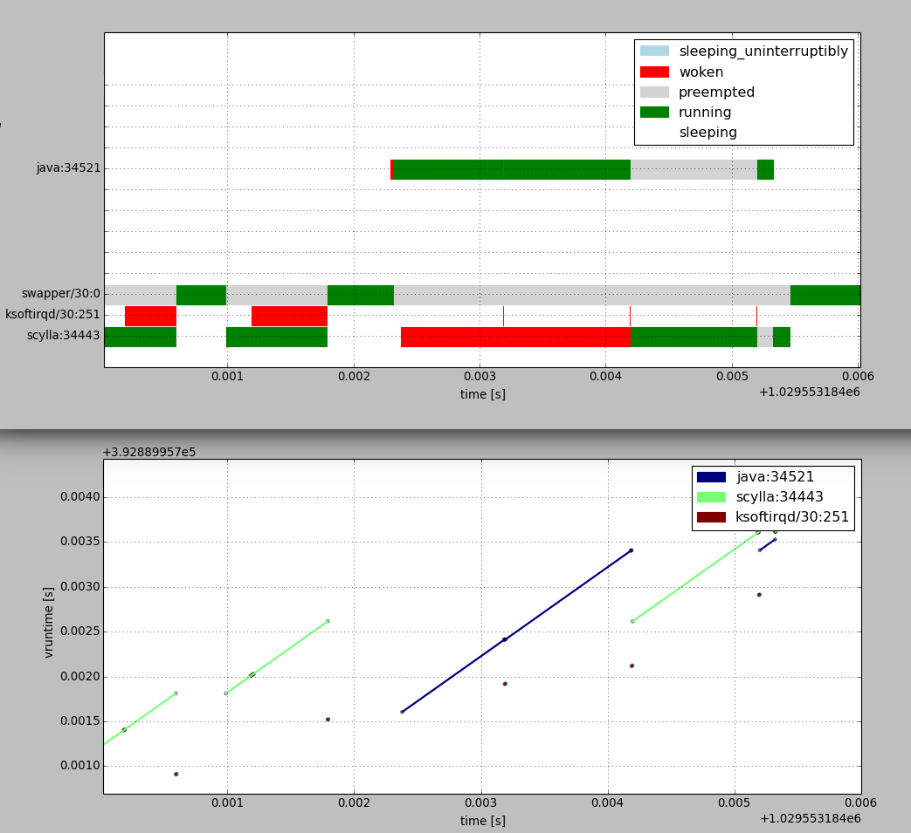

# Reducing latency spikes by tuning the CPU scheduler
> https://www.scylladb.com/2016/06/10/read-latency-and-scylla-jmx-process/

In this post we will walk through an investigation of latency spikes observed in the Scylla 1.0.x version family, which are linked to the scylla-jmx service running alongside the Scylla server on the same system. We will show how the scheduler can be tuned to reduce latency spikes. Scylla 1.2, which is at the [release candidate](https://groups.google.com/forum/#!topic/scylladb-users/vyz1Sqy0sng) stage this week, will have all relevant fixes. Users of that version won’t have to do anything. Scylla 1.2 is scheduled for release in about a week.

It all started with a report from one of our users. They tested a read-only and very light workload on a small data set, completely fitting in memory. They observed an unexpectedly high 99.9th percentile request latency, oscillating around 40 ms within a range of 20-80 ms.

We went to reproduce the problem in our lab.

## Testing setup

The system under test was a 2-node Scylla cluster.

Servers run on Intel(R) Xeon(R) E5-2630 v3 @ 2.40GHz in a configuration of 2 sockets, 16 cores and 32 threads.

The server on which perf trace was collected was running Ubuntu 14.04 with 4.2.0-27-low latency kernel.

Load characteristics:

- read-only
- small data set, completely fitting in memory
- 4 cassandra-stress loaders, each on a separate machine
- concurrency set at 100 per loader
- request rate limited to 8k/s per loader

Server utilization during the test was relatively low. Average Seastar reactor utilization was at around 10%. Loader machine utilization was also low, with CPU utilization around 15%.

## Monitoring request latency

The cassandra-stress tool reports request latency percentiles every second. Those numbers, from one of the loaders, were used to generate charts with evolution of latency profile for percentiles: 50%, 95%, 99%, 99.9% and 100% (max).

cassandra-stress is not a perfect tool for measuring latency. One of the problems is that latencies reported by it are heavily affected by pauses in the Java runtime on which the stress tool runs, mostly caused by garbage collection (GC). This effect can be measured using the [jHiccup](https://www.azul.com/jhiccup/) tool, which detects and reports pauses (aka hiccups). Below is an example latency evolution graph with maximum hiccup time (the yellow line) reported by that tool:



**Figure 1: latency evolution with maximum hiccup duration for one of the loaders**

We can see that the reported latency is jittery in high percentiles and correlates with hiccups. This distorts the picture of latency in the system under test. To remedy this, the cassandra-stress JVM was tuned in a way which reduces frequency of GC, at the expense of potentially longer GC pauses:

```
-Xmx24G -Xms24G -XX:NewSize=20G -XX:+UseG1GC
```


**Figure 2: latency evolution with maximum hiccup duration for one of the loaders, large heap**

The hiccups are now rare and we can see a much clearer latency profile between them.

We plan to write a CQL stress tool in the future based on the Seastar framework, which does not require garbage collection and would not suffer from such problems.

## Impact of scylla-jmx on latency

scylla-jmx is a JVM-based adapter service between ScyllaDB’s RESTful API and the JMX interface expected by tools such as nodetool (See the diagram below). It runs on the same machine as the Scylla server.


We discovered that running it with Scylla 1.0.0 causes latency jitter, even when nodetool is not invoked. The effect can be seen on Figure 3. The first part of the graph is with scylla-jmx running.


**Figure 3: Latency profile on Scylla 1.0.0 with scylla-jmx running vs. not running**

It turned out that due to an implementation detail scylla-jmx was polling Scylla periodically. The [fix](https://github.com/scylladb/scylla-jmx/commit/4eb02743cdb8db0bbcb234a7c002da31ec6b5fe8) to remove the polling is already merged and is scheduled to be released in version **1.2** of Scylla, in about a week. After the fix, idling scylla-jmx doesn’t have any noticeable effect on client-side latency. Nevertheless, this case led us to come up with tunings which are supposed to reduce latency jitter caused by other processes running in the system.

## Tracing the CPU scheduler

A running program (process) is comprised of threads. Each thread is a sequence of execution, which can make progress independently from other threads. Each logical CPU may execute one thread at any given moment. There may be more runnable threads than there are CPUs, so a problem arises of how to distribute CPU time among threads. The decision of which thread should run next and for how long is the job of a CPU scheduler, which is part of the operating system.

Within a single CPU, allowing one thread to make progress prevents progress of other threads. When a thread is runnable but cannot make progress, we say it experienced a scheduling delay. Typically the delay will be caused by the CPU being assigned to a different thread by the scheduler. Delays of Scylla server threads will typically result in delays in request processing.

Scylla is based on the [Seastar](http://www.seastar-project.org/) framework, which starts one thread per CPU for main processing. Those threads are called “reactor” threads. Seastar also has another per-CPU set of threads dedicated for executing blocking operations, mainly certain system calls which don’t have asynchronous interface and would otherwise block the whole reactor thread. This pool should not be used in this kind of workload though. So if Scylla was the only runnable process in the system no scheduling delays should occur, and there should be at most one runnable task per CPU.

One of the most obvious ways in which background processes like scylla-jmx can interfere with Scylla server is by competing with it for CPU time and thus causing scheduling delays.

We tested that isolating scylla-jmx on a core on which scylla threads are not running leaves latency unaffected, which supports that theory. We further confirmed that by collecting scheduler traces. A scheduler trace contains history of scheduling decisions, from which we can calculate scheduling delays for each process and figure out what is causing the delays.

The trace can be collected on Linux using [perf](https://lwn.net/Articles/353295/). For example, to collect the trace on all CPUs over the period of 6 seconds:

```
perf sched record -a sleep 6
```

We can then produce a summary report with `perf sched latency`, which may look like the one below:

```
$ perf sched latency -s max
 ---------------------------------------------------------------------------------------------------------------
  Task                  |   Runtime ms  | Switches | Average delay ms | Maximum delay ms | Maximum delay at     |
 ---------------------------------------------------------------------------------------------------------------
  scylla:34432          |   2973.649 ms |    14914 | avg:    0.011 ms | max:   12.277 ms | max at: 1029333.807010 s
  ksoftirqd/4:43        |     16.869 ms |     3037 | avg:    0.009 ms | max:    9.998 ms | max at: 1029333.808278 s
  java:34522            |     14.878 ms |       11 | avg:    0.045 ms | max:    0.382 ms | max at: 1029333.819280 s
  irq/84-p6p1-TxR:1265  |     37.584 ms |     3064 | avg:    0.007 ms | max:    0.057 ms | max at: 1029329.939957 s
  irq/94-p6p1-TxR:1275  |     64.773 ms |     5086 | avg:    0.007 ms | max:    0.057 ms | max at: 1029332.363001 s
  java:34537            |      4.236 ms |        5 | avg:    0.019 ms | max:    0.035 ms | max at: 1029333.268336 s
  java:34534            |      0.189 ms |       10 | avg:    0.011 ms | max:    0.032 ms | max at: 1029333.851643 s
  irq/96-p6p1-TxR:1277  |      0.868 ms |       74 | avg:    0.005 ms | max:    0.023 ms | max at: 1029330.959785 s
  java:34535            |      0.170 ms |        8 | avg:    0.008 ms | max:    0.017 ms | max at: 1029333.630832 s
  watchdog/4:41         |      0.005 ms |        1 | avg:    0.012 ms | max:    0.012 ms | max at: 1029333.375927 s
  kworker/4:1:26141     |      0.020 ms |        4 | avg:    0.003 ms | max:    0.004 ms | max at: 1029333.847300 s
  rcuop/12:110          |      0.017 ms |        1 | avg:    0.003 ms | max:    0.003 ms | max at: 1029333.611124 s
 -----------------------------------------------------------------------------------------
  TOTAL:                |   3113.258 ms |    26215 |
 ---------------------------------------------------
```

This report shows basic information which can be used to determine if scheduling delays could be a problem. The column with **maximum delay** per process is most significant. From the above output we can see the Scylla server (scylla:34432) experienced a scheduling delay of up to 12.277 ms. This matches increase in latency we saw in the client-side latency profile.

The summary doesn’t show the culprit of the delay though. One can look at the output of **perf sched map** or the raw trace (**perf sched script**) to figure that out. That can be a tedious task so we wrote our own scripts to post-process the trace and summarize it in a more approachable way.

We can produce a cumulative histogram of scheduling delays for the Scylla server, which looks like this:

```
 duration [s]          sum
 ------------  -----------
 0.000001000:     0.000961 #
 0.000001330:     0.013074 ##
 0.000001769:     0.000000
 0.000002353:     0.104958 ###########
 0.000003129:     0.147330 ###############
 0.000004162:     0.173940 ##################
 0.000005535:     0.193730 ####################
 0.000007361:     0.205832 #####################
 0.000009791:     0.046772 #####
 0.000013022:     0.184048 ###################
 0.000017319:     0.403954 ########################################
 0.000023034:     0.407140 ########################################
 0.000030635:     0.326356 #################################
 0.000040745:     0.148159 ###############
 0.000054190:     0.071372 ########
 0.000072073:     0.010696 ##
 0.000095858:     0.000705 #
 0.000127491:     0.000000
 0.000169562:     0.000318 #
 0.000225518:     0.000189 #
 0.000299939:     0.001882 #
 0.000398919:     0.002377 #
 0.000530562:     0.002245 #
 0.000705647:     0.001950 #
 0.000938511:     0.004042 #
 0.001248220:     0.002110 #
 0.001660132:     0.007396 #
 0.002207976:     0.009469 #
 0.002936608:     0.025714 ###
 0.003905688:     0.059116 ######
 0.005194566:     0.025837 ###
 0.006908772:     0.000000
 0.009188667:     0.000000
 0.012220927:     0.020674 ###
 0.016253833:     0.012277 ##
 0.021617598:     0.000000
       total:     2.614623
```

We can also annotate that histogram with the names of processes which were on-CPU during delays from each range. This sheds light on what’s responsible for the delays. We can see that long delays are mostly due to java (that’s scylla-jmx):

```
         0.003905688:     0.059116 ######
27.86%: java:34534
22.71%: java:34535
12.64%: java:34536
11.86%: java:34522
11.16%: java:34521
6.14%: java:34537
5.80%: java:34538
0.45%: irq/93-p6p1-TxR:1274
0.33%: irq/101-p6p1-Tx:1282
0.24%: irq/80-p6p1-TxR:1261
0.23%: irq/103-p6p1-Tx:1284
0.19%: irq/92-p6p1-TxR:1273
0.07%: irq/110-p6p1-Tx:1291
0.06%: ksoftirqd/6:59
0.05%: ksoftirqd/12:107
0.05%: ksoftirqd/2:27
0.04%: ksoftirqd/0:3
0.03%: ksoftirqd/14:123
0.03%: swapper/14:0
0.03%: irq/91-p6p1-TxR:1272
0.02%: ksoftirqd/24:203
0.01%: ksoftirqd/10:91
0.00%: swapper/12:0
         0.005194566:     0.025837 ###
32.05%: java:34535
16.19%: java:34534
16.04%: java:34536
15.73%: java:34537
12.42%: kworker/u290:0:7796
5.75%: irq/50-megasas:479
0.93%: irq/98-p6p1-TxR:1279
0.27%: irq/94-p6p1-TxR:1275
0.18%: irq/93-p6p1-TxR:1274
0.17%: irq/110-p6p1-Tx:1291
0.08%: ksoftirqd/24:203
0.06%: irq/90-p6p1-TxR:1271
0.06%: ksoftirqd/8:75
0.03%: ksoftirqd/12:107
0.03%: ksoftirqd/0:3
0.02%: ksoftirqd/4:43
0.01%: ksoftirqd/11:99
         0.006908772:     0.000000
         0.009188667:     0.000000
         0.012220927:     0.020674 ###
50.13%: java:34522
46.39%: java:34521
1.39%: irq/92-p6p1-TxR:1273
1.26%: irq/80-p6p1-TxR:1261
0.26%: ksoftirqd/14:123
0.22%: ksoftirqd/2:27
0.20%: irq/91-p6p1-TxR:1272
0.15%: irq/88-p6p1-TxR:1269
         0.016253833:     0.012277 ##
99.71%: java:34522
0.17%: irq/94-p6p1-TxR:1275
0.11%: ksoftirqd/4:43
         0.021617598:     0.000000
```

We can also visualize the longest pause (12.277 ms) on a scheduling history diagram to better understand what was happening around that time:



The diagram above shows changes of task states within a single CPU. Processes in “woken” and “preempted” states are experiencing scheduling delays. The task named “swapper” is the idle task, which executes when no other task is runnable.

We can see that Scylla server is delayed after being woken up because the CPU is mostly assigned to a java task.

## Scheduler tunables

The CFS scheduler in Linux exposes tunables which can be used to reduce scheduling delays. This should also reduce client-side latencies when Scylla is not under high load.

The **sched_latency_ns** and **sched_min_granularity_ns** tunables determine the scheduling period, which will be:

```
period = max(sched_latency_ns, sched_min_granularity_ns * nr_tasks)
```

The scheduler will assign time slices to tasks so that all of them would have a chance to advance within the scheduling period.

The actual task switch granularity may be lower than what follows from the ideal model. Unless rescheduling is triggered by some event, it will happen periodically from the scheduler tick. On CentOS 7 kernel 3.10.0-327 and Ubuntu 14.04 kernel 4.2.0-27-lowlatency (the one on which traces were collected) the scheduler tick is configured (CONFIG_HZ) to have a period of **1 ms**. Ubuntu’s 4.2.0-27-generic kernel flavor has the tick set at **4 ms** period.

Linux has an HRTICK feature, disabled by default, which is supposed to provide high-resolution preemption. We’ve observed though that enabling it doesn’t necessarily help in lowering scheduling latency as expected due to something which appears to be a bug. For more details check out the report on the linux-kernel mailing list [here](http://thread.gmane.org/gmane.linux.kernel/2216485).

There is also **sched_wakeup_granularity_ns** tunable which determines the minimum difference in vruntime between currently running task and the task being woken up which will cause the preemption of current task. Lowering this reduces wakeup delays on one hand, but may cause too frequent switches on the other.

The defaults on one of our systems were:

- sched_latency_ns: 24000000
- sched_min_granularity_ns: 3000000
- sched_wakeup_granularity_ns: 4000000

## Effect of tuning the scheduler on latency

We’ve chosen to set the scheduler tunables to those values:

- sched_latency_ns: 1000000
- sched_min_granularity_ns: 500000
- sched_wakeup_granularity_ns: 500000

With those settings we should expect scheduling delays to be reduced because the scheduler should assign smaller time slices to tasks. In the case of two runnable tasks competing for a single CPU, the delays experienced by each of them would be 0.5 ms ideally, in practice 1 ms due to scheduler tick precision. As it will be shown later, maximum delays may go higher in case tasks are waking up.

However, applying those tunables alone didn’t seem to improve scheduling delays. As can be seen on the histogram below, there are still delays in the 12-16 ms range:

```
 duration [s]          sum
 ------------  -----------
 0.000001000:     0.000883 #
 0.000001330:     0.013143 ##
 0.000001769:     0.000000
 0.000002353:     0.103776 ##########
 0.000003129:     0.105060 ##########
 0.000004162:     0.096200 #########
 0.000005535:     0.099900 ##########
 0.000007361:     0.145405 ##############
 0.000009791:     0.051428 #####
 0.000013022:     0.185164 #################
 0.000017319:     0.364039 #################################
 0.000023034:     0.442968 ########################################
 0.000030635:     0.365629 ##################################
 0.000040745:     0.159673 ###############
 0.000054190:     0.085983 ########
 0.000072073:     0.011913 ##
 0.000095858:     0.001020 #
 0.000127491:     0.000403 #
 0.000169562:     0.001199 #
 0.000225518:     0.001778 #
 0.000299939:     0.001895 #
 0.000398919:     0.003505 #
 0.000530562:     0.008784 #
 0.000705647:     0.011546 ##
 0.000938511:     0.024238 ###
 0.001248220:     0.030938 ###
 0.001660132:     0.030878 ###
 0.002207976:     0.086522 ########
 0.002936608:     0.068821 #######
 0.003905688:     0.103966 ##########
 0.005194566:     0.104819 ##########
 0.006908772:     0.095208 #########
 0.009188667:     0.078476 ########
 0.012220927:     0.020888 ##
 0.016253833:     0.041992 ####
 0.021617598:     0.000000
       total:     2.948040
```

Figure 4 below shows the scheduling history around one of the longest delays of scylla process. We can see that scylla was preempted for 14ms with CPU being assigned mostly to java:34522 with short switch-ins of ksoftirqd every 1ms.


**Figure 4: Scheduling history showing long preemption of scylla process when running in a different cgroup**

It turns out that this effect can be observed when scylla runs in a different cgroup from the java process, but not when they run in the same cgroup. The reason for this effect is yet to be discovered.

To check to which group given process belongs to, one can run:

```
cat /proc/$PID/cgroup
```

The cgroup subsystem named `cpu` is relevant for scheduling.

A process can be forced under a certain cgroup at run time with **cgclassify**. For example, to force all scylla and java (scylla-jmx) processes under the root group (-w is important for the change to affect all threads):

```
sudo cgclassify -g cpu:/ `pgrep -w scylla`
sudo cgclassify -g cpu:/ `pgrep -w java`
```

Linux has a feature called **autogroup** which will automatically associate each session with a different cgroup. Processes started in those sessions will inherit group affinity. Due to latency issues mentioned above, the scylla package will disable autogroup (See [this](https://github.com/scylladb/scylla/commit/e515933c70a11404f9f26472f562ec5c44c82c12) commit).

Forcing scylla and scylla-jmx under the same group and applying scheduler settings has the desired effect of reducing scheduling delays. Now the maximum delay is **1.8 ms**:

```
 duration [s]          sum
 ------------  -----------
 0.000001000:     0.001258 #
 0.000001330:     0.017133 ##
 0.000001769:     0.000000
 0.000002353:     0.108092 ##########
 0.000003129:     0.089592 #########
 0.000004162:     0.088984 #########
 0.000005535:     0.105515 ##########
 0.000007361:     0.126085 ############
 0.000009791:     0.051261 #####
 0.000013022:     0.186424 ##################
 0.000017319:     0.412278 ######################################
 0.000023034:     0.435419 ########################################
 0.000030635:     0.334851 ###############################
 0.000040745:     0.161521 ###############
 0.000054190:     0.084245 ########
 0.000072073:     0.011797 ##
 0.000095858:     0.001975 #
 0.000127491:     0.001475 #
 0.000169562:     0.000755 #
 0.000225518:     0.001725 #
 0.000299939:     0.003170 #
 0.000398919:     0.003136 #
 0.000530562:     0.007800 #
 0.000705647:     0.009387 #
 0.000938511:     0.011682 ##
 0.001248220:     0.008776 #
 0.001660132:     0.002659 #
 0.002207976:     0.001819 #
 0.002936608:     0.000000
       total:     2.268814
```

Figure 5 below shows the effect of those tunings on client-side latencies:


**Figure 5: Effect of scheduler tuning and cgroup placement on client-side latencies with scylla-jmx running**

Those settings will be applied automatically when installing Scylla packages starting from the 1.2 release (See [this](https://github.com/scylladb/scylla/commit/e515933c70a11404f9f26472f562ec5c44c82c12) commit).

We suggested to the user who reported latency issues to apply those settings and they observed a significant improvement of latency in high percentiles.

## Cause of delays longer than scheduling latency

One thing worth explaining about the new results is why we see scheduling delays of 1.8 ms despite having scheduler latency set to 1 ms.

It could obviously happen if there were more than two CPU hogs competing. Then it would take many scheduler ticks to cycle over them. This is not the case here though.

An example of scheduling history around such an event is shown on Figure 6, where we can see a scylla process waiting for CPU for 1.8 ms while a single java process is running:


**Figure 6: Scheduling history around 1.8ms delay with scheduler tuning applied and processes in same cgroup**

To understand this event we need to take a closer look at how CFS works. Each task has a property called vruntime. When a task is on-CPU its vruntime is increased by the amount of time it was running. Upon rescheduling, a runnable task with the smallest vruntime is picked next. The scheduler also tracks a monotonically increasing base value of vruntime for the whole run queue named min_vruntime. That value moves forward as the minimum vruntime of all runnable or running tasks increases. A task which was sleeping and is woken up would have much lower vruntime than others so its vruntime is adjusted to catch up with other tasks. With GENTLE_FAIR_SLEEPERS scheduler feature on (as in our kernel), vruntime of woken tasks will be moved forward as far as to `min_vruntime - sched_latency/2`. With GENTLE_FAIR_SLEEPERS feature off it would be `min_vruntime - sched_latency`.

The effect of vruntime catching up can be observed on Figure 6 for ksoftirqd process. When it’s woken up at time=0.001196, only scylla is running and min_vruntime will match scylla’s vruntime. When ksoftirqd gets to run at 0.001792, after scylla goes to sleep, it has vruntime 0.5 ms lower than scylla’s vruntime at the time it was woken up. Because ksoftirqd runs only briefly, min_vruntime doesn’t increase since ksoftirqd was woken up and now scylla is well ahead of min_vruntime. It could get ahead in this configuration as far as by a single scheduler tick period. If it ran longer, it would get preempted, ksoftirqd would run, and min_vruntime would catch up with scylla’s vruntime.

After a brief idle period, the java process wakes up around time=0.002294. For it has not run for a while its vruntime catches up to min_vruntime – 0.5 ms. Soon after java is woken up, scylla is woken up as well. Scylla’s vruntime is ahead of java’s runtime by more than the time left until the next scheduler tick. So when the next tick happens, ksoftirqd is scheduled in briefly, but java has still lower vruntime than scylla so it continues to run until the next tick. Those effects combined could in theory give worst case delay of `sched_latency/2 + 2*tick_period = 2.5 ms` for this configuration and workload.

## Summary

A running scylla-jmx service from Scylla versions 1.0.x was shown to causes spikes in maximum request [latency](https://www.p99conf.io/) up to tens of milliseconds.

We’ve shown how scheduler tuning can be used to reduce the jitter. In our test workload the maximum latency went down to about 5 ms. When no scylla-jmx was running, the maximum latency is about 2.5 ms.

Scylla 1.2 will ship with fixes which will make the problem go away:

- scylla-jmx will no longer interfere with the Scylla server when not used
- the package will apply scheduler settings which reduce effect of other processes on request latency
