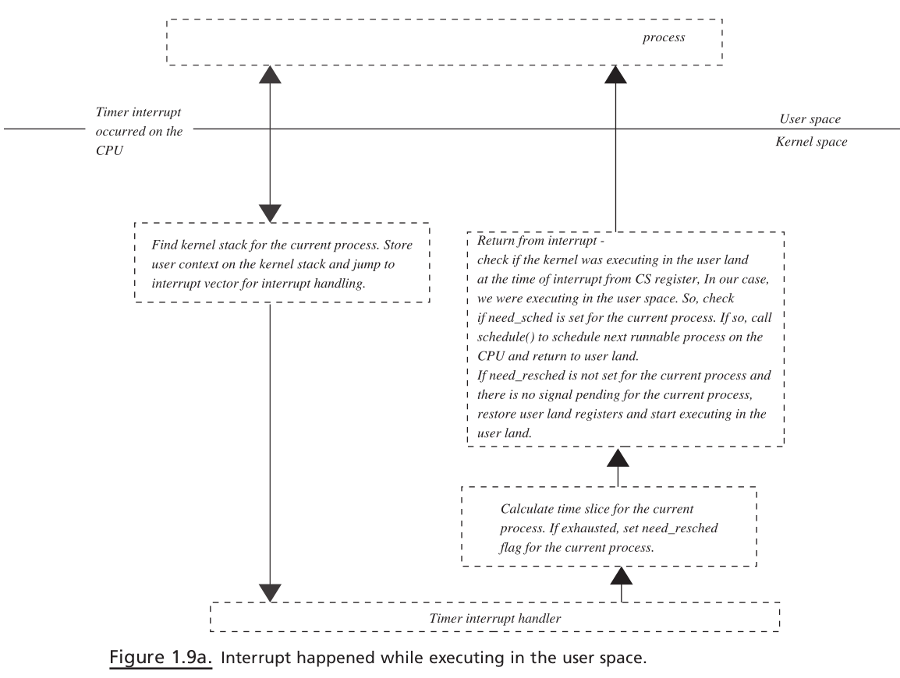

> [Linux Kernel Program - Kaiwan N Billimoria]


## When does the scheduler run?

Here's a (seemingly) logical way to go about it: invoke the scheduler when the timer
interrupt fires; that is, it gets a chance to run CONFIG_HZ times a second (which is
often set to the value 250)! Hang on, though, we learned a golden rule in Chapter
8 , Kernel Memory Allocation for Module Authors – Part 1, in the Never sleep in interrupt or
atomic contexts section: you cannot invoke the scheduler in any kind of atomic or
interrupt context; thus invoking it within the timer interrupt code path is certainly
disqualified. So, what does the OS do?

The way it's actually done is that both the `timer interrupt context`, and the `process context` code paths, are used to make scheduling work. We will briefly describe the details in the following section.


### The timer interrupt part

Within the timer interrupt (in the code of
`kernel/sched/core.c:scheduler_tick()` , wherein interrupts are disabled), the
kernel performs the meta work necessary to keep scheduling running smoothly; this
involves the constant **updating of the per CPU runqueues as appropriate, load
balancing work**, and so on. Please be aware that the actual `schedule()` function is
never called here. At best, the scheduling class hook function (for the process context
current that was interrupted), `sched_class:task_tick()` , if non-null, is invoked.
For example, for any thread belonging to the fair (CFS) class, the update of the
`vruntime` member (the virtual runtime, the (priority-biased) time spent on the
processor by the task) is done here in `task_tick_fair()` .

> More technically, all this work described in the preceding paragraph
occurs within the `timer interrupt soft IRQ`, `TIMER_SOFTIRQ` .


Now, a key point, it's the scheduling code that decides: do we need to preempt
`current` ? Within this timer interrupt code path, if the kernel detects that the current
task has exceeded its time quantum or must, for any reason, be preempted (perhaps
there is another runnable thread now on the runqueue with higher priority than it),
the code sets a "global" flag called `need_resched` . (The reason we put the word
global within quotes is that it's not really a kernel-wide global; it's actually simply a
bit within `current` instance's `thread_info->flags` bitmask named
`TIF_NEED_RESCHED` . Why? It's actually faster to access the bit that way!) It's worth
emphasizing(强调) that, in the typical (likely) case, there will be no need to preempt
`current` , thus the `thread_info.flags:TIF_NEED_RESCHED` bit will remain clear. If
set, scheduler activation will occur soon; but when exactly? Do read on...

### The process context part

Once the just-described timer interrupt portion of the scheduling housekeeping work
is done (and, of course, these things are done very quickly indeed), control is handed
back to the process context (the thread, `current` ) that was rudely interrupted. It will
now be running what we think of as the exit path from the interrupt. Here, it
checks whether the `TIF_NEED_RESCHED` bit is set – the `need_resched()` helper
routine performs this task. If it returns `True` , this indicates the immediate need for a
reschedule to occur: the kernel calls `schedule()` ! Here, it's fine to do so, as we are
now running in process context. (Always keep in mind: all this code we're talking
about here is being run by `current` , the process context in question.)


Of course, now the key question becomes where exactly is the code that will
recognize whether the `TIF_NEED_RESCHED` bit has been set (by the previously
described timer interrupt part)? Ah, this becomes the crux(症结) of it: the kernel arranges
for several **scheduling opportunity points** to be present within the kernel code base.
Two scheduling opportunity points are as follows:


- <mark>Return from the system call code path.<mark>
- <mark>Return from the interrupt code path.</mark>


> [TCP IP Architecture Design - Sameer Seth]
>
> 
>
> Figure 1.9a. Interrupt happened while executing in the user space.


#### Return from the system call code path

So, think about it: every time any thread running in user space issues a system call,
that thread is (context) switched to kernel mode and now runs code within the kernel,
with kernel privilege. Of course, system calls are finite(有限) in length; when done, there is
a well-known return path that they will follow in order to switch back to user mode
and continue execution there. On this return path, a scheduling opportunity point is
introduced: a check is made to see whether the `TIF_NEED_RESCHED` bit within its
`thread_info` structure is set. If yes, the scheduler is activated.

FYI, the code to do this is arch-dependent; on x86 it's
here: `arch/x86/entry/common.c:exit_to_usermode_loop()` . Within it, the
section relevant to us here is:
```c
static void exit_to_usermode_loop(struct pt_regs *regs, u32
cached_flags) {
[...]
    if (cached_flags& _TIF_NEED_RESCHED)
        schedule();
}        
```

#### Return from the interrupt code path

Similarly, after handling an (any) hardware interrupt (and any associated soft IRQ
handlers that needed to be run), after the switch back to process context within the
kernel (an artifact within the kernel – `irq_exit()` ), but before restoring context to
the task that was interrupted, the kernel checks the `TIF_NEED_RESCHED` bit: if it is set,
`schedule()` is invoked.

Let's summarize the preceding discussion on the setting and recognition of
the `TIF_NEED_RESCHED` bit:

- The timer interrupt (soft IRQ) sets the `thread_info:flags TIF_NEED_RESCHED` bit in the following cases:
    - If preemption is required by the logic within the scheduling class's `scheduler_tick()` hook function; for example, on CFS, if the current task's `vruntime` value exceeds that of another runnable thread by a given threshold (typically 2.25 ms; the relevant tunable is `/proc/sys/kernel/sched_min_granularity_ns` ).
    - If a higher-priority thread becomes runnable (on the same CPU and thus runqueue; via `try_to_wake_up()` ).


- In process context, this is what occurs: on both the interrupt return and system call return path, check the value of `TIF_NEED_RESCHED` :
    - If it's `set ( 1 )`, call `schedule()` ; otherwise, continue processing.

> As an aside(题外话), these scheduling opportunity points – the `return from a hardware interrupt` or a `system call` – also serve as `signal（信号）` recognition points. If a signal is pending on current , it is serviced before
restoring context or returning to user space.

### CPU scheduler entry points

The detailed comments present in (just before) the core kernel scheduling
function `kernel/sched/core.c:__schedule()` are well worth reading through;
they specify all the possible entry points to the kernel CPU scheduler. We have
simply reproduced them here directly from the 5.4 kernel code base, so do take a
look. Keep in mind: the following code is being run in `process context` by the process
(thread, really) that's going to <mark>kick itself off the CPU by ultimately context-switching</mark>
to some other thread! And this thread is who? Why, it's `current` , of course!

The `__schedule()` function has (among others) two local variables, pointer to struct
`task_struct` named `prev` and `next` . <mark>The pointer named `prev` is set to `rq->curr` ,
which is nothing but `current` !</mark> The pointer named `next` will be set to the task that's
going to be context-switched to, that's going to run next! So, you see: `current` runs
the scheduler code, performing the work and then kicking itself off the processor by
context-switching to next ! Here's the large comment we mentioned:

#### The context switch
...

