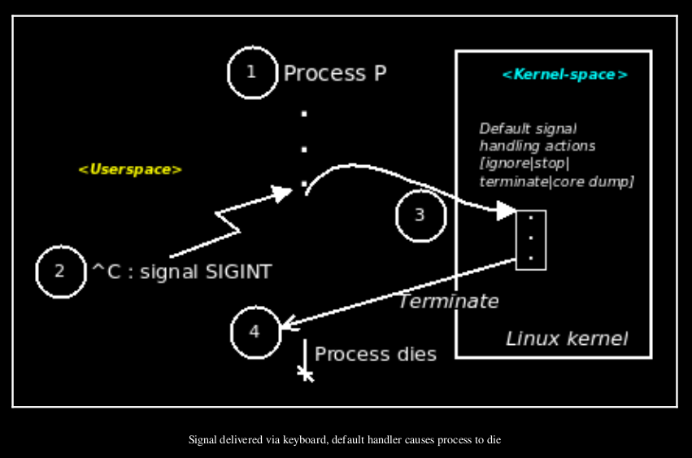
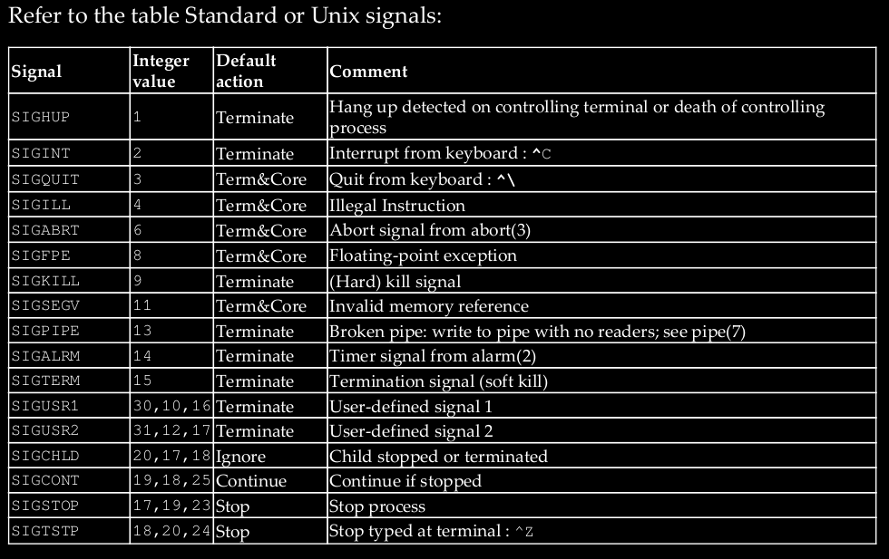

#### Default Signal Handler

> [Hands-on System Proframming with Linux - The signal mechanism in brief]


every signal is associated with a function to run
when it is delivered; this function is called the signal handler. If we do not change it,
the default signal function runs. Well, that brings up the question: Since we have not
written any default (or other) signal-handling code, then who has provided this
default signal handler function? The short answer is this: **the OS (the kernel) handles all cases in which a process receives a signal for which the app has not installed any handler**; in other words, for the default case.

the default signal handler (kernel code, really) for the SIGINT signal is to terminate the process, in effect, causing the receiving process to die.




FYI, for the default case—that is, all cases where the application developer has not
installed a specific signal-handling routine (we will learn how exactly to install our
own signal handlers shortly)—what exactly does the OS code that handles these cases
do? Depending on the signal being processed, the OS will perform one of these five
possible actions (see the following table for details):
* Ignore the signal
* Stop the process
* Continue the (previously stopped) process
* Terminate the process
* Terminate the process and emit a core dump

#### Available signals
lists the available signals:
```bash
$ kill -l
1) SIGHUP 2) SIGINT 3) SIGQUIT 4) SIGILL 5) SIGTRAP
6) SIGABRT 7) SIGBUS 8) SIGFPE 9) SIGKILL 10) SIGUSR1
11) SIGSEGV 12) SIGUSR2 13) SIGPIPE 14) SIGALRM 15) SIGTERM
16) SIGSTKFLT 17) SIGCHLD 18) SIGCONT 19) SIGSTOP 20) SIGTSTP
21) SIGTTIN 22) SIGTTOU 23) SIGURG 24) SIGXCPU 25) SIGXFSZ
26) SIGVTALRM 27) SIGPROF 28) SIGWINCH 29) SIGIO 30) SIGPWR
31) SIGSYS
34) SIGRTMIN 35) SIGRTMIN+1 36) SIGRTMIN+2 37)
SIGRTMIN+3
38) SIGRTMIN+4 39) SIGRTMIN+5 40) SIGRTMIN+6 41) SIGRTMIN+7 42)
SIGRTMIN+8
43) SIGRTMIN+9 44) SIGRTMIN+10 45) SIGRTMIN+11 46) SIGRTMIN+12
47) SIGRTMIN+13 48) SIGRTMIN+14 49) SIGRTMIN+15 50) SIGRTMAX-14
51) SIGRTMAX-13 52) SIGRTMAX-12 53) SIGRTMAX-11 54) SIGRTMAX-10
55) SIGRTMAX-9 56) SIGRTMAX-8 57) SIGRTMAX-7 58) SIGRTMAX-6 59)
SIGRTMAX-5 60) S
```

> An FAQ: where are the signals numbered 32 and 33 ?  They are internally used by the Linux Pthreads implementation (called NPTL), and are hence unavailable to app developers.




