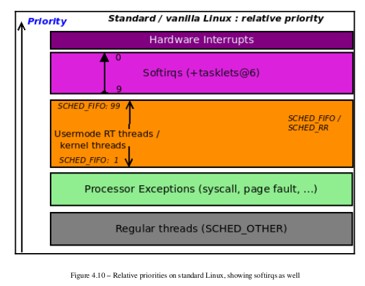
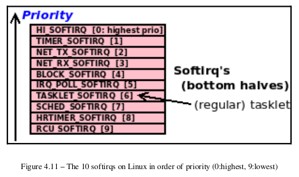
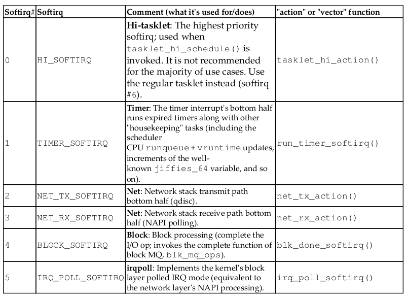
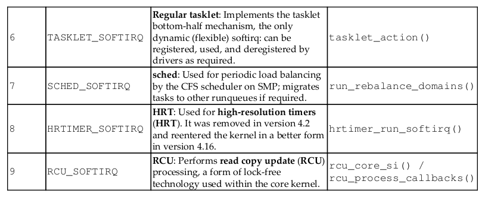

> [Linux Kernel Program - Char Device Drivers - Kaiwan N Billimoria]

So, what is the bottom half?

- The old bottom-half mechanism, which is now deprecated; it's abbreviated as BH (you can pretty much ignore it).
- The modern recommended (if you're using this top-bottom-half technology in the first place) mechanism: the tasklet.
- The underlying kernel mechanism: the softirq.

<mark>The top half (hardirq) always runs with all interrupts disabled (masked) on the current CPU and the IRQ it's handling disabled (masked) across all CPUs, but the bottom half handler runs with all interrupts enabled.</mark>

This bottom-half handling is a subset of what's known as the kernel's `deferred functionality prowess`; the kernel has several of these deferred functionality mechanisms:

- Workqueues (based on kernel threads); `context:process`
- Bottom half/tasklet (based on softirqs); `context:interrupt`
- Softirqs; `context:interrupt`
- kernel timers; `context:interrupt`

### Specifying and using a tasklet
A key difference between a tasklet and the kernel's softirq mechanism is that tasklets are
simply easier to work with, making them a good choice for your typical driver. Of course, if
you can use a `threaded handler` instead, just do that; later, we'll show a table that will help
you decide what to use and when. One of the key things that makes tasklets easier to use is
the fact that (on an SMP system) <mark>a particular tasklet will never run in parallel with itself</mark>; in
other words, a given tasklet will run on exactly one CPU at a time (making it non-
concurrent, or serialized, with respect to itself).


### Understanding the kernel softirq mechanism

You've already learned how to use the tasklet – it's a great example of a deferred
functionality mechanism. But how are they internally implemented? <mark>The kernel
implements `tasklets` via an underlying facility called the `softirq` (or software-interrupt)
mechanism.</mark>.


- Each softirq is designed to serve a particular need, usually
associated with a very particular hardware interrupt or kernel
activity. (The exceptions here are perhaps the soft IRQs reserved
for the generic tasklet: HI_SOFTIRQ and TASKLET_SOFTIRQ .)
- These 10 softirqs have a priority ordering (and will be consumed in
that order).
- The tasklet is, in fact, a thin abstraction on top of a particular
softirq ( TASKLET_SOFTIRQ ), one of the 10 available. The tasklet is
the only one that can be registered, run, and deregistered at will,
making it an ideal choice for many device drivers.


- Softirqs run in interrupt – softirq – context; the `in_softirq()` macro returns
  true here, implying you are in a softirq (or tasklet) context.

- **All softirq servicing is considered a high priority on the system. Next to the**
  **hardware interrupt** (the hardirq/ISR/primary handler), the softirq has the
  highest priority on the system. Pending softirqs are consumed by the
  kernel before the process context that was interrupted in the first place is restored.

The following diagram is a superset of our earlier depiction of priorities on standard Linux;
this one includes softirqs (within which is the tasklet):



#### Available softirqs and what they are for

The work that's carried out by a given softirq is statically compiled into the kernel image
(it's fixed). This coupling of the softirq and the action it takes (in effect, the code it runs, via
the action function pointer) is done via the following code:

```c
// kernel/softirq.c
void open_softirq(int nr, void (*action)(struct softirq_action *))
{
	softirq_vec[nr].action = action;
}
```

The following diagram is a conceptual representation of the available softirqs and their
priority level on Linux (as of kernel version 5.4), with 0 being the highest and 9 the lowest
softirq priority level:




The following table sums up the individual kernel's softirqs in order of their priority ( 0 :
HI_SOFTIRQ being the highest priority one), along with the action or vector, its
functionality, and a comment mentioning what its use case is:






Can we see the softirqs that have been fired off so far? Of course, very much like how we
can view hardirqs (via its `proc/interrupts` pseudofile). We have the `/proc/softirqs`
pseudofile for tracking softirqs.

#### Understanding how the kernel runs softirqs

The following is the (approximate) call graph that's used on x86 when a hardware interrupt
is triggered:

```c
do_IRQ() -> handle_irq() -> entering_irq() -> hardirq top-half runs ->
exiting_irq() -> irq_exit() -> invoke_softirq() -> do_softirq() -> ...
bottom half runs: tasklet/softirq ... -> restore context
```

Notice that softirq processing is done before context is restored to the interrupted task.

Now, let's briefly focus on some of the internal details of tasklet execution, followed by how
to use `ksoftirqd` kernel threads to offload softirq work.

##### Employing the ksoftirqd kernel threads

Softirqs can impose an enormous load on the system when there is a flood of them waiting
to be processed. This has been repeatedly seen in the network (and to some extent, block)
layers, leading to the development of polled mode IRQ handling; it's called `NAPI` for the
network (receive) path and simply interrupt-poll handling for the block layer. 

But what if, even with polled mode handling, the softirq flood persists? The kernel has one more trick
up its sleeve: <mark>if softirq processing exceeds 2 milliseconds, the kernel offloads the pending
softirq work onto per-CPU kernel threads named `ksoftirqd/n`.</mark> (where n represents the
CPU number, starting from 0 ). A benefit of this approach is that because kernel threads
must compete with other threads for CPU resources, user space doesn't end up getting
completely starved of CPU (which could happen with pure hardirq/softirq load).

#### Softirqs and concurrency

As we learned with regard to tasklets, a number of points with regard to concurrency must
be understood with respect to softirqs:

* As noted with `tasklets` (on SMP), a tasklet will never run in parallel with itself;
  this is a feature that makes it easier to use. This isn't true of softirqs: the same
  softirq vector can indeed run in parallel with itself on another CPU! Thus, the
  softirq vector code has to be especially careful with the use of locking (and
  deadlock avoidance).
* A softirq can always be interrupted by a hardirq, including the IRQ that caused it
  to be raised (this is because, as with tasklets, softirqs run with all interrupts
  enabled on the local core).
* A softirq cannot preempt another currently executing softirq, even though they
  have priority levels; they are consumed in priority order.
* The reality is that the kernel provides APIs such as spin_lock_bh() , which
  allow you to disable softirq processing while the lock is held. This is required to
  prevent deadlock when both the hardirq and the softirq handlers are working on
  shared data. The locking implications really do matter. We'll cover this in detail
  in the last two chapters of this book.

As we've already mentioned, softirq processing itself should complete within a few
hundred microseconds; a **flood** of unprocessed softirqs can again lead to a **livelock**
situation. The kernel mitigates (or de-risks) this in two broad ways:

- Threaded interrupts or workqueues (both based on kernel threads)
- Invoking the `ksoftirqd/n` kernel threads to take over softirq processing

> The preceding cases run in process context, thus alleviating the issue of starving genuine
> (user space) threads that require the CPU via the scheduler (as the kernel threads
> themselves have to compete for the CPU resources).

> 前面的案例在进程上下文中运行，从而减轻了通过调度程序需要 CPU 的真正（用户空间）线程饥饿的问题（因为内核线程本身必须竞争 CPU 资源）。


### BPF Measuring time servicing individual softirqs


- softirqs[-bpfcc] tool

- softirqs-bpfcc -d


## raise_softirq 解释

> https://0xax.gitbooks.io/linux-insides/content/Interrupts/linux-interrupts-9.html

With the advent of parallelisms in the Linux kernel, all new schemes of implementation of the bottom half handlers are built on the performance of the processor specific kernel thread that called `ksoftirqd` (will be discussed below). Each processor has its own thread that is called `ksoftirqd/n` where the `n` is the number of the processor. We can see it in the output of the `systemd-cgls` util:

```
$ systemd-cgls -k | grep ksoft
├─   3 [ksoftirqd/0]
├─  13 [ksoftirqd/1]
├─  18 [ksoftirqd/2]
├─  23 [ksoftirqd/3]
├─  28 [ksoftirqd/4]
├─  33 [ksoftirqd/5]
├─  38 [ksoftirqd/6]
├─  43 [ksoftirqd/7]
```

The `spawn_ksoftirqd` function starts this these threads. As we can see this function called as early [initcall](https://kernelnewbies.org/Documents/InitcallMechanism):

```C
early_initcall(spawn_ksoftirqd);
```

Softirqs are determined statically at compile-time of the Linux kernel and the `open_softirq` function takes care of `softirq` initialization. The `open_softirq` function defined in the [kernel/softirq.c](https://github.com/torvalds/linux/blob/16f73eb02d7e1765ccab3d2018e0bd98eb93d973/kernel/softirq.c):

```C
void open_softirq(int nr, void (*action)(struct softirq_action *))
{
    softirq_vec[nr].action = action;
}
```

and as we can see this function uses two parameters:

- the index of the `softirq_vec` array;
- a pointer to the softirq function to be executed;

First of all let's look on the `softirq_vec` array:

```C
static struct softirq_action softirq_vec[NR_SOFTIRQS] __cacheline_aligned_in_smp;
```

it defined in the same source code file. As we can see, the `softirq_vec` array may contain `NR_SOFTIRQS` or `10` types of `softirqs` that has type `softirq_action`. First of all about its elements. In the current version of the Linux kernel there are ten softirq vectors defined; two for tasklet processing, two for networking, two for the block layer, two for timers, and one each for the scheduler and read-copy-update processing. All of these kinds are represented by the following enum:

```C
enum
{
        HI_SOFTIRQ=0,
        TIMER_SOFTIRQ,
        NET_TX_SOFTIRQ,
        NET_RX_SOFTIRQ,
        BLOCK_SOFTIRQ,
        BLOCK_IOPOLL_SOFTIRQ,
        TASKLET_SOFTIRQ,
        SCHED_SOFTIRQ,
        HRTIMER_SOFTIRQ,
        RCU_SOFTIRQ,
        NR_SOFTIRQS
};
```

All names of these kinds of softirqs are represented by the following array:

```C
const char * const softirq_to_name[NR_SOFTIRQS] = {
        "HI", "TIMER", "NET_TX", "NET_RX", "BLOCK", "BLOCK_IOPOLL",
        "TASKLET", "SCHED", "HRTIMER", "RCU"
};
```

Or we can see it in the output of the `/proc/softirqs`:

```
~$ cat /proc/softirqs 
                    CPU0       CPU1       CPU2       CPU3       CPU4       CPU5       CPU6       CPU7       
          HI:          5          0          0          0          0          0          0          0
       TIMER:     332519     310498     289555     272913     282535     279467     282895     270979
      NET_TX:       2320          0          0          2          1          1          0          0
      NET_RX:     270221        225        338        281        311        262        430        265
       BLOCK:     134282         32         40         10         12          7          8          8
BLOCK_IOPOLL:          0          0          0          0          0          0          0          0
     TASKLET:     196835          2          3          0          0          0          0          0
       SCHED:     161852     146745     129539     126064     127998     128014     120243     117391
     HRTIMER:          0          0          0          0          0          0          0          0
         RCU:     337707     289397     251874     239796     254377     254898     267497     256624
```

As we can see the `softirq_vec` array has `softirq_action` types. This is the main data structure related to the `softirq` mechanism, so all `softirqs` represented by the `softirq_action` structure. The `softirq_action` structure consists a single field only: an action pointer to the softirq function:

```C
struct softirq_action
{
         void    (*action)(struct softirq_action *);
};
```

So, after this we can understand that the `open_softirq` function fills the `softirq_vec` array with the given `softirq_action`. The registered deferred interrupt (with the call of the `open_softirq` function) for it to be queued for execution, it should be activated by the call of the `raise_softirq` function. This function takes only one parameter -- a softirq index `nr`. Let's look on its implementation:

```C
void raise_softirq(unsigned int nr)
{
        unsigned long flags;

        local_irq_save(flags);
        raise_softirq_irqoff(nr);
        local_irq_restore(flags);
}
```

Here we can see the call of the `raise_softirq_irqoff` function between the `local_irq_save` and the `local_irq_restore` macros. The `local_irq_save` defined in the [include/linux/irqflags.h](https://github.com/torvalds/linux/blob/16f73eb02d7e1765ccab3d2018e0bd98eb93d973/include/linux/irqflags.h) header file and saves the state of the [IF](https://en.wikipedia.org/wiki/Interrupt_flag) flag of the [eflags](https://en.wikipedia.org/wiki/FLAGS_register) register and disables interrupts on the local processor. The `local_irq_restore` macro defined in the same header file and does the opposite thing: restores the `interrupt flag` and enables interrupts. We disable interrupts here because a `softirq` interrupt runs in the interrupt context and that one softirq (and no others) will be run.

The `raise_softirq_irqoff` function marks the softirq as deffered by setting the bit corresponding to the given index `nr` in the `softirq` bit mask (`__softirq_pending`) of the local processor. It does it with the help of the:

```C
__raise_softirq_irqoff(nr);
```

macro. After this, it checks the result of the `in_interrupt` that returns `irq_count` value. We already saw the `irq_count` in the first [part](https://0xax.gitbooks.io/linux-insides/content/Interrupts/linux-interrupts-1.html) of this chapter and it is used to check if a CPU is already on an interrupt stack or not. We just exit from the `raise_softirq_irqoff`, restore `IF` flag and enable interrupts on the local processor, if we are in the interrupt context, otherwise we call the `wakeup_softirqd`:

```C
if (!in_interrupt())
    wakeup_softirqd();
```

<mark>Where the `wakeup_softirqd` function activates the `ksoftirqd` kernel thread of the local processor:</mark>

```C
static void wakeup_softirqd(void)
{
    struct task_struct *tsk = __this_cpu_read(ksoftirqd);

    if (tsk && tsk->state != TASK_RUNNING)
        wake_up_process(tsk);
}
```

Each `ksoftirqd` kernel thread runs the `run_ksoftirqd` function that checks existence of deferred interrupts and calls the `__do_softirq` function depending on the result of the check. This function reads the `__softirq_pending` softirq bit mask of the local processor and executes the deferrable functions corresponding to every bit set. During execution of a deferred function, new pending `softirqs` might occur. The main problem here that execution of the userspace code can be delayed for a long time while the `__do_softirq` function will handle deferred interrupts. For this purpose, it has the limit of the time when it must be finished:

```C
unsigned long end = jiffies + MAX_SOFTIRQ_TIME;
...
...
...
restart:
while ((softirq_bit = ffs(pending))) {
    ...
    h->action(h);
    ...
}
...
...
...
pending = local_softirq_pending();
if (pending) {
    if (time_before(jiffies, end) && !need_resched() &&
        --max_restart)
            goto restart;
}
...
```

Checks of the existence of the deferred interrupts are performed periodically. There are several points where these checks occur. The main point is the call of the `do_IRQ` function defined in [arch/x86/kernel/irq.c](https://github.com/torvalds/linux/blob/16f73eb02d7e1765ccab3d2018e0bd98eb93d973/arch/x86/kernel/irq.c), which provides the main means for actual interrupt processing in the Linux kernel. When `do_IRQ` finishes handling an interrupt, it calls the `exiting_irq` function from the [arch/x86/include/asm/apic.h](https://github.com/torvalds/linux/blob/16f73eb02d7e1765ccab3d2018e0bd98eb93d973/arch/x86/include/asm/apic.h) that expands to the call of the `irq_exit` function. `irq_exit` checks for deferred interrupts and the current context and calls the `invoke_softirq` function:

```C
if (!in_interrupt() && local_softirq_pending())
    invoke_softirq();
```

that also executes `__do_softirq`. To summarize, each `softirq` goes through the following stages:

- Registration of a `softirq` with the `open_softirq` function.
- Activation of a `softirq` by marking it as deferred with the `raise_softirq` function.
- After this, all marked `softirqs` will be triggered in the next time the Linux kernel schedules a round of executions of deferrable functions.
- And execution of the deferred functions that have the same type.

As I already wrote, the `softirqs` are statically allocated and it is a problem for a kernel module that can be loaded. The second concept that built on top of `softirq` -- the `tasklets` solves this problem.


