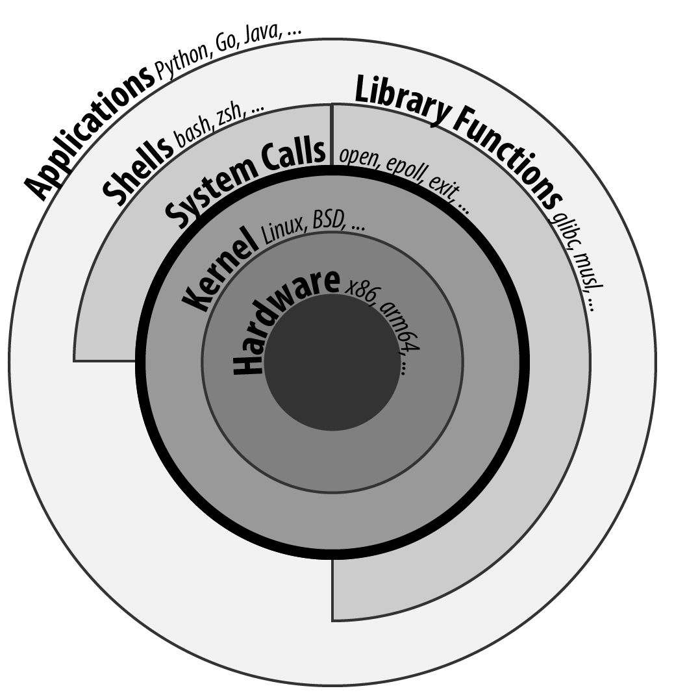

# LINUX SYSTEM CALLS UNDER THE HOOD - CROSSING THE BORDER BETWEEN USERLAND AND THE KERNEL

> [https://www.juliensobczak.com/inspect/2021/08/10/linux-system-calls-under-the-hood.html](https://www.juliensobczak.com/inspect/2021/08/10/linux-system-calls-under-the-hood.html)


Operating systems run different programs at the same time. As these programs are often written by different developers, the operating system guarantees the correct use of resources. One program cannot use all the memory or read data written by another program.

Whenever your program wants to execute a privileged action like printing a text on screen, it requests that the kernel perform the action on its behalf. How does it work? This post will show the underlying code executed when you call a Linux system call.


## OVERVIEW

All programs running on Linux use system calls. System calls are the interface between your application and the Linux kernel. If you need a service provided by the Kernel, you need a system call. You use them every time you read a file on disk (`open`, `read`, `close`), allocate a new block of memory (`sbrk`, `mmap`), communicate with another process (`kill`, `listen`), start a new process (`fork`, `wait`), or simply when your program stops (`exit`).

The command `man 2 syscalls` lists all system calls:

```
$ apt install manpages-dev
$ man 2 syscalls
...
System call                Kernel        Notes
───────────────────────────────────────────────────────────────────────

_llseek(2)                 1.2
_newselect(2)              2.0
_sysctl(2)                 2.0
accept(2)                  2.0           See notes on socketcall(2)
accept4(2)                 2.6.28
access(2)                  1.0
acct(2)                    1.0
add_key(2)                 2.6.10
adjtimex(2)                1.0
alarm(2)                   1.0
alloc_hugepages(2)         2.5.36        Removed in 2.5.44
arc_gettls(2)              3.9           ARC only
arc_settls(2)              3.9           ARC only
arc_usr_cmpxchg(2)         4.9           ARC only
arch_prctl(2)              2.6           x86_64, x86 since 4.12
atomic_barrier(2)          2.6.34        m68k only
atomic_cmpxchg_32(2)       2.6.34        m68k only
...
```

This command returns 467 different system calls on my Ubuntu 20.04 server. Not all of them are actively in use. Some system calls are deprecated and only kept to preserve compatibility with old binaries.

System calls are unavoidable, but in practice, we rarely interact directly with them.

Library Function vs System CallA library function is simply one of the functions that constitute the standard C library.Many library functions don’t use system calls (e.g., string-manipulation functions like `strcmp()`). On the other hand, some library functions are layered on top of system calls. For example, the `fopen()` library function uses the `open` system call to actually open a file. Often, library functions are designed to provide a more user-friendly interface than the underlying system call. For example, the `printf()` library function provides output formatting and data buffering, whereas the `write` system call just outputs a block of bytes. Sometimes, library functions and system calls have the same name. For example, `man 2 exit` prints the manual for the `exit` system call and `man 3 exit` prints the manual for the `exit()` library function.System calls are implemented by your kernel and are an integral part of Linux. On the contrary, different implementations of the standard C library exist. The most commonly installed is the GNU C library ([glibc](http://www.gnu.org/software/libc/)), and is the one we will cover in this article.Figure 1. System calls are the border between your application and the Linux kernel

For example, in C, the PID of your program is accessible using the function `getpid()`:

getpid.c

```
#include <stdio.h>
#include <sys/types.h>
#include <unistd.h>

int main(void)
{
    pid_t pid;
    pid = getpid(); 
    printf("PID=%d\n", pid);
    return 0;
}
```

|      | The `getpid()` library function is defined in `unistd.h` and returns the PID of the current process using the `getpid` system call. |
| ---- | ------------------------------------------------------------ |
|      |                                                              |

Retrieving the PID of the current process is one of the most basic system calls. It simply returns the value stored in memory inside a data structure maintained by the kernel. It takes no arguments. It always succeeds. But calling `getpid()` is not like calling any other function.

Here is a minimal benchmark illustrating this difference:

benchmark.c

```
#include <stdio.h>
#include <sys/types.h>
#include <unistd.h>
#include <time.h>

pid_t getdummyid() { 
    return 1;
}

int main(void)
{
    pid_t pid;

    clock_t start_time;
    double elapsed_time;

    start_time = clock();
    for (int i=0; i<10000000; i++) { 
        pid = getdummyid();
    }
    elapsed_time = (double)(clock() - start_time) / CLOCKS_PER_SEC;
    printf("Done getdummyid in %f seconds\n", elapsed_time);

    start_time = clock();
    for (int i=0; i<10000000; i++) { 
        pid = getpid(); 
    }
    elapsed_time = (double)(clock() - start_time) / CLOCKS_PER_SEC;
    printf("Done getpid     in %f seconds\n", elapsed_time);


    return 0;
}
```

|      | We defined a basic function returning an integer literal. Retrieving the PID of a process doesn’t interact with a hardware device. Simply returning this integer is relatively close to reading this value from a data structure kept in memory. |
| ---- | ------------------------------------------------------------ |
|      | We call the two functions 1,000,000 times and measure how long it takes. |

Here are the results on my laptop using Ubuntu 20.04 in a virtual server:

```
# gcc -o benchmark benchmark.c
# ./benchmark
Done getdummyid in 0.022424 seconds
Done getpid     in 4.141334 seconds
```

Calling a system call is, on this example, 200 times slower than calling a simple function. Indeed, a system call is not a simple function call. When you call the function `getpid()`, you use a wrapper implemented by glibc hiding the actual logic to execute a system call. Under the hood, this wrapper function does a lot of work:

- **Step 1**: The library function copies its arguments into registers. It also copies a number identifying the system call into a specific register. The library function then forces the processor to switch from user mode to kernel mode.
- **Step 2**: The kernel executes the system call:
  - The kernel saves the state of the CPU (the register values).
  - The kernel checks the validity of the system call number.
  - The kernel invokes the right system call routine based on this number. This routine checks the validity of arguments and executes the logic of the system call.
  - The kernel restores the state of the CPU and places the return value and the possible error in specific registers.
- **Step 3**: The library function checks for an error and set the global variable `errno`. The library returns to the caller.

That’s a lot of work, for sure, and provides the beginning of an explanation for why system calls are more expensive.

## STEP BY STEP

It’s time to show the code behind system calls. We will use glibc (v2.33) and Linux kernel (v5.13) to illustrate the lines of code running between the user and kernel modes. We will continue with the `getpid` example.

### USER MODE (GLIBC)

#### THE OBJECTIVE

For this first step, the objective is to execute the system call `getpid` from the viewpoint of a user process. Concretely, we will have to specify values in specific CPU registers before calling a specific CPU instruction, and as different CPU architectures have different registers and different instructions set, the logic will be, of course, different 🙂 (based on your computer architecture).

For example, here is the assembly code to execute the `getpid` system call for the `amd64` architecture:

```
mov rax, 39
syscall
```

Here is the same code for the `arm64` architecture:

```
mov r8, 172
svc
```

These two instructions are enough to request the kernel to returns the PID of the current process.

API vs ABILinux system calls are accessible using an *application binary interface* (ABI). An ABI defines how a routine is accessed in machine code (hardware-dependent) whereas an API defines a similar access in source code (hardware-independent).If Linux system calls were implemented using a standard C API, every program would have to call them like C functions. An ABI removes this restriction by asking the compiler or interpreter of your favorite language to generate the machine code (i.e., initializing the registers). ABI is for hardware what API is for software.The [System V Application Binary Interface](https://wiki.osdev.org/System_V_ABI) is the reference specification used by major Unix-like operating systems such as Linux. If we want to understand the previous code sample, we need to have a look in particular at the [System V Application Binary Interface for AMD64](https://refspecs.linuxfoundation.org/elf/x86_64-abi-0.99.pdf). This document is 100-page long, but only the section about the calling conventions are interesting:User-level applications use as integer registers for passing the sequence `%rdi`, `%rsi`, `%rdx`, `%rcx`, `%r8` and `%r9`. The kernel interface uses `%rdi`, `%rsi`, `%rdx`, `%r10`, `%r8` and `%r9`.A system-call is done via the `syscall` instruction. This clobbers `%rcx` and `%r11` as well as the `%rax` return value, but other registers are preserved.The number of the syscall has to be passed in register `%rax`.System-calls are limited to six arguments, no argument is passed directly on the stack.Returning from the `syscall`, register `%rax` contains the result of the system-call. A value in the range between -4095 and -1 indicates an error, it is `-errno`.Only values of class INTEGER or class MEMORY are passed to the kernel.In our example, we don’t have arguments to pass, but we still need to specify which system call we want to execute. Under the hood, a Linux system call is just a number. For `amd64`, the number 39 represents the `getpid` system call and must be specified in the register `rax` before calling the CPU instruction `syscall`.

#### THE CODE

Glibc implements the `getpid()` library function and many other similar functions to make accessible system calls in a friendly manner to C programs. Calling the `getpid` system call is not so different from calling any other system call. The number of arguments varies, and some calls do not return errors, but the logic is similar. Basically, glibc must put values in registers and call an instruction to delegate to the kernel. Therefore, to avoid code duplication, glibc adopts a declarative approach to implement these library functions.

For example, if you look inside the code source, you will only find the declaration of the function `getpid()`:

include/unistd.h

```
extern __pid_t __getpid (void);
```

You will not find the implementation directly, at least not in an obvious manner.

System calls are defined in various `syscalls.list` files reflecting the differences between machine architectures. These files are then merged in a precise order. The format looks like this:

```
.
----
# File name Caller  Syscall name    Args    Strong name Weak names
...
execve  - execve  i:spp __execve  execve
flock   - flock   i:ii  __flock   flock
getpid  - getpid  Ei:   __getpid  getpid
...
----
```

These files contain the metadata required to generate thin assembly wrappers around the corresponding system calls. For example, `getpid` arguments are defined as `Ei:`, which means:

- `E` → `errno` is not set by the call (i.e., the system call never fails).
- `i` → returns a scalar value (i.e., a integer representing the `pid_t`)
- `:` → separates the return context from the arguments. As there are no letters after it, it means the system call takes no argument.

These files are then read by the script `make-syscalls.sh`, launched by the `Makefile` when [building glibc](https://stackoverflow.com/a/68153847). This script outputs one rule for every system call:

sysd-syscalls

```
#### CALL=getpid NUMBER=39 ARGS=i: SOURCE=-
ifeq (,$(filter getpid,$(unix-syscalls)))
unix-syscalls += getpid
$(foreach p,$(sysd-rules-targets), \
$(foreach o,$(object-suffixes),$(objpfx)$(patsubst %,$p,getpid)$o)): \
                $(..)sysdeps/unix/make-syscalls.sh
        $(make-target-directory)
        (echo '#define SYSCALL_NAME getpid'; \
         echo '#define SYSCALL_NARGS 0'; \
         echo '#define SYSCALL_ULONG_ARG_1 0'; \
         echo '#define SYSCALL_ULONG_ARG_2 0'; \
         echo '#define SYSCALL_SYMBOL __getpid'; \
         echo '#define SYSCALL_NOERRNO 1'; \
         echo '#define SYSCALL_ERRVAL 0'; \
         echo '#include <syscall-template.S>'; \
         echo 'weak_alias (__getpid, getpid)'; \
         echo 'hidden_weak (getpid)'; \
        ) | $(compile-syscall) \
        $(foreach p,$(patsubst %getpid,%,$(basename $(@F))),$($(p)CPPFLAGS))
endif
```

Here is an example of command when all of the pieces are put together:

```
(echo '#define SYSCALL_NAME getpid'; \
 echo '#define SYSCALL_NARGS 0'; \
 echo '#define SYSCALL_ULONG_ARG_1 0'; \
 echo '#define SYSCALL_ULONG_ARG_2 0'; \
 echo '#define SYSCALL_SYMBOL __getpid'; \
 echo '#define SYSCALL_NOERRNO 1'; \
 echo '#define SYSCALL_ERRVAL 0'; \
 echo '#include <syscall-template.S>'; \
 echo 'weak_alias (__getpid, getpid)'; \
 echo 'hidden_weak (getpid)'; \
) | /usr/bin/gcc -c  -I../include \
 -I$HOME/glibc/build/x86_64-linux-gnu/getpid \
 -I$HOME/glibc/build/x86_64-linux-gnu \
 -I../sysdeps/unix/sysv/linux/x86_64/64 \
 -I../sysdeps/unix/sysv/linux/x86_64 \
 -I../sysdeps/unix/sysv/linux/x86 \
 -I../sysdeps/x86/nptl \
 -I../sysdeps/unix/sysv/linux/wordsize-64 \
 -I../sysdeps/x86_64/nptl \
 -I../sysdeps/unix/sysv/linux/include \
 -I../sysdeps/unix/sysv/linux \
 -I../sysdeps/nptl \
 -I../sysdeps/pthread \
 -I../sysdeps/gnu \
 -I../sysdeps/unix/inet \
 -I../sysdeps/unix/sysv \
 -I../sysdeps/unix/x86_64 \
 -I../sysdeps/unix \
 -I../sysdeps/posix \
 -I../sysdeps/x86_64/64 \
 -I../sysdeps/x86_64/fpu/multiarch \
 -I../sysdeps/x86_64/fpu \
 -I../sysdeps/x86/fpu/include \
 -I../sysdeps/x86/fpu \
 -I../sysdeps/x86_64/multiarch \
 -I../sysdeps/x86_64  -I../sysdeps/x86 \
 -I../sysdeps/ieee754/float128 \
 -I../sysdeps/ieee754/ldbl-96/include \
 -I../sysdeps/ieee754/ldbl-96 \
 -I../sysdeps/ieee754/dbl-64/wordsize-64 \
 -I../sysdeps/ieee754/dbl-64 \
 -I../sysdeps/ieee754/flt-32 \
 -I../sysdeps/wordsize-64 \
 -I../sysdeps/ieee754 \
 -I../sysdeps/generic \
 -I.. -I../libio -I. \
 -D_LIBC_REENTRANT -include $HOME/glibc/build/libc-modules.h \
 -DMODULE_NAME=libc -include ../include/libc-symbols.h \
 -DPIC -DSHARED \
 -DTOP_NAMESPACE=glibc \
 -DASSEMBLER  \
 -g -Werror=undef -Wa,--noexecstack \
 -o $HOME/glibc/build/poxis/getpid.os -x assembler-with-cpp - \
 -MD -MP -MF $HOME/glibc/build/posix/getpid.os.dt -MT \
 $HOME/glibc/build/posix/getpid.os
```

The command compiles a C snippet from `stdin` using many directories containing header files, in particular, files named `sysdep.h`. These files declare macros representing the real assembly code for all supported architectures. For example:

sysdeps/unix/sysv/linux/x86_64/sysdep.h

```
/* The Linux/x86-64 kernel expects the system call parameters in
   registers according to the following table:

    syscall number  rax
    arg 1       rdi
    arg 2       rsi
    arg 3       rdx
    arg 4       r10
    arg 5       r8
    arg 6       r9
*/

#undef INTERNAL_SYSCALL
#define INTERNAL_SYSCALL(name, nr, args...)              \
    internal_syscall##nr (SYS_ify (name), args)

#undef internal_syscall0
#define internal_syscall0(number, dummy...)              \
({                                                       \
    unsigned long int resultvar;                         \
    asm volatile (                                       \
    "syscall\n\t"                                        \
    : "=a" (resultvar)                                   \
    : "0" (number)                                       \
    : "memory", REGISTERS_CLOBBERED_BY_SYSCALL);         \
    (long int) resultvar;                                \
})

#undef internal_syscall1
#define internal_syscall1(number, arg1)                  \
({                                                       \
    unsigned long int resultvar;                         \
    TYPEFY (arg1, __arg1) = ARGIFY (arg1);               \
    register TYPEFY (arg1, _a1) asm ("rdi") = __arg1;    \
    asm volatile (                                       \
    "syscall\n\t"                                        \
    : "=a" (resultvar)                                   \
    : "0" (number), "r" (_a1)                            \
    : "memory", REGISTERS_CLOBBERED_BY_SYSCALL);         \
    (long int) resultvar;                                \
})

...
```

The result of the previous rule command is an object file. Let’s inspect its content:

```
$ objdump -ldr posix/getpid.o

posix/getpid.o:     file format elf64-x86-64


Disassembly of section .text:

0000000000000000 <__getpid>:
__getpid():
/glibc/posix/../sysdeps/unix/syscall-template.S:91
   0:   f3 0f 1e fa             endbr64
   4:   b8 27 00 00 00          mov    $0x27,%eax
   9:   0f 05                   syscall
/glibc/posix/../sysdeps/unix/syscall-template.S:93
   b:   c3                      retq
```

To sum up, when we are calling the `getpid()` library function, the alias `__getpid()` is really called. This function is implemented in assembly language and executes the same instructions we presented before.

In practice, not all system calls can be generated like this. A prior version of the `getpid()` library function used a cache to limit system calls since the PID of a process never changes. This cache was removed by [this commit](https://repo.or.cz/glibc.git/commit/c579f48edba88380635ab98cb612030e3ed8691e), but if we move back in Git history, we can have a look at [a different technique](https://sourceware.org/glibc/wiki/SyscallWrappers) used by glibc to implement library functions.

/sysdeps/unix/sysv/linux/getpid.c

```
#include <unistd.h>
#include <tls.h>
#include <sysdep.h>


static inline __attribute__((always_inline)) pid_t really_getpid (pid_t oldval);

static inline __attribute__((always_inline)) pid_t
really_getpid (pid_t oldval)
{
  if (__glibc_likely (oldval == 0))
    {
      pid_t selftid = THREAD_GETMEM (THREAD_SELF, tid);
      if (__glibc_likely (selftid != 0))
        return selftid;
    }

  INTERNAL_SYSCALL_DECL (err);
  pid_t result = INTERNAL_SYSCALL (getpid, err, 0);

  /* We do not set the PID field in the TID here since we might be
     called from a signal handler while the thread executes fork.  */
  if (oldval == 0)
    THREAD_SETMEM (THREAD_SELF, tid, result);
  return result;
}

pid_t
__getpid (void) 
{
  pid_t result = THREAD_GETMEM (THREAD_SELF, pid); 
  if (__glibc_unlikely (result <= 0))
    result = really_getpid (result); 
  return result;
}

libc_hidden_def (__getpid)
weak_alias (__getpid, getpid)
libc_hidden_def (getpid)
```

|      | The function `__getpid()` is implemented as a C function.    |
| ---- | ------------------------------------------------------------ |
|      | The code checks for the `pid` in the thread-local memory area to determine if the function has already been called. |
|      | If the cache is empty, the code delegates to `really_getpid()` that checks the cache again before calling the macro `INTERNAL_SYSCALL` we have just covered before. |

Of course, When a file like `getpid.c` is present, the script `make-syscalls.sh` does not override it:

sysd-syscalls

```
#### CALL=getpid NUMBER=39 ARGS=Ei: SOURCE=sysdeps/unix/sysv/linux/getpid.c 
```

|      | No rule is generated. |
| ---- | --------------------- |
|      |                       |

The code will simply be compiled with the rest of the glibc source code, reusing the same macros as the current implementation, which means the code always ends up with the `syscall` instruction to give control to the kernel.

### KERNEL MODE (LINUX)

#### THE OBJECTIVE

The user process has just requested a service from the kernel. It filled the registers and called a special instruction to jump to a different location. Enter the kernel.

For this second step, the objective is for the kernel to register a procedure at this location. This procedure reads the system call number and looks at the table of system calls to find the address of the kernel function to call. Then after this function returns, it does a few checks and then returns to the user process.

#### THE CODE

First, we will look at the implementation of the `getpid()` system call.

##### IMPLEMENTING A SYSTEM CALL

The main entry point for the `getpid` system call is called `sys_getpid()`, but you would not find the function declaration as such. System call functions are defined using the `SYSCALL_DEFINEn()` macro rather than explicitly, where `n` indicates the number of arguments. This macro takes the system call name followed by the `(type, name)` pairs for the parameters as arguments. The motivation is to make metadata available for other tools like tracing.

Here is the definition of the `getpid` system call :

kernel/sys.c

```
/**
 * sys_getpid - return the thread group id of the current process
 *
 * Note, despite the name, this returns the tgid not the pid.  The tgid and
 * the pid are identical unless CLONE_THREAD was specified on clone() in
 * which case the tgid is the same in all threads of the same group.
 *
 * This is SMP safe as current->tgid does not change.
 */
SYSCALL_DEFINE0(getpid)
{
    return task_tgid_vnr(current); 
}
```

|      | The code uses the `current` pointer representing the current task, which is issuing the syscall. The PID is then extracted from this struct. We will not cover it further. |
| ---- | ------------------------------------------------------------ |
|      |                                                              |

This entry point also needs a corresponding function prototype in the reference file `include/linux/syscalls.h`. This prototype is marked as `asmlinkage` to match the way that system calls are invoked:

include/linx/syscalls.h

```
/* kernel/sys.c */
asmlinkage long sys_getpid(void);
```

Finally, the system call must be registered in the system call table, so that the kernel can found it from its number.

Most architectures share a generic system call table:

include/uapi/asm-generic/unistd.h

```
/* kernel/sys.c */
#define __NR_getpid 172
__SYSCALL(__NR_getpid, sys_getpid)
```

But some architectures (e.g. x86) have their own architecture-specific system call tables. For `amd64`, the system call table looks like:

arch/x86/entry/syscalls/syscall_64.tbl

```
#
# 64-bit system call numbers and entry vectors
#
# The format is:
# <number> <abi> <name> <entry point>
...
39  common  getpid          sys_getpid 
...
```

|      | We find again the number 39 representing the `getpid` system call on `amd64`. |
| ---- | ------------------------------------------------------------ |
|      |                                                              |

That’s pretty much all the steps required when [adding a new system call in Linux](https://www.kernel.org/doc/html/v4.12/process/adding-syscalls.html).

Now, we must look at the glue between the `syscall` CPU instruction and the system call function we have just presented.

##### INITIALIZING THE SYSTEM CALL ENTRY

On `amd64`, the instruction `syscall` put the address present in the register `IA32_LSTAR` into the register `RIP`, the instruction pointer. After this step, the handler at that location will be executed in a CPU privileged mode. It means that the kernel needs to put the system call entry address into the `IA32_LSTAR` register during its initialization.

`int 0x80` vs `syscall`Many online code examples use the `int 0x80` instruction instead of `syscall`. This instruction was the only option on `i386` architecture (`x86`) and is still available on `amd64` architecture (`x86-64`) since this latter is a superset of the former for backward-compatibility reasons (i.e., code compiled to `x86` is portable to `x86-64`).For example, the `getpid` system call can be executed in two different ways on `amd64`:`; getpid (x86) mov eax, 20 int 0x80 ; getpid (x86-64) mov rax, 39 syscall`Similar instructions exist for other architectures too. The motivation is always to transition from user to kernel mode in a secure way—an application cannot just jump to arbitrary kernel code.For an implementation viewpoint:`int 0x80` relies on software interrupts. The idea is to use the same method to enter the kernel as hardware interrupts do (ex: when pressing a key on your keyboard).`syscall` (and `sysenter`) relies on specific CPU instructions designed for the specific use case of system calls and thus comes with optimizations.`syscall` is more performant because it does less operations (`syscall` does not generate a software interrupt) and based on [some benchmarks](https://x86.lol/generic/2019/07/04/kernel-entry.html), using `syscall` is a magnitude faster (~5 times faster), which is fast compared to `int 0x80` but still slow compared to calling a local function.

The kernel starts when the function `start_kernel` defined in `init/main.c` is called. This function installs various interrupt handlers using the function `trap_init`, which called `cpu_init`, which called `syscall_init`. Let’s look at the implementation of this last function (for `amd64`):

arch/x86/kernel/cpu/common.c

```
void syscall_init(void)
{
    wrmsr(MSR_STAR, 0, (__USER32_CS << 16) | __KERNEL_CS); 
    wrmsrl(MSR_LSTAR, (unsigned long)entry_SYSCALL_64); 
  ...
}
```

|      | `MSR_*` are [Model-specific Register](https://en.wikipedia.org/wiki/Model-specific_register) and can only be written by the privileged CPU instruction `wrmsr`. This first line is low-level code to ensure that we return to user code with the related privilege. |
| ---- | ------------------------------------------------------------ |
|      | `entry_SYSCALL_64` is the system call entry. We store the address of this function. |

Now that the system call entry is ready, we are ready too to see what happens when the `syscall` instruction is called, but first, we still have to introduce the system call table.

##### INITIALIZING THE SYSTEM CALLS TABLE

Any system call will trigger the execution of the system call entry we have just configured. This function determines which system call routine to execute by looking into the system call table for the system call number.

This table is represented by the `sys_call_table` array in the Linux kernel:

arch/x86/entry/syscall_64.c

```
asmlinkage const sys_call_ptr_t sys_call_table[__NR_syscall_max+1] = {
    [0 ... __NR_syscall_max] = &__x64_sys_ni_syscall, 
  #include <asm/syscalls_64.h> 
};
```

|      | All elements point initially to the `sys_ni_syscall` function, which is a fallback function simply returning `-ENOSYS` (`Function not implemented`). |
| ---- | ------------------------------------------------------------ |
|      | The header file `asm/syscalls_64.h` is generated dynamically from the list of system calls on your system and overrides the default handler for all defined system calls. |

This `asm/syscalls_64.h` file is generated by the script `arch/x86/entry/syscalls/syscalltbl.sh` and the result looks like:

asm/syscalls_64.h

```
__SYSCALL_COMMON(0, sys_read, sys_read)
__SYSCALL_COMMON(1, sys_write, sys_write)
...
__SYSCALL_COMMON(39, sys_getpid, sys_getpid)
...
```

If we evaluate the macros, our system call table initialization looks like this:

```
asmlinkage const sys_call_ptr_t sys_call_table[__NR_syscall_max+1] = {
  [0 ... __NR_syscall_max] = &__x64_sys_ni_syscall,
  [0] = sys_read,
  [1] = sys_write,
  ...
  [39] = sys_getpid,
  ...
};
```

At this point, we have already configured the system call entry, and the system call table is ready for this handler to determine the system call to execute. Let’s do it.

##### ENTERING A SYSTEM CALL

As we have seen, the system call entry is defined by the `entry_SYSCALL_64` function defined like this:

arch/x86/entry/entry_64.S

```
.code64
.section .entry.text, "ax"

/*
 * 64-bit SYSCALL instruction entry. Up to 6 arguments in registers.
 *
 * This is the only entry point used for 64-bit system calls.  The
 * hardware interface is reasonably well designed and the register to
 * argument mapping Linux uses fits well with the registers that are
 * available when SYSCALL is used.
 *
 * Registers on entry:
 * rax  system call number
 * rcx  return address
 * r11  saved rflags
 * rdi  arg0
 * rsi  arg1
 * rdx  arg2
 * r10  arg3
 * r8   arg4
 * r9   arg5
 *
 * Only called from user space.
 */
SYM_CODE_START(entry_SYSCALL_64)
    ...

    /* IRQs are off. */
    movq    %rax, %rdi
    movq    %rsp, %rsi
    call    do_syscall_64

    movq    RCX(%rsp), %rcx
    movq    RIP(%rsp), %r11

    cmpq    %rcx, %r11
    jne swapgs_restore_regs_and_return_to_usermode

    ...
SYM_CODE_END(entry_SYSCALL_64)
```

The line that interests us is the system call execution:

```
call    do_syscall_64
```

Where the function `do_syscall_64` is defined like this:

arch/x86/entry/common.c

```
__visible noinstr void do_syscall_64(unsigned long nr, struct pt_regs *regs)
{
    nr = syscall_enter_from_user_mode(regs, nr);

    if (likely(nr < NR_syscalls)) { 
        nr = array_index_nospec(nr, NR_syscalls); 
        regs->ax = sys_call_table[nr](regs); 
    }
    syscall_exit_to_user_mode(regs);
}
```

|      | Check the system call number is valid. The value of `NR_syscalls` is determined at compile time. |
| ---- | ------------------------------------------------------------ |
|      | Clamp the index within `[0..NR_syscalls]`.                   |
|      | Execute the function present in the system call table with the specified number. |

After a system call handler returns, the system call entry restores registers, flags and pushes the return address of the user process before exiting with the `sysretq` instruction. Then, the user program continues where it left off. Our long journey in Linux system calls is finished.


Figure 2. Steps when executing a system call

Try It Out!The code was tested on Ubuntu 20.04. You can recreate the same environment using a local virtual machine if you are running on a different operating system. I use [Vagrant](https://www.vagrantup.com/) on my machine:`$ mkdir sandbox/ $ cd sandbox $ cat > Vagrantfile << EOF cat Vagrantfile # -*- mode: ruby -*- Vagrant.configure("2") do |config|  config.vm.box = "bento/ubuntu-20.04" end EOF $ vagrant up $ vagrant ssh vagrant@vagrant:~$ lsb_release -a Distributor ID: Ubuntu Description:    Ubuntu 20.04.1 LTS Release:    20.04 Codename:   focal`When using a virtual machine, calling a system call is no different from what we have presented. As the processors are virtual, the hypervisor is responsible for converting machine code generated to the host architecture. [Several techniques exist](https://stackoverflow.com/questions/14415050/how-are-system-calls-handled-in-a-virtual-machine/25485159) to handle this. A naive approach is for the hypervisor to trap system calls and delegate to the guest OS using different system calls specific to this OS and its architecture.What follows is a basic program written in Assembly for `amd64` architecture and executing the system calls `getpid` and `exit`. (The second is required if you don’t want your program to crash abruptly at the end.)getpid.asm`section .data      ; Section containing initialised data section .bss       ; Section containing uninitialised data section .text      ; Section containig code global _start      ; Linker needs this to find the entry point _start:    ; getpid    mov rax, 0x27    syscall     ; exit    mov rax, 60    xor edi, edi    syscall`What we have is still a text file with assembly language instructions. It is not a format that a computer can run. Assembly language is text (source code) that must be converted into bytes (machine code). Therefore, we need to run a few commands first:`nasm`: The assembler "assembles" the instructions to machine code bytes to create an object file.`ld`: The linker turns this object file into an executable file that the operating system can run. (As we have only one object file, the linker does almost nothing but is a mandatory step.)Let’s create the executable:`$ nasm -f elf64 -g -F dwarf getpid.asm $ ld -o getpid getpid.o $ ./getpid`The program outputs nothing. We haven’t write code for that. We can solve this problem using a debugger to inspect registers but first, let’s dump some information about our object file:`$ objdump -d getpid getpid:     file format elf64-x86-64 Disassembly of section .text: 0000000000401000 <_start>:  401000:   b8 27 00 00 00          mov    $0x27,%eax  401005:   0f 05                   syscall  401007:   b8 3c 00 00 00          mov    $0x3c,%eax  40100c:   31 ff                   xor    %edi,%edi  40100e:   0f 05                   syscall`The result of the `getpid` system call will be available starting with the address `401007` in the register `rax`.`# gdb getpid Reading symbols from getpid...`Let’s output some information about our file:`(gdb) info files Symbols from "/home/vagrant/getpid". Local exec file:    `/home/vagrant/getpid', file type elf64-x86-64.    Entry point: 0x401000     0x0000000000401000 - 0x0000000000401010 is .text`We retrieve the initial address `0x401000` as reported previously by the command `objdump`.Let’s add a breakpoint to stop after the system call execution:`(gdb) break *0x401007 Breakpoint 1 at 0x401007: file getpid.asm, line 15. (gdb) run Starting program: /home/vagrant/getpid Breakpoint 1, _start () at getpid.asm:15 15      mov eax,60`Print the value of the register `rax`:`(gdb) info register rax rax            0xfdb               4066`In a second terminal:`# ps fauxww | grep getpid root        4064  0.1  2.2  36168 22884 pts/0    S+   \_ gdb getpid root        4066  0.0  0.0    156    16 pts/0    t        \_ /home/vagrant/getpid`The output confirms that the PID of our program is `4066`. We successfully executed our first system call using assembly code!

## CASE STUDIES

### GO

We will use the Go programming language and explain using code how the language makes system calls accessible to Go developers. We will still use the `getpid` system call for the example.

The function `Getpid` is implemented by the package `os`:

src/os/exec.go

```
package os

import (
    "syscall"
)

func Getpid() int { return syscall.Getpid() }
```

The code simply delegates to the package `syscall`. This package contains files implementing system calls for every supported architecture. For example, the file `zsyscall_linux_amd64` provides the implementation of system calls for the `amd64` architecture. Other files such as `zsyscall_linux_arm64` exist in the same package. Go build constraints are used to determine which file is finally included when building the binary:

src/syscall/zsycall_linux_amd64.go

```
//go:build linux && amd64
// +build linux,amd64
```

Here is the definition of `Getpid` for `amd64` architecture:

src/syscall/zsycall_linux_amd64.go

```
// THIS FILE IS GENERATED BY THE COMMAND AT THE TOP; DO NOT EDIT

func Getpid() (pid int) {
    r0, _ := rawSyscallNoError(SYS_GETPID, 0, 0, 0)
    pid = int(r0)
    return
}
```

As visible from the code, this file was generated from the template file `syscall_linux_amd64.go`. Here is a snippet from this file:

src/syscall/syscall_linux.go

```
...
//sysnb Getpid() (pid int)
...
```

This prototype definition of the `getpid` system call specifies the number of arguments, if errors can be returned, and also if the current goroutine must be suspended during the execution of the system call (`sys` vs `sysnb` = suspend vs continue). The utility program [`mksyscall.pl`](https://github.com/golang/go/blob/go1.16.6/src/syscall/mksyscall.pl) present in the same package reads this template file to generate the implementations of system call wrappers like `Getpid()`.

What remains to cover is the code behind this line included in the generated code:

```
r0, _ := rawSyscallNoError(SYS_GETPID, 0, 0, 0)
```

This function `rawSyscallNoError` is defined like this:

src/syscall/syscall_linux.go

```
package syscall

func rawSyscallNoError(trap, a1, a2, a3 uintptr) (r1, r2 uintptr)
```

In Go, a function declaration may omit the body. Such a declaration provides the signature for a function implemented outside Go, such as an assembly routine.

The code belongs in the [`sys/unix` package](https://godoc.org/golang.org/x/sys/unix). This package regroups the assembly code to execute system calls. Porting Go to a new architecture/OS combination or supporting a new syscall implies changes in this package like updating the hand-written assembly files at `asm_${GOOS}_${GOARCH}.s`, which are parsed by the Go tooling to build the final code.

Here is the native implementation for Linux of the function `rawSyscallNoError`:

src/cmd/vendor/golang.org/x/sys/unix/asm_linux_amd64.s

```
TEXT ·RawSyscallNoError(SB),NOSPLIT,$0-48
    MOVQ    a1+8(FP), DI
    MOVQ    a2+16(FP), SI
    MOVQ    a3+24(FP), DX
    MOVQ    $0, R10
    MOVQ    $0, R8
    MOVQ    $0, R9
    MOVQ    trap+0(FP), AX  // syscall entry
    SYSCALL
    MOVQ    AX, r1+32(FP)
    MOVQ    DX, r2+40(FP)
    RET
```

The logic should look familiar if you remember the calling conventions in the System V ABI specification.

Concerning the `getpid` system call, the const `SYS_GETPID` is defined like this:

src/cmd/vendor/golang.org/x/sys/unix/zsysnum_linux_amd64.go

```
SYS_GETPID                 = 39
```

And now, the native implementation of the `getpid` system call:

src/runtime/sys_linux_amd64.s

```
#define SYS_getpid      39

TEXT ·getpid(SB),NOSPLIT,$0-8
    MOVL    $SYS_getpid, AX
    SYSCALL
    MOVQ    AX, ret+0(FP)
    RET
```

For comparison, here is the same code for the `arm64` architecture:

src/runtime/sys_linux_arm64.s

```
#define SYS_getpid      172

TEXT ·getpid(SB),NOSPLIT|NOFRAME,$0-8
    MOVD    $SYS_getpid, R8
    SVC
    MOVD    R0, ret+0(FP)
    RET
```

That’s all. You have reviewed the standard Go code to execute a system call on Linux.

### JAVA

Since Java 9, the process API can be used to get the current process ID.

```
long pid = ProcessHandle.current().pid(); 
```

|      | We grab a handle to the current process and then query the PID. |
| ---- | ------------------------------------------------------------ |
|      |                                                              |

This method is implemented in the type [`ProcessHandlerImpl`](https://github.com/openjdk/jdk/blob/jdk-16+36/src/java.base/share/classes/java/lang/ProcessHandleImpl.java) like this:

java/lang/ProcessHandleImpl.java

```
package java.lang;

/**
 * ProcessHandleImpl is the implementation of ProcessHandle.
 *
 * @see Process
 * @since 9
 */
@jdk.internal.ValueBased
final class ProcessHandleImpl implements ProcessHandle {

    static {
        long pid = getCurrentPid0();
    }

    /**
     * The pid of this ProcessHandle.
     */
    private final long pid;

    /**
     * Returns the native process ID.
     * A {@code long} is used to be able to fit the system specific binary values
     * for the process.
     *
     * @return the native process ID
     */
    @Override
    public long pid() {
        return pid;
    }

    /**
     * Return the pid of the current process.
     *
     * @return the pid of the  current process
     */
    private static native long getCurrentPid0();
}
```

The code delegates to the `native` function `getCurrentPid0` implemented in C in [`ProcessHandleImpl_unix.c`](https://github.com/openjdk/jdk/blob/jdk-16+36/src/java.base/unix/native/libjava/ProcessHandleImpl_unix.c):

src/java.base/unix/native/libjava/ProcessHandleImpl_unix.c

```
#include "jni.h"
#include "jni_util.h"
#include "java_lang_ProcessHandleImpl.h"
#include "java_lang_ProcessHandleImpl_Info.h"

#include "ProcessHandleImpl_unix.h"

#include <unistd.h>

/*
 * Class:     java_lang_ProcessHandleImpl
 * Method:    getCurrentPid0
 * Signature: ()J
 */
JNIEXPORT jlong JNICALL
Java_java_lang_ProcessHandleImpl_getCurrentPid0(JNIEnv *env, jclass clazz) {
    pid_t pid = getpid(); 
    return (jlong) pid;
}
```

|      | The [function `getpid()`](https://linux.die.net/man/3/getpid) is defined by glibc. |
| ---- | ------------------------------------------------------------ |
|      |                                                              |

As Java native methods are implemented in C, the code can reuse existing function libraries supported by glibc that we have already covered. We are back to square one. It’s time to close this blog post.

------

## `MOV RAX, 60`

As we have seen through this article, a system call is definitively not a simple function call. A lot of code is executed to delegate the responsibility to the kernel to ensure we are privileged to run it.

System calls are essential for developers. They define the capabilities of your system. For example, the [`epoll` system call](https://man7.org/linux/man-pages/man7/epoll.7.html) helped [Nginx](https://www.nginx.com/) to solve the [C10k problem](https://en.wikipedia.org/wiki/C10k_problem) by offering a event-driven I/O model, the [`inotify_*` system calls](https://man7.org/linux/man-pages/man2/inotify_init.2.html) allows [`react-scripts`](https://github.com/facebook/create-react-app/blob/v4.0.0/docusaurus/docs/troubleshooting.md#npm-start-fail-due-to-watch-error) to automatically rerun your tests when you are making a code change, the [`sendfile` system call](https://man7.org/linux/man-pages/man2/sendfile.2.html) supports the [Zero-Copy](https://en.wikipedia.org/wiki/Zero-copy) optimization used by [Kafka](https://kafka.apache.org/08/documentation.html), which is one of the main reasons explaining its performance, the [`ptrace` system call](https://man7.org/linux/man-pages/man2/ptrace.2.html) is [used by debugguers](https://unix.stackexchange.com/questions/6933/how-does-a-debugger-work-in-linux/375257) like gdb to inspect your program using breakpoints, and so on. The question is, therefore, what are you going to build using these system calls? 😉
