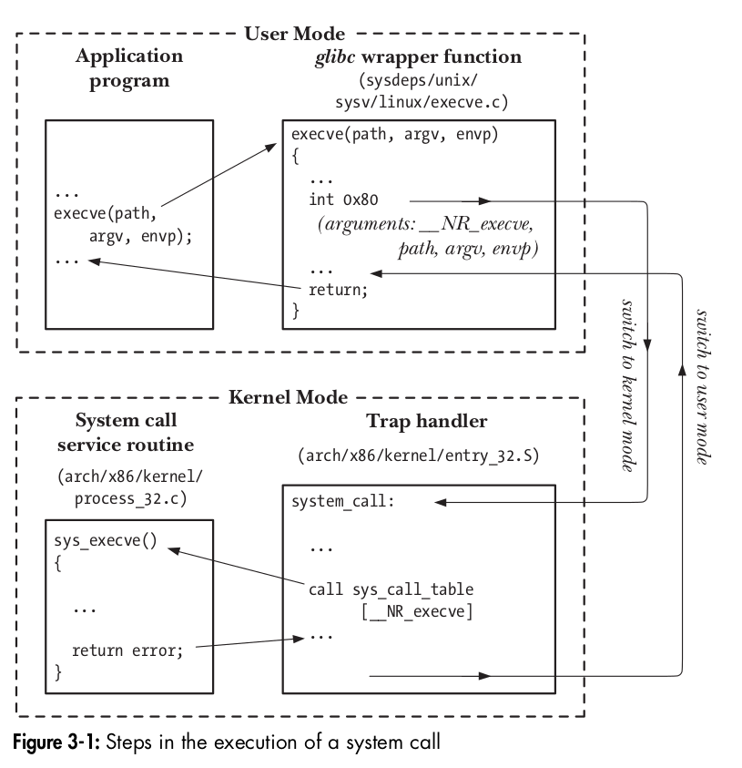

# Syscall

> *From [The Linux Programming Interface]*




> https://cs61.seas.harvard.edu/site/2021/Kernel/


> https://www.juliensobczak.com/inspect/2021/08/10/linux-system-calls-under-the-hood.html
>
> 


> [TCP IP Architecture Design - Sameer Seth]
>
> 
>
> Figure 1.10. System call implementation on Linux.


## Calling Conventions


> https://chromium.googlesource.com/chromiumos/docs/+/master/constants/syscalls.md


| arch | syscall NR | return | arg0 | arg1 | arg2 | arg3 | arg4 | arg5 |
| :-: | :-: | :-: | :-: | :-: | :-: | :-: | :-: | :-: |
| arm | r7 | r0 | r0 | r1 | r2 | r3 | r4 | r5 |
| arm64 | x8 | x0 | x0 | x1 | x2 | x3 | x4 | x5 |
| x86 | eax | eax | ebx | ecx | edx | esi | edi | ebp |
| x86\_64 | rax | rax | rdi | rsi | rdx | r10 | r8 | r9 |


### syscall instruction

> https://blog.packagecloud.io/the-definitive-guide-to-linux-system-calls/

#### legacy system calls: interrupt based


32/64 bit:

```
int $0x80
```

#### Fast system calls


64 bit:

- On 32bit systems use: `sysenter` and `sysexit`.
- On 64bit systems use: `syscall` and `sysret`.


A hardware interrupt is raised by a hardware device to notify the kernel that a particular event has occurred. A common example of this type of interrupt is an interrupt generated when a NIC receives a packet.

A software interrupt is raised by executing a piece of code. On x86-64 systems, a software interrupt can be raised by executing the `int` instruction.


## ASM e.g


### 32bit ASM e.g

> [Source Link](https://blog.packagecloud.io/the-definitive-guide-to-linux-system-calls/#:~:text=some%20inline%20assembly.-,Using%C2%A0syscall%C2%A0system%20calls%20with%20your%20own%20assembly,-Building%20on%20the)


No e.g

### 64bit ASM e.g

> [Source Link](https://blog.packagecloud.io/the-definitive-guide-to-linux-system-calls/#:~:text=some%20inline%20assembly.-,Using%C2%A0syscall%C2%A0system%20calls%20with%20your%20own%20assembly,-Building%20on%20the)


First, we need to find the system call number for `exit`. In this case we need to read the table found in [`arch/x86/syscalls/syscall_64.tbl`](https://github.com/torvalds/linux/blob/v3.13/arch/x86/syscalls/syscall_64.tbl#L69):

```
60      common  exit                    sys_exit
```

The `exit` syscall is number `60`. According to the interface described above, we just need to move `60` into the `rax` register and the first argument (the exit status) into `rdi`.


```c
int
main(int argc, char *argv[])
{
  unsigned long syscall_nr = 60;
  long exit_status = 42;

  asm ("movq %0, %%rax\n"
       "movq %1, %%rdi\n"
       "syscall"
    : /* output parameters, we aren't outputting anything, no none */
      /* (none) */
    : /* input parameters mapped to %0 and %1, repsectively */
      "m" (syscall_nr), "m" (exit_status)
    : /* registers that we are "clobbering", unneeded since we are calling exit */
      "rax", "rdi");
}
```


## Ref

- http://blog.rchapman.org/posts/Linux_System_Call_Table_for_x86_64/
- https://man7.org/linux/man-pages/man2/syscall.2.html
- https://man7.org/linux/man-pages/man2/syscalls.2.html
- https://blog.packagecloud.io/the-definitive-guide-to-linux-system-calls/
- https://gitlab.com/x86-psABIs/x86-64-ABI
- https://refspecs.linuxfoundation.org/elf/x86_64-abi-0.99.pdf
- https://www.juliensobczak.com/inspect/2021/08/10/linux-system-calls-under-the-hood.html
- https://sys.readthedocs.io/en/latest/doc/06_setting_up_arguements.html
- https://sys.readthedocs.io/en/latest/doc/06_setting_up_arguements.html#walk-through-open-system-call-in-glibc
- [Writing C Software without the Standard Library FOR UN*X](https://gist.github.com/Scherso/d11e7de8bd27f234519cfb94348d9c70)


```{toctree}
syscall-table.md
linux-system-calls-under-the-hood.md
```


