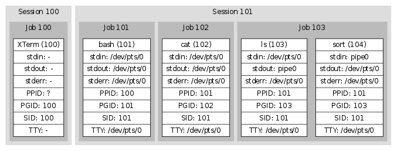

## Jobs




- `SIGHUP`

  - 默认动作：Terminate
  - 可能动作：Terminate, Ignore, Function call

  当**检测到 hangup** 时，**UART 驱动**会向**整个 session** 发送 SIGHUP 信号。 正常情况下，这会 kill 掉所有进程。某些程序，例如 **`nohup(1)` 和 `screen(1)`，会从他们的 session（和 TTY）中 detach 出来**， 因此这些程序的子进程无法关注到 hangup 事件。

- `SIGINT`

  - 默认动作：Terminate
  - 可能动作：Terminate, Ignore, Function call

  当输入流中出现**interactive attention character**（交互式注意字符，通常是 `^C`，ASCII 码是 3）时，**TTY 驱动**会向**当前的前台**作业发送 `SIGINT` 信号 ，除非这个特性被关闭了。任何对 TTY 设备有权限的人都可以修改 the interactive attention character 或打开/关闭这个特性；另外，**会话管理器（session manager） 跟踪记录每个作业的 TTY 配置，当发生作业切换时会更新 TTY**。

- `SIGQUIT`

  - 默认动作：Core dump
  - 可能动作：Core dump, Ignore, Function call

  `SIGQUIT` 和 `SIGINT` 类似，但 quit 字符通常是 ^\，而且默认动作不同。

- `SIGPIPE`

  - 默认动作：Terminate
  - 可能动作：Terminate, Ignore, Function call

  对于每个尝试**向没有 reader 的 piepe 写数据的进程**，内核会向其发送 `SIGPIPE` 信号。这很有用，因为如果没有这个信号，某些作业就无法终止。

- ```plaintext
  SIGCHLD
  ```

  - 默认动作：Ignore
  - 可能动作：Ignore, Function call

  当一个进程死掉或状态发生改变时（stop/continue），内核会向其父进程发送此信号 。该信号还附带了其他信息，即该进程的进程 ID、用户 ID、退出状态码（或终止信号） 以及其他一些执行时统计信息（execution time statistics）。session leader 使用 这个信号跟踪它的作业。

- `SIGSTOP`

  - 默认动作：Suspend
  - 可能动作：Suspend

  该信号会无条件地挂起信号接受者，例如，该信号的动作是不能被重新配置的（ reconfigure）。但要注意，该信号并不是在作业控制（job control）期间被内核发送 的。`^Z` 通常情况下触发的是 `SIGTSTP` 信号，这个信号是可以被应用捕获的。例如 ，应用可以将光标移动到屏幕底部，或者将终端置于某个已知状态，随后通过 `SIGSTOP` 将自己置于 sleep 状态。

- `SIGCONT`

  - 默认动作：Wake up
  - 可能动作：Wake up, Wake up + Function call

  该信号会唤醒（un-suspend）一个已经 stop 的进程。**用户执行 `fg` 命令时， shell 会显式地发送这个信号**。由于应用无法捕获该信号，因此如果出现未预期的 `SIGCONT` 信号，可能就表示某些进程在一段时间之前被挂起了，现在挂起被解除了。

- `SIGTSTP`

  - 默认动作：Suspend
  - 可能动作：Suspend, Ignore, Function call

  该信号与 `SIGINT` 和 `SIGQUIT` 类似，但对应的**魔法字符通常是 `^Z`，默认动作是挂起进程**。

- `SIGTTIN`

  - 默认动作：Suspend
  - 可能动作：Suspend, Ignore, Function call

  如果一个后台作业中的进程尝试读取一个 TTY 设备，TTY 会发送该信号给整个作业。 正常情况下这会挂起作业。

- `SIGTTOU`

  - 默认动作：Suspend
  - 可能动作：Suspend, Ignore, Function call

  如果一个后台作业中的进程尝试写一个 TTY 设备，TTY 会发送该信号给整个作业。 正常情况下这会挂起作业。可以在 per-TTY 级别打开或关闭这个特性。

- `SIGWINCH`

  - 默认动作：Ignore
  - 可能动作：Ignore, Function call

  前面提到，TTY 设备会跟踪记录终端的尺寸（size），但这个信息需要手动更新。 **当终端尺寸发送变化时，TTY 设备会向前台作业发送该信号**。行为良好的交互式应用， 例如编辑器，会对此作出响应：从 TTY 设备获取新的终端尺寸，然后根据该信息重绘自己。

## Ref.
https://arthurchiao.art/blog/tty-demystified-zh/