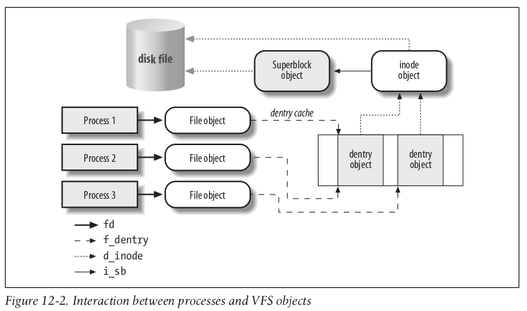

> [Understanding The Linux Kernel]

The common file model consists of the following object types:

- The superblock object
Stores information concerning a mounted filesystem. For disk-based filesystems,
this object usually corresponds to a filesystem control block stored on disk.

- The inode object
Stores general information about a specific file. For disk-based filesystems, this
object usually corresponds to a file control block stored on disk. Each inode
object is associated with an inode number, which uniquely identifies the file
within the filesystem.

## dentry Objects

The kernel creates a dentry object for every component of a pathname that a process
looks up; the dentry object associates the component to its corresponding inode. For
example, when looking up the `/tmp/test` pathname, the kernel creates 

- a `dentry` object for the `/ root` directory, 
- a second `dentry` object for the `tmp` entry of the `root` directory, 
- and a third `dentry` object for the `test` entry of the `/tmp` directory.

