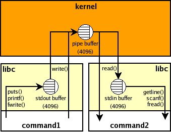
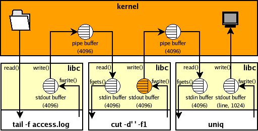

# stdio_buffering

> from http://www.pixelbeat.org/programming/stdio_buffering/


## buffering in standard streams

I found it difficult to figure out what buffering was applied to the standard streams.
Consider for example the following unix shell pipeline:

```
$ command1 | command2
```

Here the shell forks off 2 processes and connects them using a pipe in the manner
depicted in the [DIAgram](http://www.pixelbeat.org/programming/stdio_buffering/pipe_stdio.dia) below. Note the 3 buffers involved in the connection.

The kernel buffer, created by the pipe system call from the shell, is sized
based on the page size for the system. We have no control really over the
kernel buffer size or operation but that is not an issue for us as it will
[efficiently](http://lwn.net/2001/0208/a/kiobuf-pipe.php3) [copy](http://lkml.org/lkml/2001/10/18/103) data as soon as it's received (on linux at least).
[Update: The linux pipe buffers have changed to [circular buffers](http://lwn.net/Articles/118750/) (16 x 4KiB)
also there is a [proposed patch](http://lkml.org/lkml/2008/5/30/180) to make the size dynamic.]

The other buffers represented are associated with the standard streams,
and for efficiency are only allocated on first use of these streams.
There are 3 standard streams (stdin, stdout, stderr) created automatically for
nearly all unix programs by the C library (libc) at the start of program execution,
and new streams can be created to connect to files, sockets, pipes, ...
To control how data is read/written from these buffers one can control
both the buffer sizes and modes (Unbuffered, Buffered, Line Buffered).
To determine the characteristics of the buffering automatically applied to the
standard streams I used [this program](http://www.pixelbeat.org/programming/stdio_buffering/default_buffers.c), which indicated the following:

**Default Buffering modes:**

- stdin is buffered (line buffering doesn't affect stdin)
- stdout is buffered (line buffered if connected to a terminal)
- stderr is unbuffered

**Default Buffer sizes:**

- Buffer size only directly affects buffered mode
- The default size like the kernel is based on the page size (4096 bytes on my system)
- if stdin/stdout are connected to a terminal then default size = 1024; else size = 4096

## stdio output buffering problems

Now consider the case where the data source has intermittent output
and one wants to both see the data as it appears and filter the data.
For example, one wants to filter the output of tcpdump -l or tail -f etc.
Note certain filters (like sort) need to buffer all data internally and so
can't be used in this application.
As a concrete example consider the following pipeline which shows the IP addresses
accessing a web site while filtering out consecutive access from a particular IP.

```
$ tail -f access.log | cut -d' ' -f1 | uniq
```

The problem with this is that one will not see the hosts as they appear
in the log file, because of the automatic stdio buffering applied by libc.
Given the above rules, one gets buffering for the example pipeline above,
as depicted in the following [DIAgram](http://www.pixelbeat.org/programming/stdio_buffering/pipe_stdio_example.dia).

The highlighted buffer causes the problem because it is connected to a pipe
and hence will automatically buffer up data into 4096 byte chunks before sending to uniq.
Note tail's stdout buffer would also have this problem, but tail -f calls fflush
on the stdout stream when new data is received to alleviate this
(as do tcpdump -l, grep --line-buffered and sed --unbuffered for example).
Note also that uniq's stdout buffer is connected to a terminal and so will be automatically
flushed when a new line is written to it which is fine for our needs.

## stdio input buffering problems

Buffering on stdin like stdout is used (to coalesce reads) for efficiency.
One would have more control with byte by byte reads, but that would not be practical.
Consider the following issue:

```
$ printf "one\ntwo\nthree\n" | ( sed 1q ; sed 1q ; sed 1q )
one
```

As you can see the first sed process reads all the data, starving the rest.
Note if one could set the stdin buffer to line buffering mode it still would
have no affect as that only controls when output is flushed.
[Reading lines from stdin](http://www.pixelbeat.org/programming/readline/) is a common requirement but implemented above the stdin buffer.
Generally one can only control whether a process reads stdin or not,
or if the process needs to read a specific amount, then buffering on
stdin has to be disabled. A related common issue is with ssh:

```
$ printf "one\ntwo\nthree\n" | ( ssh localhost printf 'zero\\n' ; cat )
zero
```

Here the remote printf command doesn't read stdin but the local ssh client
does not know this and so it will read the data on its behalf.
To tell ssh that the remote command doesn't require any input use the -n option:

```
$ printf "one\ntwo\nthree\n" | ( ssh -n localhost printf 'zero\\n' ; cat )
zero
one
two
three
```

The common issue with this is if you want to put the ssh client in the background when you know
the remote command will not need any input from stdin (graphical apps being the usual case),
then the ssh client will block trying to read from stdin which will consequently stall the app.
One can tell ssh to ignore stdin and to fork to the background when appropriate with the -f option.
For e.g.: ssh -fY localhost xterm

## stdio buffer control

Programmatically one can bypass the buffers by using read/write directly, but
that would be inefficient in most cases. Also one can set both the buffering mode
and buffer size used using the setvbuf library call, as can be seen in my [example program](http://www.pixelbeat.org/programming/stdio_buffering/obuffer.c).
It should be noted here that changing the buffering for a stream can have unexpected effects.
For example glibc (2.3.5 at least) will do a read(blksize) after every fseek() if buffering is on.

However currently there is no way to directly control the buffering mode
or buffer size of existing applications. There is a hack where one can use
the unbuffer script that comes as standard with "expect" to trick "cut" in the
example above into thinking that it is connected to a terminal.
However this is dependent on what libc does to control the buffer and so
can currently only control toggling between line and fully buffered mode.
There are also caveats with that hack as documented in the [unbuffer man page](http://linuxcommand.org/man_pages/unbuffer1.html),
and in addition there is the increased possibility of running out of ptys on the system.

[**Update** Nov 2008: I noticed another method from Brian Dessent for using
[LD_PRELOAD to control buffering](http://lists.gnu.org/archive/html/bug-coreutils/2008-11/msg00164.html), as detailed by Jim Meyering.]

[**Update** Aug 2009: We've made the LD_PRELOAD method above easily available in coreutils 7.5
with the a new stdbuf command which can be used with the example presented here like:

```
tail -f access.log | stdbuf -oL cut -d ' ' -f1 | uniq
```

Note use stdbuf -o**0** if your data is not line oriented.
For full details please see the [stdbuf man page](http://www.pixelbeat.org/programming/stdio_buffering/stdbuf-man.html) or [stdbuf info manual](http://www.gnu.org/software/coreutils/stdbuf).]

[**Update** Dec 2012: I notice that stdbuf has been [made available](https://github.com/freebsd/freebsd-head/commit/398caacf) in FreeBSD 9.1.]

## possible stdio buffer control enhancements

Since all the default stdio buffering parameters are setup before main() is entered,
the only way to control them is with environment variables. One could control both the
buffering mode and size with variables of the format: BUF_X_=Y
where X = 0 (stdin), 1 (stdout), 2 (stderr), ...
and Y = 0 (unbuffered), 1 (line buffered), >1 buffered + size

So for our example we could have:

```
$ tail -f access.log | BUF_1_=1 cut -d' ' -f1 | uniq
```

This logic would be very easy to add to glibc, however something like this
was suggested previously and independently of me and was [rejected](https://marc.info/?l=glibc-bug&m=98313957306297&w=2).
Also it was suggested directly to me that adding this to libc would add
Denial Of Service possibilities, and that in any case applications expect
a particular buffering setup.

Note adding this logic to applications isn't nearly as general, especially
given the fact that there is no way to generically map from file descriptor number
to stream pointer outside of libc. Anyway [here is a patch](http://www.pixelbeat.org/programming/stdio_buffering/cut-buf.diff) against cut.c from
coreutils-0.94 to illustrate what is required to support the pipeline above.

Many thanks to Bob Proulx for feedback and ideas for this page.
