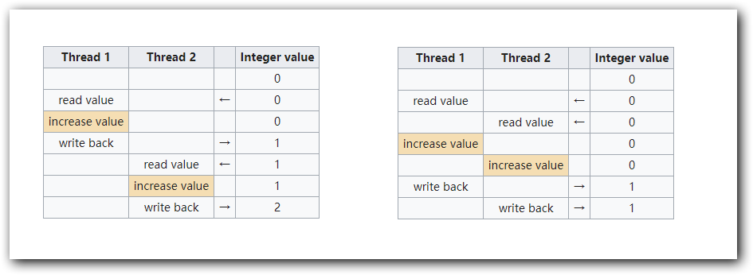
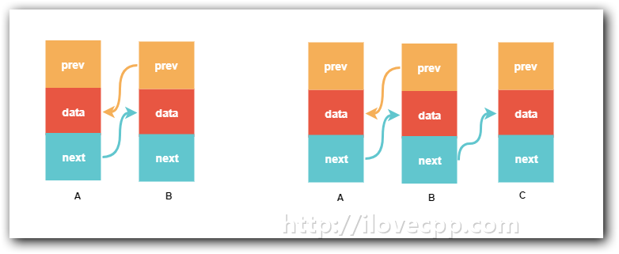

# 当谈论线程安全时，我们在谈论什么

> Source: http://www.ilovecpp.com/2018/11/01/thread-safe/


相对多进程来说，多线程的一个明显的好处就是线程间数据共享容易的多。然而这种便利是有代价的，每一个写过多线程程序的程序员，都曾为它掉过头发，它正是————线程安全。那么到底什么是线程安全呢？

举个例子，想象一下你和你的朋友合租一间公寓，公寓里只有一个卫生间，正常情况下，同一时间你们中只有一个人能使用这个卫生间。这样的分配方式就是所谓的”线程安全”。其中你和你的朋友分别代表一个线程，卫生间就是线程间共享的变量。那么如何保证同一时间只有一个人在使用这个卫生间呢，常见的做法就是给卫生间装锁(mutex)，你们使用卫生间之前都需将门先锁上(lock)。当别人在使用卫生间时，你只需要在门口静静等待，直到他把门打开(unlock)。而如果这个卫生间没锁呢？你们去卫生间的时间都是任意的，就有可能发生这样的情况:当你急匆匆打开卫生间门的时候，正看到的是你的朋友洗澡的中间状态，这是非常让人惨不忍睹的画面。这样的情况就不是线程安全的。

当然保证线程安全的方法不局限于使用锁，还有其他的方法，我们后边再提。如果这发生在程序里，运气好的话程序会直接crash掉，否则就是一颗定时炸弹，指不定什么时候炸那么一下，让你不得安宁。

上面用一个比喻说明了什么是”线程安全”，《C++ concurrency in action》上有一个比较严谨的定义：

> designing a data structure for concurrency means that multiple threads can access the data structure concurrently, either performing the same or distinct operations, and each thread will see a self-consistent view of the data structure.No data will be lost or corrupted, all invariants will be upheld, and there’ll be no problematic race conditions. Such a data structure is said to be thread-safe.

大意是如果在线程间共享的一个数据结构，每个线程都会操作这个数据结构，无论他们怎么操作，数据不会丢失、不会破坏，不变量(invariants)不会改变，没有潜在的条件竞争(race conditions)。那么这个数据结构就是线程安全的。

其中涉及到两个新名词invariant 和 race condition，一个一个说明。

# race condition 和 invariant

首先是race condition，[Wikipedia](https://en.wikipedia.org/wiki/Race_condition)是这么定义的:

> Race conditions arise in software when an application depends on the sequence or timing of processes or threads for it to operate properly.

当程序的结果依赖于线程的操作顺序时，那么就认为这当中存在race condition。C++11中定义的内存模型，用术语”data race”表示在一个共享内存上的并发操作会引起race condition。

举个例子，当两个线程都对同一个全局变量自增操作时，其结果取决于操作的顺序。



虽然两个线程都对这个变量increase操作，要是increase的时机不对的话，这个整数的的最终结果可能是1而不失期望值2。

race condition可能会导致invariant被打破，从而引发线程安全的问题。举一个通俗一点儿的例子：



A,B是双向链表里的三个节点，现在我们需要添加节点C到这个双向链表上，需要以下几个步骤:

1. 将节点B的next指针指向节点C
2. 将节点C的prec指针指向节点B

如果在添加操作进行到1和2之间的步骤时，另外一个线程访问这个双向链表，那么它看到的链表就是右边这个样子的。如果这个线程通过节点C向前遍历这个链表时，就会引发未定义的错误。未定义的错误是C++里最阴暗的角落，没有之一。

在双向链表里，每个节点的next指针都指向它的后一个节点，prev指针指向前一个节点，如果存在的话。这里的节点C是有前置节点的，但是它的prev并没有指向节点B。这时我们说这个双向链表的一个invariant就打破了。只要这个invariant被打破的状态被多个线程看到，我们就可以认为这个数据结构不是线程安全的。

# 使用mutex保证线程安全

最简单的方式就是使用互斥锁(mutex)。使用锁的本质上是讲本来并发的操作串行化(Serialization)。

还拿开篇的比喻来说，本来洗澡是连续的一系列的动作:脱衣服、洗头、洗脸、洗身子…使用了锁之后，外边的人要等待你完成洗澡一系列的动作之后，才能拿到锁打开卫生间。这样一来你们两个对卫生间的使用就有了先后关系，是轮流使用的。

这个锁的粒度也是有讲究的，原则上我们应该遵循:the smaller the protected region, the fewer operations are serialized, and the greater the potential for concurrency(《C++ concurrency in action》 6.1)。应当让串行化的操作尽量的少。

先来看看要是锁的粒度很大会发生什么。如果你将要使用卫生间洗澡，你不是先锁上卫生间的门，而是锁上了公寓的门，然后再准备衣服、准备洗发水…之后再去洗澡，这样做在线程安全上来说，是不会有问题的(因为没有race condition了)。但是却极大的降低了并发能力——你没有使用卫生间的时候，室友应该允许进入公寓的干其他事情的。这样一来，他阻塞等待你解锁的时间会变长，这段时间他什么也干不了，就是干等着你解锁。同理程序里也是一样，mutex锁定的范围太大，会严重影响并发性，不能发挥多线程程序利用多核的能力。

此外，是不是锁的粒度越小越好呢？也不是。洗澡是连续的一系列的动作，如果你锁上卫生间脱衣服然后解锁，然后再锁上卫生间再洗头再解锁…这样下去。当你完成其中一个动作时，此时卫生间正处于一个被你使用的中间状态(intermediate states)，此时你的室友是有机会打开卫生间，看到里边发生的一切…这和没有使用锁的时候并没有本质的区别，同样也不是线程安全的。

使用mutex保证线程安全，虽然简单，但是锁的粒度拿捏好，也是很有讲究的。

# lock-free算法

虽然互斥锁已经足够强大，可以确保程序做到线程安全，理解也相对简单。但它毕竟不是万能灵药。死锁也是多线程编程下一个比较常见的问题，另外对锁粒度的拿捏也影响到了程序的并发性。

lock-free编程的核心思想是将一系列本来需要在mutex保护下对共享变量的操作，重新设计成一个不可分割的步骤，也就是所谓的”原子操作”(atomic operations)。设计一个lock-free的数据结构，是非常复杂的，需要熟悉许多底层相关的知识(比如内存模型，CPU体系结构等)，所幸这是一个热门的话题，已经有许多大牛设计好了的靠谱的轮子可以直接拿用([求推荐Lock-Free 算法相关论文？](https://www.zhihu.com/question/23705245))。

由于对共享变量的操作，是一个不可分割的部分，因此别的线程是不能看到它在其他线程里invariant被打破的瞬间的，因此确保了线程安全。

# 一次初始化

单例模式可能是我们对”设计模式”的第一次接触，虽然经常用到，但是你不一定真的了解它。

```
class Singleton {
public:
    static Singleton& Instance() {
        static Singleton S;
        return S;
    }

private:
    Singleton();
    ~Singleton();
};
```

这是一个比较常见的单例模式实现，也被称作Meyers Singleton。很遗憾，在C++11之前这种写法是无法保证线程安全的。这个问题的本质在于，变量的初始化是否是线程安全的,对此StackOverFlow上有两个问题值得一看：[Is Meyers’ implementation of the Singleton pattern thread safe?](https://stackoverflow.com/questions/1661529/is-meyers-implementation-of-the-singleton-pattern-thread-safe) 和 [https://stackoverflow.com/questions/8102125/is-local-static-variable-initialization-thread-safe-in-c11](https://stackoverflow.com/questions/1661529/is-meyers-implementation-of-the-singleton-pattern-thread-safe)。直到C++11才对此有了保证：

> If control enters the declaration concurrently while the variable is being initialized, the concurrent execution shall wait for completion of the initialization.

也就是说上边的这段代码，直到C++11才有了线程安全的保证。

即使没有C++11中变量并发初始化线程安全的保证，我们仍然可以写出线程安全的单例模式。Pthread库中的[pthread_once](https://linux.die.net/man/3/pthread_once)和C++11中的[std::call_once](https://en.cppreference.com/w/cpp/thread/call_once)。

```
class Singleton
{
private:
    Singleton(const Singleton&) = delete;
    Singleton & operator=(const Singleton&) = delete;

    static std::unique_ptr<Singleton> instance;
    static std::once_flag onceFlag;
public:
    Singleton() = default;

    static Singleton& Instance()
    {
        std::call_once(onceFlag,[] (){
            instance.reset(new Singleton); 
        });

        return *(instance.get());
    }
};
```

这里我实现了一个call_once的线程安全单例模式实现。

# 使用线程局部存储

线程局部存储(thread local storage)通常用于单线程程序里使用全局变量的地方，通过这种方式定义的变量，会在每一个线程里边都会有一个单独的实例。Pthread库提供了 pthread_key_create () /pthread_key_delete() 等API创建thread local数据，GCC编译器提供了`__thread`关键字用于声明thread lcoal变量，语言级别上，C++11都提供了[thread_local](https://en.cppreference.com/w/cpp/language/storage_duration)关键字。

```
thread_local unsigned int rage = 1;
std::mutex cout_mutex;

void increase_rage(const std::string &thread_name)
{
    ++rage; // modifying outside a lock is okay; this is a thread-local variable
    std::lock_guard<std::mutex> lock(cout_mutex);
    std::cout << "Rage counter for " << thread_name << ": " << rage << " ,&rage = " << &rage << '\n';
}

int main()
{
    std::thread a(increase_rage, "a"), b(increase_rage, "b");
    a.join();
    b.join();

    std::lock_guard<std::mutex> lock(cout_mutex);
    std::cout << "Rage counter for main: " << rage << " ,&rage = " << &rage << '\n';
}
```

rage就是thread-local变量，对它的操作不需要加锁，代码里边的std::mutex是用来保护std::cout的。因为C++中的iostream不是线程安全的，上面流式输出等价于:

```
std::cout.operator<<("Rage counter for ").operator<<(thread_name).operator<<(": ").operator<<(rage) ...
```

即使单个的ostream::operator<<()是线程安全的，而`线程安全是不可以组合的`，因此这里我们用mutex保护std::cout上输出的正确性。再看这段程序的输出：

```
Rage counter for b: 2 ,&rage = 0x7f6f9a32f6fc
Rage counter for a: 2 ,&rage = 0x7f6f9ab306fc
Rage counter for main: 1 ,&rage = 0x7f6f9bb4a77c
```

rage对这三个线程都可见，但是每个线程里rage不是同一个实例，它们有各自的存储地址，互不影响。

C程序通常使用一个全局errno变量来表示错误号，在单线程中还好，但是在多线程下，一个线程调用系统函数发生错误可能会覆盖另外一个线程设置的errno的值,https://linux.die.net/man/3/errno：

> errno is defined by the ISO C standard to be a modifiable lvalue of type int, and must not be explicitly declared; errno may be a macro. errno is thread-local; setting it in one thread does not affect its value in any other thread.

# 使用immutable objects

所谓的immutable objects 是指构造后不能改变的对象。线程间共享immutable对象，是不存在race condition的，可以保证是线程安全的。

例如python中的numbers,string对象就是immutable的。例如

```
str = 'foo'
str = 'bar'
```

str一开始引用的’foo’并未被修改，而是将str引用到了一个新的值——‘bar’。

注意区分C++中的const语义：

```
class Foo;
Foo foo;
const Foo& bar  = foo;
```

const仅仅从语义保证了foo对象不可以通过bar的引用改变，但是你直接修改foo是完全合法的。c++甚至提供了`const_cast`这样的类型转换。c++中的对象是否是immutable需要我们自己保证。

# 总结

网上还有人提到一种说法，可重入函数可以保证线程安全。但是也有特例,可重入并不是线程安全的一个子集([异步可重入函数与线程安全函数等价吗？](https://www.zhihu.com/question/21526405))。

以上就是几个保证线程安全的常见方式。保障线程安全最好的办法就是能不共享对象就不共享对象。实在不行就要尽量的少共享对象，如果没有共享写的需求就优先考虑immutable对象。当共享的对象可能在线程间被修改时，需选用合适的同步手段保护它，并且尽量减少串行化的操作。

选择合适的轮子，完成同步工作如BlockingQueue、CountDownLatch等，而不是使用底层的同步原语。
