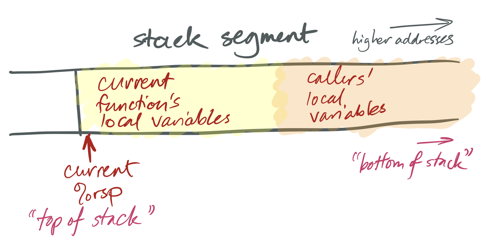
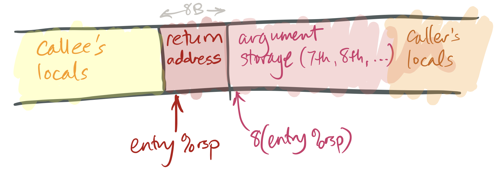
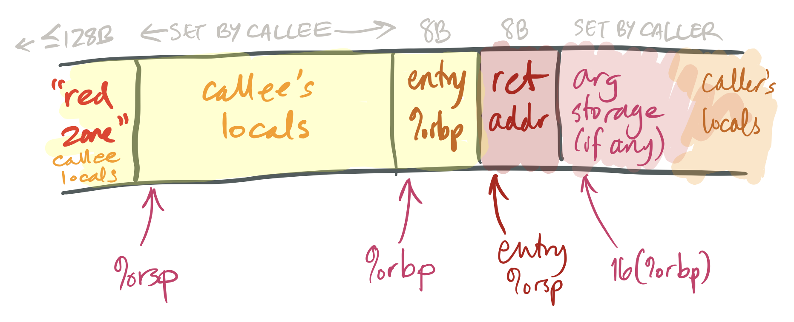
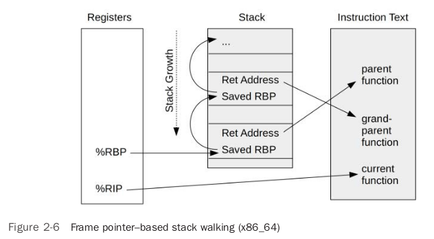

## begin

-  [application binary interface (ABI)](http://web.archive.org/web/20160315222154/http://www.x86-64.org/documentation_folder/abi-0.99.pdf)
-  https://cs61.seas.harvard.edu/site/pdf/x86-64-abi-20210928.pdf


## Argument passing and stack frames


> [Assembly 2: Calling convention](https://cs61.seas.harvard.edu/site/2018/Asm2/)


On x86-64 Linux, the first six function arguments are passed in registers :
`%rdi`, `%rsi`, `%rdx`, `%rcx`, `%r8`, and `%r9` 

The seventh and subsequent arguments are passed on the stack, about which more below. 
The return value is passed in register `%rax`.

The full rules more complex than this. You can read them in [the AMD64 ABI](https://software.intel.com/sites/default/files/article/402129/mpx-linux64-abi.pdf), section 3.2.3, but they’re quite detailed. Some highlights:

1. A structure argument that fits in a single machine word (64 bits/8 bytes) is passed in a single register.
   
    Example: `struct small { char a1, a2; }`
    
2. A structure that fits in two to four machine words (16–32 bytes) is passed in sequential registers, as if it were multiple arguments.
   
    Example: `struct medium { long a1, a2; }`
    
3. A structure that’s larger than four machine words is always passed on the stack.
   
    Example: `struct large { long a, b, c, d, e, f, g; }`
    
4. Floating point arguments are generally passed in special registers, the “SSE registers,” that we don’t discuss further.
   
5. If the return value takes more than eight bytes, then the _caller_ reserves space for the return value, and passes the _address_ of that space as the first argument of the function. The callee will fill in that space when it returns.
   

Writing small programs to demonstrate these rules is a pleasant exercise; for example:

```c
struct small { char a1, a2; };
int f(small s) {
    return s.a1 + 2 * s.a2;
}
```

compiles to:

```bash
gcc -fno-omit-frame-pointer -S ./small.c
```


```asm
movl %edi, %eax           # copy argument to %eax
movsbl %dil, %edi         # %edi := sign-extension of lowest byte of argument (s.a1)
movsbl %ah, %eax          # %eax := sign-extension of 2nd byte of argument (s.a2)
movsbl %al, %eax
leal (%rdi,%rax,2), %eax  # %eax := %edi + 2 * %eax
ret
```


## Stack

> https://cs61.seas.harvard.edu/site/2021/Asm/



This is built in to the architecture by the operation of instructions like `pushq`, `popq`, `call`, and `ret`. A `push` instruction pushes a value onto the stack. This both modifies the stack pointer (making it smaller) and modifies the stack segment (by moving data there). For instance, the instruction `pushq X` means:

```asm
subq $8, %rsp
movq X, (%rsp)
```

And `popq X` undoes the effect of `pushq X`. It means:

```asm
movq (%rsp), X
addq $8, %rsp
```

`X` can be a register or a memory reference.

The portion of the stack reserved for a function is called that function’s **stack frame**. Stack frames are aligned: x86-64 requires that each stack frame be a multiple of 16 bytes, and when a `callq` instruction begins execution, the `%rsp` register must be 16-byte aligned. This means that every function’s entry `%rsp` address will be 8 bytes off a multiple of 16.

## Return address and entry and exit sequence


To prepare for a function call, the caller performs the following tasks in its entry sequence.

1. The caller stores the first six arguments in the corresponding registers.
2. If the callee takes more than six arguments, or if some of its arguments are large, the caller must store the surplus arguments on its stack frame. It stores these in increasing order, so that the 7th argument has a smaller address than the 8th argument, and so forth. The 7th argument must be stored at `(%rsp)` (that is, the top of the stack) when the caller executes its `callq` instruction.
3. The caller saves any caller-saved registers (see below).
4. The caller executes `callq FUNCTION`. This has an effect like `pushq $NEXT_INSTRUCTION; jmp FUNCTION` (or, equivalently, `subq $8, %rsp; movq $NEXT_INSTRUCTION, (%rsp); jmp FUNCTION`), where `NEXT_INSTRUCTION` is the address of the instruction immediately following `callq`.

This leaves a stack like this:




To return from a function:

1. The callee places its return value in `%rax`.
2. The callee restores the stack pointer to its value at entry (“entry `%rsp`”), if necessary.
3. The callee executes the `retq` instruction. This has an effect like `popq %rip`, which removes the return address from the stack and jumps to that address.
4. The caller then cleans up any space it prepared for arguments and restores caller-saved registers if necessary.

Particularly simple callees don’t need to do much more than return, but most callees will perform more tasks, such as allocating space for local variables and calling functions themselves.

## Callee-saved registers and caller-saved registers


The most important responsibility is that certain registers’ values *must be preserved across function calls*. A callee may use these registers, but if it changes them, it must restore them to their original values before returning. These registers are called **callee-saved registers**(由被调用者负责备份，可以更新这些register，但需要在返回前还原). All other registers are **caller-saved**(由调用者负责在调用前备份并在调用后还原，被调用者可以更新这些register，且不需要还原)。

On x86-64 Linux, `%rbp`, `%rbx`, `%r12`, `%r13`, `%r14`, and `%r15` are callee-saved, as (sort of) are `%rsp` and `%rip`. The other registers are caller-saved.

## Base pointer (frame pointer)

The `%rbp` register is called the *base pointer* (and sometimes the *frame pointer*). For simple functions, an optimizing compiler generally treats this like any other callee-saved general-purpose register. However, for more complex functions, `%rbp` is used in a specific pattern that facilitates debugging. It works like this:



1. The first instruction executed on function entry is `pushq %rbp`. This saves the caller’s value for `%rbp` into the callee’s stack. (Since `%rbp` is callee-saved, the callee must save it.)

2. The second instruction is `movq %rsp, %rbp`. This saves the current stack pointer in `%rbp` (so `%rbp` = entry `%rsp` - 8).

   This adjusted value of `%rbp` is the callee’s “frame pointer.” The callee will not change this value until it returns. The frame pointer provides a stable reference point for local variables and caller arguments. (Complex functions may need a stable reference point because they reserve varying amounts of space for calling different functions.)

   Note, also, that the value stored at `(%rbp)` is the *caller’s* `%rbp`, and the value stored at `8(%rbp)` is the return address. This information can be used to trace backwards through callers’ stack frames by functions such as debuggers.

3. The function ends with `movq %rbp, %rsp; popq %rbp; retq`, or, equivalently, `leave; retq`. This sequence restores the caller’s `%rbp` and entry `%rsp` before returning.

## function stack

> [BPF Performance Tools]

### Frame Pointer–Based Stacks

The frame pointer technique follows a convention where the head of a linked list of stack frames
can always be found in a register (`rbp` on x86_64) and where the return address is stored at a
known offset (+8) from the stored `rbp`. This means that any debugger or tracer that
interrupts the program can read `rbp` and then easily fetch the stack trace by walking the `rbp`
linked list and fetching the addresses at the known offset. This is shown in Figure:




The AMD64 ABI notes that the use of `rbp` as a frame pointer register is conventional, and can
be avoided to save function prologue and epilogue instructions, and to make `rbp` available as a
general-purpose register.

The gcc compiler currently defaults to omitting the frame pointer and using `rbp` as a
general-purpose register, which breaks frame pointer-based stack walking. This default can
be reverted using the `-fno-omit-frame-pointer` option.


# Ref
https://codearcana.com/posts/2013/05/21/a-brief-introduction-to-x86-calling-conventions.html