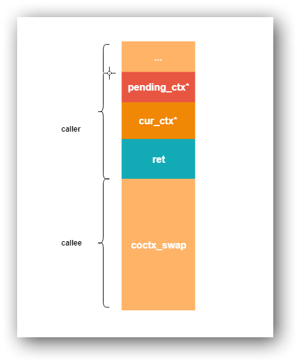
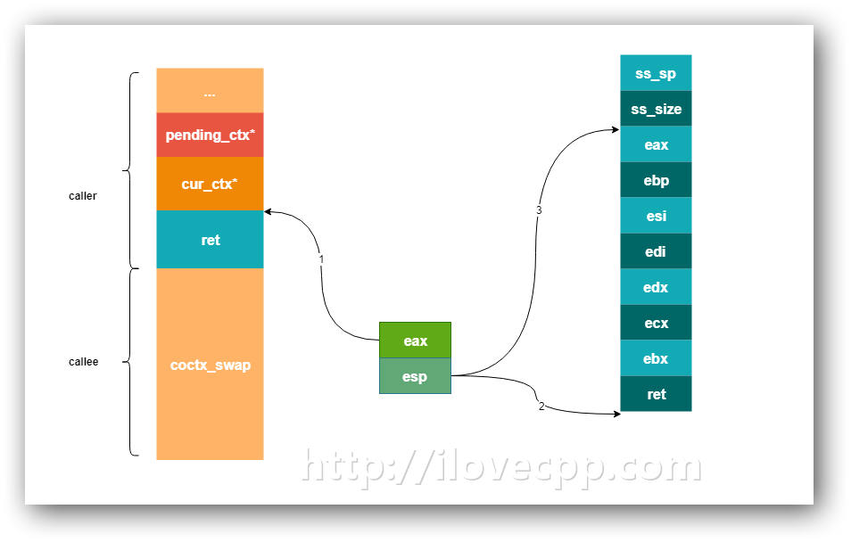
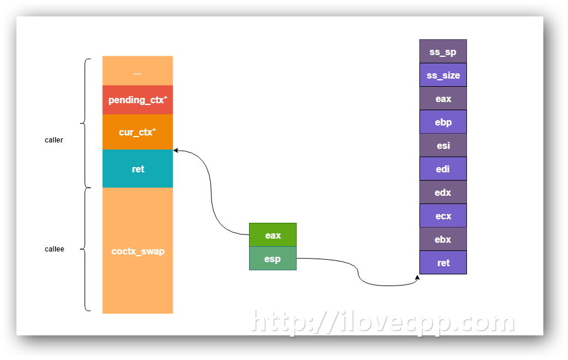
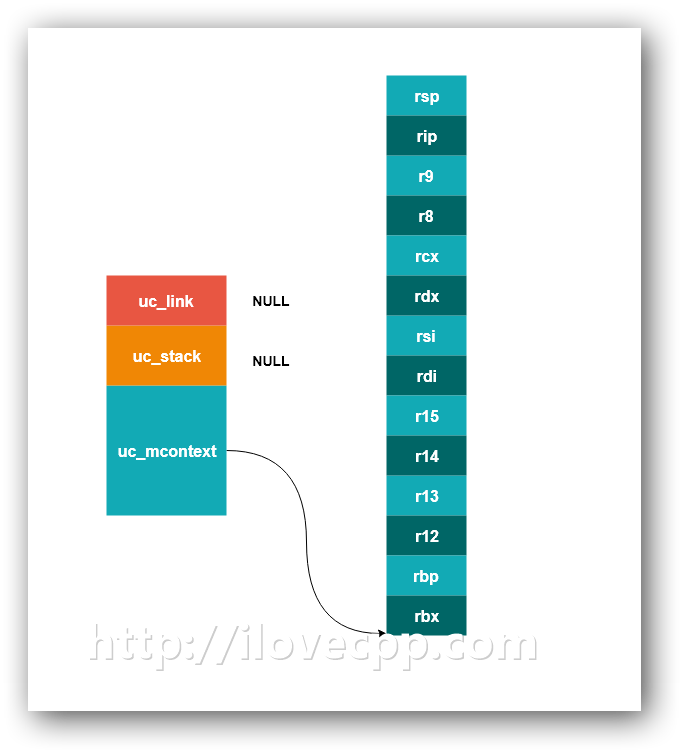
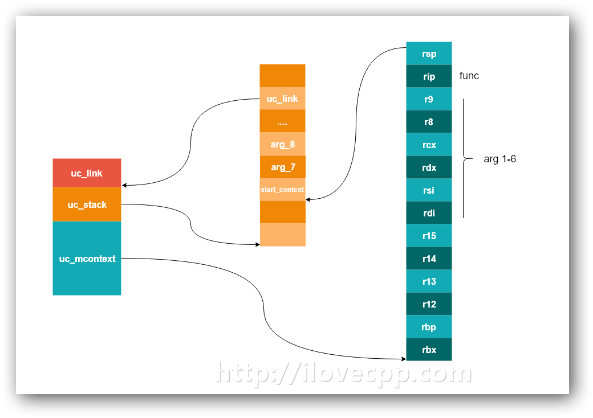

# 协程那些事儿


> Source: http://www.ilovecpp.com/2018/12/19/coroutine/


协程并不是什么新概念，可以理解为是拥有了控制权的用户态线程，用户可以自行选择切换用户上下文(user context)的时机，不需要操作系统额外调度([Steps in Context Switching](https://stackoverflow.com/questions/7439608/steps-in-context-switching))。

光这一点就足够牛逼了，现在Linux采用的是[NPTL](http://man7.org/linux/man-pages/man7/nptl.7.html)线程模型,线程和进程在内核里边都是同样的PCB块(task_struct)，看上去还是比较重量级的。网上找来一个有趣的测试，一次线程切换的开销大概是10Kns的量级:[线程切换的开销到底有多大](https://www.yuque.com/jwang/tfvf35/yehli6)。具体的为什么协程上下文切换比线程要快，网上也有讨论：https://www.zhihu.com/question/308641794/answer/572499202。根据这个作者的测试结果，切换协程的开销大概只有几十纳秒(ns)。


## 协程能干什么

使用异步的网络库，回调函数满天飞，有时甚至会出现好几层嵌套的回调，非常不利于代码的阅读。有了协程之后，同样的功能，我们可以使”同步阻塞”的方式组织代码。`阻塞`其实是一个用户态的概念，而内核是不会阻塞的，当发生耗时的IO操作时，当前线程剩余的时间片会被放弃，其他线程得到CPU，这样的过程也就是上下文切换。和内核一样，使用协程库后，我们可以使用”同步阻塞”的方式组织代码，而实际当“阻塞”发生时，程序会继续执行其他的执行流，而当”阻塞”的操作完成的时候，执行流会自动跳转回来继续向下执行。

协程库的作用就是提供一些列的接口，让程序拥有在用户态切换上下文的能力，而上下文切换的时机需要调用者自行决断。

一个协程库最核心的技术就是上下文切换。搬砖之余，参考了[corountine](https://github.com/cloudwu/coroutine)和[libco](https://github.com/Tencent/libco)的源码，在此对比一下这两个库上下文切换的技术实现。

## 汇编实现上下文切换

libco的上下文切换的实现在`coxtx_swap.S`文件里边，这部分代码不复杂，抛去注释、空格等只有70行左右。但是要看懂这部分代码，也并不容易，首先得能看懂基本的汇编代码，知道常用的寄存器，并且对[函数调用栈帧](https://en.wikibooks.org/wiki/X86_Disassembly/Functions_and_Stack_Frames)比较熟悉。此外最好还能了解一下调用约定：https://en.wikibooks.org/wiki/X86_Disassembly/Calling_Conventions ， https://stackoverflow.com/questions/2535989/what-are-the-calling-conventions-for-unix-linux-system-calls-on-i386-and-x86-6。

`struct coctx_t`的结构用来表示用户上下文，是机器相关(machine-dependent)的,x86上需保存8个寄存器，x64多了6个(https://baixiangcpp.oss-cn-shanghai.aliyuncs.com/blog/coroutine/x86_64-abi-0.99.pdf这个pdf的第21页的表格有对x64平台函数调用用的的寄存器进行说明)。x86和x64的代码，仅有的区别就是要保存/恢复的寄存器数量多一点，其余实现都一致，为了缩小篇幅，下文我们均以x86的代码为例：

```
struct coctx_t
{
    void *regs[8];
    size_t ss_size;
    char *ss_sp;
};
```

这个`regs`字段里保存的寄存器的值，分别对应着：

```
// | regs[0]: ret |
// | regs[1]: ebx |
// | regs[2]: ecx |
// | regs[3]: edx |
// | regs[4]: edi |
// | regs[5]: esi |
// | regs[6]: ebp |
// | regs[7]: eax |  = esp
```

再看切换上下文的C函数声明:

```
extern "C"
{
    extern void coctx_swap( coctx_t* cur_ctx,coctx_t* pending_ctx) asm("coctx_swap");
};
```

`cur_ctx`用于表示当前的用户上下文，`pending_ctx`表示将要恢复执行(resume)的用户上下文。这个函数完成后，cur_ctx会被挂起，pending_ctx会被载入CPU开始运行。在一个函数中调用了coctx_swap():

```
void fun()
{
    ...
    coctx_swap(current_ctx,pending_ctx);
    do_something();
}
```

此时的栈帧应当是这样的：



调用函数(这里是fun()),会把pending_ctx、current_ctx依次压栈，然后将返回地址(coctx_swap函数的下一条指令处，这里是do_something函数)压栈。然后coctx_swap函数的汇编代码就开始执行了：

```
leal 4(%esp), %eax
movl 4(%esp), %esp
leal 32(%esp), %esp

pushl %eax

pushl %ebp
pushl %esi
pushl %edi
pushl %edx
pushl %ecx
pushl %ebx
pushl -4(%eax)


movl 4(%eax), %esp //parm b -> &regs[0]

popl %eax
popl %ebx  
popl %ecx
popl %edx
popl %edi
popl %esi
popl %ebp
popl %esp
pushl %eax

xorl %eax, %eax
ret
```

先看第一段的三句指令，执行步骤我用图示的方法画了出来:



此时eax保存是current_ctx的地址值，esp指向了current_ctx，再将esp地址指向ss_size。因为栈是向下增长的，紧接着的`pushl`操作会将当前cpu的寄存器的值、还有返回地址(-4(%eax))，保存到current_ctx->regs数组里边。

顺便说一句，这样的使用esp的方式，有网友提出这违反了`System V ABI`调用约定，可能会产生bug(https://github.com/Tencent/libco/issues/90)，并且还给出了复现的代码，我暂时没有尝试，如果后边测了以后可能会单独写一篇blog。

到这里当前协程的上下文就已经保存到current_ctx里边了。下面的工作就是，把pending_ctx载入CPU，恢复执行。于是，接下来先将esp指向pending_ctx：

```
movl 4(%eax), %esp
```



再通过pop操作将pending_ctx里保存的返回地址以及寄存器的值依次载入当CPU里。注意最后一个pop操作(`popl %esp`)完成的时候,当前的函数栈帧就跳到了pending_ctx里保存的了，然后将`%eax`压栈（这个里边保存的是返回地址），最后ret指令将这个返回地址载入eip，新的协程就开始执行了。

切换上下文的工作到此就已经结束了，过程行云流水。

## ucontext系列函数

和libco不同的是，coroutine库没有通过汇编的方式实现切换上下文。它用的是 `<ucontext.h>` 中的4个函数:`getcontext`、`setcontext`、`makecontext`、`swapcontext`。[GNU](https://www.gnu.org/software/libc/manual/html_node/System-V-contexts.html#System-V-contexts)上有每个函数详细的说明。

先从数据结构着手，ucontext_t顾名思义表示user context,至少要包含如下几个字段：

```
typedef struct ucontext_t
{
    struct ucontext_t *uc_link;
    stack_t uc_stack;
    mcontext_t uc_mcontext;
    sigset_t uc_sigmask;
    ...
} ucontext_t;

typedef struct
{
    void *ss_sp;
    int ss_flags;
    size_t ss_size;
} stack_t
```

其中mcontext_t结构是machine-dependent的不透明结构，可以使用gdb打印出来，主要用来保存一些和硬件相关的资源，在我的fedora28(x86-64)上它是这样的:

```
/* Context to describe whole processor state.  */
typedef struct
  {
    gregset_t __ctx(gregs);
    /* Note that fpregs is a pointer.  */
    fpregset_t __ctx(fpregs);
    __extension__ unsigned long long __reserved1 [8];
} mcontext_t;

/* Number of general registers.  */
##define __NGREG 23

/* Container for all general registers.  */
typedef greg_t gregset_t[__NGREG];

/* Structure to describe FPU registers.  */
typedef struct _libc_fpstate *fpregset_t;
```

注释的也很明白，这个结构用来保存一些寄存器的值。

### getcontext

getcontext使用当前调用线程的上下文初始化ucp。函数原型一目了然:

> int getcontext(ucontext_t *ucp);

可是当我用如下代码将获取到ucp里的uc_stack打印出来的时候，却显示为0，一度让我怀疑这个函数是不是实现有bug:

```
void print()
{
    ucontext_t uc;
    getcontext(&uc);
    printf("%p\n",uc.uc_stack.ss_sp);
}
```

最终在https://www.gnu.org/software/libc/manual/html_node/System-V-contexts.html找到了原因:

> Compatibility Note: Depending on the operating system, information about the current context’s stack may be in the uc_stack field of ucp, or it may instead be in architecture-specific subfields of the uc_mcontext field.

其实理解libco的汇编代码后，我们甚至都能猜到getcontext()干了些什么，翻阅了glibc的实现(x86-64):

```
ENTRY(__getcontext)
        /* Save the preserved registers, the registers used for passing
           args, and the return address.  */
        movq        %rbx, oRBX(%rdi)
        movq        %rbp, oRBP(%rdi)
        movq        %r12, oR12(%rdi)
        movq        %r13, oR13(%rdi)
        movq        %r14, oR14(%rdi)
        movq        %r15, oR15(%rdi)
        movq        %rdi, oRDI(%rdi)
        movq        %rsi, oRSI(%rdi)
        movq        %rdx, oRDX(%rdi)
        movq        %rcx, oRCX(%rdi)
        movq        %r8, oR8(%rdi)
        movq        %r9, oR9(%rdi)
        movq        (%rsp), %rcx
        movq        %rcx, oRIP(%rdi)
        leaq        8(%rsp), %rcx                /* Exclude the return address.  */
        movq        %rcx, oRSP(%rdi)
    ...
PSEUDO_END(__getcontext)
```

前面我们已经知道了x64下的函数调用约定，getcontext()函数只有一个参数ucontext_t*，于是%rdi是getcontext函数的第一个参数，另外oRBX、oRBP…等这些宏用于计算ucontext_t中对应的保存寄存器值得字段的偏移，这段代码的作用就是将寄存器的值分别保存到ucp中。重点看这最后几句：

```
movq        (%rsp), %rcx  
movq        %rcx, oRIP(%rdi)  
leaq        8(%rsp), %rcx  
movq        %rcx, oRSP(%rdi)
```

(%rsp)保存的是%rip(也就是是call getcontext后的下一条指令的地址，可以参考上一节的第一张插图),然后`movq (%rsp), %rcx`和`movq %rcx, oRIP(%rdi)`将%rip也存放到ucp中保存。最后两句将调用getcontext之前的函数栈顶保存到ucp中，保证恢复的时候函数栈的平衡。

getcontext之后，ucp将会初始化成这样：



### setcontext

> int setcontext(const ucontext_t *ucp);

setcontext也只有一个参数，它的作用是用ucp指向的ucontext_t恢复用户上下文。

getContext()的实现其实就相当于libco里边coctx_swap()里的那一连串的push操作，而setContext()则是对应的后边的一连串的pop操作，它将ucp里的寄存器信息、返回地址全部load到CPU里边去。

这段源码这里就不贴了，本篇文章的篇幅已经太长了，具体可以参考：https://code.woboq.org/userspace/glibc/sysdeps/unix/sysv/linux/x86_64/setcontext.S.html。

setcontext()成功之后不会返回，这很好理解，因为%rip跳转到其他地方了。

### makecontext

> void makecontext(ucontext_t *ucp, void (*func)(), int argc, …);

老实讲makecontext名字取的不是很好，容易让人产生一种这个函数可以”生产”一个ucontext_t的错觉，其实这个函数的作用是修改一个用getcontext()获取的ucontext_t。它用指定的函数func指针和参数修改ucp,当这个ucp被setcontext（或者swapcontext，后文再提）之后，执行流跳转到新的函数func所在的代码段开始向下执行。

man page上关于makecontext(3)有一个使用的example，示范了makecontext的用法：

```
int
main(int argc, char *argv[])
{
    char func1_stack[16384];
    char func2_stack[16384];

    if (getcontext(&uctx_func1) == -1)
        handle_error("getcontext");
    uctx_func1.uc_stack.ss_sp = func1_stack;
    uctx_func1.uc_stack.ss_size = sizeof(func1_stack);
    uctx_func1.uc_link = &uctx_main;
    makecontext(&uctx_func1, func1, 0);
    ...
}
```

在调用getcontext()之后，makecontext()之前，还需对获取到的ucp的两个字段额外的赋值。

ucp->uc_stack是即将运行的func使用的堆栈。如果修改了%rip的值，而不给它一个额外的堆栈，直接影响了堆栈的平衡，程序很容易就挂掉了。例子里func1_stack是在main的堆栈里边分配的，我们也可以使用堆上的内存，但是要主要内存的释放。

此外ucontext_t.uc_link也被初始化了，这个字段存在的意义是，当前的ucontext运行结束后，会把uc_link当做是后继的用户上下文，会被自动载入并继续执行，如果是设置为NULL的话，当前的ucontext执行完，调用线程就会直接退出了。

这里我也找到了makecontext()的源码，不同于getcontext()函数，它是C语言写的：

```
void __makecontext(ucontext_t *ucp, void (*func)(void), int argc, ...)
{
    extern void __start_context(void) attribute_hidden;
    extern void __push___start_context(ucontext_t *)
        attribute_hidden;
    greg_t *sp;
    unsigned int idx_uc_link;
    va_list ap;
    int i;
    /* Generate room on stack for parameter if needed and uc_link.  */
    sp = (greg_t *)((uintptr_t)ucp->uc_stack.ss_sp + ucp->uc_stack.ss_size);
    sp -= (argc > 6 ? argc - 6 : 0) + 1;
    /* Align stack and make space for trampoline address.  */
    sp = (greg_t *)((((uintptr_t)sp) & -16L) - 8);
    idx_uc_link = (argc > 6 ? argc - 6 : 0) + 1;
    /* Setup context ucp.  */
    /* Address to jump to.  */
    ucp->uc_mcontext.gregs[REG_RIP] = (uintptr_t)func;
    /* Setup rbx.*/
    ucp->uc_mcontext.gregs[REG_RBX] = (uintptr_t)&sp[idx_uc_link];
    ucp->uc_mcontext.gregs[REG_RSP] = (uintptr_t)sp;

    sp[0] = (uintptr_t) &__start_context;
    sp[idx_uc_link] = (uintptr_t) ucp->uc_link;

    ...
}
```

暂时先不考虑其余代码，看 `ucp->uc_mcontext.gregs[REG_RIP] = (uintptr_t)func;`这行,__makecontext直接将func指针保存到了ucp->uc_mcontext.gregs[REG_RIP]实现跳转。

由于栈的增长方向是从高地址到低地址的，ucp->uc_link申请的内存是从低地址开始的，因此需要计算一下这块内存的高地址值：

> sp = (greg_t *)((uintptr_t)ucp->uc_stack.ss_sp + ucp->uc_stack.ss_size);

如果函数的参数超过6个的话，还要额外的预留出额外参数(通过栈传递)的内存，其中这个”+1”视为uc_link留的，ucp->uc_link会保存在栈中：

> sp -= (argc > 6 ? argc - 6 : 0) + 1;

这还没完，还以16L的长度，对齐堆栈，然后预留8个字节的长度防止trampoline(https://en.wikipedia.org/wiki/Trampoline_(computing) ):

> sp = (greg_t *)((((uintptr_t)sp) & -16L) - 8);

最后再将sp的值放到uc_mcontext.gregs[REG_RSP]中。

再来看makecontext余下的代码：

```
void __makecontext(ucontext_t *ucp, void (*func)(void), int argc, ...)
{
    ...
    va_start(ap, argc);

    for (i = 0; i < argc; ++i)
        switch (i)
        {
        case 0:
            ucp->uc_mcontext.gregs[REG_RDI] = va_arg(ap, greg_t);
            break;
        case 1:
            ucp->uc_mcontext.gregs[REG_RSI] = va_arg(ap, greg_t);
            break;
        case 2:
            ucp->uc_mcontext.gregs[REG_RDX] = va_arg(ap, greg_t);
            break;
        case 3:
            ucp->uc_mcontext.gregs[REG_RCX] = va_arg(ap, greg_t);
            break;
        case 4:
            ucp->uc_mcontext.gregs[REG_R8] = va_arg(ap, greg_t);
            break;
        case 5:
            ucp->uc_mcontext.gregs[REG_R9] = va_arg(ap, greg_t);
            break;
        default:
            /* Put value on stack.  */
            sp[i - 5] = va_arg(ap, greg_t);
            break;
        }
    va_end(ap);
}
```

这一段虽然长，但是只做了一件事儿，把前六个参数传入对应寄存器，如果还有余下的参数，压入堆栈中。

于是makecontext之后，ucp将会被修改成：



于是func会在uc_stack中执行，而不会对调用线程的函数栈产生影响。栈底的uc_link相当于rip的作用，当前的func执行完之后，会自动载入uc_link指向的ucontext_t，如此反复。

### swapcontext

> int swapcontext(ucontext_t *oucp, const ucontext_t *ucp);

可以理解为是这样的步骤：1. getcontext(oucp) 2.setcontext(ucp)。从语义上讲swapcontext()和coctx_swap()一样，仅仅是保存上下文的数据结构不一样罢了。将当前的用户上下文保存至oucp中，并激活ucp指向的用户上下文。其实现也和coctx_swap()差不多，具体参考其源码:https://code.woboq.org/userspace/glibc/sysdeps/unix/sysv/linux/x86_64/swapcontext.S.html，这里也不多赘述了。

## 总结

本文分别以coroutine和libco两个协程库为例，剖析了主流的两种在用户态切换上下文的技术实现。ucontext方案是系统提供的接口，兼容性会更好。直接通过汇编实现的方式速度更快，但是稍不注意就有可能违反了调用约定，产生潜在的[bug](https://github.com/Tencent/libco/issues/90)。
