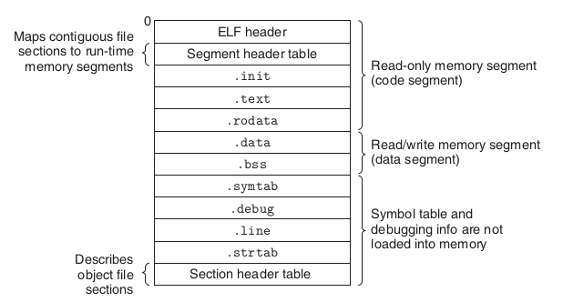
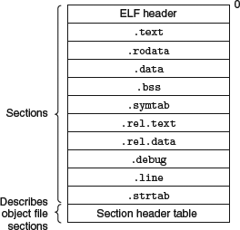

# ELF 格式简述

程序代码被编译和链接成包含二进制计算机指令的可执行文件。而可执行文件是有格式规范的，在 Linux 中，这个规范叫 Executable and linking format (ELF)。ELF 中包含二进制计算机指令、静态数据、元信息。

- 静态数据 - 我们在程序中 hard code 的东西数据，如字串常量等
- 二进制计算机指令集合，程序代码逻辑生成的计算机指令。代码中的每个函数都在编译时生成一块指令，而链接器负责把一块块指令连续排列到输出的 ELF 文件的 `.text section（区域）` 中。
- 元信息，可再细分为两类：
  - 告诉操作系统，如何加载和动态链接可执行文件，完成进程内存的初始化。
  - 一些非运行期必须，但可以帮助定位问题的信息。如 `.symtab section`


ELF 文件为其包含的数据提供 2 个视图：
- `链接视图(inking view)` 
- `执行视图(execution view)`
  
这两个视图分别通过两个 `header table` 访问：`section header table` 和  ` program header table`。




*<p align = "center">典型的 ELF 文件格式例子<br />图源自 [Computer Systems - A Programmer’s Perspective]:</p>*


*ELF 格式相关数据结构关系图*


## 典型的 ELF 文件示例

### 典型的 relocatable object file 

> [Computer Systems A Programmer's Perspective]




### 典型的 executable object file

> [Computer Systems A Programmer's Perspective]


## 文件结构

### ELF 文件头

If we look at an ELF file with the command `readelf -h` , we can view the initial ELF
file header. The ELF file header starts at the 0 offset of an ELF file and serves as a
map to the rest of the file.

如果我们使用命令 `readelf -h` 查看 ELF 文件，我们可以查看 ELF 文件头。 ELF 文件头从 ELF 文件的偏移量 0 开始，并作为其余部分的索引。

```bash
$ readelf -h ./envoy
ELF Header:
  Magic:   7f 45 4c 46 02 01 01 00 00 00 00 00 00 00 00 00 
  Class:                             ELF64
  Data:                              2's complement, little endian
  Version:                           1 (current)
  OS/ABI:                            UNIX - System V
  ABI Version:                       0
  Type:（ELF 文件类型）                DYN (Shared object file)
  Machine:                           Advanced Micro Devices X86-64
  Version:                           0x1
  Entry point address:               0x14dcac0
  Start of program headers:          64 (bytes into file)（指向 header table）
  Start of section headers:          99364400 (bytes into file)
  Flags:                             0x0
  Size of this header:               64 (bytes)
  Size of program headers:           56 (bytes)
  Number of program headers:         12
  Size of section headers:           64 (bytes)
  Number of section headers:         35
  Section header string table index: 33

```

查看 Linux 中的 ELF(5) 手册页(`man elf`)向我们展示了 ELF 文件头结构：

```c
//ELF文件头部结构： ElfN_Ehdr
#define EI_NIDENT 16

typedef struct {
unsigned char    e_ident[EI_NIDENT];
uint16_t    e_type; //ELF 文件类型
uint16_t    e_machine;
uint32_t    e_version;
ElfN_Addr    e_entry;
ElfN_Off    e_phoff; //program header table offset -> 指向 header table
ElfN_Off    e_shoff;
uint32_t    e_flags;
uint16_t    e_ehsize;
uint16_t    e_phentsize;
uint16_t    e_phnum;
uint16_t    e_shentsize;
uint16_t    e_shnum;
uint16_t    e_shstrndx;

} ElfN_Ehdr;
```


#### ELF 文件类型
> Ref. [Learning Linux Binary Analys]

- ET_NONE : This is an unknown type. It indicates that the file type is unknown,
or has not yet been defined.

- ET_REL : This is a relocatable file. ELF type relocatable means that the file
is marked as a relocatable piece of code or sometimes called an object file.
Relocatable object files are generally pieces of Position independent code
(PIC) that have not yet been linked into an executable. You will often see
.o files in a compiled code base. These are the files that hold code and data
suitable for creating an executable file.

- ET_EXEC : This is an executable file. ELF type executable means that the file
is marked as an executable file. These types of files are also called programs
and are the entry point of how a process begins running.

- ET_DYN : This is a shared object. ELF type dynamic means that the file is
marked as a dynamically linkable object file, also known as shared libraries.
These shared libraries are loaded and linked into a program's process image
at runtime

- ET_CORE : This is an ELF type core that marks a core file. A core file is a dump
of a full process image during the time of a program crash or when the
process has delivered an SIGSEGV signal (segmentation violation). GDB can
read these files and aid in debugging to determine what caused the program
to crash.


为何有的可执行文件是 `ET_DYN` 而不是 `ET_EXEC`：

> https://stackoverflow.com/questions/61567439/why-is-my-simple-main-programs-elf-header-say-its-a-dyn-shared-object-file
> Executables that are as compiled as "position independent executables" (with `-pie`/`-fPIE`) should be relocated to a random address at runtime. To achieve this, they use the DYN type.
> Your version of g++ was configured with `--enable-default-pie`, so it sets `-pie` and `-fPIE` by default. You can disable this, and generate a normal executable, by linking with `-no-pie`.


### ELF program headers

**ELF program headers are what describe `segments` within a binary** and are necessary for program loading. **Segments are understood by the kernel during load time and describe the memory layout of an executable on disk and how it should translate to memory.** The program header table can be accessed by referencing the offset found in the initial ELF header member called `e_phoff` (program header table offset), as shown in the `ElfN_Ehdr` structure above.

```c
//program header 的结构：

typedef struct {
uint32_t p_type;  (segment type) 如：PT_LOAD、PT_DYNAMIC ……

Elf32_Off p_offset; (segment offset)

Elf32_Addr p_vaddr; (segment virtual address)

Elf32_Addr p_paddr; (segment physical address)

uint32_t p_filesz; (size of segment in the file)

uint32_t p_memsz; (size of segment in memory)

uint32_t p_flags; (segment flags, I.E execute|read|read) //segment 内存块的权限

uint32_t p_align; (segment alignment in memory)

} Elf32_Phdr;


```

下面按 segment 类型分别细说：

#### PT_LOAD
An executable will always have at least one `PT_LOAD` type segment. This type of
program header is describing a loadable segment, which means that the segment
is going to be loaded or mapped into memory.


For instance, an ELF executable with dynamic linking will generally contain the
following two loadable segments (of type `PT_LOAD` ):
- The **text segment** for program code
- And the **data segment** for global variables and dynamic linking information

#### PT_DYNAMIC – Phdr for the dynamic segment
The dynamic segment is specific to executables that are dynamically linked and
contains information necessary for the dynamic linker. This segment contains
tagged values and pointers, including but not limited to the following:

可执行 ELF 文件指向 SO 文件的引用信息，最少包括以下部分：

- List of shared libraries that are to be linked at runtime
- The address/location of the `Global offset table (GOT)` discussed in the ELF
Dynamic Linking section
- Information about relocation entries


#### PT_NOTE
A segment of type PT_NOTE may contain auxiliary information that is pertinent
to a specific vendor or system.


#### PT_INTERP
指向 `program interpreter` 的路径，如指向一个`/lib/linux-ld.so.2`字串。

#### PT_PHDR
This segment contains the location and size of the program header table itself. The
Phdr table contains all of the Phdr's describing the segments of the file (and in the
memory image)

#### 列出所有 segment
We can use the `readelf -l <filename>` command to view a file's Phdr table:
```log
labile@worknode5:~$ readelf -l ./envoy

Elf file type is DYN (Shared object file)
Entry point 0x14dcac0
There are 12 program headers, starting at offset 64

Program Headers:
  Type           Offset             VirtAddr           PhysAddr
                 FileSiz            MemSiz              Flags  Align
  PHDR           0x0000000000000040 0x0000000000000040 0x0000000000000040
                 0x00000000000002a0 0x00000000000002a0  R      0x8
  INTERP         0x00000000000002e0 0x00000000000002e0 0x00000000000002e0
                 0x000000000000001c 0x000000000000001c  R      0x1
      [Requesting program interpreter: /lib64/ld-linux-x86-64.so.2]
  LOAD           0x0000000000000000 0x0000000000000000 0x0000000000000000
                 0x00000000014dba84 0x00000000014dba84  R      0x1000
  LOAD           0x00000000014dbac0 0x00000000014dcac0 0x00000000014dcac0  
                 0x0000000002756c10 0x0000000002756c10  R E <--执行指令 0x1000 
  LOAD           0x0000000003c32700 0x0000000003c34700 0x0000000003c34700
                 0x000000000023c6d0 0x000000000023c6d0  RW     0x1000
  LOAD           0x0000000003e6edd0 0x0000000003e71dd0 0x0000000003e71dd0
                 0x00000000000336e0 0x000000000024ab70  RW     0x1000
  TLS            0x0000000003c32700 0x0000000003c34700 0x0000000003c34700
                 0x0000000000000088 0x0000000000014560  R      0x40
  DYNAMIC        0x0000000003e37c98 0x0000000003e39c98 0x0000000003e39c98
                 0x0000000000000200 0x0000000000000200  RW     0x8
  GNU_RELRO      0x0000000003c32700 0x0000000003c34700 0x0000000003c34700
                 0x000000000023c6d0 0x000000000023c900  R      0x1
  GNU_EH_FRAME   0x0000000000dc98d0 0x0000000000dc98d0 0x0000000000dc98d0
                 0x0000000000124b34 0x0000000000124b34  R      0x4
  GNU_STACK      0x0000000000000000 0x0000000000000000 0x0000000000000000
                 0x0000000000000000 0x0000000000000000  RW     0x0
  NOTE           0x00000000000002fc 0x00000000000002fc 0x00000000000002fc
                 0x0000000000000020 0x0000000000000020  R      0x4

 Section to Segment mapping:
  Segment Sections...
   00     
   01     .interp 
   02     .interp .note.ABI-tag .dynsym .gnu.version .gnu.version_r .gnu.hash .dynstr .rela.dyn .rela.plt .rodata .gcc_except_table .eh_frame_hdr .eh_frame 
   03     .text .init .fini malloc_hook google_malloc .plt 
   04     .tdata .fini_array .init_array .data.rel.ro .dynamic .got .got.plt 
   05     .tm_clone_table .data .bss 
   06     .tdata .tbss 
   07     .dynamic 
   08     .tdata .fini_array .init_array .data.rel.ro .dynamic .got .got.plt 
   09     .eh_frame_hdr 
   10     
   11     .note.ABI-tag 

上面有 12 个  segment，每个 segment 引用了一个或几个 section
```


The text segment is READ+EXECUTE and the data segment is READ+WRITE , and both
segments have an alignment of 0x1000 or 4,096 which is a page size on a 32-bit
executable, and this is for alignment during program loading.

### ELF section headers
Now that we've looked at what `program headers` are, it is time to look at `section headers`.

`section` 不是 `segment`。 

- `Segments` 是程序执行所必须的元素
- 每个 `segment` 中包含多个 code 或 data 的 `section`。
- `section header table` 保存了指向 section 中的指针字典。其主要作用是 linking 和 debug。程序执行不依赖于这个信息。Section headers are not necessary for program execution,
and a program will execute just fine without having a section header table. This is
because the section header table doesn't describe the program memory layout. That
is the responsibility of the program header table.  `section header`实际上只是对`program header`的补充。


#### The .text section
The .text section is a code section that contains program code instructions. In an
executable program where there are also Phdr's, this section would be within the
range of the text segment. Because it contains program code, it is of section type
`SHT_PROGBITS` .
#### The .rodata section
The rodata section contains read-only data such as strings from a line of C code,
such as the following command are stored in this section:
printf("Hello World!\n");
This section is read-only and therefore must exist in a read-only segment of an
executable. So you will find .rodata within the range of the text segment (not the
data segment). Because this section is read-only, it is of type `SHT_PROGBITS` .
#### The .plt section
The procedure linkage table (PLT) will be discussed in depth later in this chapter,
but it contains code necessary for the dynamic linker to call functions that are
imported from shared libraries. It resides in the text segment and contains code,
so it is marked as type `SHT_PROGBITS` .

#### The .data section
The data section, not to be confused with the `data segment`, will exist within the data
segment and contain data such as initialized global variables. It contains program
variable data, so it is marked `SHT_PROGBITS` .


#### The .bss section
The bss section contains uninitialized global data as part of the data segment and
therefore takes up no space on disk other than 4 bytes, which represents the section
itself. The data is initialized to zero at program load time and the data can be
assigned values during program execution. The bss section is marked `SHT_NOBITS`
since it contains no actual data.
#### The .got.plt section
The Global offset table (GOT) section contains the global offset table. This works
together with the PLT to provide access to imported shared library functions and is
modified by the dynamic linker at runtime. This section in particular is often abused
by attackers who gain a pointer-sized write primitive in heap or .bss exploits. We
will discuss this in the ELF Dynamic Linking section of this chapter. This section has
to do with program execution and therefore is marked SHT_PROGBITS .
#### The .dynsym section
The dynsym section contains dynamic symbol information imported from shared
libraries. It is contained within the text segment and is marked as type SHT_DYNSYM .
#### The .dynstr section
The dynstr section contains the string table for dynamic symbols that has the name
of each symbol in a series of null terminated strings.
#### The .rel.* section
Relocation sections contain information about how parts of an ELF object or process
image need to be fixed up or modified at linking or runtime. We will discuss more
about relocations in the ELF Relocations section of this chapter. Relocation sections
are marked as type SHT_REL since they contain relocation data.
#### The .hash section
The hash section, sometimes called .gnu.hash , contains a hash table for symbol
lookup. 


The `text segments` will be as follows:
• [.text] : This is the program code
• [.rodata] : This is read-only data
• [.hash] : This is the symbol hash table
• [.dynsym ] : This is the shared object symbol data
• [.dynstr ] : This is the shared object symbol name
• [.plt] : This is the procedure linkage table
• [.rel.got] : This is the G.O.T relocation data
The `data segments` will be as follows:
• [.data] : These are the globally initialized variables
• [.dynamic] : These are the dynamic linking structures and objects
• [.got.plt] : This is the global offset table
• [.bss] : These are the globally uninitialized variables

