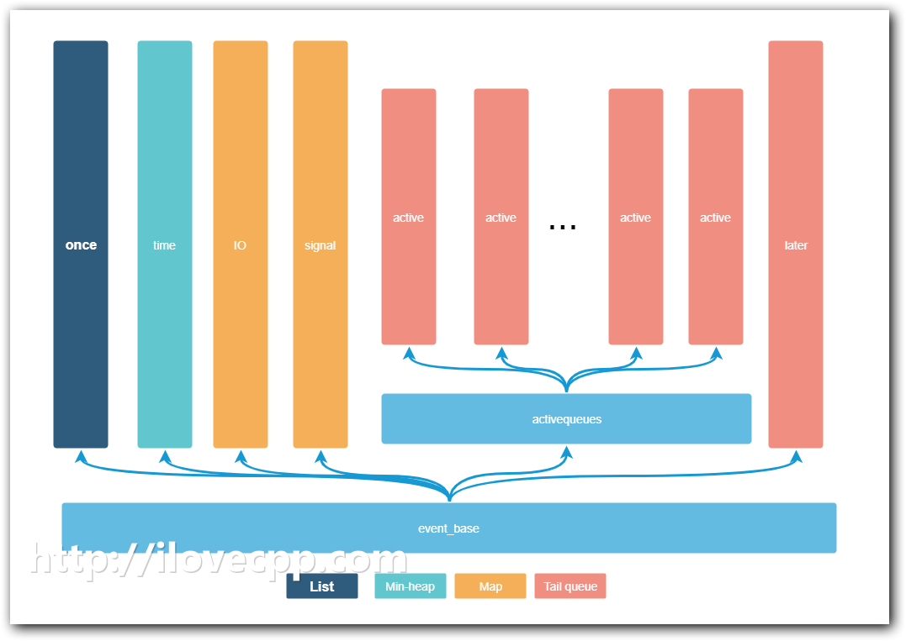

# 抽丝剥茧libevent——初始化event_base

> http://www.ilovecpp.com/2018/05/02/libevent-event-base/


event_base是libevent里另外一个核心的结构，它是存放各种事件集的容器，同时也是libevent事件循环(event loop)的主要结构。和event一样，它也是不透明结构。

每个libevent程序都必须创建至少一个event_base结构。如果需要多个线程监听I/O的话，需要为每个线程分配一个event_base(推荐的做法是[one loop per thread](https://www.zhihu.com/question/53595630))。

本文可能不会详尽event_base每个字段含义，libevent盘根错节，先抽取出一条主线，逐渐深入每一处细节。

# event_base结构

尽管event_base结构libevent的源码里其实已经为每个字段都作了注释，这里我还是再解释一下：

```
struct event_base {
    //libevent 选用的后端多路复用模型，关于选用的规则"通用编程技法"一章已经有描述了
    const struct eventop *evsel;
    //保存后端多路复用模型需要的信息
    void *evbase;

    //用来减少修改事件带来的系统调用
    struct event_changelist changelist;

    //后端的处理信号的方法，以及所需要的信息
    const struct eventop *evsigsel;
    struct evsig_info sig;

    //虚拟事件，最大虚拟事件数
    int virtual_event_count;
    int virtual_event_count_max;

    //event_base里边事件的总数,最大个数
    int event_count;
    int event_count_max;

    //event_base 里激活事件的总数，最大数
    int event_count_active;
    int event_count_active_max;

    //用来控制事件循环的几个标志
    int event_gotterm;
    int event_break;
    int event_continue;

    //当前正在处理的事件的优先级
    int event_running_priority;

    //标记当前是否处于事件循环中
    int running_loop;

    //延迟回到事件的个数,用来防止"饥饿现象"
    //剖析bufferevent的时候，再分析
    int n_deferreds_queued;

    //激活事件队列的数组，包含优先级
    struct evcallback_list *activequeues;
    //激活事件队列的个数
    int nactivequeues;
    //延迟回调事件队列
    struct evcallback_list active_later_queue;

    //超时处理的几个数据结构，后面剖析超时管理的时候再分析
    struct common_timeout_list **common_timeout_queues;
    int n_common_timeouts;
    int n_common_timeouts_allocated;

    //管理未决的IO事件的数据结构（WIN32上市hash，linux上是数组）
    struct event_io_map io;

    //管理信号事件的数组
    struct event_signal_map sigmap;

    //最小堆，用来管理超时
    struct min_heap timeheap;

    //时间的缓存
    struct timeval tv_cache;

    //系统
    struct evutil_monotonic_timer monotonic_timer;
    struct timeval tv_clock_diff;
    time_t last_updated_clock_diff;

    //多线程支持的所需要的一些保证线程安全的结构
#ifndef EVENT__DISABLE_THREAD_SUPPORT
    unsigned long th_owner_id;
    void *th_base_lock;
    void *current_event_cond;
    int current_event_waiters;
#endif

    //当前正在处理的事件回调函数
    struct event_callback *current_event;


#ifdef _WIN32
    // iocp结构，windows上的多路复用，忽略
    struct event_iocp_port *iocp;
#endif

    // event_base 配置信息
    enum event_base_config_flag flags;

    //处理激活事件回调的时候，需要的信息，包括处理的最长时间，最多一次处理多少个回调，优先级的边界
    struct timeval max_dispatch_time;
    int max_dispatch_callbacks;
    int limit_callbacks_after_prio;

    //用于通知主线程的几个数据结构
    int is_notify_pending;
    evutil_socket_t th_notify_fd[2];
    struct event th_notify;
    int (*th_notify_fn)(struct event_base *base);

    //随机数的种子
    struct evutil_weakrand_state weakrand_seed;

    //保存一次性事件的列表
    LIST_HEAD(once_event_list, event_once) once_events;

};
```

# event_base初始化流程

和`event`初始化过程类似，通过`event_base_new()`或者`event_base_new_with_config()`可以初始化一个event_base。相对地，通过`event_base_free()`函数释放event_base。

从命名就可以看出来event_base_new()和event_base_new_with_config()的区别是后者允许你初始化的时候给event_base配置参数。

为了节约篇幅，初始化的过程就不贴出来了，主要干了这5件事情：

1. 分配event_base的空间
2. 选择后端的多路复用方法
3. 初始化管理事件集以及事件回调函数的各种容器
4. 根据config标志，设置event_base
5. 初始化多线程相关的数据结构

分配内存和设置event_base没什么好说的，多线程这块后边的章节再单独细说。下面重点分析2-4的流程。

# 选用后端多路复用方法

在[通用编程技法](http://www.ilovecpp.com/2018/04/20/lievent-trick/)一节，提到了event_base选择后端多路复用方法的过程。通常linux都提供了epoll,poll,select多路复用接口，因而全局变量`eventops`(event.c文件里)数组的取值是这样的:

```
static const struct eventop *eventops[] = {
    &epollops,
    &pollops,
    &selectops,
    NULL
};
```

根据event_base_new_with_config的逻辑，数组的下标越小，优先级越高：

```
struct event_base* event_base_new_with_config(const struct event_config *cfg)
{
    ...
    for (i = 0; eventops[i] && !base->evbase; i++)
    {
        ...
        base->evsel = eventops[i];
        base->evbase = base->evsel->init(base);
    }
    ...
}
```

以Linux平台为例，最终base->evsel初始化的值是epollops,也就是说默认情况下使用epoll作为后端：

```
const struct eventop epollops = {
    "epoll",
    epoll_init,
    epoll_nochangelist_add,
    epoll_nochangelist_del,
    epoll_dispatch,
    epoll_dealloc,
    1, /* need reinit */
    EV_FEATURE_ET|EV_FEATURE_O1|EV_FEATURE_EARLY_CLOSE,
    0
};
```

# 初始化后端的多路复用方法

确定了后端方法后，紧接着会调用base->evsel->init(epoll_init)对其初始化,并将其所需要的信息交给event_base保存:

```
static void* epoll_init(struct event_base *base)
{
    int epfd = -1;
    struct epollop *epollop;

#ifdef EVENT__HAVE_EPOLL_CREATE1
    /* First, try the shiny new epoll_create1 interface, if we have it. */
    epfd = epoll_create1(EPOLL_CLOEXEC);
#endif
    if (epfd == -1) {
        /* Initialize the kernel queue using the old interface.  (The
        size field is ignored   since 2.6.8.) */
        if ((epfd = epoll_create(32000)) == -1) {
            if (errno != ENOSYS)
                event_warn("epoll_create");
            return (NULL);
        }
        evutil_make_socket_closeonexec(epfd);
    }
    ...
    epollop->epfd = epfd;

    if ((base->flags & EVENT_BASE_FLAG_EPOLL_USE_CHANGELIST) != 0 ||
        ((base->flags & EVENT_BASE_FLAG_IGNORE_ENV) == 0 &&
        evutil_getenv_("EVENT_EPOLL_USE_CHANGELIST") != NULL)) {

        base->evsel = &epollops_changelist;
    }

    ...
    return (epollop);
}
```

epoll_init主要干了两件事儿：

1. 封装epoll_create(1)函数，创建了epoll实例
2. 如果配置了changlist，就将后端的方法替换为epollops_changelist

与epollops相比epollops_changelist，只有2个函数指针不同，分别是event_changelist_add_和event_changelist_del_：

```
static const struct eventop epollops_changelist = {
    "epoll (with changelist)",
    epoll_init,
    event_changelist_add_,
    event_changelist_del_,
    epoll_dispatch,
    epoll_dealloc,
    1, /* need reinit */
    EV_FEATURE_ET|EV_FEATURE_O1| EARLY_CLOSE_IF_HAVE_RDHUP,
    EVENT_CHANGELIST_FDINFO_SIZE
};
```

changelist是libevent2重要的一项feature，主要用于提高性能减少系统调用，后边会单独用一章详细介绍。

# 初始化事件集容器

event_base初始化的另外一项工作是对保存事件以及事件回调函数函数的容器的初始化。我这里将这些容器用图表示了出来：



下面的表描述了这些容器的类型以及作用，

| 字段               | 类型       | 作用                                                         |
| :----------------- | :--------- | :----------------------------------------------------------- |
| once_events        | list       | 保存一次性事件                                               |
| timeheap           | minheap    | 保存超时时间                                                 |
| sigmap             | hashmap    | 保存信号事件(数组实现)                                       |
| io                 | hashmap    | 保存I/O事件 (Linux的fd是连续的数字，和sigmap用了数组实现，widnows的文件句柄不是连续的数字，没用数组实现) |
| activequeues       | array      | 数组的每个元素是回到函数的链表(`struct evcallback_list`)，数组的作用是为了体现优先级，数组的下标越小，回调函数链表的优先级越高，也就越早会被调用 |
| active_later_queue | tail queue | 保存被延迟回调(deferred callbacks)的事件回调函数             |

# 总结

不知不觉篇幅已经这么长了，才整理了event_base初始化过程，到下一章将详细介绍它是如何发挥作用的。
