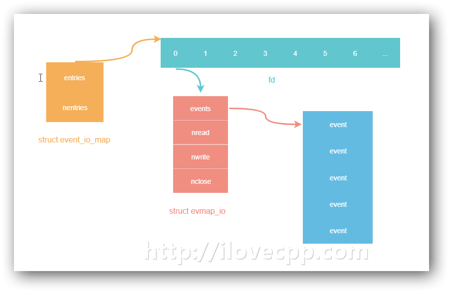
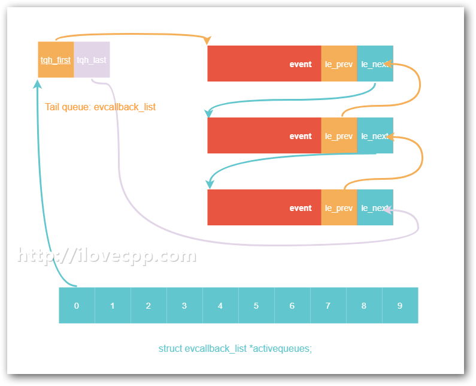

# 抽丝剥茧libevent——事件处理框架

> Source: http://www.ilovecpp.com/2018/05/06/libevent-event-processing/


我们已经大致知道event_base的初始化过程，上一节的最后给出了一张event_base中管理的各种数据结构的图示。本节就是要探究event_base是如何利用这些结构处理事件的。

# I/O事件管理

首先前面提到event_base成员`struct event_io_map io`是一个用数组实现的hashmap，用来保存未决的I/O事件(`struct event_signal_map`同样，用来保存signal事件)。



libevent通过evmap_io_add_/evmap_io_del_函数往该hashmap里调加/删除event。以evmap_io_add_为例：

```
//将fd对应的I/O事件ev添加到event_base上
int evmap_io_add_(struct event_base *base, evutil_socket_t fd, struct event *ev)
{
    const struct eventop *evsel = base->evsel;
    struct event_io_map *io = &base->io;
    struct evmap_io *ctx = NULL;
    int nread, nwrite, nclose, retval = 0;
    short res = 0, old = 0;
    struct event *old_ev;

    EVUTIL_ASSERT(fd == ev->ev_fd);

    if (fd < 0)
        return 0;

    //获取fd对应的struct event_io结构
    //对应于上图里的粉色部分
    GET_IO_SLOT_AND_CTOR(ctx, io, fd, evmap_io, evmap_io_init,
                         evsel->fdinfo_len);

    nread = ctx->nread;
    nwrite = ctx->nwrite;
    nclose = ctx->nclose;

    //记录该fd之前是否有对应的各个事件
    if (nread)
        old |= EV_READ;
    if (nwrite)
        old |= EV_WRITE;
    if (nclose)
        old |= EV_CLOSED;

    //更新记录的各个事件个数
    if (ev->ev_events & EV_READ) {
        if (++nread == 1)
            res |= EV_READ;
    }
    if (ev->ev_events & EV_WRITE) {
        if (++nwrite == 1)
            res |= EV_WRITE;
    }
    if (ev->ev_events & EV_CLOSED) {
        if (++nclose == 1)
            res |= EV_CLOSED;
    }
    if (EVUTIL_UNLIKELY(nread > 0xffff || nwrite > 0xffff || nclose > 0xffff)) {
        event_warnx("Too many events reading or writing on fd %d",
            (int)fd);
        return -1;
    }
    if (EVENT_DEBUG_MODE_IS_ON() &&
        (old_ev = LIST_FIRST(&ctx->events)) &&
        (old_ev->ev_events&EV_ET) != (ev->ev_events&EV_ET)) {
        event_warnx("Tried to mix edge-triggered and non-edge-triggered"
            " events on fd %d", (int)fd);
        return -1;
    }

    if (res) {
        void *extra = ((char*)ctx) + sizeof(struct evmap_io);
        /* XXX(niels): we cannot mix edge-triggered and
         * level-triggered, we should probably assert on
         * this. */

        //添加到后端的IO多路复用结构里
        //最终会调用epoll_ctl，见"初始化event_base"一章的第一个堆栈
        if (evsel->add(base, ev->ev_fd,
            old, (ev->ev_events & EV_ET) | res, extra) == -1)
            return (-1);
        retval = 1;
    }

    ctx->nread = (ev_uint16_t) nread;
    ctx->nwrite = (ev_uint16_t) nwrite;
    ctx->nclose = (ev_uint16_t) nclose;

    //将事件挂到struct event_io的events链表上
    //上图里蓝色的部分
    LIST_INSERT_HEAD(&ctx->events, ev, ev_io_next);

    return (retval);
}
```

也就是说使用libevent时，对新建的I/O事件调用event_add后，首先会将这个事件添加到event_io_map这样的hashmap里，然后才会将对应的文件描述符添加到后端的多路复用方法epoll之中。

# 信号和定时器管理

对于一个网络库而言，除了I/O事件之外还要处理signal事件以及timer事件。其中signal事件和I/O事件采用的管理容器基本一致，都是用的hashmap，上图里的`fd`替换为`signal value`即为event_signal_map的示意图。

timer事件采用的是一个`最小堆`的结构存储，并且巧妙的将其转化为I/O事件统一在epoll处理了。

更新：最近我更新的两个博文说明了eventloop中是如何处理信号和定时器的，链接分别是：[Effective epoll](http://www.ilovecpp.com/2019/01/20/effective-epoll/)和[Linux下定时器的设计与实现](http://www.ilovecpp.com/2019/01/16/timer/)。

# 事件主循环

现在我们开始分析libevent里最重要的一个函数(没有之一)。前面”reactor模式”一章，已经用libevent-like风格简单封装了一个reactor模式的dispatcher——event_base_dispatch()函数。

```
struct epoll_event {
    uint32_t     events;    /* Epoll events */
    epoll_data_t data;      /* User data variable */
};
```

当时利用`struct epoll_event`的`data`域存放了文件描述符对应的事件回调函数的指针，当监控的事件发生时，再从epoll_event里取回并调用回调函数。在libevent里并不是这么做的：

```
int event_base_dispatch(struct event_base *event_base)
{
    return (event_base_loop(event_base, 0));
}

int event_base_loop(struct event_base *base, int flags)
{
    ...

    while (!done) {

        //如果当前event_base里有已经激活的事件
        //就将时间最小堆，堆顶的超时值取出来，作为下一轮后端方法dispatch的超时值
        //否则就将超时时间置为0，evsel->dispatch会立马超时返回，激活的事件得以处理
        tv_p = &tv;
        if (!N_ACTIVE_CALLBACKS(base) && !(flags & EVLOOP_NONBLOCK)) {
            timeout_next(base, &tv_p);
        } else {
            evutil_timerclear(&tv);
        }

        // 如果未设置EVLOOP_NO_EXIT_ON_EMPTY，event_base里没有事件
        // 会结束当前的dispatcher
        if (0==(flags&EVLOOP_NO_EXIT_ON_EMPTY) &&
            !event_haveevents(base) && !N_ACTIVE_CALLBACKS(base)) {
            event_debug(("%s: no events registered.", __func__));
            retval = 1;
            goto done;
        }

        //将延迟回调，放入激活的链表里，等待处理
        event_queue_make_later_events_active(base);

        clear_time_cache(base);

        //最关键的步骤：调用后端的epoll_dispatch函数，等待事件发生或者超时
        //并将激活的事件移到激活队列里边
        //也就是对epoll_wait的进一步封装，下一节分析
        res = evsel->dispatch(base, tv_p);

        if (res == -1) {
            event_debug(("%s: dispatch returned unsuccessfully.",
                __func__));
            retval = -1;
            goto done;
        }

        update_time_cache(base);

        //处理超时
        timeout_process(base);

        //处理激活事件
        if (N_ACTIVE_CALLBACKS(base)) {
            int n = event_process_active(base);
            if ((flags & EVLOOP_ONCE)
                && N_ACTIVE_CALLBACKS(base) == 0
                && n != 0)
                done = 1;
        } else if (flags & EVLOOP_NONBLOCK)
            done = 1;
    }
    ...
}
```

总结一下，它主要工作流程大体上是这样的：

1. 设置超时时间
2. 开始epoll_dispatch（对epoll_wait的封装）
3. 处理超时事件
4. 处理激活的I/O事件

# 标记激活事件

再来分析一下event_base_dispatch()里的`evsel->dispatch(base, tv_p);`是如何标记激活的事件的，看epoll_dispatch()这个函数。

```
//主要是对epoll_wait的封装
//在其返回后，将epoll上发生的事件激活
static int epoll_dispatch(struct event_base *base, struct timeval *tv)
{
    ...
    res = epoll_wait(epollop->epfd, events, epollop->nevents, timeout);
    ...

    for (i = 0; i < res; i++) {
        int what = events[i].events;
        short ev = 0;
        ...
        //将事件激活
        evmap_io_active_(base, events[i].data.fd, ev | EV_ET);
    }

    ...
    return (0);
}

//激活所有fd对应的事件(注意：多次event_add后，可能会有多个对应的event)
void evmap_io_active_(struct event_base *base, evutil_socket_t fd, short events)
{
    struct event_io_map *io = &base->io;
    struct evmap_io *ctx;
    struct event *ev;

    //回到最上边的图示
    //这步的作用就是将fd对应的struct event_io结构取出(粉红色部分)
    //赋值给ctx
    GET_IO_SLOT(ctx, io, fd, evmap_io);

    if (NULL == ctx)
        return;
    LIST_FOREACH(ev, &ctx->events, ev_io_next) {
        if (ev->ev_events & events)
            event_active_nolock_(ev, ev->ev_events & events, 1);
    }
}

//激活单个事件
void event_active_nolock_(struct event *ev, int res, short ncalls)
{
    ...

    //event_process_active处理激活事件时会用到base->event_continue这个标志
    if (ev->ev_pri < base->event_running_priority)
        base->event_continue = 1;

    //取出事件里对应的回到函数
    //并将其激活
    event_callback_activate_nolock_(base, event_to_event_callback(ev));
}

//激活事件的回调函数
int event_callback_activate_nolock_(struct event_base *base,
    struct event_callback *evcb)
{
    ...
    event_queue_insert_active(base, evcb);
    ...
}

//将回到函数插入到，带有优先级的激活回调函数连表里
static void event_queue_insert_active(struct event_base *base, struct event_callback *evcb)
{
    ...
    //更新激活事件数量
    base->event_count_active++;
    MAX_EVENT_COUNT(base->event_count_active_max, base->event_count_active);
    EVUTIL_ASSERT(evcb->evcb_pri < base->nactivequeues);

    //将回到函数插入到带有优先级的激活回调函数连表里
    TAILQ_INSERT_TAIL(&base->activequeues[evcb->evcb_pri],
        evcb, evcb_active_next);
}
```

标记激活事件的步骤相对来说还是比较麻烦的，主要流程归纳如下：

1. epoll_wait返回，拿到活动的fd
2. 取出fd对应的所有的event，可能不止一个，循环以下步骤。
3. 将事件对应的回调函数取出
4. 将回调函数插入到对应优先级的链表上

# 事件优先级

libevent的事件是支持优先级的，优先级越高的事件越先被处理。



event_base中`activequeues`是一个数组，数组的每一个元素是一个`struct evcallback_list*`指针，数组下标表示优先级，下标越小，优先级越高。

初始化事件时，如果不显示指定事件的优先级，会默认被指为优先级总数的一半。

# 处理激活事件

再回来看event_base_loop主循环的最后一部分，调用了`event_process_active()`处理激活事件。

处理事件的时候，会用到event_base里有三个成员，它们分别是：

```
struct event_base
{
    struct timeval max_dispatch_time; //处理的最长时间
    int max_dispatch_callbacks;       //每次最多处理多少个回到函数
    int limit_callbacks_after_prio;   //优先级的边界
};
```

默认情况下，它们的值分别是：

```
struct event_config* event_config_new(void)
{
    struct event_config *cfg = mm_calloc(1, sizeof(*cfg));

    if (cfg == NULL)
        return (NULL);

    TAILQ_INIT(&cfg->entries);
    cfg->max_dispatch_interval.tv_sec = -1;
    cfg->max_dispatch_callbacks = INT_MAX;
    cfg->limit_callbacks_after_prio = 1;

    return (cfg);
}
```

有了这三个标志位位，现在就可以处理所有激活的回调函数了。

```
static int event_process_active(struct event_base *base)
{
    ...

    //设置本次处理结束的超时的时间
    if (base->max_dispatch_time.tv_sec >= 0) {
        update_time_cache(base);
        gettime(base, &tv);
        evutil_timeradd(&base->max_dispatch_time, &tv, &tv);
        endtime = &tv;
    } else {
        endtime = NULL;
    }

    for (i = 0; i < base->nactivequeues; ++i) {

        //遍历每种优先级的struct evcallback_list*队列

        if (TAILQ_FIRST(&base->activequeues[i]) != NULL) {
            //标记event_base正在处理的事件的优先级
            base->event_running_priority = i;

            activeq = &base->activequeues[i];

            //对于小于limit_after_prio数值的优先级队列(优先级高的)
            //要确保全部处理完毕
            if (i < limit_after_prio)
                c = event_process_active_single_queue(base, activeq,
                    INT_MAX, NULL);

            //对于大于limit_after_prio数值的优先级队列(优先级低的)
            //只能保证尽量处理，处理不完的下次处理
            //因为默认情况下max_dispatch_callbacks等于INT_MAX，
            //max_dispatch_interval等于-1
            //因此这部分默认也是会全部处理

            else
                c = event_process_active_single_queue(base, activeq,
                    maxcb, endtime);
            if (c < 0) {
                goto done;
            } else if (c > 0)
                break; /* Processed a real event; do not
                    * consider lower-priority events */
            /* If we get here, all of the events we processed
             * were internal.  Continue. */
        }
    }

done:
    //更新标志，表示现在不处理回调函数了
    base->event_running_priority = -1;

    return c;
}
```

至于`event_process_active_single_queue`就不继续往下跟了，就是调用回调函数，并将其从队列里移除。

处理激活事件的大致流程总结：

1. 设置超时时间
2. 遍历每一个优先级的队列
3. 优先级数值小于 limit_after_prio 的，确保全部处理完毕
4. 优先级数值大于 limit_after_prio 的，尽量的多处理，不一定能够全部处理掉，处理不完的下一轮dispatch中再处理

默认情况下，libevent会确保所有的事件都会得到处理，然后如果你配置了这个三个事件处理的标志位后，就要当心了，因为这里存在一种饥饿（Starvation）的可能，低优先级事件过多的时候(数值大于limit_after_prio)，最低等级的事件的回调函数可能永远也不会被调用。

# 总结

到这里 event_base,event结构，reactor模式，以及事件处理流程已经都分析完毕了，它们是libevent的最基础的原理。后边的章节将会介绍libevent的一些高级功能。
