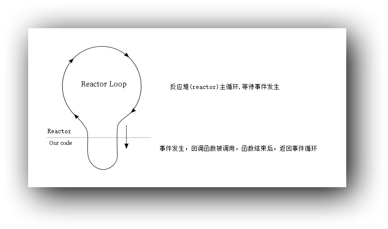
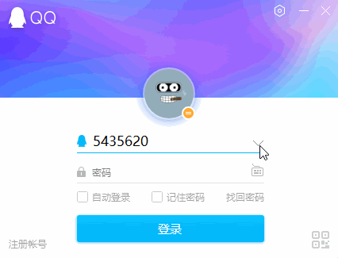

# 抽丝剥茧libevent——reactor模式

> http://www.ilovecpp.com/2018/04/26/libevent-reactor/


现代网络库通常基于reactor模式或者proactor模式。使用这两种模式，可以将具体业务从网络框架中分离出去，从而降低耦合。 这两者的基本概念是：[如何深刻理解reactor和proactor？](https://www.zhihu.com/question/26943938)。

由于Linux缺少完备的系统异步I/O支持，proactor模式在LInux上玩不转。Windows上的IOCP通常可以用来实现proactor。

libevent采用的是reactor模式。


# Reactor

Reactor早在1995年的时候就被Jim Coplien 和 Douglas C. Schmidt提出。它是一种设计模式，用于处理多个传递给服务处理程序的服务请求（Resources），把这些服务请求分解（Synchronous Event Demultiplexer），并且通过调度器（Dispatcher）将这些请求派发给关联的处理程序（Request Handler）。如果深入了解其语义、使用场景以及优缺点可以参阅这篇论文，http://www.dre.vanderbilt.edu/~schmidt/PDF/reactor-siemens.pdf。

上边提到的四个英文名词，正是是构成了一个reactor的主要部件，其作用分别如下：

| 部件                            | 作用                                                      |
| :------------------------------ | :-------------------------------------------------------- |
| Resources                       | 发生事件的资源，如文件描述符                              |
| Synchronous Event Demultiplexer | 将同步的事件多路分解，select,poll,epoll等就是充当这个角色 |
| Dispatcher                      | 将产生I/O事件的资源派发给对应的处理程序                   |
| Request Handler                 | 资源对应的处理程序(回调函数)                              |

一个完整的Reactor只需把这四个部件实现出来即可，后面的章节我们将逐一实现。

# Reactor事件流

reactor是一种基于事件驱动的设计模式。所谓事件驱动，简单来说就是产生什么事件，就会执行什么回调函数。一个reactor的事件流是这样的，图片修改自python中事件驱动库——[Twisted](https://twistedmatrix.com/trac/wiki)：



主要有这几个步骤：

1. 注册事件
2. 将事件加入reactor
3. 开始事件循环（下图虚线以上部分）
4. 事件发生，调用回调函数,回到(3) （下图虚线以下部分）
5. 回调函数中，可能会动态添加、删除事件，回到(1)开始

libevent主要的内容就是实现了上图中虚线以上的部分，使用libevent时，我们主要工作就是实现虚线以下的业务。

有了以上内容铺垫，下面将开始实现一个完整的libevent-like风格的reactor。
对于Synchronous Event Demultiplexer Linux上已经有了epoll，不需要额外添加。下面就先从Dispatcher着手。要实现Dispatcher得理解事件循环的概念，为了便于理解，不妨看看Windows上的消息循环。如果你之前并未接触过windows GUI编程，也不必担心，这非常容易。

# Windows消息循环

先来看一张动图：



我点击了一下向下的箭头按钮，然后QQ号码的列表就显示出来了，这样的过程就是事件驱动的。点击鼠标是一个事件，事件发生后，QQ号码列表才会被弹出。在这个过程中，鼠标的按下和弹起，windows通常会产生`WM_LBUTTONDOWN`和`WM_LBUTTONUP`对应的两个消息发往对应的窗体程序。窗体程序如果事先绑定了按钮被点击的函数的话，这时这个函数就会被回调。

那么消息循环是如何实现的呢？基本上对于所有的Windows上的GUI程序，抽丝剥茧后(或者包含在第三方的UI库中)都能找到这样的消息循环的代码：

```
...
while (GetMessage(&msg, nullptr, 0, 0))
{
    if (!TranslateAccelerator(msg.hwnd, hAccelTable, &msg))
    {
        TranslateMessage(&msg);
        DispatchMessage(&msg);
    }
}
...
```

GetMessage的作用是不停的从调用线程的消息队列里获取消息，消息队列为空的时候会阻塞。DispatchMessage函数的作用是将消息发送给窗体程序对应的窗口过程函数，窗口过程函数会根据注册的消息，调用相应的回调函数。其他函数与本节主题无关，不多赘述，感兴趣的可以参考[MSDN](https://docs.microsoft.com/en-us/windows/desktop/winmsg/using-messages-and-message-queues)。

以上代码本质上就是一个Dispatcher，只要用epoll相关的函数替换一下，就能为我们所用了。

# Dispatcher

GetMessage函数的特点和epoll_wait类似，都是从监控源中获取消息/事件，为空时会阻塞调用线程。Dispatcher中最关键的就是epoll_wait处理了。一个libevent-like风格的Dispatcher就可以实现成：

```
//event_base 这样"别扭"的封装是为了和libevent统一风格
struct event_base
{
    int epollfd;
};

void event_base_dispatch(struct event_base *base)
{
    for(;;)
    {
        int nfds = epoll_wait(base->epollfd, events, MAX_EVENTS, -1);
        if( xxx )
        {
            //callback;
        }

    }
}
```

这还不是一个完整的Dispatcher，callback这里的逻辑暂时被我省略了，因为到目前为止，还不知道如何去获取事件绑定的回调函数，在`事件处理`节，我们再来完善这部分代码。

# 事件

前面提到reactor是事件驱动的，事件是libevent基本操作的单位。一个事件应当至少包括这些元素：

1. 事件源
2. 事件类型
3. 事件的回调函数

因此可以这样封装事件：

```
typedef void (*callback)(int fd, int events, void *arg);

struct event
{
    int fd;                     //文件描述符
    short events;               //事件类型，EPOLLIN等
    void *arg;                  //传递给回调函数的额外参数
    callback cb;                //回调函数指针

    char *buf;                  //I/O缓冲区
    int bufsize;                //缓冲区大小

    struct event_base *base;
};
```

相应的，event_new表示创建一个事件，同时也是将事件与回调函数绑定的一个过程:

```
/*
 * base   event_base
 * fd     要绑定的文件描述符
 * events 事件类型
 * cb     回调函数
 * arg    传给回调函数的额外参数
 */

struct event *event_new(struct event_base *base, int fd, short events, callback cb, void *arg)
{
    struct event *ev = malloc(sizeof(struct event));
    if (!ev)
        return NULL;

    ev->fd = fd;
    ev->events = events;
    ev->cb = cb;
    ev->base = base;
    ev->arg = arg;
    ev->buf = malloc(BUF_SIZE);
    ev->bufsize = BUF_SIZE;
    bzero(ev->buf, BUF_SIZE);

    return ev;
}
```

# 添加、删除事件

有了struct event之后，现在需要将其添加到reactor的Dispatcher上(在我们的这里也就是epoll的监控列表里)。而`epoll_event`结构，极大的方便我们将`struct event`添加到epoll上。

```
typedef union epoll_data
{
    void        *ptr;
    int          fd;
    uint32_t     u32;
    uint64_t     u64;
} epoll_data_t;

struct epoll_event 
{
    uint32_t     events;      /* Epoll events */
    epoll_data_t data;        /* User data variable */
};
```

调用epoll_ctl的时候,只需将event指针赋给data域。这样一来事件的添加和上一章的epoll示例中，添加文件描述符并无太大差别。event_add函数表示上epoll添加监听事件：

```
void event_add(struct event *ev)
{
    struct epoll_event epollev;
    epollev.events = ev->events;
    epollev.data.ptr = ev;

    if (epoll_ctl(ev->base->epollfd, EPOLL_CTL_ADD, ev->fd, &epollev) == -1)
        onError("epoll_ctl add fd");
}
```

此外event_del、event_mod分别表示事件的删除和修改。限于篇幅不全部贴出，文末会给出完整的代码。

# 事件处理

再回过头看base_dispatch这个函数，前面省略了调用回调函数的相关代码。现在有了`struct event`我们就能写出相对完整的处理了。

```
void base_dispatch(struct event_base *base)
{
    int nfds;
    struct epoll_event events[MAX_EVENTS];

    for (;;)
    {
        int n = 0;
        nfds = epoll_wait(base->epollfd, events, MAX_EVENTS, -1);
        if (nfds == -1)
            exit(EXIT_FAILURE);

        for (n = 0; n < nfds; ++n)
        {
            struct epoll_event epollev = events[n];
            struct event *ev = (struct event *)epollev.data.ptr;
            ev->cb(ev->fd, epollev.events, ev);
        }
    }
}
```

监听的事件发生后，再从`struct epoll_event`的data域中取出对应的`struct event`，调用绑定的回调函数。

# 完整的reactor

到现在为止，reactor所需要的四个部件，我们已经拥有了3个了：Resources(文件描述符)，Demultiplexer(epoll),Dispatcher。现在只剩一下一个Request Handler未实现，对于网络库而言，这部分应该是交给用户根据具体的业务而实现的。

利用上述已有的代码，我实现了一个简单的echo服务。recvdata从客户端读取内容存放到event的buf中，再利用senddata原封不动的发往客户端。完整代码在我的gist上:https://gist.github.com/baixiangcpp/be7872baa82d9b9c400b17a2b0fe5fe3。

# libevent中事件的处理

libevent事件处理远比我这里复杂的多，它并没有”粗暴”的将event的指针放到epoll_event中，而是利用了好链表、堆、哈希表等数据结构来维护。这么做的目的，我们将在后边的章节里，一一分析。
