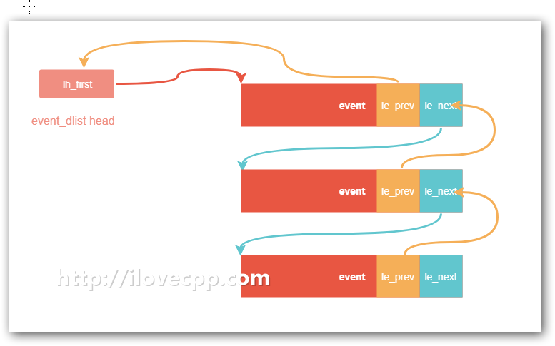

# 抽丝剥茧libevent——通用的编程技法

> Source: http://www.ilovecpp.com/2018/04/20/lievent-trick/


阅读libevent源码时，搞懂它的网络处理逻辑，应该是一件比较容易的事儿。但是我们不应该局限于此,深入每一处细节，体会作者的设计意图才是学习libevent的最佳”食用”方式。学习掌握这些开源库里边的通用编程技法，对提高我们的编程能力大有好处。

# 数据封装

libevent作为一个开源库，要尽量降低与库使用者的耦合度。这就要求库的模块设计要尽量少的暴露其实现细节，这也是我们在面向对象编程里经常提到的——数据封装。封装的最终目的是实现信息隐藏(Information Hiding)。

libevent是基于C语言的，在C语言中没有类(class)的概念，只有struct的概念。struct对数据成员的访问并没有如C++般精细的权限控制(public/private/protected)。所有的数据成员对外都是可见的，struct对数据的包装只能看作做”打包”而不是”封装”。

libevent大量的采用了不透明指针，来实现对数据的封装。对于库使用者libevent仅提供了`event.h`,在这个文件里边我们完全看不到event的内部细节,只能看到一个event结构的声明。

```
struct event
#ifdef EVENT_IN_DOXYGEN_
{/*Empty body so that doxygen will generate documentation here.*/}
#endif
;
```

event结构的完整定义放在了`event_struct.h`文件中。其中的数据成员，我们放到后边的博客里边再分析，这里仅作演示。作为库使用者而言，只能通过lievent提供的操作函数对event的数据成员进行访问。比如要计算struct event的大小，我们是不能直接进行sizeof操作的，如果你坚持这么做的话，编译器会立马罢工，给你返回一个：”invalid application of ‘sizeof’ to incomplete type ‘struct event’ “,只能通过库作者提供的`event_get_struct_event_size()`接口达到同样的目的。这样就对struct event实现了信息隐藏，达到了封装的效果。

指向这种看不到内部数据的结构体指针，有一个专业的术语——不透明指针(opaque pointer)。这种技术在设计模式中被称为`桥接模式`(Bridge pattern)，有时候也被称为”Pimpl技法”或者”编译防火墙”或者”D-Pointer”。

这样做还有一个好处就是二进制兼容。

# 二进制兼容

二进制兼容的意思就是，在升级库的时候不必重新编译使用了该库的软件。Qt在这方面做的就很出色,可以参阅Qt里边的`D-Pointer`技术https://wiki.qt.io/D-Pointer。

由于我们不直接依赖`struct event`的内部结构，如果新的版本中libevent往event的数据结构中新添加、修改了一个成员，event.h头文件并不需要跟着修改，那么我们仅仅需要替换掉libevent的动态库，而不需要重新编译整个的项目。

这部分就不展开讲了，因为网上有一篇陈硕的文章写的肯定会比我写的要清楚得多，原文在这里:https://blog.csdn.net/Solstice/article/details/6233478。

# 多态

你没有看错，多态并不是面向对象语言的专利。C++之父Bjarne Stroustrup曾经给多态下的定义是”providing a single interface to entities of different types”。根据这个定义，C语言也能模拟出”多态”的行为，即使libevent这里没有继承的关系。

多态可以分为子类型多态（Subtype polymorphism）和包含多态（inclusion polymorphism），严格来说我以为，我们模拟出来的多态应当属于包含多态。其实多态的类型还有很多：https://en.wikipedia.org/wiki/Polymorphism_(computer_science)，有兴趣可以深入探究。

C语言规定了在struct中只能定义变量，不可以定义函数。但是稍加变通，可以使用函数指针来代替。在C++中，是通过一个虚函数表(https://blog.csdn.net/haoel/article/details/1948051/) 实现函数的动态绑定的。我们只需要在C语言中模拟出一个”虚函数表”，来实现多态。libevent正是这么干的。

```
struct eventop {
    const char *name;

    void *(*init)(struct event_base *);

    int (*add)(struct event_base *, evutil_socket_t fd, short old, short events, void *fdinfo);

    int (*del)(struct event_base *, evutil_socket_t fd, short old, short events, void *fdinfo);

    int (*dispatch)(struct event_base *, struct timeval *);

    void (*dealloc)(struct event_base *);

    int need_reinit;

    enum event_method_feature features;

    size_t fdinfo_len;
};

struct event_base {
    /** Function pointers and other data to describe this event_base's
     * backend. */
    const struct eventop *evsel;

    ...
}
```

event_base中的第一个成员变量evsel，代表了libevent将要采用的多路复用后端。它是`const struct eventop *`,而`struct eventop`这个结构则包含了5个函数指针。每种多路复用机制都需要封装成这五个函数接口的形式，提供其初始化、释放以及对事件的注册、注销和分发。

`struct eventop`本质上可以看成一张”虚函数”表。

```
/* Array of backends in order of preference. */
static const struct eventop *eventops[] = {
#ifdef EVENT__HAVE_EVENT_PORTS
    &evportops,
#endif
#ifdef EVENT__HAVE_WORKING_KQUEUE
    &kqops,
#endif
#ifdef EVENT__HAVE_EPOLL
    &epollops,
#endif
#ifdef EVENT__HAVE_DEVPOLL
    &devpollops,
#endif
#ifdef EVENT__HAVE_POLL
    &pollops,
#endif
#ifdef EVENT__HAVE_SELECT
    &selectops,
#endif
#ifdef _WIN32
    &win32ops,
#endif
    NULL
};
```

eventops数组里存放的就是`struct eventop`所有可取的值。

```
struct event_base* event_base_new_with_config(const struct event_config *cfg)
{
    ...
    for (i = 0; eventops[i] && !base->evbase; i++) {
        ...

        base->evsel = eventops[i];

        base->evbase = base->evsel->init(base);
    }
    ...
}
```

event_base_new_with_config中将eventops数组内的值，动态的赋值给base->evsel。这样就实现了在不同的平台之上，将不同的多路复用后端赋给了evesl。因而evsel->init、evsel->dispatch等操作才会在不同的平台上，展现出不同的行为——多态。

此外即使经过预处理后，eventops数组的值只有一个，evsel的值也是运行期在event_base_new_with_config中才被确定的，依然是动态多态(dynamic polymorphism)。

# 不重复造轮子

C语言的标准库里并没有像C++中的STL，要使用`list`、`queue`等数据结构只能靠自己。libevent并没有重复造轮子，而是使用的glibc提供的list、tail queue等数据结构。Linux上这些数据结构都包含在头文件`/usr/include/sys/queue.h`中，操作都是通过宏函数实现的。因此要想复用这些数据结构仅仅需要拷贝一份头文件即可，libevent源码里的`.\compat\sys\queue.h`就是拷贝的glibc上的。

这些数据结构都是经受过时间的考验的，肯定比我们一般人实现出来的数据结构要稳定、高效得多。这些数据结构的用法，不多赘述了，Linux manual page上有非常详细的使用说明和example: http://man7.org/linux/man-pages/man3/queue.3.html。

除了是使用宏实现的意外，这些数据结构还有一个特点，prev使用的是`二级指针`。以List为例,libevent中是这样使用的:

```
#define LIST_HEAD(name, type)						\
struct name {								\
    struct type *lh_first;	/* first element */			\
}

#define LIST_HEAD_INITIALIZER(head)					\
    { NULL }

#define LIST_ENTRY(type)						\
struct {								\
    struct type *le_next;	/* next element */			\
    struct type **le_prev;	/* address of previous next element */	\
}

...

LIST_HEAD (event_dlist, event); 

struct event {

    union {
        struct {
            LIST_ENTRY (event) ev_io_next;
            struct timeval ev_timeout;
        } ev_io;

        /* used by signal events */
        struct {
            LIST_ENTRY (event) ev_signal_next;
            short ev_ncalls;
            /* Allows deletes in callback */
            short *ev_pncalls;
        } ev_signal;
    } ev_;

    ...
};
```

event_dlist表示一个event链表，示意图如下：



需要注意的是`le_prev`,它指向的不是前一个event节点，而是指向前一个event节点里的le_next指针的指针。这样做有一个好处，当删除一个event节点的时候，不需要判断le_prev指针是否为空，可以大胆的对其解引用，因为它不可能为空，即使它是list里第一个元素，le_prev指向了event_dlist里边的lh_fisrst。

`le_prev`这样的设计,正是Linus大神推崇的”core low-level coding”:https://coolshell.cn/articles/8990.html。

# 总结

以上是我在看libevent源码的时候总结的几个我们平常写代码时能够用得着的编程技法，当然libevent里边的技巧远不止于此。还有一些宏的使用技巧,为了防止走火入魔，我就不写出来了，我们凡人还是老老实实的写凡人的代码。
