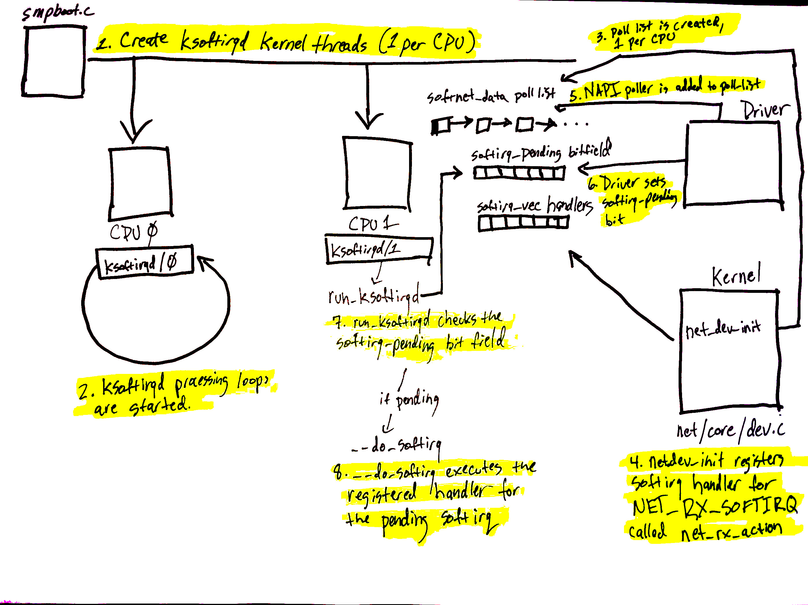
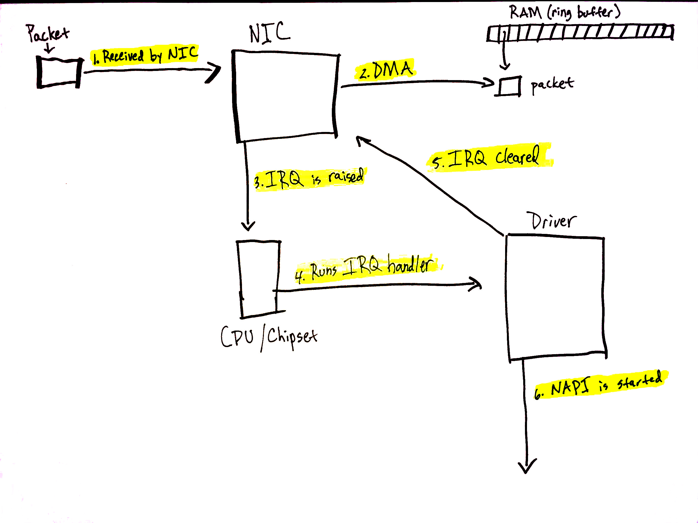
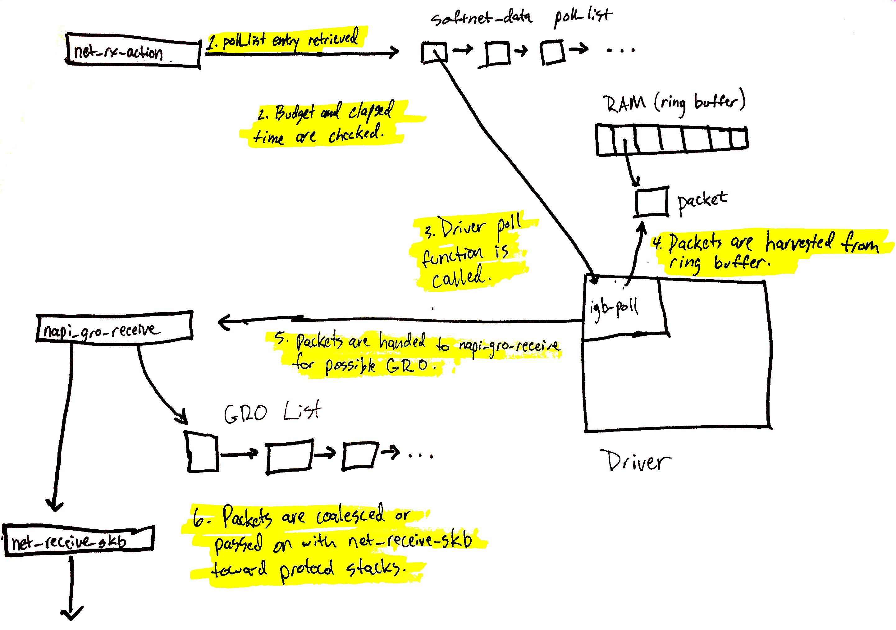
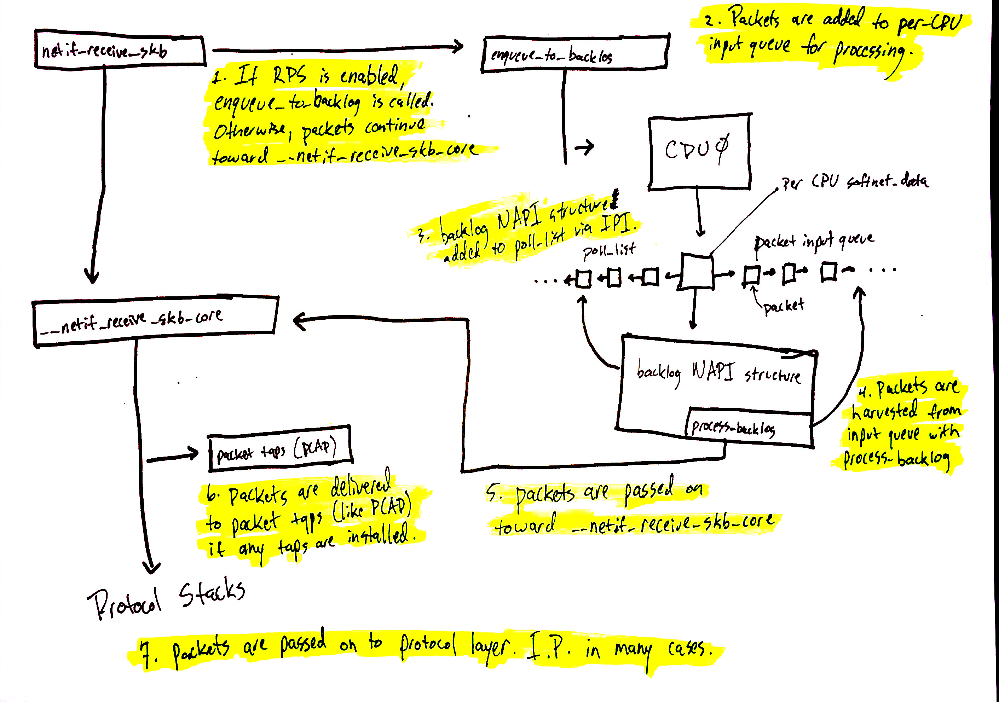

# Illustrated Guide to Monitoring and Tuning the Linux Networking Stack: Receiving Data

> https://blog.packagecloud.io/illustrated-guide-monitoring-tuning-linux-networking-stack-receiving-data/

## TL;DR

This blog post expands on our previous blog post [Monitoring and Tuning the Linux Networking Stack: Receiving Data](https://packagecloud.io/blog/monitoring-tuning-linux-networking-stack-receiving-data/) with a series of diagrams aimed to help readers form a more clear picture of how the Linux network stack works.

There are no shortcuts when it comes to monitoring or tuning the Linux network stack. Operators must strive to fully understand each of the various systems and their interactions if there is any hope to tune or optimize them. That said, the length of the previous blog post may have made it difficult for readers to conceptualize how the various systems interact. Hopefully, this blog post will help clear that up a bit.

## Getting started

These diagrams are intended to give an overview of how the Linux network stack works. As such, many details are excluded. In order to get the complete picture, readers are encouraged to read our blog post which covers every aspect of the network stack in detail: [Monitoring and Tuning the Linux Networking Stack: Receiving Data](https://packagecloud.io/blog/monitoring-tuning-linux-networking-stack-receiving-data/). The purpose of these drawings is to help readers form a mental model of how some of the systems in the kernel interact with each other at a high-level.

Let’s begin by taking a look at some important initial setup that is necessary before packet processing can be understood.

## Initial setup

Devices have many ways of alerting the rest of the computer system that some work is ready for processing. In the case of network devices, it is common for the NIC to raise an IRQ to signal that a packet has arrived and is ready to be processed. When an IRQ handler is executed by the Linux kernel, it runs at a very, very high priority and often blocks additional IRQs from being generated. As such, IRQ handlers in device drivers must execute as quickly as possible and defer all long running work to execute outside of this context. This is why the “`softIRQ`” system exists.

The “softIRQ” system in the Linux kernel is a system that kernel uses to process work outside of the device driver IRQ context. In the case of network devices, the softIRQ system is responsible for processing incoming packets. The softIRQ system is initialized early during the boot process of the kernel.

The diagram above corresponds to the [softIRQ section of our network blog post](https://packagecloud.io/blog/monitoring-tuning-linux-networking-stack-receiving-data/#softirqs) and shows the initializing of the softIRQ system and its per-CPU kernel threads.

The initialization of the softIRQ system is as follows:

1. softIRQ kernel threads are created (one per CPU) in `spawn_ksoftirqd` in [kernel/softirq.c](https://github.com/torvalds/linux/blob/v3.13/kernel/softirq.c#L743-L758) with a call to `smpboot_register_percpu_thread` from [kernel/smpboot.c](https://github.com/torvalds/linux/blob/v3.13/kernel/smpboot.c#L94-L163). As seen in the code, the function `run_ksoftirqd` is listed as `thread_fn`, which is the function that will be executed in a loop.
2. The ksoftirqd threads begin executing their processing loops in the `run_ksoftirqd` function.
3. Next, the [`softnet_data` structures are created, one per CPU](https://packagecloud.io/blog/monitoring-tuning-linux-networking-stack-receiving-data/#initialization-of-network-device-subsystem). These structures hold references to important data structures for processing network data. One we’ll see again is the `poll_list`. The `poll_list` is where NAPI poll worker structures will be added by calls to `napi_schedule` or other NAPI APIs from device drivers.
4. `net_dev_init` then registers the `NET_RX_SOFTIRQ` softirq with the softirq system by calling `open_softirq`, as [shown here](https://packagecloud.io/blog/monitoring-tuning-linux-networking-stack-receiving-data/#initialization-of-softirq-handlers). The handler function that is registered is called `net_rx_action`. This is the function the softirq kernel threads will execute to process packets.

Steps 5 - 8 on the diagram relate to the arrival of data for processing and will be mentioned in the next section. Read on for more!

## Data arrives

[Data arrives from the network!](https://packagecloud.io/blog/monitoring-tuning-linux-networking-stack-receiving-data/#data-arrives)

When network data arrives at a NIC, the NIC will use [DMA](https://en.wikipedia.org/wiki/Direct_memory_access) to write the packet data to RAM. In the case of the `igb` network driver, a ring buffer is setup in RAM that points to received packets. It is important to note that some NICs are “multiqueue” NICs, meaning that they can DMA incoming packets to one of many ring buffers in RAM. As we’ll see soon, such NICs are able to make use of multiple processors for processing incoming network data. [Read more about multiqueue NICs](https://packagecloud.io/blog/monitoring-tuning-linux-networking-stack-receiving-data/#preparing-to-receive-data-from-the-network). The diagram above shows just a single ring buffer for simplicity, but depending on the NIC you are using and your hardware settings you may have multiple queues on your system.

Read more detail about the process describe below [in this section of the networking blog post](https://packagecloud.io/blog/monitoring-tuning-linux-networking-stack-receiving-data/#data-arrives).

Let’s walk through the process of receiving data:

1. Data is received by the NIC from the network.
2. The NIC uses DMA to write the network data to RAM.
3. The NIC raises an IRQ.
4. The device driver’s [registered IRQ handler is executed](https://packagecloud.io/blog/monitoring-tuning-linux-networking-stack-receiving-data/#interrupt-handler).
5. The IRQ is cleared on the NIC, so that it can generate IRQs for new packet arrivals.
6. **NAPI softIRQ poll loop is started with [a call to `napi_schedule`](https://packagecloud.io/blog/monitoring-tuning-linux-networking-stack-receiving-data/#napi-and-napischedule).**

The call to `napi_schedule` triggers the start of steps 5 - 8 in the previous diagram. As we’ll see, the **NAPI softIRQ poll loop is started by simply flipping a bit in a bitfield and adding a structure to the `poll_list`** for processing. No other work is done by `napi_schedule` and this is precisely how a driver defers processing to the softIRQ system.

Continuing on to the diagram in the previous section, using the numbers found there:

5. The call to `napi_schedule` in the driver adds the driver's NAPI poll structure to the `poll_list` for the current CPU.
6. The softirq pending bit is set so that the `ksoftirqd` process on this CPU knows that there are packets to process.
7. `run_ksoftirqd` function (which is being run in a loop by the `ksoftirq` kernel thread) executes.
8. `__do_softirq` is called which [checks the pending bitfield](https://packagecloud.io/blog/monitoring-tuning-linux-networking-stack-receiving-data/#dosoftirq), sees that a softIRQ is pending, and calls the handler registered for the pending softIRQ: `net_rx_action` which does all the heavy lifting for incoming network data processing.

It is important to note that the softIRQ kernel thread is executing `net_rx_action`, not the device driver IRQ handler.

## Network data processing begins

Now, data processing begins. The `net_rx_action` function (called from the `ksoftirqd` kernel thread) will start to process any NAPI poll structures that have been added to the `poll_list` for the current CPU. Poll structures are added in two general cases:

- From device drivers with calls to `napi_schedule`.
- With an [Inter-processor Interrupt](https://en.wikipedia.org/wiki/Inter-processor_interrupt) in the case of [Receive Packet Steering](https://packagecloud.io/blog/monitoring-tuning-linux-networking-stack-receiving-data/#receive-packet-steering-rps). [Read more about how Receive Packet Steering uses IPIs to process packets](https://packagecloud.io/blog/monitoring-tuning-linux-networking-stack-receiving-data/#enqueuetobacklog).

We’re going to start by walking through what happens when a driver’s NAPI structure is retreived from the `poll_list`. (The next section how NAPI structures registered with IPIs for RPS work).

The diagram above is explained in depth [here](https://packagecloud.io/blog/monitoring-tuning-linux-networking-stack-receiving-data/#netrxaction-processing-loop)), but can be summarized as follows:

1. `net_rx_action` loop starts by checking the NAPI poll list for NAPI structures.
2. The `budget` and elapsed time [are checked](https://github.com/torvalds/linux/blob/v3.13/net/core/dev.c#L4300-L4309) to ensure that the softIRQ will not monopolize CPU time.
3. The registered [`poll` function is called](https://packagecloud.io/blog/monitoring-tuning-linux-networking-stack-receiving-data/#napi-poll-function-and-weight). In this case, the function `igb_poll` was registered by the `igb` driver.
4. The driver’s `poll` function [harvests packets from the ring buffer in RAM](https://packagecloud.io/blog/monitoring-tuning-linux-networking-stack-receiving-data/#napi-poll).
5. Packets are handed over to `napi_gro_receive`, which will deal with possible [Generic Receive Offloading](https://packagecloud.io/blog/monitoring-tuning-linux-networking-stack-receiving-data/#generic-receive-offloading-gro).
6. Packets are [either held for GRO](https://packagecloud.io/blog/monitoring-tuning-linux-networking-stack-receiving-data/#napigroreceive) and the call chain ends here or [packets are passed on](https://packagecloud.io/blog/monitoring-tuning-linux-networking-stack-receiving-data/#napiskbfinish) to `netif_receive_skb` to proceed up toward the protocol stacks.

We’ll see next how `netif_receive_skb` deals with Receive Packet steering to distribute the packet processing load amongst multiple CPUs.

## Network data processing continues

Network data processing continues from `netif_receive_skb`, but the path of the data depends on whether or not Receive Packet Steering (RPS) is enabled or not. An “out of the box” Linux kernel will not have RPS enabled by default and it will need to be explicitly enabled and configured if you want to use it.

[In the case where RPS is disabled](https://packagecloud.io/blog/monitoring-tuning-linux-networking-stack-receiving-data/#without-rps-default-setting), using the numbers in the above diagram:

1\. `netif_receive_skb` passes the data on to `__netif_receive_core`.
6\. `__netif_receive_core` [delivers data to any taps](https://packagecloud.io/blog/monitoring-tuning-linux-networking-stack-receiving-data/#packet-tap-delivery) (like [PCAP](http://www.tcpdump.org/manpages/pcap.3pcap.html)).
7\. `__netif_receive_core` [delivers data to registered protocol layer handlers](https://packagecloud.io/blog/monitoring-tuning-linux-networking-stack-receiving-data/#protocol-layer-delivery). In many cases, this would be the `ip_rcv` function that the IPv4 protocol stack has registered.

[In the case where RPS is enabled](https://packagecloud.io/blog/monitoring-tuning-linux-networking-stack-receiving-data/#with-rps-enabled):

1. `netif_receive_skb` [passes the data on to `enqueue_to_backlog`](https://packagecloud.io/blog/monitoring-tuning-linux-networking-stack-receiving-data/#enqueuetobacklog).
2. Packets are placed on a per-CPU input queue for processing.
3. The remote CPU’s NAPI structure is added to that CPU’s `poll_list` and an [IPI](https://packagecloud.io/blog/monitoring-tuning-linux-networking-stack-receiving-data/#enqueuetobacklog) is queued which will trigger the softIRQ kernel thread on the remote CPU to wake-up if it is not running already.
4. When the `ksoftirqd` kernel thread on the remote CPU runs, it follows the same pattern describe in the previous section, but this time, the registered `poll` function is [`process_backlog` which harvests packets from the current CPU’s input queue](https://packagecloud.io/blog/monitoring-tuning-linux-networking-stack-receiving-data/#processbacklog).
5. Packets are passed on toward `__netif_receive_skb_core`.
6. `__netif_receive_core` [delivers data to any taps](https://packagecloud.io/blog/monitoring-tuning-linux-networking-stack-receiving-data/#packet-tap-delivery) (like [PCAP](http://www.tcpdump.org/manpages/pcap.3pcap.html)).
7. `__netif_receive_core` [delivers data to registered protocol layer handlers](https://packagecloud.io/blog/monitoring-tuning-linux-networking-stack-receiving-data/#protocol-layer-delivery). In many cases, this would be the `ip_rcv` function that the IPv4 protocol stack has registered.

## Protocol stacks and userland sockets

Next up are the protocol stacks, netfilter, berkley packet filters, and finally the userland socket. This code path is long, but linear and relatively straightforward.

You can [continue following the detailed path for network data](https://packagecloud.io/blog/monitoring-tuning-linux-networking-stack-receiving-data/#protocol-layer-registration). A very brief, high level summary of the path is:

1. Packets are received by the IPv4 protocol layer with `ip_rcv`.
2. Netfilter and a routing optimization are performed.
3. Data destined for the current system is delivered to higher-level protocol layers, like UDP.
4. Packets are received by the UDP protocol layer with `udp_rcv` and are queued to the receive buffer of a userland socket by `udp_queue_rcv_skb` and `sock_queue_rcv`. Prior to queuing to the receive buffer, berkeley packet filters are processed.

Note that netfilter is consulted multiple times throughout this process. The exact locations can be [found in our detailed walk-through](https://packagecloud.io/blog/monitoring-tuning-linux-networking-stack-receiving-data/#protocol-layer-registration).

## Conclusion

The Linux network stack is incredibly complex and has many different systems interacting together. Any effort to tune or monitor these complex systems must strive to understand the interation between all of them and how changing settings in one system will affect others.

This (poorly) illustrated blog post attempts to make our [longer blog post](https://packagecloud.io/blog/monitoring-tuning-linux-networking-stack-receiving-data/) more manageable and easy to understand.
