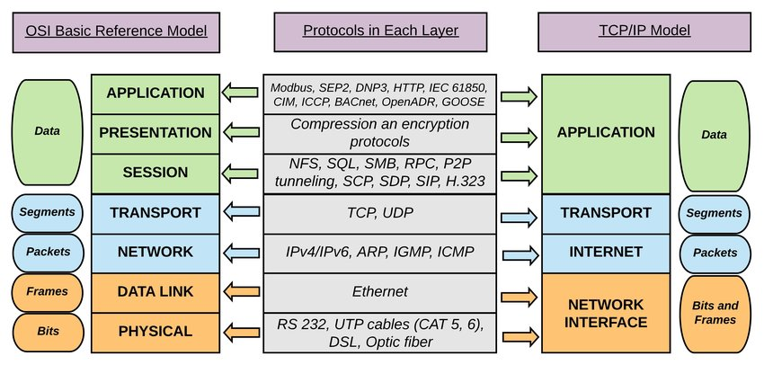
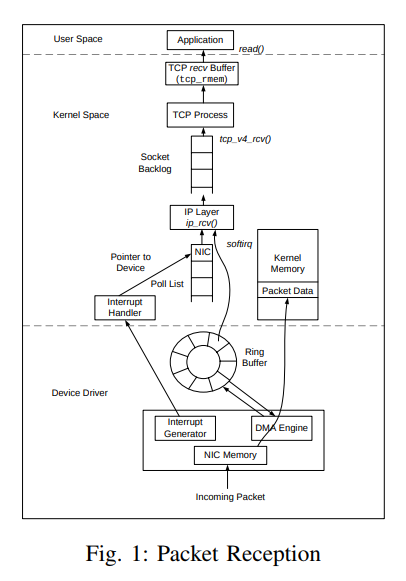
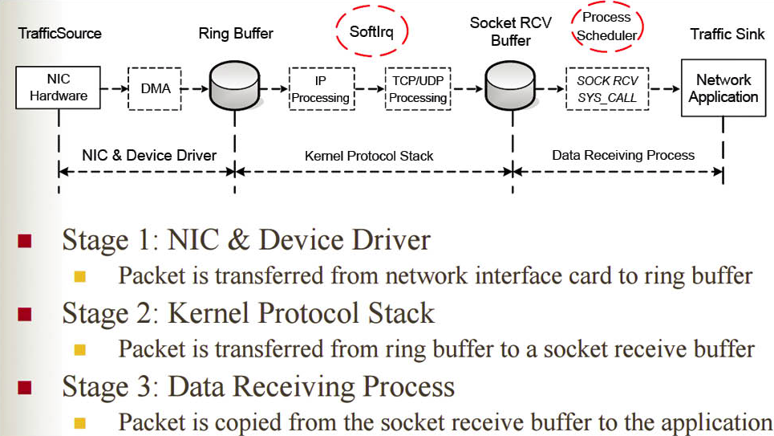

# 网络包的内核漂流记 Part 1 - 图解网络包接收流程

注，原文来自 https://blog.mygraphql.com/zh/notes/low-tec/network/kernel-net-stack/ 。如你看到的转载图片不清，请回到原文。

## 《网络包的内核漂流记》系列介绍

大家知道，网络数据来源于网线、光纤、无线电波上的比特(bit)，然后到网卡，到内核，最后到应用进程 socket。事情好像很简单。但如果是 SRE/DevOps 或是 Performance Engineer ，需要做细致的监控和优化时，这些显然是不够的。引用本文主要参考作者的原话：
> Optimizing and monitoring the network stack is impossible unless you carefully read and understand how it works. You cannot monitor code you don’t understand at a deep level.
> 除非您仔细阅读并了解其工作原理，否则无法优化和监控网络堆栈。 您无法深入监控您不理解的代码。
> —— [Joe Damato](https://blog.packagecloud.io/monitoring-tuning-linux-networking-stack-receiving-data/)

《网络包的内核漂流记》尝试分析和跟踪一个网络包在内核各子系统间的流转和触发的协作。

开始前先做个预告，《网络包的内核漂流记》 系统包括：
- Part 1: 图解网络包接收流程(本文)
- Part 2: [BPF 跟踪 epoll/Envoy 事件与调度](https://blog.mygraphql.com/zh/notes/low-tec/network/bpf-trace-net-stack/ )
  - 我将演示如何用 bpftrace 踪网络包的内核漂流。

为免吓跑人，还是老套路，多图少代码。不过有的图有点点复杂。🚜

本文主要参考：[Monitoring and Tuning the Linux Networking Stack: Receiving Data](https://blog.packagecloud.io/monitoring-tuning-linux-networking-stack-receiving-data/) 。是的，这是篇被转载、参考到泛滥的文章。几乎你能在网上找到的所有讲 Linux 网卡和网络栈收发的文章，都会参考它。但有句话是：

> 一千个人眼中就有一千个 “哈姆雷特”。  —— 无名高人

### 风格、样式、本文的交互阅读方式 📖

虽然不是写书，不过还是说明一下吧：

1. 我不打算像八股文的 Linux 内核文章一样，贴一堆源码，让文章看起来内容很丰满但无趣。我用交互 SVG 图片的的方法去引用源码 😎 。
2. https://blog.mygraphql.com/zh/notes/low-tec/network/kernel-net-stack/ 的原文是 SVG 图片。如果你是在其它地方看到本文，请转回原文。
3. 正确浏览 SVG 图片的姿势是浏览器中图片处右键，选择 “新 Tab 中打开图片” 。
4. **SVG 图片可以点击链接，直接跳转到相应内核源码网页，精确到源码行。** 是的，你不需要 git clone那大陀源码 🤠 ，只需要一个浏览器就可以。如果你在电脑前开双屏，结合源码和图看，相信我，内核源码不是什么天书，你能看懂大部分的。
5. 浏览内核源码我用 https://elixir.bootlin.com/linux/v5.4/source 。这个是很好的内核源码浏览网站，内置源码引用跳转和搜索功能。

## ISO 网络模型

我并不太学院派，但回顾一下基础知识还是必须的：

*图：OSI 基本参考模型和 TCP/IP 堆栈之间的逻辑映射，来自[这里](https://www.researchgate.net/figure/The-logical-mapping-between-OSI-basic-reference-model-and-the-TCP-IP-stack_fig2_327483011)*

下文把第 n 层缩写为 Ln，如 TRANSPORT 层是第 4 层，缩写为 `L4`。

## 网络包接收流程概述

上面是我画的图，[网上有一图](https://linux2me.wordpress.com/2018/06/03/tuning-the-tcp-stack-system-administrator/)也比较形像：

## 网络包接收步骤

从代码细节看，网络包接收步骤比较多。下面划分为 4 步来叙述：
1. 初始化与配置
2. IRQ 处理
3. SoftIRQ 中加载网络包到内存
4. SoftIRQ 中推送网络包到上层

### 初始化与配置
首先说说，内核启动时，网络子系统的初始化流程。

1. 创建 ksoftirqd 内核线程(每个 CPU 一个)
2. ksoftirqd 线程开始在 `run_ksoftirqd` 函数中执行它们的处理循环。
3. 接下来，为每个 CPU 创建一个专用的 `softnet_data` 对象。。这些对象又引用了其它处理网络数据的重要对象。其中之一是下文会提到 `poll_list（轮询列表）`。 程序通过调用 `napi_schedule()`函数或来自设备驱动程序的其他 NAPI API 来添加 NAPI 到 `poll_list`中 。
4. 然后，`net_dev_init()` 通过调用 `open_softirq()` 向 softirq 系统注册 `NET_RX_SOFTIRQ` 软中断。注册的处理函数称为“`net_rx_action()`”。这是softirq内核线程将执行以处理数据包的函数。

不要心急，第 4 步以后的步骤，将在下文继续。因需要铺垫一下其它内容。

### IRQ 处理
下面，从网卡在网络上接收到数据开始，说说前期的包处理过程。

1. 网卡从网络接收数据。
2. NIC 使用 DMA 将网络数据写入 RAM。
3. NIC 拉起 IRQ 位。
4. 设备驱动之前注册的IRQ处理程序被执行。
5. 清除网卡上的 IRQ，以便它可以为新的数据包到达生成 IRQ。
6. 通过调用 `napi_schedule()` 函数，异步触发 NAPI softIRQ 轮询循环。

有了以上铺垫知识后，我们回头看看上节的「初始化与配置」中未讲解的步骤：

5\. 驱动中对`napi_schedule()`的调用将驱动的NAPI poll对象添加到当前CPU的`poll_list`中。
6\. 标记 softirq 拉起位，以便这个 CPU 上的 `ksoftirqd` 进程知道有数据包要处理。
7\. `run_ksoftirqd()` 函数被调用（由`ksoftirq` 内核线程循环运行）执行。
8\. `__do_softirq（）` 被调用检查`softirq 拉起位`，看到一个 softIRQ 拉起， 并调用拉起位相关的softIRQ注册的处理程序：`net_rx_action()`，后续的网络接收数据所有重要的工作将在这个函数中完成。

### SoftIRQ 中加载网络包到内存

这个图比较简单，不多说。

### SoftIRQ 中推送网络包到上层

在`Receive Packet Steering(RPS)`被禁用的情况流程为：

1\. `netif_receive_skb()` 将数据传递给 `__netif_receive_core()`。
6\. `__netif_receive_core()` 将数据传送到 `TAP(监听模块)` (如 `PCAP`)。
7\. `__netif_receive_core()` 将数据传递给已注册的协议层处理程序。在大多数情况下，是 IPv4 协议栈注册的 `ip_rcv` 函数。

使用`Receive Packet Steering(RPS)`的情况流程，这里不说了，我暂时未分析到。

如果你心急，想了解 `Receive Packet Steering(RPS)` 是什么鬼，那么：
- https://01.org/linuxgraphics/gfx-docs/drm/networking/scaling.html#rps-receive-packet-steering
- https://www.kernel.org/doc/Documentation/networking/scaling.txt
- https://www.alibabacloud.com/blog/597128

## 结尾
没太多好说的，好好学习，天天向上。笨人做笨事，做最好的自己。

## 相关
如果你关注云原生，也使用到 Calico，那么以下这篇兄弟文章你可能喜欢：
- [一个IP包的旅行 —— K8s 网络之 Calico 浅度解构](https://blog.mygraphql.com/zh/notes/cloud/calico/)

