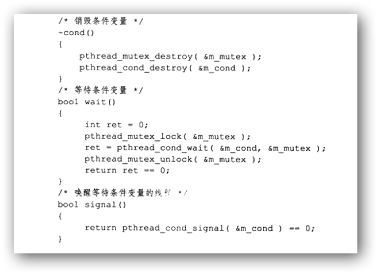
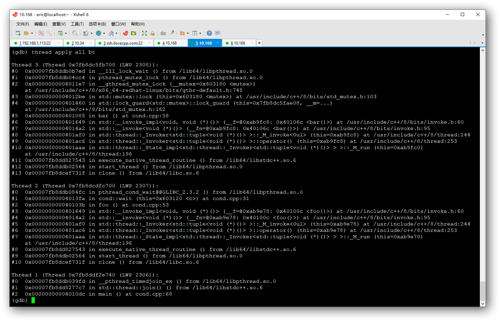

# 正确封装条件变量不容易

> Source: http://www.ilovecpp.com/2018/09/29/condition/


最近看《Linux高性能服务端编程》一书，书上对条件变量的封装比较有意思:

作者通过这样奇怪的封装，将mutex隐藏到在cond类里边。但是，这样封装的条件变量是不能正常使用的。

# mutex到底用来保护什么？

通常在程序里，我们使用条件变量来表示等待”某一条件”的发生。虽然名叫”条件变量”，但是它本身并不保存条件状态，本质上条件变量仅仅是一种通讯机制：当有一个线程在等待(pthread_cond_wait)某一条件变量的时候，会将当前的线程挂起，直到另外的线程发送信号(pthread_cond_signal)通知其解除阻塞状态。

由于要用额外的共享变量保存条件状态(这个变量可以是任何类型比如bool)，由于这个变量会同时被不同的线程访问，因此需要一个额外的mutex保护它。

《Linux系统编程手册》也有这个问题的介绍：

> A condition variable is always used in conjunction with a mutex. The mutex provides mutual exclusion for accessing the shared variable, while the condition variable is used to signal changes in the variable’s state.

条件变量总是结合mutex使用，条件变量就共享变量的状态改变发出通知，mutex就是用来保护这个共享变量的。

# 为什么pthread_cond_wait()需要mutex参数?

首先，我们使用条件变量的接口实现一个简单的生产者-消费者模型，avail就是保存条件状态的共享变量，它对生产者线程、消费者线程均可见。不考虑错误处理，先看生产者实现：

```
pthread_mutex_lock(&mutex);
avail++;
pthread_mutex_unlock(&mutex);

pthread_cond_signal(&cond); /* Wake sleeping consumer */
```

因为avail对两个线程都可见，因此对其修改均应该在mutex的保护之下，再来看消费者线程实现：

```
for (;;)
{
    pthread_mutex_lock(&mutex);
    while (avail == 0)
        pthread_cond_wait(&cond, &mutex);

    while (avail > 0)
    {
        /* Do something */
        avail--;
    }
    pthread_mutex_unlock(&mutex);
}
```

当”avail==0”时，消费者线程会阻塞在pthread_cond_wait()函数上。如果pthread_cond_wait()仅需要一个pthread_cond_t参数的话，此时mutex已经被锁，要是不先将mutex变量解锁，那么其他线程(如生产者线程)永远无法访问avail变量，也就无法继续生产，消费者线程会一直阻塞下去。因此pthread_cond_wait()需要传递给它一个pthread_mutex_t类型的变量。

pthread_cond_wait()函数首先大致会分为3个部分：

1.解锁互斥量mutex
2.阻塞调用线程，直到当前的条件变量收到通知
3.重新锁定互斥量mutex

其中1和2是原子操作，也就是说在pthread_cond_wait()调用线程陷入阻塞之前其他的线程无法获取当前的mutex，也就不能就该条件变量发出通知。

# 虚假唤醒

前面判断条件状态的时候`avail > 0`放在了while循环中，而不是if中，这是因为pthread_cond_wait()阻塞在条件变量上的时候，即使其他的线程没有就该条件变量发出通知(pthread_cond_signal()/pthread_cond_broadcast())，条件变量也有可能会自己醒来(pthread_cond_wait()函数返回)，因此需要重新检查一下共享变量上的条件成不成立，确保条件变量是真的收到了通知，否则继续阻塞等待。关于虚假唤醒的相关介绍，可以戳这里查看维基百科下面的几个引用：https://en.wikipedia.org/wiki/Spurious_wakeup。

# 开篇条件变量的封装的问题

结合前面的3节，我们总结了pthread_cond_wait()使用时，必须遵守的几个法则：

1.必须结合mutex使用，mutex用于保护共享变量，而不是保护pthread_cond_wait()的某些内部操作
2.mutex上锁后，才能调用pthread_cond_wait()
3.条件状态判断要放在while()循环里，然后再pthread_cond_wait()

如果这么使用，就不会再用错条件变量了。现在回到开篇的源码上，它是这么封装wait操作的:

```
class cond
{
  public:
    bool wait()
    {
        int ret = 0;
        pthread_mutex_lock(&m_mutex);
        ret = pthread_cond_wait(&m_cond, &m_mutex);
        pthread_mutex_unlock(&m_mutex);
        return ret == 0;
    }

    bool signal()
    {
        return pthread_cond_signal(&m_cond) == 0;
    }

  private:
    pthread_mutex_t m_mutex;
    pthread_cond_t m_cond;
};
```

这段代码大致上有2个问题，首先，wait()函数直接将mutex隐藏到其实现里边，这里的mutex完全没发挥作用，没有保护任何的东西，仅仅是为了适配pthread_cond_wait()接口。如果仅仅只有这个问题那也罢了，最多损失一下性能多几下mutex加锁解锁的消耗。

更糟糕的是，这会导致死锁，我们先来使用一下这里封装的条件变量:

```
cond c;
bool flag = false;
std::mutex mutex;

void foo()
{
    std::lock_guard<std::mutex> guard(mutex);
    while(!flag)
        c.wait();
}

void bar()
{
    std::lock_guard<std::mutex> guard(mutex);
    flag = true;
    c.signal();
}

int main()
{
    std::thread t1(foo);
    std::thread t2(bar);
    
    t1.join();
    t2.join();
}
```

编译运行，程序死锁了，gdb attach上去看到了这样的堆栈：



foo()此时阻塞在pthread_cond_wait()上，pthread_cond_wait()已经将条件变量内部封装的m_mutex解锁了，但是std::lock_guard维护的std::mutex还未解锁。再看bar()线程，此时它正阻塞在std::lock_guard上对std::mutex加锁(堆栈里看到在linux平台是std::mutex就是用POSIX mutex实现的)。于是这样就产生了死锁：

1.foo()阻塞等待bar()线程通知改变其所等待的条件变量
2.bar()在等foo()解锁std::mutex,以改变条件状态flag

# 总结

那么如何封装条件变量呢，可以参考C++11标准库的接口设计，将mutex放出来，在wait的时候当参数传入:https://en.cppreference.com/w/cpp/thread/condition_variable/wait，这里不多赘述了。
