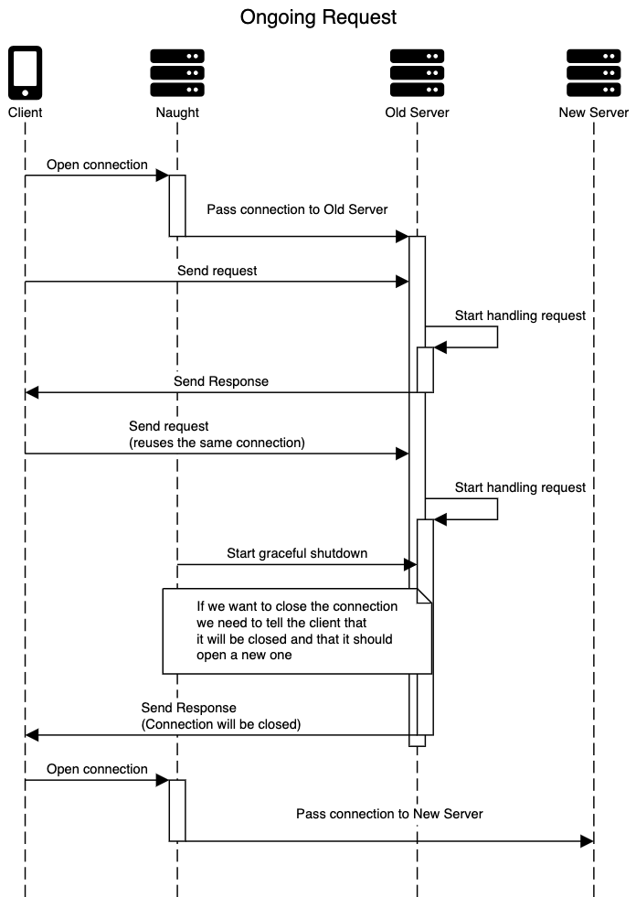
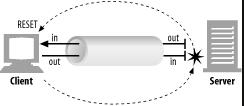

# HTTP/1.1 Connection


> [Hypertext Transfer Protocol -- HTTP/1.1 (rfc2616)](https://www.w3.org/Protocols/rfc2616/rfc2616-sec8.html#sec8) - 8 Connections


## Negotiation(谈判)


* Server side

An HTTP/1.1 server MAY assume that a HTTP/1.1 client intends to maintain a persistent connection unless a Connection header including the connection-token "close" was sent in the request. If the server chooses to close the connection immediately after sending the response, it SHOULD send a Connection header including the connection-token close.(即系，默认是长连接)


* Client side

An HTTP/1.1 client MAY expect a connection to remain open, but would decide to keep it open based on whether the response from a server contains a Connection header with the connection-token close. In case the client does not want to maintain a connection for more than that request, it SHOULD send a Connection header including the connection-token close.


## Race condition(竞态条件)

A client, server, or proxy MAY close the transport connection at any time. For example, a client might have started to send a new request at the same time that the server has decided to close the "idle" connection. From the server's point of view, the connection is being closed while it was idle, but from the client's point of view, a request is in progress.

在服务端关闭一个空闲连接时，客户端可能同时发出 HTTP Request。

重试与等幂:

This means that clients, servers, and proxies MUST be able to recover from asynchronous close events. Client software SHOULD reopen the transport connection and retransmit the aborted sequence of requests without user interaction so long as the request sequence is idempotent (see section 9.1.2). 

Non-idempotent methods or sequences MUST NOT be automatically retried, although user agents MAY offer a human operator the choice of retrying the request(s). Confirmation by user-agent software with semantic understanding of the application MAY substitute for user confirmation. The automatic retry SHOULD NOT be repeated if the second sequence of requests fails.


Servers SHOULD always respond to at least one request per connection, if at all possible. Servers SHOULD NOT close a connection in the middle of transmitting a response, unless a network or client failure is suspected.

连接数限制的建议：

Clients that use persistent connections SHOULD limit the number of simultaneous connections that they maintain to a given server. A single-user client SHOULD NOT maintain more than 2 connections with any server or proxy. A proxy SHOULD use up to 2*N connections to another server or proxy, where N is the number of simultaneously active users. These guidelines are intended to improve HTTP response times and avoid congestion.


## Client side 对连接失效的处理

An HTTP/1.1 (or later) client sending a message-body SHOULD monitor the network connection for an error status while it is transmitting the request. If the client sees an error status(如服务端关闭了连接？), it SHOULD immediately cease transmitting the body. If the body is being sent using a "chunked" encoding (section [3.6](https://www.w3.org/Protocols/rfc2616/rfc2616-sec3.html#sec3.6)), a zero length chunk and empty trailer MAY be used to prematurely mark the end of the message. If the body was preceded by a Content-Length header, the client MUST close the connection.

如果服务端过早关闭连接(Server Prematurely/Early Closes Connection)


## Client side 应对服务端过早关闭连接(Client Behavior if Server Prematurely Closes Connection)


If an HTTP/1.1 client sends a request which includes a request body, but which does not include an Expect request-header field with the "100-continue" expectation, and if the client is not directly connected to an HTTP/1.1 origin server, and if the client sees the connection close before receiving any status from the server, the client SHOULD retry the request. If the client does retry this request, it MAY use the following "binary exponential backoff" algorithm to be assured of obtaining a reliable response:

1. Initiate a new connection to the server
  2. Transmit the request-headers
  3. Initialize a variable R to the estimated round-trip time to the
     server (e.g., based on the time it took to establish the
     connection), or to a constant value of 5 seconds if the round-
     trip time is not available.
  4. Compute T = R * (2**N), where N is the number of previous
     retries of this request.
  5. Wait either for an error response from the server, or for T
     seconds (whichever comes first)
  6. If no error response is received, after T seconds transmit the
     body of the request.
  7. If client sees that the connection is closed prematurely,
     repeat from step 1 until the request is accepted, an error
     response is received, or the user becomes impatient and
     terminates the retry process.

If at any point an error status is received, the client

  - SHOULD NOT continue and
  - SHOULD close the connection if it has not completed sending the


## Connection HEADER field definition


> [Hypertext Transfer Protocol -- HTTP/1.1 (rfc2616)](https://www.w3.org/Protocols/rfc2616/rfc2616-sec14.html) - 14.10 Connection HEADER field definition


The Connection general-header field allows the sender to specify options that are desired for that particular connection and MUST NOT be communicated by proxies over further connections.(即系代理不应该透传 Connection 这个 HEADER)

The Connection header has the following grammar:

```
       Connection = "Connection" ":" 1#(connection-token)
       connection-token  = token
```

HTTP/1.1 proxies MUST parse the Connection header field before a message is forwarded and, for each connection-token in this field, remove any header field(s) from the message with the same name as the connection-token. Connection options are signaled by the presence of a connection-token in the Connection header field, not by any corresponding additional header field(s), since the additional header field may not be sent if there are no parameters associated with that connection option.

Message headers listed in the Connection header MUST NOT include end-to-end headers, such as Cache-Control.

HTTP/1.1 defines the "close" connection option for the sender to signal that the connection will be closed after completion of the response. For example,

```
       Connection: close
```

in either the request or the response header fields indicates that the connection SHOULD NOT be considered `persistent' (section 8.1) after the current request/response is complete.

HTTP/1.1 applications that do not support persistent connections MUST include the "close" connection option in every message.

A system receiving an HTTP/1.0 (or lower-version) message that includes a Connection header MUST, for each connection-token in this field, remove and ignore any header field(s) from the message with the same name as the connection-token. This protects against mistaken forwarding of such header fields by pre-HTTP/1.1 proxies. See section [19.6.2](https://www.w3.org/Protocols/rfc2616/rfc2616-sec19.html#sec19.6.2).


## Graceful shutdown HTTP/1.1 server

> [https://blog.dashlane.com/implementing-nodejs-http-graceful-shutdown/](https://blog.dashlane.com/implementing-nodejs-http-graceful-shutdown/)




Finally, to solve the issue of letting clients know that the server wanted to close the connection we started looking around at other implementations and see how other people were doing it. A common “trick” we found was using a `Connection` header in the response to tell the client that the server would like to close the connection. [Looking at the MDN docs about it](https://developer.mozilla.org/en-US/docs/Web/HTTP/Headers/Connection), it turns out that sending `Connection: close` in the response headers does exactly that. If we keep track of every request en each connection, we can add this header to the last request being handled and close the connection once the response has reached the client (or at least left the server). If the header hasn’t been sent for a specific connection we’ll keep it open to wait for a new request on it and send back the header.


## Close order

> [https://www.oreilly.com/library/view/http-the-definitive/1565925092/ch04s07.html](https://www.oreilly.com/library/view/http-the-definitive/1565925092/ch04s07.html)


### TCP close and reset errors

Simple HTTP applications can use only full closes. But when applications start talking to many other types of HTTP clients, servers, and proxies, and when they start using pipelined persistent connections, it becomes important for them to use half closes to prevent peers from getting unexpected write errors.

In general, **closing the output channel of your connection is always safe**. The peer on the other side of the connection will be notified that you closed the connection by getting an end-of-stream notification once all the data has been read from its buffer.

> [shutdown(2) — Linux manual page](https://man7.org/linux/man-pages/man2/shutdown.2.html)
>
> ```c
>        #include <sys/socket.h>
> 
>        int shutdown(int sockfd, int ho
> ```
>
> The shutdown() call causes all or part of a full-duplex connection on the socket associated with sockfd to be shut down. 
>
> - If how is `SHUT_RD`, further receptions will be disallowed.  如果调用后接收到对方的 TCP 报文，将以 RST 回应。《Unix Network Programming》 中说：receive buffer 将会丢弃，就算是已经 ACK 的数据。进程的 read 操作将失败。但 未 ACK 的数据将继续发送。
> - If how is `SHUT_WR`, further transmissions will be disallowed. 。《Unix Network Programming》 中说：同时把 FIN 放入发送队列，未 ACK 的数据将继续发送，这就是  TCP 中的 Half-close 连接。进程的 write 操作将失败。
> - If how is `SHUT_RDWR`, further receptions and transmissions will be disallowed.

**Closing the input channel of your connection is riskier**, unless you know the other side doesn’t plan to send any more data. If the other side sends data to your closed input channel, the operating system will issue a TCP “`connection reset by peer`” message back to the other side’s machine, as shown in [Figure 4-21](https://www.oreilly.com/library/view/http-the-definitive/1565925092/ch04s07.html#httptdg-CHP-4-FIG-21). Most operating systems treat this as a serious error and erase any buffered data the other side has not read yet. This is very bad for pipelined connections.TCP close and reset errors

Simple HTTP applications can use only full closes. But when applications start talking to many other types of HTTP clients, servers, and proxies, and when they start using pipelined persistent connections, it becomes important for them to use half closes to prevent peers from getting unexpected write errors.

In general, closing the output channel of your connection is always safe. The peer on the other side of the connection will be notified that you closed the connection by getting an end-of-stream notification once all the data has been read from its buffer.

Closing the input channel of your connection is riskier, unless you know the other side doesn’t plan to send any more data. If the other side sends data to your closed input channel, the operating system will issue a TCP “connection reset by peer” message back to the other side’s machine, as shown in [Figure 4-21](https://www.oreilly.com/library/view/http-the-definitive/1565925092/ch04s07.html#httptdg-CHP-4-FIG-21). Most operating systems treat this as a serious error and erase any buffered data the other side has not read yet. This is very bad for pipelined connections.




Say you have sent 10 pipelined requests on a persistent connection, and the responses already have arrived and are sitting in your operating system’s buffer (but the application hasn’t read them yet). Now say you send request #11, but the server decides you’ve used this connection long enough, and closes it. Your request #11 will arrive at a closed connection and will reflect a reset back to you. This reset will erase your input buffers.

When you finally get to reading data, you will get a connection reset by peer error, and the buffered, unread response data will be lost, even though much of it successfully arrived at your machine.

### Graceful close

The HTTP specification counsels that when clients or servers want to close a connection unexpectedly, they should “issue a graceful close on the transport connection,” but it doesn’t describe how to do that.

In general, applications implementing graceful closes will first close their output channels and then wait for the peer on the other side of the connection to close *its* output channels. When both sides are done telling each other they won’t be sending any more data (i.e., closing output channels), the connection can be closed fully, with no risk of reset.

Unfortunately, there is no guarantee that the peer implements or checks for half closes. For this reason, applications wanting to close gracefully should half close their output channels and periodically check the status of their input channels (looking for data or for the end of the stream). If the input channel isn’t closed by the peer within some timeout period, the application may force connection close to save resources.

