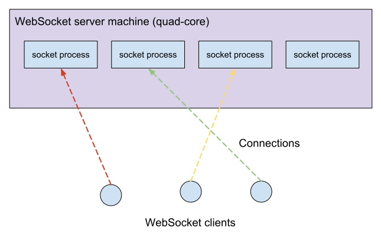

# Ephemeral port exhaustion and how to avoid it


> [https://making.pusher.com/ephemeral-port-exhaustion-and-how-to-avoid-it/](https://making.pusher.com/ephemeral-port-exhaustion-and-how-to-avoid-it/)

Recently, a production incident caused a part of our system to reject all new connections. The culprit: “ephemeral port exhaustion.” By default, your OS will not give any warning when this is about to happen – scary, given the severe consequences! In this post we try to remedy this. We’ll explain what ephemeral ports are, show you how to get appropriate alerting in place, and list some options for avoiding the problem when it does arise.

# A story of a production incident

One day, our alarms went off. Our integration tests, which continuously run against our [Channels product](https://pusher.com/channels), were failing to connect to our WebSocket servers. We have a metric that records the number of connections, and it was showing that no new connections were being accepted beyond the existing ~100,000 connections.

We checked our logs, and found something that looked suspicious:

```
haproxy[3569]: Connect() failed for backend socket: no free ports
```

That sounds worrying, but what does it mean exactly? We must first understand what connections we have in the Pusher Channels infrastructure. Externally, there are TCP connections between WebSocket clients (our users) and WebSocket server machines. Each WebSocket server has many external connections:


These WebSocket server machines are powerful multi-core machines. However, our processes are all single threaded. To make use of our multi-core machines, we run one WebSocket server (`socket`) process per core:



Each logical connection between a WebSocket client and a socket process is proxied by a local HAProxy process. Therefore each logical connection consists of two TCP connections: one external connection between the WebSocket client and HAProxy, and one internal connection between HAProxy and the socket process. We use HAProxy here to provide a single external port, for load balancing between our socket processes, and for TLS termination.


So why was HAProxy complaining that it had run out of free ports? Concentrate on the internal connections between HAProxy and the socket processes. Let’s calculate the maximum number of available ports for those internal connections, and see if it matches up with the number of connections to our machine when HAProxy started logging these errors.

## The theoretical limit on the number of ports

Each TCP connection is uniquely identified in the OS by the 4-tuple consisting:

```
(local ip, local port, peer ip, peer port)
```

For the connections between HAProxy and the WebSocket server process, the local IP address and the peer IP address are fixed because they are both bound to localhost (`127.0.0.1`). For a given WebSocket server process, the peer port is also fixed, e.g. `8080`. Therefore the only field we can vary is the “local port”:

```
(127.0.0.1, local port, 127.0.0.1, 8080)
```

Port numbers are 16 bit, which means we have a theoretical limit of 65536 connections per WebSocket server process. In our example, we had four WebSocket server processes, so that would allow us to handle a maximum of 65536 local ports * 4 peer IPs = 262144 WebSocket connections per machine.

But in our metrics, we saw the “no free ports” errors happening at a significantly lower number of connections than this: ~100,000. Why is there this mismatch between the limit we were experiencing and the one we have just calculated?

## The real limit

What was HAProxy actually trying to do when it logged the error? We looked through [the source code](https://github.com/haproxy/haproxy/blob/f7b7c3e2f2d0bdf835a204cbccdff8005292ccaf/src/proto_tcp.c#L487-L500) and figured out it was calling `connect(2)` in order to connect to one of our “socket” processes, and receiving a `EADDRNOTAVAIL` error from the operating system (linux).

[The man page](http://man7.org/linux/man-pages/man2/connect.2.html) states that this error is returned if

> The socket referred to by sockfd had not previously been bound to an address and, upon attempting to bind it to an ephemeral port, it was determined that all port numbers in the ephemeral port range are currently in use.
>
> See the discussion of /proc/sys/net/ipv4/ip_local_port_range in [ip(7)](http://man7.org/linux/man-pages/man7/ip.7.html).

This specifically mentions “ephemeral ports” which implies it’s a subset of all available ports. Let’s check the `/proc/sys/net/ipv4/ip_local_port_range` file

```
$ cat /proc/sys/net/ipv4/ip_local_port_range
32768	61000
```

The man page states

> This file contains two integers that define the default local port range allocated to sockets that are not explicitly bound to a port number—that is, the range used for ephemeral ports.

Interestingly, this range on linux is different from [the range defined by IANA](https://www.iana.org/assignments/service-names-port-numbers/service-names-port-numbers.xhtml): 49152 through 65535. [This thread](https://lkml.org/lkml/2007/5/12/183) provides some motivation for this.

So HAProxy is calling `connect(2)` without binding to a specific port, and is therefore being assigned a port number from this ephemeral (local) port range. This range is 61,000 - 32,768 = 28,232 by default on Linux. We had four backend WebSocket server processes per machine, so this gives us a total of 28,232 * 4 = 112,928 connections per machine. This more closely matches the number of connections at which new connections started failing at. We reproduced the problem by setting the ephemeral port range much lower in a staging environment and saw an exact match between the range and the number of connection at which HAProxy complained about running out of ports. So we have our culprit!

**Generally, this limit means that ephemeral port exhaustion becomes likely if you have a large number of outgoing connections to a small number of processes (ports) on a small number of machines (IP addresses). Load balancers, as in our case, are likely to match this profile.**

*Warning: in practice ephemeral ports may become exhausted when the reported number of connections is lower than the limit. This is because connections in non “established” states (e.g. TIME_WAIT), will still consume ephemeral ports.*

## Getting visibility into the problem

What is scary about this issue is that by default it is hard to know how close the machine is to hitting the limit; once the limit is reached, the system suddenly degrades severely. For that reason, you will more than likely want to create an alarm that goes off when the number of used ephemeral ports is close to the limit.

Let’s have a go at building this alarm. We can use the ss tool to list the current connections that are using ephemeral ports:

```
$ first_port=$(cut --fields 1 /proc/sys/net/ipv4/ip_local_port_range)
$ last_port=$(cut --fields 2 /proc/sys/net/ipv4/ip_local_port_range)
$ ss --numeric --tcp state connected \
     "( sport >= :$first_port and sport <= :$last_port )"
State      Recv-Q Send-Q     Local Address:Port    Peer Address:Port
ESTAB      0      0          127.0.0.1:52987       127.0.0.1:8081
ESTAB      0      0          127.0.0.1:55020       127.0.0.1:8082
ESTAB      0      0          127.0.0.1:54082       127.0.0.1:8080
...
```

Now we need to group these connections by unique `(local ip, peer ip, peer port)` because the ephemeral port limit is not global – it applies only to each of these groups. We can then count the number of connections in each of these groups, and alert if the value is too close to the ephemeral port limit. Unfortunately we are not aware of a tool which does this out of the box, so we coded it up in Ruby like so:

```
groups = Hash.new(0)
conns.lines.each do |conn|
  state, recvq, sendq, local, peer = conn.split
  local_ip, local_port = local.split(':')
  group = [local_ip, peer]
  groups[group] += 1
end

groups.each do |group, used_port_count|
  if used_port_count > ephemeral_port_warning
    puts
      "WARNING: connections from #{group[0]} to #{group[1]} have used "\
      "#{used_port_count} ephemeral ports out of #{ephemeral_port_max} max"
  end
end
```

This script can then be periodically run by your alerting system of choice.

## What to do if you are near the limit?

So you’ve just added this alarm to your machines, and it starts going off. What can you do about it? Here’s a few options:

- Boot more machines
- Deploy more backend processes to load balance across
- Run multiple instances of the load balancer (HAProxy in our case)
- Increase the ephemeral port range. This guide recommends setting the bounds to 1024 through 65000. Before you do this, you should check whether the range does not clash with with any listen sockets you might be using.
- [EDIT] a number of readers have suggested opening connections to multiple destination IP addresses, e.g. (both `127.0.0.1` and `127.0.0.2`). Multiple address can be achieved with virtual network interfaces. [More info here](https://unix.stackexchange.com/questions/130797/can-tcp-provide-more-than-65535-ports/130798#130798).

For us, booting more machines was the quickest and easiest solution.

## Conclusion

Ephemeral port exhaustion is likely to affect load balancers that balance between a small number of backends. Once ephemeral ports are exhausted all new connections will abruptly be rejected. For this reason it is essential that the ephemeral port usage is monitored, hopefully avoiding the problem that we experienced!

*Thanks to Jim Fisher for the Ruby alarm code, who also reviewed this post along with Kevin Norman.*


