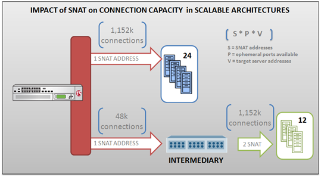

# TCP Ephemeral port

## Linux 默认 TCP Ephemeral port 范围

```
Linux 2.4 kernel	sysctl net.ipv4.ip_local_port_range	32768 60999
```


## Load balancer 应对 Ephemeral port 用尽的方法

> [https://www.nginx.com/blog/overcoming-ephemeral-port-exhaustion-nginx-plus/](https://www.nginx.com/blog/overcoming-ephemeral-port-exhaustion-nginx-plus/)

 - Enabling Keepalive Connections
 - 同一网口多 ip： [Dynamically Binding Connections to a Defined List of Local IP Addresses](https://www.nginx.com/blog/overcoming-ephemeral-port-exhaustion-nginx-plus/#:~:text=Dynamically%20Binding%20Connections%20to%20a%20Defined%20List%20of%20Local%20IP%C2%A0Addresses)
 - 减少主动关闭后的 TIME_WATIT : `sysctl net.ipv4.tcp_tw_recycle` `sysctl net.ipv4.tcp_tw_reuse` 


## Ref.

```{toctree}
how-to-stop-running-out-of-ephemeral-ports-and-start-to-love-long-lived-connections.md
ephemeral-port-exhaustion-and-how-to-avoid-it.md
```

### WILS: Load Balancing and Ephemeral Port Exhaustion

> [WILS: Load Balancing and Ephemeral Port Exhaustion](https://community.f5.com/t5/technical-articles/wils-load-balancing-and-ephemeral-port-exhaustion/ta-p/287984)



