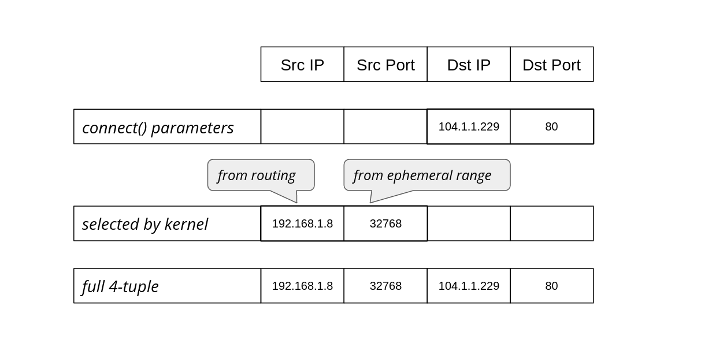

# How to stop running out of ephemeral ports and start to love long-lived connections

> [https://blog.cloudflare.com/how-to-stop-running-out-of-ephemeral-ports-and-start-to-love-long-lived-connections/](https://blog.cloudflare.com/how-to-stop-running-out-of-ephemeral-ports-and-start-to-love-long-lived-connections/)

Often programmers have assumptions that turn out, to their surprise, to be invalid. From my experience this happens a lot. Every API, technology or system can be abused beyond its limits and break in a miserable way.

It's particularly interesting when basic things used everywhere fail. Recently we've reached such a breaking point in a ubiquitous part of Linux networking: establishing a network connection using the `connect()` system call.

Since we are not doing anything special, just establishing TCP and UDP connections, how could anything go wrong? Here's one example: we noticed alerts from a misbehaving server, logged in to check it out and saw:

```
marek@:~# ssh 127.0.0.1
ssh: connect to host 127.0.0.1 port 22: Cannot assign requested address
```

You can imagine the face of my colleague who saw that. SSH to localhost refuses to work, while she was already using SSH to connect to that server! On another occasion:

```
marek@:~# dig cloudflare.com @1.1.1.1
dig: isc_socket_bind: address in use
```

This time a basic DNS query failed with a weird networking error. Failing DNS is a bad sign!

In both cases the problem was Linux running out of ephemeral ports. When this happens it's unable to establish any outgoing connections. This is a pretty serious failure. It's usually transient and if you don't know what to look for it might be hard to debug.

The root cause lies deeper though. We can often ignore limits on the number of outgoing connections. But we encountered cases where we hit limits on the number of concurrent outgoing connections during normal operation.

In this blog post I'll explain why we had these issues, how we worked around them, and present an userspace code implementing an improved variant of `connect()` syscall.

### Outgoing connections on Linux part 1 - TCP

Let's start with a bit of historical background.

### Long-lived connections

Back in 2014 Cloudflare announced support for WebSockets. We wrote two articles about it:

- [Cloudflare Now Supports WebSockets](https://blog.cloudflare.com/cloudflare-now-supports-websockets/)
- [Bind before connect](https://idea.popcount.org/2014-04-03-bind-before-connect/)

If you skim these blogs, you'll notice we were totally fine with the WebSocket protocol, framing and operation. What worried us was our capacity to handle large numbers of concurrent outgoing connections towards the origin servers. Since WebSockets are long-lived, allowing them through our servers might greatly increase the concurrent connection count. And this did turn out to be a problem. It was possible to hit a ceiling for a total number of outgoing connections imposed by the Linux networking stack.

In a pessimistic case, each Linux connection consumes a local port (ephemeral port), and therefore the total connection count is limited by the size of the ephemeral port range.

### Basics - how port allocation works

When establishing an outbound connection a typical user needs the destination address and port. For example, DNS might resolve `cloudflare.com` to the '104.1.1.229' IPv4 address. A simple Python program can establish a connection to it with the following code:

```
cd = socket.socket(AF_INET, SOCK_STREAM)
cd.connect(('104.1.1.229', 80))
```

The operating system’s job is to figure out how to reach that destination, selecting an appropriate source address and source port to form the full 4-tuple for the connection:



The operating system chooses the source IP based on the routing configuration. On Linux we can see which source IP will be chosen with `ip route get`:

```
$ ip route get 104.1.1.229
104.1.1.229 via 192.168.1.1 dev eth0 src 192.168.1.8 uid 1000
	cache
```

The `src` parameter in the result shows the discovered source IP address that should be used when going towards that specific target.

The source port, on the other hand, is chosen from the local port range configured for outgoing connections, also known as the ephemeral port range. On Linux this is controlled by the following sysctls:

```
$ sysctl net.ipv4.ip_local_port_range net.ipv4.ip_local_reserved_ports
net.ipv4.ip_local_port_range = 32768    60999
net.ipv4.ip_local_reserved_ports =
```

The `ip_local_port_range` sets the low and high (inclusive) port range to be used for outgoing connections. The `ip_local_reserved_ports` is used to skip specific ports if the operator needs to reserve them for services.

### Vanilla TCP is a happy case

The default ephemeral port range contains more than 28,000 ports (60999+1-32768=28232). Does that mean we can have at most 28,000 outgoing connections? That’s the core question of this blog post!

In TCP the connection is identified by a full 4-tuple, for example:

| full 4-tuple | 192.168.1.8 | 32768 | 104.1.1.229 | 80   |
| ------------ | ----------- | ----- | ----------- | ---- |
|              |             |       |             |      |

In principle, it is possible to reuse the source IP and port, and share them against another destination. For example, there could be two simultaneous outgoing connections with these 4-tuples:

| full 4-tuple #A | 192.168.1.8 | 32768 | 104.1.1.229  | 80   |
| :-------------- | :---------- | :---- | :----------- | :--- |
| full 4-tuple #B | 192.168.1.8 | 32768 | 151.101.1.57 | 80   |

This "source two-tuple" sharing can happen in practice when establishing connections using the vanilla TCP code:

```
sd = socket.socket(SOCK_STREAM)
sd.connect( (remote_ip, remote_port) )
```

But slightly different code can prevent this sharing, as we’ll discuss.

In the rest of this blog post, we’ll summarise the behaviour of code fragments that make outgoing connections showing:

- The technique’s description
- The typical `errno` value in the case of port exhaustion
- And whether the kernel is able to reuse the {source IP, source port}-tuple against another destination

The last column is the most important since it shows if there is a low limit of total concurrent connections. As we're going to see later, the limit is present more often than we'd expect.

| technique description     | errno on port exhaustion | possible src 2-tuple reuse |
| :------------------------ | :----------------------- | :------------------------- |
| connect(dst_IP, dst_port) | EADDRNOTAVAIL            | yes (good!)                |

In the case of generic TCP, things work as intended. Towards a single destination it's possible to have as many connections as an ephemeral range allows. When the range is exhausted (against a single destination), we'll see EADDRNOTAVAIL error. The system also is able to correctly reuse local two-tuple {source IP, source port} for ESTABLISHED sockets against other destinations. This is expected and desired.

### Manually selecting source IP address

Let's go back to the Cloudflare server setup. Cloudflare operates many services, to name just two: CDN (caching HTTP reverse proxy) and [WARP](https://blog.cloudflare.com/1111-warp-better-vpn).

For Cloudflare, it’s important that we don’t mix traffic types among our outgoing IPs. Origin servers on the Internet might want to differentiate traffic based on our product. The simplest example is CDN: it's appropriate for an origin server to firewall off non-CDN inbound connections. Allowing Cloudflare cache pulls is totally fine, but allowing WARP connections which contain untrusted user traffic might lead to problems.

To achieve such outgoing IP separation, each of our applications must be explicit about which source IPs to use. They can’t leave it up to the operating system; the automatically-chosen source could be wrong. While it's technically possible to configure routing policy rules in Linux to express such requirements, we decided not to do that and keep Linux routing configuration as simple as possible.

Instead, before calling `connect()`, our applications select the source IP with the `bind()` syscall. A trick we call "bind-before-connect":

```
sd = socket.socket(SOCK_STREAM)
sd.bind( (src_IP, 0) )
sd.connect( (dst_IP, dst_port) )
```

| technique description                     | errno on port exhaustion | possible src 2-tuple reuse |
| :---------------------------------------- | :----------------------- | :------------------------- |
| bind(src_IP, 0) connect(dst_IP, dst_port) | EADDRINUSE               | no **(bad!)**              |

This code looks rather innocent, but it hides a considerable drawback. When calling `bind()`, the kernel attempts to find an unused local two-tuple. Due to BSD API shortcomings, the operating system can't know what we plan to do with the socket. It's totally possible we want to `listen()` on it, in which case sharing the source IP/port with a connected socket will be a disaster! That's why the source two-tuple selected when calling `bind()` must be unique.

Due to this API limitation, in this technique the source two-tuple can't be reused. Each connection effectively "locks" a source port, so the number of connections is constrained by the size of the ephemeral port range. Notice: one source port is used up for each connection, no matter how many destinations we have. This is bad, and is exactly the problem we were dealing with back in 2014 in the WebSockets articles mentioned above.

Fortunately, it's fixable.

### IP_BIND_ADDRESS_NO_PORT

Back in 2014 we fixed the problem by setting the SO_REUSEADDR socket option and manually retrying `bind()`+ `connect()` a couple of times on error. This worked ok, but later in 2015 [Linux introduced a proper fix: the IP_BIND_ADDRESS_NO_PORT socket option](https://kernelnewbies.org/Linux_4.2#Networking). This option tells the kernel to delay reserving the source port:

```
sd = socket.socket(SOCK_STREAM)
sd.setsockopt(IPPROTO_IP, IP_BIND_ADDRESS_NO_PORT, 1)
sd.bind( (src_IP, 0) )
sd.connect( (dst_IP, dst_port) )
```

| technique description                                        | errno on port exhaustion | possible src 2-tuple reuse |
| :----------------------------------------------------------- | :----------------------- | :------------------------- |
| IP_BIND_ADDRESS_NO_PORT bind(src_IP, 0) connect(dst_IP, dst_port) | EADDRNOTAVAIL            | yes (good!)                |

This gets us back to the desired behavior. On modern Linux, when doing bind-before-connect for TCP, you should set IP_BIND_ADDRESS_NO_PORT.

### Explicitly selecting a source port

Sometimes an application needs to select a specific source port. For example: the operator wants to control full 4-tuple in order to debug ECMP routing issues.

Recently a colleague wanted to run a cURL command for debugging, and he needed the source port to be fixed. cURL provides the `--local-port` option to do this¹ :

```
$ curl --local-port 9999 -4svo /dev/null https://cloudflare.com/cdn-cgi/trace
*   Trying 104.1.1.229:443...
```

In other situations source port numbers should be controlled, as they can be used as an input to a routing mechanism.

But setting the source port manually is not easy. We're back to square one in our hackery since IP_BIND_ADDRESS_NO_PORT is not an appropriate tool when calling `bind()` with a specific source port value. To get the scheme working again and be able to share source 2-tuple, we need to turn to SO_REUSEADDR:

```
sd = socket.socket(SOCK_STREAM)
sd.setsockopt(socket.SOL_SOCKET, socket.SO_REUSEADDR, 1)
sd.bind( (src_IP, src_port) )
sd.connect( (dst_IP, dst_port) )
```

Our summary table:

| technique description                                        | errno on port exhaustion | possible src 2-tuple reuse |
| :----------------------------------------------------------- | :----------------------- | :------------------------- |
| SO_REUSEADDR bind(src_IP, src_port) connect(dst_IP, dst_port) | EADDRNOTAVAIL            | yes (good!)                |

Here, the user takes responsibility for handling conflicts, when an ESTABLISHED socket sharing the 4-tuple already exists. In such a case `connect` will fail with EADDRNOTAVAIL and the application should retry with another acceptable source port number.

### Userspace connectx implementation 

With these tricks, [we can implement a common function and call it `connectx`](https://github.com/cloudflare/cloudflare-blog/blob/master/2022-02-connectx/connectx.py#L93-L110). It will do what `bind()`+`connect()` should, but won't have the unfortunate ephemeral port range limitation. In other words, created sockets are able to share local two-tuples as long as they are going to distinct destinations:

```
def connectx((source_IP, source_port), (destination_IP, destination_port)):
```

We have three use cases this API should support:

| user specified                       | technique               |
| :----------------------------------- | :---------------------- |
| {_, _, dst_IP, dst_port}             | vanilla connect()       |
| {src_IP, _, dst_IP, dst_port}        | IP_BIND_ADDRESS_NO_PORT |
| {src_IP, src_port, dst_IP, dst_port} | SO_REUSEADDR            |

The name we chose isn't an accident. MacOS (specifically the underlying Darwin OS) has exactly that function implemented [as a `connectx()` system call](https://www.manpagez.com/man/2/connectx) ([implementation](https://github.com/apple/darwin-xnu/blob/a1babec6b135d1f35b2590a1990af3c5c5393479/bsd/netinet/tcp_usrreq.c#L517)):


It's more powerful than our `connectx` code, since it supports TCP Fast Open.

Should we, Linux users, be envious? For TCP, it's possible to get the right kernel behaviour with the appropriate setsockopt/bind/connect dance, so a kernel syscall is not quite needed.

But for UDP things turn out to be much more complicated and a dedicated syscall might be a good idea.

### Outgoing connections on Linux - part 2 - UDP

In the previous section we listed three use cases for outgoing connections that should be supported by the operating system:

- Vanilla egress: operating system chooses the outgoing IP and port
- Source IP selection: user selects outgoing IP but the OS chooses port
- Full 4-tuple: user selects full 4-tuple for the connection

We demonstrated how to implement all three cases on Linux for TCP, without hitting connection count limits due to source port exhaustion.

It's time to extend our implementation to UDP. This is going to be harder.

For UDP, Linux maintains one hash table that is keyed on local IP and port, which can hold duplicate entries. Multiple UDP connected sockets can not only share a 2-tuple but also a 4-tuple! It's totally possible to have two distinct, connected sockets having exactly the same 4-tuple. This feature was created for multicast sockets. The implementation was then carried over to unicast connections, but it is confusing. With conflicting sockets on unicast addresses, only one of them will receive any traffic. A newer connected socket will "overshadow" the older one. It's surprisingly hard to detect such a situation. To get UDP `connectx()` right, we will need to work around this "overshadowing" problem.

### Vanilla UDP is limited

It might come as a surprise to many, but by default, the total count for outbound UDP connections is limited by the ephemeral port range size. Usually, with Linux you can't have more than ~28,000 connected UDP sockets, even if they point to multiple destinations.

Ok, let's start with the simplest and most common way of establishing outgoing UDP connections:

```
sd = socket.socket(SOCK_DGRAM)
sd.connect( (dst_IP, dst_port) )
```

| technique description     | errno on port exhaustion | possible src 2-tuple reuse | risk of overshadowing |
| :------------------------ | :----------------------- | :------------------------- | :-------------------- |
| connect(dst_IP, dst_port) | EAGAIN                   | no **(bad!)**              | no                    |

The simplest case is not a happy one. The total number of concurrent outgoing UDP connections on Linux is limited by the ephemeral port range size. On our multi-tenant servers, with potentially long-lived gaming and H3/QUIC flows containing WebSockets, this is too limiting.

On TCP we were able to slap on a `setsockopt` and move on. No such easy workaround is available for UDP.

For UDP, without REUSEADDR, Linux avoids sharing local 2-tuples among UDP sockets. During `connect()` it tries to find a 2-tuple that is not used yet. As a side note: there is no fundamental reason that it looks for a unique 2-tuple as opposed to a unique 4-tuple during 'connect()'. This suboptimal behavior might be fixable.

### SO_REUSEADDR is hard

To allow local two-tuple reuse we need the SO_REUSEADDR socket option. Sadly, this would also allow established sockets to share a 4-tuple, with the newer socket overshadowing the older one.

```
sd = socket.socket(SOCK_DGRAM)
sd.setsockopt(socket.SOL_SOCKET, socket.SO_REUSEADDR, 1)
sd.connect( (dst_IP, dst_port) )
```

| technique description                  | errno on port exhaustion | possible src 2-tuple reuse | risk of overshadowing |
| :------------------------------------- | :----------------------- | :------------------------- | :-------------------- |
| SO_REUSEADDR connect(dst_IP, dst_port) | EAGAIN                   | yes                        | yes **(bad!)**        |

In other words, we can't just set SO_REUSEADDR and move on, since we might hit a local 2-tuple that is already used in a connection against the same destination. We might already have an identical 4-tuple connected socket underneath. Most importantly, during such a conflict we won't be notified by any error. This is unacceptably bad.

### Detecting socket conflicts with eBPF

We thought a good solution might be to write an eBPF program to detect such conflicts. The idea was to put a code on the `connect()` syscall. Linux cgroups allow the BPF_CGROUP_INET4_CONNECT hook. The eBPF is called every time a process under a given cgroup runs the `connect()` syscall. This is pretty cool, and we thought it would allow us to verify if there is a 4-tuple conflict before moving the socket from UNCONNECTED to CONNECTED states.

[Here is how to load and attach our eBPF](https://github.com/cloudflare/cloudflare-blog/tree/master/2022-02-connectx/ebpf_connect4)

```
bpftool prog load ebpf.o /sys/fs/bpf/prog_connect4  type cgroup/connect4
bpftool cgroup attach /sys/fs/cgroup/unified/user.slice connect4 pinned /sys/fs/bpf/prog_connect4
```

With such a code, we'll greatly reduce the probability of overshadowing:

| technique description                                     | errno on port exhaustion                 | possible src 2-tuple reuse | risk of overshadowing |
| :-------------------------------------------------------- | :--------------------------------------- | :------------------------- | :-------------------- |
| INET4_CONNECT hook SO_REUSEADDR connect(dst_IP, dst_port) | manual port discovery, EPERM on conflict | yes                        | yes, but small        |

However, this solution is limited. First, it doesn't work for sockets with an automatically assigned source IP or source port, it only works when a user manually creates a 4-tuple connection from userspace. Then there is a second issue: a typical race condition. We don't grab any lock, so it's technically possible a conflicting socket will be created on another CPU in the time between our eBPF conflict check and the finish of the real `connect()` syscall machinery. In short, this lockless eBPF approach is better than nothing, but fundamentally racy.

### Socket traversal - SOCK_DIAG ss way

There is another way to verify if a conflicting socket already exists: we can check for connected sockets in userspace. It's possible to do it without any privileges quite effectively with the SOCK_DIAG_BY_FAMILY feature of `netlink` interface. This is the same technique the `ss` tool uses to print out sockets available on the system.

The netlink code is not even all that complicated. [Take a look at the code](https://github.com/cloudflare/cloudflare-blog/blob/master/2022-02-connectx/connectx.py#L23). Inside the kernel, it goes [quickly into a fast `__udp_lookup()` routine](https://elixir.bootlin.com/linux/latest/source/net/ipv4/udp_diag.c#L28). This is great - we can avoid iterating over all sockets on the system.

With that function handy, we can draft our UDP code:

```python
sd = socket.socket(SOCK_DGRAM)
sd.setsockopt(socket.SOL_SOCKET, socket.SO_REUSEADDR, 1)
cookie = sd.getsockopt(socket.SOL_SOCKET, SO_COOKIE, 8)
sd.bind( src_addr )
c, _ = _netlink_udp_lookup(family, src_addr, dst_addr)
if c != cookie:
    raise OSError(...)
sd.connect( dst_addr )
```

This code has the same race condition issue as the connect inet eBPF hook before. But it's a good starting point. We need some locking to avoid the race condition. Perhaps it's possible to do it in the userspace.

### SO_REUSEADDR as a lock 

Here comes a breakthrough: we can use SO_REUSEADDR as a locking mechanism. Consider this:

```python
sd = socket.socket(SOCK_DGRAM)
cookie = sd.getsockopt(socket.SOL_SOCKET, SO_COOKIE, 8)
sd.setsockopt(socket.SOL_SOCKET, socket.SO_REUSEADDR, 1)
sd.bind( src_addr )
sd.setsockopt(socket.SOL_SOCKET, socket.SO_REUSEADDR, 0)
c, _ = _netlink_udp_lookup(family, src_addr, dst_addr)
if c != cookie:
    raise OSError()
sd.connect( dst_addr )
sd.setsockopt(socket.SOL_SOCKET, socket.SO_REUSEADDR, 1)
```

The idea here is:

- We need REUSEADDR around bind, otherwise it wouldn't be possible to reuse a local port. It's technically possible to clear REUSEADDR after bind. Doing this technically makes the kernel socket state inconsistent, but it doesn't hurt anything in practice.
- By clearing REUSEADDR, we're locking new sockets from using that source port. At this stage we can check if we have ownership of the 4-tuple we want. Even if multiple sockets enter this critical section, only one, the newest, can win this verification. This is a cooperative algorithm, so we assume all tenants try to behave.
- At this point, if the verification succeeds, we can perform `connect()` and have a guarantee that the 4-tuple won't be reused by another socket at any point in the process.

This is rather convoluted and hacky, but it satisfies our requirements:

| technique description | errno on port exhaustion | possible src 2-tuple reuse | risk of overshadowing |
| :-------------------- | :----------------------- | :------------------------- | :-------------------- |
| REUSEADDR as a lock   | EAGAIN                   | yes                        | no                    |

Sadly, this schema only works when we know the full 4-tuple, so we can't rely on kernel automatic source IP or port assignments.

### Faking source IP and port discovery

In the case when the user calls 'connect' and specifies only target 2-tuple - destination IP and port, the kernel needs to fill in the missing bits - the source IP and source port. Unfortunately the described algorithm expects the full 4-tuple to be known in advance.

One solution is to implement source IP and port discovery in userspace. This turns out to be not that hard. For example, [here's a snippet of our code](https://github.com/cloudflare/cloudflare-blog/blob/master/2022-02-connectx/connectx.py#L204):

```python
def _get_udp_port(family, src_addr, dst_addr):
    if ephemeral_lo == None:
        _read_ephemeral()
    lo, hi = ephemeral_lo, ephemeral_hi
    start = random.randint(lo, hi)
    ...
```

### Putting it all together

Combining the manual source IP, port discovery and the REUSEADDR locking dance, we get a decent userspace implementation of `connectx()` for UDP.

We have covered all three use cases this API should support:

| user specified                       | comments                                   |
| :----------------------------------- | :----------------------------------------- |
| {_, _, dst_IP, dst_port}             | manual source IP and source port discovery |
| {src_IP, _, dst_IP, dst_port}        | manual source port discovery               |
| {src_IP, src_port, dst_IP, dst_port} | just our "REUSEADDR as lock" technique     |

[Take a look at the full code](https://github.com/cloudflare/cloudflare-blog/blob/master/2022-02-connectx/connectx.py#L116-L166).

### Summary

This post described a problem we hit in production: running out of ephemeral ports. This was partially caused by our servers running numerous concurrent connections, but also because we used the Linux sockets API in a way that prevented source port reuse. It meant that we were limited to ~28,000 concurrent connections per protocol, which is not enough for us.

We explained how to allow source port reuse and prevent having this ephemeral-port-range limit imposed. We showed an userspace `connectx()` function, which is a better way of creating outgoing TCP and UDP connections on Linux.

Our UDP code is more complex, based on little known low-level features, assumes cooperation between tenants and undocumented behaviour of the Linux operating system. Using REUSEADDR as a locking mechanism is rather unheard of.

The `connectx()` functionality is valuable, and should be added to Linux one way or another. It's not trivial to get all its use cases right. Hopefully, this blog post shows how to achieve this in the best way given the operating system API constraints.

___

¹ On a side note, on the second cURL run it fails due to TIME-WAIT sockets: "bind failed with errno 98: Address already in use".

One option is to wait for the TIME_WAIT socket to die, or work around this with the [time-wait sockets kill script](https://github.com/cloudflare/cloudflare-blog/blob/master/2022-02-connectx/killtw.py). Killing time-wait sockets is generally a bad idea, violating protocol, unneeded and sometimes doesn't work. But hey, in some extreme cases it's good to know what's possible. Just saying.
