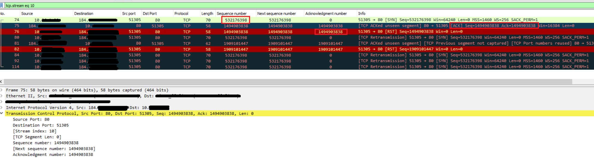
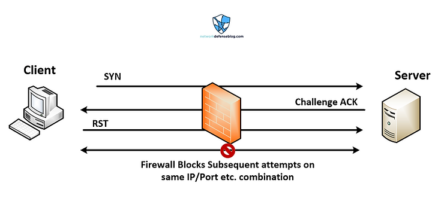
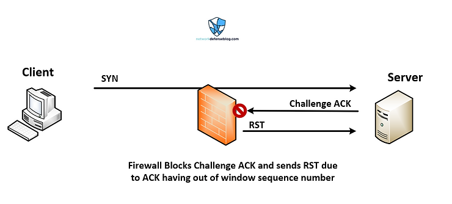

# Challenge ACK

> [https://www.networkdefenseblog.com/post/wireshark-tcp-challenge-ack](https://www.networkdefenseblog.com/post/wireshark-tcp-challenge-ack)

## Background

First, during normal TCP connection conditions a 3-way handshake is established. The client will send a TCP packet with the SYN (Synchronization) flag set, secondly the receiving server will send its own SYN with the ACK (Acknowledgement) flag also set. This is so it can acknowledge the previous SYN from the client. Finally during the 3rd step the client  will respond with an ACK to the SYN the server sent. After that the two computers can exchange whatever data they intended. Also during the life of the TCP connection there are numbers called 'sequence numbers' which are used to track the exchange of information, this fact will be important later. 

Simple right, you've probably heard it a 100 times. BUT what do you do if you see something happening during the 3-way handshake that is puzzling? In this case the packet captures were showing the server was sending an ACK on part 2 of the 3-way handshake without the SYN flag set which was causing the client to send a `TCP RST (reset)` and therefore not establishing the connection as it should. 

## The Case of the Challenge ACK

The scope of the problem was certain websites all hosted by the same provider (who will not be named) couldn't load or redirect to a different page. It appeared a lot of different websites all had the same IP A record, i.e. were resolving to the same IP address. I assume this is due to some type of proxy or load- balancer receiving the connections before the web servers. Another thing was some of the websites reported actually needed redirects, so without the established TCP connection the HTTP 301 redirect never came to the client PC. 

First thing I checked was DNS internal vs. external - because you know, its *always* DNS. That checked out fine. After trying a few times over the course of 2 days the websites finally stopped being reachable so then I began checking firewalls logs for the IP address of my test machine and then did packet captures. That is when I noticed the 3-way handshake was not completing. 

Essentially what I ran into was the server side sending a "`Challenge ACK`" aka Arbitrary(随意的) ACK reply aka blind TCP reset attack mitigation. This is outlined in [RFC 5961 Sec 3 and 4](https://tools.ietf.org/html/rfc5961#section-4). 

As you can see from the below screenshot of the packet capture, the client was sending the typical SYN, however the reply from the server only had the ACK flag set (second packet is highlighted providing the info in the lower plane), and <mark>the acknowledgement number wasn't even matching the original SYN's sequence number(即 server 以不正确的 ack seq no 回应)</mark>. If you look at the first screenshot of the post you can see how the acknowledged sequence number matches with what the client sent. 

The first packet listed is the client SYN, you can see the sequence number is 532176398, however in the second packet which is the challenge ACK from the server you can see the acknowledged sequence number is 1494903838 which doesn't appear to match the flow. It should have been 532176399 with the SYN flag also set. The client then sends a reset matching that sequence number. 

上图可见，client 对于 server 发来的两个 `Challenge ACK` 回复了两个 `RST`。之后 client 继续 retrans SYN, server 不再回应了。

I later would come to find out that this is correct behavior per the RFC:

> A legitimate peer, after restart, would not have a TCB in the synchronized state.  Thus, when the ACK arrives, the peer should send  a RST segment back with the sequence number derived from the ACK field that caused the RST.
>
> 合法对等点在重启后不会有处于同步状态的 TCB。 因此，当 ACK 到达时，对等方应发回一个 RST 段，其中包含从导致 RST 的 ACK 字段派生的序列号。

When the client sends the reset it basically closes that connection on the server which could still be open from a previous flow with the same parameters. So when the client retransmits and tries to open the connection again the server replies with the expected SYN/ACK. 

当客户端发送重置时，它促使服务器上的失效旧连接关闭。 因此，当客户端后继重新传输并尝试再次打开连接时，服务器会回复预期的 SYN/ACK。

Back to the firewall. Once the client reset was seen by the firewall(may be Linux conntrack) it was marking the connection as completed and dropping subsequent attempts from the client to establish the connection. This next diagram displays this simply:

From my research it seems a lot of session tracking mechanisms would block this. For example the `Cisco ASA` likely would drop it due to "TCP Reset-I" or reset seen from internal host, and in my case the `Palo Alto` firewall was dropping it due to "**out-of-window-packet-drop**". Furthermore, it appears some firewalls performing TCP intercept could potentially drop the challenge ACK before forwarding it to the client. The example below shows the possibility where a reset was sent directly due to dropping the connection before its even established between client and server. This would be dependent on vendor platform and configuration etc.

I speculate this challenge ACK was being done by the hosting company because of a DDoS mitigation type mechanism to prevent an excessive amount of SYNs from the same IP or to verify clients are legitimate, because in the case of an attack a lot of times the source addresses would be spoofed. 

Alternatively, perhaps the server is running out of available TCP sockets so it is using the client RSTs to free up connections on reused ports. This would apply if the server still thought the connection was active, it would reply with an acknowledgment of what sequence number it was expecting next. i.e. in the case of NAT you could potentially have a large number of requests coming from a few IP addresses if a large enterprise is accessing the same website/IP or something similar. 

# RFC 5961 - Improving TCP's Robustness to Blind In-Window Attacks

> [https://datatracker.ietf.org/doc/html/rfc5961#section-3](https://datatracker.ietf.org/doc/html/rfc5961#section-3)

以下的发送 `challenge ACK` 立足于以下假设：

1. 触发发送的条件是一个可疑的，可能是填写了假冒 src ip 的远端发过来的 tcp packet。可疑的原因是 tcp packet seq no 不在 tcp 窗口内要求的位置上。如果这个可疑是 false 的，发送 `challenge ACK` 也不会引发副作用。
2. ip router 是可信的，发送 `challenge ACK` 会抵达到真正的 tcp peer，而不是上面的 假冒 peer。真正的 tcp peer 在收到这个 `challenge ACK` 后，不会引发副作用。

## 3. Blind Reset Attack Using the RST Bit

### 3.1.  Description of the Attack

   As described in the introduction, it is possible for an attacker to
   generate a RST segment that would be acceptable to a TCP receiver by
   guessing in-window sequence numbers.  In particular [RFC0793], page
   37, states the following:

      In all states except SYN-SENT, all reset (RST) segments are
      validated by checking their SEQ-fields [sequence numbers].  A
      reset is valid if its sequence number is in the window.  In the
      SYN-SENT state (a RST received in response to an initial SYN), the
      RST is acceptable if the ACK field acknowledges the SYN.

### 3.2.  Mitigation

   [RFC0793] currently requires handling of a segment with the RST bit
   when in a synchronized state to be processed as follows:

   1) If the RST bit is set and the sequence number is outside the
      current receive window `(SEG.SEQ <= RCV.NXT || SEG.SEQ > RCV.NXT+
      RCV.WND`), silently drop the segment.

   2) If the RST bit is set and the sequence number is acceptable, i.e.,
      `(RCV.NXT <= SEG.SEQ < RCV.NXT+RCV.WND)`, then reset the connection.

   Instead, implementations SHOULD implement the following steps in
   place of those specified in [RFC0793] (as listed above).

      1) If the RST bit is set and the sequence number is outside the
      current receive window, silently drop the segment.

      2) If the RST bit is set and t**he sequence number exactly matches the**
      **next expected sequence number (RCV.NXT)**, then TCP MUST reset the
      connection.

   3) If the RST bit is set and the sequence number does not exactly
      match the next expected sequence value, yet is within the current
      receive window (RCV.NXT < SEG.SEQ < RCV.NXT+RCV.WND), TCP MUST
      send an acknowledgment (`challenge ACK`):

      `<SEQ=SND.NXT><ACK=RCV.NXT><CTL=ACK>`

      After sending the challenge ACK, TCP MUST drop the unacceptable
      segment and stop processing the incoming packet further.  Further
      segments destined to this connection will be processed as normal.

   The modified RST segment processing would thus become:

   In all states except SYN-SENT, all reset (RST) segments are validated
   by checking their SEQ-fields [sequence numbers].  A reset is valid if
   its sequence number exactly matches the next expected sequence
   number.  **If the RST arrives and its sequence number field does NOT**
   **match the next expected sequence number but is within the window,**
   **then the receiver should generate an ACK**.  In all other cases, where
   the SEQ-field does not match and is outside the window, the receiver
   MUST silently discard the segment.

   In the SYN-SENT state (a RST received in response to an initial SYN),
   the RST is acceptable if the ACK field acknowledges the SYN.  In all
   other cases the receiver MUST silently discard the segment.

   With the above slight change to the TCP state machine, it becomes
   much harder for an attacker to generate an acceptable reset segment.

   In cases where the remote peer did generate a RST, but it fails to
   meet the above criteria (the RST sequence number was within the
   window but NOT the exact expected sequence number), when the
   `challenge ACK`(这里假设只有真正的 remote peer 才能收到这个 challeng ACK) is sent back, it(首先发送 RST 的一方) will no longer have the transmission
   control block (TCB) related to this connection(因为在发送 RST 时已经删除了 TCB) and hence as per
   [RFC0793], the remote peer(首先发送 RST 的一方) will send a second RST back.  The sequence
   number of the second RST is derived from the acknowledgment number of
   the incoming ACK.  This second RST, if it reaches the sender, will
   cause the connection to be aborted since the sequence number would
   now be an exact match.

   A valid RST received out of order would still generate a challenge
   ACK in response.  If this RST happens to be a genuine（真的） one, the other
   end would send an RST with an exact sequence number match that would
   cause the connection to be dropped.

   Note that the above mitigation may cause a non-amplification(非放大) ACK
   exchange.  This concern is discussed in Section 10.

## 4.  Blind Reset Attack Using the SYN Bit

4.1.  Description of the Attack

   The analysis of the reset attack using the RST bit highlights another
   possible avenue(途径) for a blind attacker using a similar set of sequence
   number guessing.  Instead of using the RST bit, an attacker can use
   the SYN bit with the exact same semantics to tear down a connection.

4.2.  Mitigation

   [RFC0793] currently requires handling of a segment with the SYN bit
   set **in the synchronized state** to be as follows:

   1) If the SYN bit is set and the sequence number is outside the
      expected window, send an ACK back to the sender.

   2) If the SYN bit is set and the sequence number is acceptable, i.e.,
      (RCV.NXT <= SEG.SEQ < RCV.NXT+RCV.WND), then send a RST segment to
      the sender.(所以填假 src ip 者，成功 reset 了真的连接)

   Instead, the handling of the SYN **in the synchronized state** SHOULD be
   performed as follows:

   1) If the SYN bit is set, irrespective(不管) of the sequence number, TCP
      MUST send an ACK (also referred to as challenge ACK) to the remote
      peer:

      `<SEQ=SND.NXT><ACK=RCV.NXT><CTL=ACK>`

      After sending the acknowledgment, TCP MUST drop the unacceptable
      segment and stop processing further.

   By sending an ACK, the remote peer is challenged to confirm the loss
   of the previous connection and the request to start a new connection.
   A legitimate(合法的) peer, after restart, would not have a TCB in the
   synchronized state.  Thus, when the ACK arrives, the peer should send
   a RST segment back with the sequence number derived from the ACK
   field that caused the RST.

   This RST will confirm that the remote peer has indeed closed the
   previous connection.  **Upon receipt of a valid RST, the local TCP**
   **endpoint MUST terminate its connection**.  The local TCP endpoint
   should then rely on SYN retransmission from the remote end to
   re-establish the connection.

   A spoofed(欺骗) SYN, on the other hand, will then have generated an
   additional ACK that the peer will discard as a duplicate ACK and will
   not affect the established connection.

   Note that this mitigation does leave one corner case un-handled,
   which will prevent the reset of a connection when it should be reset
   (i.e., it is a non-spoofed SYN wherein a peer really did restart).
   This problem occurs when the restarting host chooses the exact same
   IP address and port number that it was using prior to its restart.
   By chance, the restarted host must also choose an initial sequence
   number of exactly (RCV.NXT - 1) of the remote peer that is still in
   the established state.  Such a case would cause the receiver to
   generate a "challenge" ACK as described above.  But since the ACK
   would be within the outgoing connections window, the inbound ACK
   would be acceptable, and the sender of the SYN will do nothing with
   the response ACK.  This sequence will continue as the SYN sender
   continually times out and retransmits the SYN until such time as the
   connection attempt fails.

   This corner case is a result of the [RFC0793] specification and is
   not introduced by these new requirements.

   Note that the above mitigation may cause a non-amplification ACK
   exchange.  This concern is discussed in Section 10.

