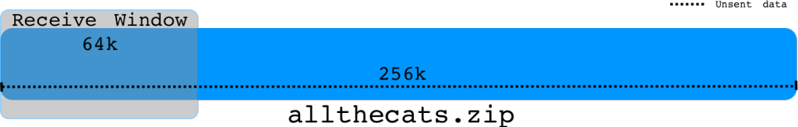
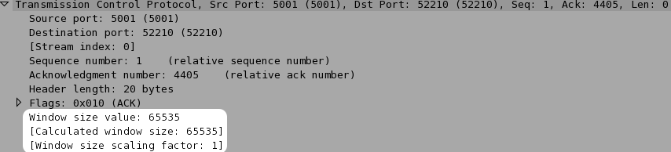
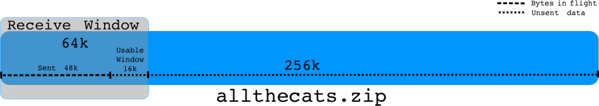
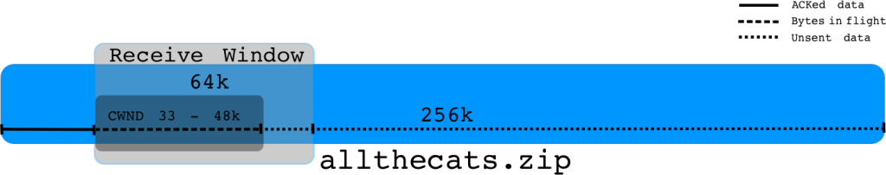
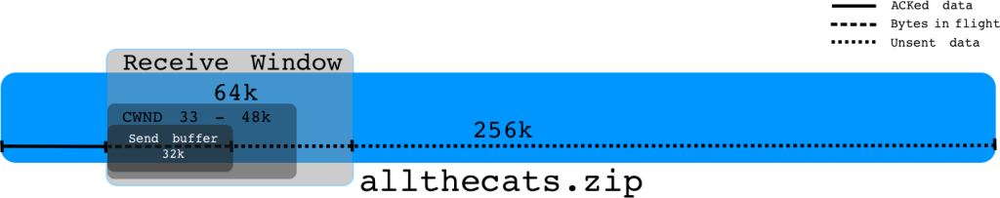

# Understanding Throughput and TCP Windows

> [https://packetbomb.com/understanding-throughput-and-tcp-windows/](https://packetbomb.com/understanding-throughput-and-tcp-windows/)

Throughput is generally measured in the amount of data sent over time e.g. bits or bytes per second. Sending more bits in a shorter amount of time equals higher throughput. So let’s talk about some of the factors that control how much data can be sent in a given time period.

Here’s some data represented as a stream:

The amount of data we can send is the minimum of:

- the amount the receiver says it can receive and
- the amount the sender thinks it can send

That makes sense, right?

## Receive Window

The receiver advertises to the sender how much data it can receive and buffer. This is representative of the free buffer space for the socket (SO\_RCVBUF).

So for the data stream, the amount of data that can be received from the receiver’s perspective is:  

It’s pretty straight forward. The amount of free space in the receive buffer is advertised to the sender in every ACK packet as the Window Size.

## Send Window

The amount of data the sender can send is more complicated. The upper bound is the receiver’s advertised window, the sender can’t send more than that or data will be discarded. Here are some factors to consider:

1. The amount of unacknowledged data already sent i.e. bytes in flight
2. The congestion window (cwnd)
3. The send buffer size (SO\_SNDBUF)

Let’s examine each of these.

### Bytes in Flight

Bytes in flight is the amount of data that has been sent but not yet acknowledged. If the receiver’s window is 64k and we’ve sent 48k that hasn’t yet been acknowledged, then we can only send 16k more before we fill the receive window. Once we receive an ACK with an updated Window Size, we can send more data.  

### Congestion Window

The congestion window (cwnd) is the sender’s flow control that is based on the network capacity and conditions. It is usually referred to in multiples of maximum segment size (MSS). So an MSS of 1460 and a cwnd of 33 would be ~48k bytes. The cwnd at the beginning of a connection is usually 2, 3, or 10 depending on the operating system and kernel version. The cwnd is initially increased by TCP Slow Start. Read more at [PacketLife’s excellent post on Slow Start](http://packetlife.net/blog/2011/jul/5/tcp-slow-start/). Once the cwnd reaches the Slow Start threshold (ssthresh) or there is data loss due to congestion, the cwnd growth changes to a congestion avoidance algorithm.

Eventually the congestion window will increase up to either the network’s limit due to congestion or hit the receiver’s window limit. Even if the receiver’s window (rwnd) is 64k, the sender is bound by the cwnd. It might be that the current network conditions do not support having 64k of outstanding data buffered in the network. In this sense, the amount of data the sender can send is the minimum of the rwnd and the cwnd.

### Send Buffer

Send buffer size is the size of the socket send buffer. This is the buffer that the application writes data to for TCP to send. It the application doesn’t specify a size, a default size is used. The optimal send buffer size depends on the bandwidth delay product (BDP) i.e. how much data the network can buffer as a product of bandwidth and latency. Let’s see what [MSDN](http://msdn.microsoft.com/en-us/library/windows/desktop/bb736549(v=vs.85).aspx) has to say:

> When sending data over a TCP connection using Windows sockets, it is important to keep a sufficient amount of data outstanding (sent but not acknowledged yet) in TCP in order to achieve the highest throughput. The ideal value for the amount of data outstanding to achieve the best throughput for the TCP connection is called the ideal send backlog (ISB) size. The ISB value is a function of the bandwidth-delay product of the TCP connection and the receiver’s advertised receive window (and partly the amount of congestion in the network).

Now here’s the important part:

> Applications that perform one blocking or non-blocking send request at a time typically rely on internal send buffering by Winsock to achieve decent throughput. The send buffer limit for a given connection is controlled by the SO\_SNDBUF socket option. For the blocking and non-blocking send method, **the send buffer limit determines how much data is kept outstanding in TCP**. If the ISB value for the connection is larger than the send buffer limit, then the throughput achieved on the connection will not be optimal.

For instance:

If the bandwidth is 20Mbps and the round trip time (rtt) is 40ms, the BDP is 20000000/8 \* .04 = 100k. So 100kB is the maximum amount of data that can be in transit in the network at one time.

If the receive window is 64k and the cwnd opens up to 48k, but the send buffer is 32k, we’re not able to fill the available send window of 48k. In this case we’re limited by the send buffer size.

### Summary

Many factors control the sender’s throughput. The sender can’t send more data at one time than the advertised receive window. The sender can’t send more data at one time than the congestion window. The sender can’t send more data at one time than is available in the send buffer.

One thing we didn’t talk about in detail is latency. These factors’ impact is lessened by low latency and increased by higher latency. The round trip time can make or break the performance depending on these other factors.

The receive window is right there in the TCP header, but cwnd and send buffer size aren’t. So how do we know which factor might be limiting throughput? I’ll show you how in the link below.

### Analysis

Ok! Let’s look at some real examples of throughput being limited by these factors.
