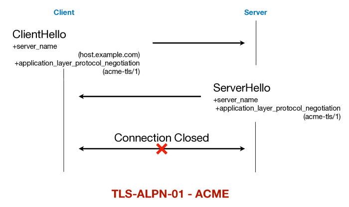

# ALPN

ALPN, [https://tools.ietf.org/html/rfc7301](https://tools.ietf.org/html/rfc7301)

## Use Case

### ACME

> [https://medium.com/geekculture/exploring-application-layer-protocol-negotiation-alpn-c47b5ec3b419](https://medium.com/geekculture/exploring-application-layer-protocol-negotiation-alpn-c47b5ec3b419)

Another major use of ALPN is in automated certificate issuance. It was [discovered in early 2018](https://community.letsencrypt.org/t/important-what-you-need-to-know-about-tls-sni-validation-issues/50811) that the SNI based method used by [Automatic Certificate Management Environment (ACME)](https://tools.ietf.org/html/rfc8555) protocol, for domain validation over *https* port, was insecure. This prompted a [new challenge method](https://tools.ietf.org/html/rfc8737) for domain validation over ALPN.

ALPN protocol id **“acme-tls/1”** is assigned for this purpose. A supporting client and server will use **“acme-tls/1”** in ALPN extension to perform the domain validation. An interesting fact to note is, there is [no application data](https://tools.ietf.org/html/rfc8737#section-4).

> The protocol consists of a TLS handshake in which the required validation information is transmitted. The “acme-tls/1” protocol does not carry application data. Once the handshake is completed, the client MUST NOT exchange any further data with the server and MUST immediately close the connection.
