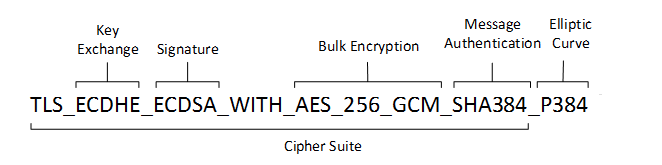

# Cipher Suite(密码套件)

各版本的 TLS 都支持不同的的密码套件（Cipher Suite）。

## 命名规范


同一个 Cipher Suite，也有两种命名规范（习惯）：

 - OpenSSL
 - IANA

他们的对应关系见：

> https://testssl.sh/openssl-iana.mapping.html

### IANA 格式

> [https://learn.microsoft.com/en-us/windows/win32/secauthn/cipher-suites-in-schannel](https://learn.microsoft.com/en-us/windows/win32/secauthn/cipher-suites-in-schannel)
>
> 


> [https://en.m.wikipedia.org/wiki/Cipher_suite](https://en.m.wikipedia.org/wiki/Cipher_suite)
>
> For example: `TLS_ECDHE_RSA_WITH_AES_128_GCM_SHA256`
>
> The meaning of this name is:
>
> - _TLS_ defines the protocol that this cipher suite is for; it will usually be TLS.
> - _ECDHE_ indicates the [key exchange algorithm](https://en.m.wikipedia.org/wiki/Key_exchange_algorithm "Key exchange algorithm") being used.
> - _RSA_ authentication mechanism during the handshake.
> - _AES_ session cipher.
> - _128_ session encryption key size (bits) for cipher.
> - _GCM_ type of encryption (cipher-block dependency and additional options).
> - _SHA_ (SHA2)hash function. For a digest of 256 and higher. Signature mechanism. Indicates the [message authentication algorithm](https://en.m.wikipedia.org/wiki/Message_authentication_code "Message authentication code") which is used to authenticate a message.
> - _256_ Digest size (bits).


> [https://www.thesslstore.com/blog/explaining-ssl-handshake/](https://www.thesslstore.com/blog/explaining-ssl-handshake/)
>
> ### TLS 1.2 Cipher Suites
>
> This is an example of a TLS 1.2 cipher suite, I’ve color-coded it to make it easier to read:
>
> 
>
> - TLS is the protocol
> - ECDHE is the key exchange algorithm
> - ECDSA is the authentication algorithm
> - AES 128 GCM is the symmetric encryption algorithm
> - SHA256 is the hashing algorithm.
>
> In the example above, we’re using Elliptic Curve Diffie-Hellman Ephemeral for key exchange and Elliptic Curve Digital Signature Algorithm for authentication. DH can also be paired with RSA (functioning as a digital signature algorithm) to accomplish authentication.
>
> As we’ll cover in the next section, this entire portion of the cipher suite has been removed from negotiation in the TLS 1.3 handshake.
>
> ### TLS 1.3 Cipher Suites
>
> TLS 1.3 has made countless improvements over its predecessors, which is good considering [it was in development for about a decade](https://www.thesslstore.com/blog/tls-1-3-approved/). The IETF removed support for older outmoded algorithms and streamlined everything, shortening the entire handshake from two round trips to one and reducing the sizes of cipher suites from four negotiations/algorithms to two.
>
> The number of supported cipher suites has also dropped from 37 to five. Here’s an example of a TLS 1.3 cipher suite:
>
> 
>
> - TLS is the protocol
> - AES 256 GCM is the Authenticated Encryption with Associated Data (AEAD) algorithm
> - SHA384 is the Hashed-Key Derivation Function (HKFD) algorithm
>
> We already know we’re going be using some version of Diffie-Hellman Ephemeral key exchange, we just don’t know the parameters, so that means that the first two algorithms in the TLS 1.2 cipher suite are no longer needed. Those functions are still occurring, they just no longer need to be negotiated during the handshake.
>
> From the example above you can see we’re using AES or the Advanced Encryption Standard, as our symmetric bulk cipher. It’s running in Galois Counter Mode using 256-bit keys. We’re using SHA384 ([part of the SHA2 family](https://www.thesslstore.com/blog/difference-sha-1-sha-2-sha-256-hash-algorithms/)) as our HKFD hash algorithm. If that’s all French to you, we’ll explain it in the next session.
>
> Here are the five supported TLS 1.3 cipher suites:
>
> - TLS_AES_256_GCM_SHA384
> - TLS_CHACHA20_POLY1305_SHA256
> - TLS_AES_128_GCM_SHA256
> - TLS_AES_128_CCM_8_SHA256
> - TLS_AES_128_CCM_SHA256


不同的 Library 支持的 Cipher Suite 也不同。见下面 boringssl 的例子。

## key exchange algorithm(密钥交换算法)


```{toctree}
key-exchange-algorithm.md
```

## Data integrity(数据完整性校验)

> [https://en.m.wikipedia.org/wiki/Transport_Layer_Security](https://en.m.wikipedia.org/wiki/Transport_Layer_Security)


|                          Algorithm                           | SSL 2.0 | SSL 3.0 | TLS 1.0 | TLS 1.1 | TLS 1.2 | TLS 1.3 |           Status            |
| :----------------------------------------------------------: | :-----: | :-----: | :-----: | :-----: | :-----: | :-----: | :-------------------------: |
| [HMAC](https://en.m.wikipedia.org/wiki/HMAC)-[MD5](https://en.m.wikipedia.org/wiki/MD5) |   Yes   |   Yes   |   Yes   |   Yes   |   Yes   |   No    | Defined for TLS 1.2 in RFCs |
| [HMAC](https://en.m.wikipedia.org/wiki/HMAC)-[SHA1](https://en.m.wikipedia.org/wiki/SHA-1) |   No    |   Yes   |   Yes   |   Yes   |   Yes   |   No    |                             |
| [HMAC](https://en.m.wikipedia.org/wiki/HMAC)-[SHA256/384](https://en.m.wikipedia.org/wiki/SHA-2) |   No    |   No    |   No    |   No    |   Yes   |   No    |                             |
| [AEAD](https://en.m.wikipedia.org/wiki/AEAD_block_cipher_modes_of_operation) |   No    |   No    |   No    |   No    |   Yes   |   Yes   |                             |
| [GOST 28147-89 IMIT](https://en.m.wikipedia.org/wiki/GOST_28147-89)[[60\]](https://en.m.wikipedia.org/wiki/Transport_Layer_Security#cite_note-gostlink-60) |   No    |   No    |   Yes   |   Yes   |   Yes   |    ?    |   Proposed in RFC drafts    |
| [GOST R 34.11-94](https://en.m.wikipedia.org/wiki/GOST_(hash_function))[[60\]](https://en.m.wikipedia.org/wiki/Transport_Layer_Security#cite_note-gostlink-60) |   No    |   No    |   Yes   |   Yes   |   Yes   |    ?    |                             |

