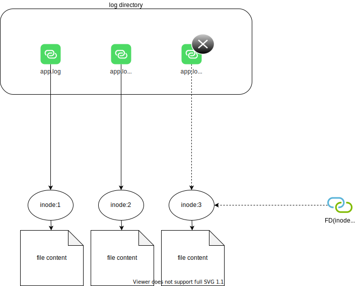

# Filebeat

## VFS

首先，看看 Linux 的虚拟文件系统 VFS 的基本概念：

这里，一点需要注意的是：如果文件被 filebeat 打开后，应用的 logback 可以在目录中删除了日志文件。但文件内容(inode)其实并未删除， filebeat 可以继续读取删除了的文件。logback 可以在目录中新建与原来文件名相同的文件。即这种情况下，被删除的文件是 headless(file's stat.NLink==0) 的。

如果删除的文件已经没有进程打开，那么在 xfs 文件系统下，inode id 会很快被重用。即很可能新文件的 inode id 与刚被删除的文件相同：
[The XFS inode allocation algorithm aggressively reuses recently freed inodes. This is historical behavior that has been in place for quite some time, since XFS was imported to mainline Linux](https://patchwork.kernel.org/project/xfs/patch/20220121142454.1994916-1-bfoster@redhat.com/)

## 配置

然后看看 filebeat 的一些配置与其关系：

*[用 Draw.io 打开](https://app.diagrams.net/?ui=sketch#Uhttps%3A%2F%2Fdevops-insider.mygraphql.com%2Fzh_CN%2Flatest%2F_images%2Ffilebeat-conf.drawio.svg)*

## 运行期组件

*[用 Draw.io 打开](https://app.diagrams.net/?ui=sketch#Uhttps%3A%2F%2Fdevops-insider.mygraphql.com%2Fzh_CN%2Flatest%2F_images%2Ffilebeat-goroutines.drawio.svg)*

## 更优秀的文章

 - [监控日志系列---- Filebeat原理](https://kingjcy.github.io/post/monitor/log/collect/filebeat/filebeat-principle/)
 - [容器日志采集利器：Filebeat深度剖析与实践](http://ethfoo.xyz/posts/logging/%E5%AE%B9%E5%99%A8%E6%97%A5%E5%BF%97%E9%87%87%E9%9B%86%E5%88%A9%E5%99%A8filebeat%E6%B7%B1%E5%BA%A6%E5%89%96%E6%9E%90%E4%B8%8E%E5%AE%9E%E8%B7%B5/)
 - [ELK 背压浅探](https://emergencyexit.xyz/elk-back-pressure-study.html)
 - [The XFS inode allocation algorithm aggressively reuses recently freed inodes. This is historical behavior that has been in place for quite some time, since XFS was imported to mainline Linux](https://patchwork.kernel.org/project/xfs/patch/20220121142454.1994916-1-bfoster@redhat.com/)