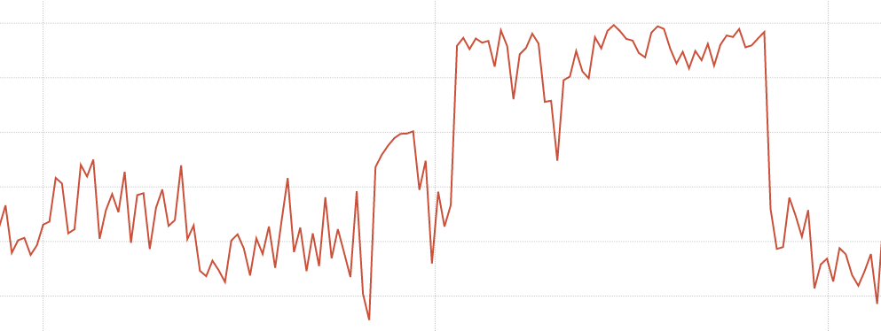

# CPU frequency scaling metrics from the node exporter

> https://www.robustperception.io/cpu-frequency-scaling-metrics-from-the-node-exporter/

Modern CPUs don't run at one constant frequency.

To save power CPUs can reduce the frequency they run at, which is quite useful for battery based devices like laptops. So while [CPU metrics](https://www.robustperception.io/new-features-in-prometheus-2-20-0) give you the proportion of time in each mode, one second of user time isn't always represent same amount of work as another second of user time. This can be a problem when running benchmarks.

Linux provides information about this under `/sys/devices/system/cpu/*/cpufreq/`, and on my desktop the node exporter produces:

```
# HELP node_cpu_frequency_max_hertz Maximum cpu thread frequency in hertz.
# TYPE node_cpu_frequency_max_hertz gauge
node_cpu_frequency_max_hertz{cpu="0"} 3.4e+09
node_cpu_frequency_max_hertz{cpu="1"} 3.4e+09
# HELP node_cpu_frequency_min_hertz Minimum cpu thread frequency in hertz.
# TYPE node_cpu_frequency_min_hertz gauge
node_cpu_frequency_min_hertz{cpu="0"} 1.6e+09
node_cpu_frequency_min_hertz{cpu="1"} 1.6e+09
# HELP node_cpu_scaling_frequency_hertz Current scaled cpu thread frequency in hertz.
# TYPE node_cpu_scaling_frequency_hertz gauge
node_cpu_scaling_frequency_hertz{cpu="0"} 2.352192e+09
node_cpu_scaling_frequency_hertz{cpu="1"} 2.243048e+09
# HELP node_cpu_scaling_frequency_max_hertz Maximum scaled cpu thread frequency in hertz.
# TYPE node_cpu_scaling_frequency_max_hertz gauge
node_cpu_scaling_frequency_max_hertz{cpu="0"} 3.4e+09
node_cpu_scaling_frequency_max_hertz{cpu="1"} 3.4e+09
# HELP node_cpu_scaling_frequency_min_hertz Minimum scaled cpu thread frequency in hertz.
# TYPE node_cpu_scaling_frequency_min_hertz gauge
node_cpu_scaling_frequency_min_hertz{cpu="0"} 1.6e+09
node_cpu_scaling_frequency_min_hertz{cpu="1"} 1.6e+09
```

 

`node_cpu_frequency_max_hertz` and `node_cpu_frequency_min_hertz` are the limits of what the hardware can do. `node_cpu_scaling_frequency_max_hertz` and `node_cpu_scaling_frequency_min_hertz` are the limits within which the kernel will stay, and can be adjusted at runtime - such as if you need consistent performance in order to run a benchmark.

`node_cpu_scaling_frequency_hertz` is what the kernel believes the current frequency is. There's also a `node_cpu_frequency_hertz`, which my desktop above doesn't produce, which is the current frequency value from the hardware.

 

The data is naturally noisy, but smoothing the scaling frequency a bit with `avg_over_time` it's fairly obvious when I was gaming last night from the higher CPU frequency:[](https://www.robustperception.io/wp-content/uploads/2020/08/Screenshot_2020-08-06_17-17-25.png)

 

More information is available in the [kernel docs](https://www.kernel.org/doc/Documentation/cpu-freq/user-guide.txt). If you're playing with CPU performance settings, it's generally wise to keep an eye on [temperature](https://www.robustperception.io/temperature-and-hardware-monitoring-metrics-from-the-node-exporter).
