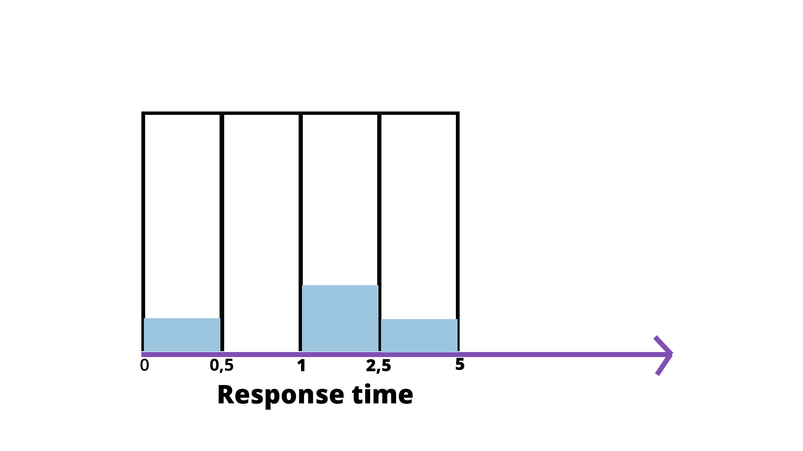

# Histograms 与 Summary 比较



*上图源自：https://isitobservable.io/observability/prometheus/how-to-build-a-promql-prometheus-query-language*

> https://prometheus.io/docs/practices/histograms/

Histograms and summaries are more complex metric types. Not only does a single histogram or summary create a multitude of time series, it is also more difficult to use these metric types correctly. This section helps you to pick and configure the appropriate metric type for your use case.

## Library support

First of all, check the library support for [histograms](https://prometheus.io/docs/concepts/metric_types/#histogram) and [summaries](https://prometheus.io/docs/concepts/metric_types/#summary).

Some libraries support only one of the two types, or they support summaries only in a limited fashion (lacking [quantile calculation](https://prometheus.io/docs/practices/histograms/#quantiles)).

## Count and sum of observations

Histograms and summaries both sample observations, typically request durations or response sizes. They track the number of observations *and* the sum of the observed values, allowing you to calculate the *average* of the observed values. Note that:

-  the number of observations (showing up in Prometheus as a time series with a `_count` suffix) is inherently a counter (as described above, it only goes up). 
- The sum of observations (showing up as a time series with a `_sum` suffix) behaves like a counter, too, as long as there are no negative observations. Obviously, request durations or response sizes are never negative. In principle, however, you can use summaries and histograms to observe negative values (e.g. temperatures in centigrade). In that case, the sum of observations can go down, so you cannot apply `rate()` to it anymore. In those rare cases where you need to apply `rate()` and cannot avoid negative observations, you can use two separate summaries, one for positive and one for negative observations (the latter with inverted sign), and combine the results later with suitable PromQL expressions.

To calculate the average request duration during the last 5 minutes from a histogram or summary called `http_request_duration_seconds`, use the following expression:

```
  rate(http_request_duration_seconds_sum[5m])
/
  rate(http_request_duration_seconds_count[5m])
```

## Apdex score

A straight-forward use of histograms (but not summaries) is to count observations falling into particular buckets of observation values.

You might have an SLO to serve 95% of requests within 300ms. In that case, configure a histogram to have a bucket with an upper limit of 0.3 seconds. You can then directly express the relative amount of requests served within 300ms and easily alert if the value drops below 0.95. The following expression calculates it by job for the requests served in the last 5 minutes. The request durations were collected with a histogram called `http_request_duration_seconds`.

```
  sum(rate(http_request_duration_seconds_bucket{le="0.3"}[5m])) by (job) #5m内小于 300ms 的请求数
/
  sum(rate(http_request_duration_seconds_count[5m])) by (job) #5m内总请求数
```

You can approximate the well-known [Apdex score](https://en.wikipedia.org/wiki/Apdex) in a similar way. Configure a bucket with the target request duration as the upper bound and another bucket with the tolerated request duration (usually 4 times the target request duration) as the upper bound. Example: The target request duration is 300ms. The tolerable request duration is 1.2s. The following expression yields the Apdex score for each job over the last 5 minutes:

```
(
  sum(rate(http_request_duration_seconds_bucket{le="0.3"}[5m])) by (job)
+
  sum(rate(http_request_duration_seconds_bucket{le="1.2"}[5m])) by (job)
) / 2 / sum(rate(http_request_duration_seconds_count[5m])) by (job)
```

Note that we divide the sum of both buckets. The reason is that the histogram buckets are [cumulative](https://en.wikipedia.org/wiki/Histogram#Cumulative_histogram). The `le="0.3"` bucket is also contained in the `le="1.2"` bucket; dividing it by 2 corrects for that.

The calculation does not exactly match the traditional Apdex score, as it includes errors in the satisfied and tolerable parts of the calculation.


## Quantiles

You can use both `summaries` and `histograms` to calculate so-called `φ-quantiles`, where 0 ≤ φ ≤ 1. The φ-quantile is the observation value that ranks at number φ\*N among the N observations. Examples for φ-quantiles: The 0.5-quantile is known as the median. The 0.95-quantile is the 95th percentile.

The essential difference between `summaries` and `histograms` is that：

-  `summaries` calculate streaming φ-quantiles on the client side(这里指标准数据源，即被监控的应用) and expose them directly, 
- while `histograms` expose bucketed observation counts and the calculation of quantiles from the buckets of a histogram happens on the server side using the [`histogram_quantile()` function](https://prometheus.io/docs/prometheus/latest/querying/functions/#histogram_quantile).

The two approaches have a number of different implications:

|                                                              | Histogram                                                    | Summary                                                      |
| ------------------------------------------------------------ | ------------------------------------------------------------ | ------------------------------------------------------------ |
| Required configuration                                       | Pick buckets suitable for the expected range of observed values. | Pick desired φ-quantiles and sliding window. Other φ-quantiles and sliding windows cannot be calculated later. |
| Client(这里指标准数据源，即被监控的应用) performance         | Observations are very cheap as they only need to increment counters. | Observations are expensive due to the streaming quantile calculation.(应用需要流式计算百分位) |
| Server performance                                           | The server has to calculate quantiles. You can use recording rules should the ad-hoc calculation take too long (e.g. in a large dashboard). | Low server-side cost.                                        |
| Number of time series (in addition to the _sum and _count series) | One time series per configured bucket.                       | One time series per configured quantile.                     |
| Quantile error (see below for details)                       | Error is limited in the dimension of observed values by the width of the relevant bucket. | Error is limited in the dimension of φ by a configurable value. |
| Specification of φ-quantile and sliding time-window          | Ad-hoc with Prometheus expressions.                          | Preconfigured by the client.                                 |
| Aggregation                                                  | Ad-hoc with Prometheus expressions.                          | In general not aggregatable.                                 |

Note the importance of the last item in the table. Let us return to the SLO of serving 95% of requests within 300ms. This time, you do not want to display the percentage of requests served within 300ms, but instead the 95th percentile, i.e. the request duration within which you have served 95% of requests. To do that, you can either configure a `summary` with a 0.95-quantile and (for example) a 5-minute decay(衰变) time, or you configure a `histogram` with a few buckets around the 300ms mark, e.g. `{le="0.1"}`, `{le="0.2"}`, `{le="0.3"}`, and `{le="0.45"}`. If your service runs replicated with a number of instances, you will collect request durations from every single one of them, and then you want to aggregate everything into an overall 95th percentile. However, aggregating the precomputed quantiles from a `summary` rarely makes sense. In this particular case, averaging the quantiles yields statistically nonsensical values.

```
avg(http_request_duration_seconds{quantile="0.95"}) // BAD! 原因之一是：在跨 pod 计算百分位时，每个应用的 pod 的 0.95 百分位的响应时间都是不一样的；且每个 pod 的负载也可能不同。
```

Using histograms, the aggregation is perfectly possible with the [`histogram_quantile()` function](https://prometheus.io/docs/prometheus/latest/querying/functions/#histogram_quantile).

```
histogram_quantile(0.95, sum(rate(http_request_duration_seconds_bucket[5m])) by (le)) // GOOD.
```

Furthermore, should your SLO change and you now want to plot the 90th percentile, or you want to take into account the last 10 minutes instead of the last 5 minutes, you only have to adjust the expression above and you do not need to reconfigure the clients.

...

Two rules of thumb（总结）:

1. If you need to `aggregate`, choose `histograms`.

2. Otherwise,

   Choose a `histogram` if you have an idea of the range and distribution of values that will be observed. 

   Choose a `summary` if you need an accurate quantile, no matter what the range and distribution of the values is.


## histogram_quantile() - histogram 转百分位

> [https://prometheus.io/docs/prometheus/latest/querying/functions/#histogram_quantile](https://prometheus.io/docs/prometheus/latest/querying/functions/#histogram_quantile)

`histogram_quantile(φ scalar, b instant-vector)` calculates the φ-quantile (0 ≤ φ ≤ 1) from the buckets `b` of a [histogram](https://prometheus.io/docs/concepts/metric_types/#histogram). (See [histograms and summaries](https://prometheus.io/docs/practices/histograms) for a detailed explanation of φ-quantiles and the usage of the histogram metric type in general.) The samples in `b` are the counts of observations in each bucket. Each sample must have a label `le` where the label value denotes the inclusive upper bound of the bucket. (Samples without such a label are silently ignored.) The [histogram metric type](https://prometheus.io/docs/concepts/metric_types/#histogram) automatically provides time series with the `_bucket` suffix and the appropriate labels.

Use the `rate()` function to specify the time window for the quantile calculation.

Example: A histogram metric is called `http_request_duration_seconds`. To calculate the 90th percentile of request durations over the last 10m, use the following expression:

```
histogram_quantile(0.9, rate(http_request_duration_seconds_bucket[10m]))
```

The quantile is calculated for each label combination in `http_request_duration_seconds`. To aggregate, use the `sum()` aggregator around the `rate()` function. Since the `le` label is required by `histogram_quantile()`, it has to be included in the `by` clause. The following expression aggregates the 90th percentile by `job`:

```
histogram_quantile(0.9, sum by (job, le) (rate(http_request_duration_seconds_bucket[10m])))
```

To aggregate everything, specify only the `le` label:

```
histogram_quantile(0.9, sum by (le) (rate(http_request_duration_seconds_bucket[10m])))
```

The `histogram_quantile()` function interpolates quantile values by assuming a linear distribution within a bucket. The highest bucket must have an upper bound of `+Inf`. (Otherwise, `NaN` is returned.) If a quantile is located in the highest bucket, the upper bound of the second highest bucket is returned. A lower limit of the lowest bucket is assumed to be 0 if the upper bound of that bucket is greater than 0. In that case, the usual linear interpolation is applied within that bucket. Otherwise, the upper bound of the lowest bucket is returned for quantiles located in the lowest bucket.

If `b` has 0 observations, `NaN` is returned. If `b` contains fewer than two buckets, `NaN` is returned. For φ < 0, `-Inf` is returned. For φ > 1, `+Inf` is returned. For φ = `NaN`, `NaN` is returned.

## 不错的资料

- [https://www.robustperception.io/how-does-a-prometheus-histogram-work/](https://www.robustperception.io/how-does-a-prometheus-histogram-work/)
- 