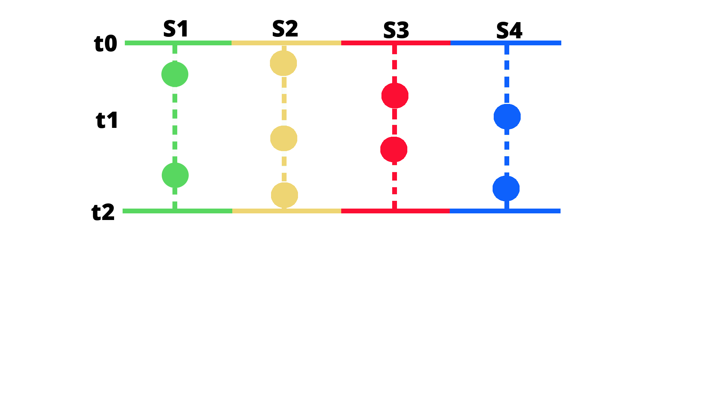
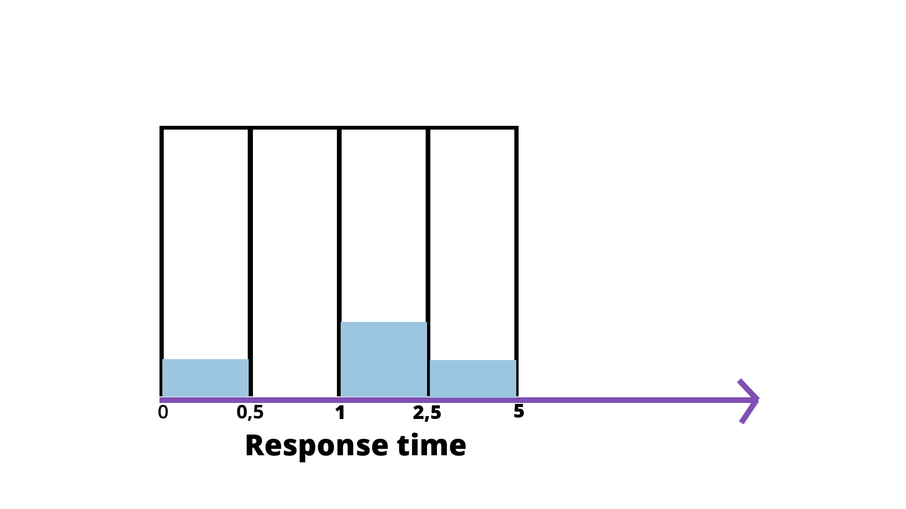

# METRIC TYPES

> https://prometheus.io/docs/concepts/metric_types/

The Prometheus client libraries offer four core metric types. These are currently only differentiated in the client libraries (to enable APIs tailored to the usage of the specific types) and in the wire protocol. The Prometheus server does not yet make use of the type information and flattens all data into untyped time series. This may change in the future.

> Prometheus 内部存储层并无 `Metric Type` 这个概念。只是在 client library 与 外部交互协议中有这个概念。

## Histogram

A _histogram_ samples observations (usually things like request durations or response sizes) and counts them in configurable buckets. It also provides a sum of all observed values.

A histogram with a base metric name of `<basename>` exposes multiple time series during a scrape:

- cumulative counters for the observation buckets, exposed as `<basename>_bucket{le="<upper inclusive bound>"}`
- the **total sum** of all observed values, exposed as `<basename>_sum`
- the **count** of events that have been observed, exposed as `<basename>_count` (identical to `<basename>_bucket{le="+Inf"}` above)

Use the [`histogram_quantile()` function](https://prometheus.io/docs/prometheus/latest/querying/functions/#histogram_quantile) to calculate quantiles from histograms or even aggregations of histograms. A histogram is also suitable to calculate an [Apdex score](https://en.wikipedia.org/wiki/Apdex). When operating on buckets, remember that the histogram is [cumulative](https://en.wikipedia.org/wiki/Histogram#Cumulative_histogram). See [histograms and summaries](https://prometheus.io/docs/practices/histograms) for details of histogram usage and differences to [summaries](https://prometheus.io/docs/concepts/metric_types/#summary).

**NOTE:** Beginning with Prometheus v2.40, there is experimental support for native histograms. A native histogram requires only one time series, which includes a dynamic number of buckets in addition to the sum and count of observations. Native histograms allow much higher resolution at a fraction of the cost. Detailed documentation will follow once native histograms are closer to becoming a stable feature.

## Summary

Similar to a _histogram_, a _summary_ samples observations (usually things like request durations and response sizes). While it also provides a total count of observations and a sum of all observed values, it calculates configurable quantiles(分位数s) over a `sliding time window`.

A summary with a base metric name of `<basename>` exposes multiple time series during a scrape:

- streaming **φ-quantiles** (0 ≤ φ ≤ 1) of observed events, exposed as `<basename>{quantile="<φ>"}`
- the **total sum** of all observed values, exposed as `<basename>_sum`
- the **count** of events that have been observed, exposed as `<basename>_count`

See [histograms and summaries](https://prometheus.io/docs/practices/histograms) for detailed explanations of φ-quantiles, summary usage, and differences to [histograms](https://prometheus.io/docs/concepts/metric_types/#histogram).

## Types of Prometheus metrics

> [https://isitobservable.io/observability/prometheus/how-to-build-a-promql-prometheus-query-language](https://isitobservable.io/observability/prometheus/how-to-build-a-promql-prometheus-query-language)

### Range vector

The range vector doesn’t give you one value, like the instant vector; it gives you a set of values measured between two timestamps.

### Histogram

The histogram allows you to specify values for predefined buckets. Here’s an example:

Let’s say I would like to report the http_response size. Every time I use the histogram to report, i.e., 2 seconds, then Prometheus will take my response times and count the number of requests fitting in specific buckets.

