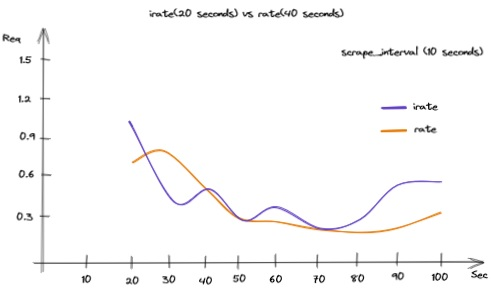

# Rate - 秒增量

## rate()


> [https://prometheus.io/docs/prometheus/latest/querying/functions/#rate](https://prometheus.io/docs/prometheus/latest/querying/functions/#rate)

`rate(v range-vector)` calculates the per-second average rate of increase of the time series in the range vector. Breaks in monotonicity (such as counter resets due to target restarts) are automatically adjusted for. Also, the calculation extrapolates(推断) to the ends of the time range, allowing for missed scrapes or imperfect alignment of scrape cycles with the range's time period.

The following example expression returns the per-second rate of HTTP requests as measured over the last 5 minutes, per time series in the range vector:

```
rate(http_requests_total{job="api-server"}[5m])
```

`rate` should only be used with counters. It is best suited for alerting, and for graphing of slow-moving counters.

Note that when combining `rate()` with an aggregation operator (e.g. `sum()`) or a function aggregating over time (any function ending in `_over_time`), always take a `rate()` first, then aggregate. Otherwise `rate()` cannot detect counter resets when your target restarts.

### What range should I use with rate()?

> [https://www.robustperception.io/what-range-should-i-use-with-rate/](https://www.robustperception.io/what-range-should-i-use-with-rate/)

Choosing what range to use with the `rate` function can be a bit subtle.

The general rule for choosing the range is that it should be at least 4x the `scrape interval`. This is to allow for various races, and to be resilient to a failed scrape.

Let's say you had a 10s `scrape interval`, and scrapes started at t=0. The rate function needs at least two samples to work, so for a query at t=10 you'd need 1x the `scrape interval`. At t=20, the scrape at that time may not have been fully ingested yet so 2x will cover you for two samples back to t=0. At t=29 that scrape might still not have been ingested, so you'd need ~3x to be safe. Finally you want to be resilient to a failed scrape. If the t=20 scrape fails and you're at t=39 but the t=30 scrape is still ongoing, then you'd need ~4x to see both the t=0 and t=10 samples. So a 40s rate (i.e. `rate(my_counter_total[40s]`) would be the minimum safe range. Usually you would round this up to 60s for a 1m rate.

Another consideration is that if you're using [query\_range](https://www.robustperception.io/step-and-query_range), such as in graphing, then the `range` should be at least the size of the `step`. Otherwise you'll skip over some data. Grafana's `$__rate_interval` can be useful here.

On the other hand you don't want to go too long for your ranges. If you take a rate over an hour and alert on that, that's all well and good until the underlying condition stops and then you have to wait an hour until the alert goes away. So on one hand longer ranges can make it easier to spot trends, but the averaging effect can also increase reaction times.

If you do want to have averages over different ranges (and rates are fundamentally averages), don't create recording rules for every potential range. That's wasteful, causes confusion, and can be challenging to maintain. This is as you can't compare rates over different ranges (e.g. a 5m rate and a 10m rate aren't directly comparable), and you'd have to track which is meant to be used where. As with scrape and evaluation intervals it's best to have one standard range for sanity - usually 1m, 2m, or 5m - so create one set of recording rule with a low range, and then use `avg_over_time` in graphs and alerts when you want to average over a longer period.

So to summarise, use a range that's at least 4x your `scrape interval`, choose one consistent range across your organisation for recording rules, and use `avg_over_time` if you need an average over a longer period for graphs and alerts.

## irate()

> [https://prometheus.io/docs/prometheus/latest/querying/functions/#irate](https://prometheus.io/docs/prometheus/latest/querying/functions/#irate)


`irate(v range-vector)` calculates the per-second instant rate of increase of the time series in the range vector. <mark>This is based on the last two data points</mark>. Breaks in monotonicity (such as counter resets due to target restarts) are automatically adjusted for.

The following example expression returns the per-second rate of HTTP requests looking up to 5 minutes back for the two most recent data points, per time series in the range vector:

```
irate(http_requests_total{job="api-server"}[5m])
```

<mark>`irate` should only be used when graphing volatile, fast-moving counters. Use `rate` for alerts and slow-moving counters</mark>, as brief changes in the `rate` can reset the `FOR` clause and graphs consisting entirely of rare spikes are hard to read. 

> `irate` 只在 counter 快速变化时适用。 在预警或慢速变化的 counter 中，应该使用 `rate`。

Note that when combining `irate()` with an [aggregation operator](https://prometheus.io/docs/prometheus/latest/querying/operators/#aggregation-operators) (e.g. `sum()`) or a function aggregating over time (any function ending in `_over_time`), always take a `irate()` first, then aggregate. Otherwise `irate()` cannot detect counter resets when your target restarts.

### `increase()`

> [https://prometheus.io/docs/prometheus/latest/querying/functions/#increase](https://prometheus.io/docs/prometheus/latest/querying/functions/#increase)

`increase(v range-vector)` calculates the increase in the time series in the range vector. Breaks in monotonicity (such as counter resets due to target restarts) are automatically adjusted for. The increase is extrapolated(推断) to cover the full time range as specified in the range vector selector, so that it is possible to get a non-integer result even if a counter increases only by integer increments.

The following example expression returns the number of HTTP requests as measured over the last 5 minutes, per time series in the range vector:

```
increase(http_requests_total{job="api-server"}[5m])
```

`increase` should only be used with counters. It is syntactic sugar for `rate(v)` multiplied by the number of seconds under the specified time range window, and should be used primarily for human readability. Use `rate` in recording rules so that increases are tracked consistently on a per-second basis.

## rate() versus irate()

> [https://utcc.utoronto.ca/~cks/space/blog/sysadmin/PrometheusRateVsIrate](https://utcc.utoronto.ca/~cks/space/blog/sysadmin/PrometheusRateVsIrate)

Prometheus's [PromQL](https://prometheus.io/docs/prometheus/latest/querying/basics/) query language has two quite similar functions for calculating the rate of things (well, of counters), [`rate()`](https://prometheus.io/docs/prometheus/latest/querying/functions/#rate()) and [`irate()`](https://prometheus.io/docs/prometheus/latest/querying/functions/#irate()). When I was starting out writing PromQL things, I found people singing the praises of each of them and sometimes suggesting that you avoid the other as misleading ([eg](https://www.robustperception.io/irate-graphs-are-better-graphs), [and](https://www.stroppykitten.com/technical/prometheus-grafana-statistics)). In particular, it's often said that you should use `irate()` lest you miss brief activity spikes, which is both true and not true depending on how exactly you use `irate()`. To explain that, I need to start with what these two functions do and go on to the corollaries.

`rate()` is the simpler function to describe. Ignoring things like counter resets, **`rate()` gives you the per second average rate of change over your range interval** by using the first and the last metric point in it (whatever they are, and whatever their timestamps are). Since it is the average over the entire range, it necessarily smooths out any sudden spikes; the only things that matter are the start and the end values and the time range between them.

As for `irate()`, I'll quote straight from the documentation:

> \[`irate()`\] calculates the per-second instant rate of increase of the time series in the range vector. _This is based on the last two data points_.

(Emphasis mine.)

In other words, **`irate()` is the per second rate of change at the end of your range interval**. Everything else in your range interval is ignored (if there are more than two data points in it).

There are some immediate corollaries(推论) that follow from this. 
- First, there's no point in giving `irate()` a particularly large range interval(<mark>给 irate() 一个特别大的区间是没有意义的</mark>); all you need is one that's a large enough to insure that it has two points in it. You'll need this to be somewhat larger than twice your scrape interval, but there's little point in going further than three or four times that. 
- Second, `irate()` is not going to be very useful on metrics that change less often than you scrape them, because some of the time the last two points that `irate()` will use are the same metric update, just scraped twice, and `irate()` will therefor report no change.<mark>即 `irate` 对短期变化更迟钝</mark>

(Consider, for example, a metric that you expose through the [node exporter](https://github.com/prometheus/node_exporter)'s `textfile` collector and generate once a minute from cron, while your Prometheus configuration scrapes the node exporter itself once every fifteen seconds. Three out of every four metric points collected by Prometheus are actually the same thing; only every fourth one represents a genuine new data point. Similar things can happen with metrics scraped from [Pushgateway](https://github.com/prometheus/pushgateway).)

Obviously, the difference between `rate()` and `irate()` basically vanish when the range interval gets sufficiently small. If your range interval for `rate()` only includes two metric points, it's just the same as `irate()`. However, it's easier to make `irate()` reliable at small range intervals; if you use `rate()`, it may be chancy to insure that your range interval always has two and only two points. `irate()` automatically arranges that for you by how it works.

Often when we use either `rate()` or `irate()`, we want to graph the result. Graphing means moving through time with [query steps](https://utcc.utoronto.ca/~cks/space/blog/sysadmin/PrometheusQuerySteps) and that means we get into interactions between the query step and both the range interval and the function you're using. In particular, **as the query step grows large enough, `irate()` will miss increasingly large amounts of changes**. This is because it is the instant rate of change at the _end_ of your range interval (using the two last metric points). When the query steps include more than two points in each interval, you lose the information from those extra points. As an extreme example, imagine a query step of five minutes and a metric that updates every thirty seconds. If you use `irate()`, you're only seeing the last minute out of every five minute slice of time; you have no idea of what happened in the other four minutes, including if there was an activity spike in them. If you use `rate()` instead, you can at least have some visibility into the total changes across those five minutes even if you don't capture any short term activity spikes.

There are two unfortunate corollaries of this for graphing. First, **the range interval you likely want to use for `rate()` depends partly on your query step**. For many graphs, there is no fixed one size fits all range interval for `rate()`. Depending on what you want to see, you might want a `rate()` range interval of either the query step (which will give you the `rate()` of disjoint sets of metric points) or somewhat more than the query step (which will give you somewhat overlapping metric points, and perhaps smooth things out). The second is that **whether you want to use `rate()` or `irate()` depends on whether your query step is small or large**. With a small query step and thus a high level of detail, you probably want to use `irate()` with a range interval that's large enough to cover three or four metric points. But for large query steps and only broad details, `irate()` will throw away huge amounts of information and you need to use `rate()` instead.

This is where we come to Grafana. Current versions of Grafana offer a [`$__interval` Grafana templating variable](http://docs.grafana.org/reference/templating/#the-interval-variable) that is the current query step, and you can plug that into a `rate()` expression. However, Grafana offers no way to switch between `rate()` and `irate()` depending on the size of this interval, and it also ties together the minimum interval and the minimum query step (as I sort of grumbled about in [this entry](https://utcc.utoronto.ca/~cks/space/blog/sysadmin/PrometheusQuerySteps)). This makes Grafana more flexible than basic interactive Prometheus usage, since you can make your `rate()` range intervals auto-adjust to fit the query steps for your current graphs and their time ranges. However you can't entirely get a single graph that will show you both fine details (complete with momentary spikes) over small time ranges and broad details over large time ranges.

(People who are exceedingly clever might be able to do something with Grafana's [`$__interval_ms`](http://docs.grafana.org/reference/templating/#the-interval-ms-variable) and multiple metric calculations.)

For our purposes, I think we want to use `rate()` instead of `irate()` in our regular Grafana dashboard graphs because we're more likely to be looking at broad overviews with fairly wide timescales. If we're looking at something in fine detail, we can turn to Prometheus and by-hand `irate()` based queries and graphs.

PS: Some of this is grumbling. For many practical purposes, a Grafana graph with a `rate()` range interval and query step that's down to twice your Prometheus metric update interval is basically as good as an `irate()` based graph at your metric update interval. And if you regularly need a Grafana dashboard for fine-grained examination of problems, you can build one that specifically uses `irate()` in places where it's actually useful.

**Sidebar: The minimum range interval versus the minimum query step**

Suppose that you have a continuously updating metric that Prometheus scrapes every fifteen seconds. To do a `rate()` or `irate()` of this, you need at least two metric points and thus a range interval of thirty seconds (at least; in practice you need a somewhat larger interval). However, you get a new metric value roughly every fifteen seconds and thus a potentially new rate of change every fifteen seconds as well (due to your new metric point). This means it's reasonable to look at a graph with a query step of fifteen seconds and an interval of thirty seconds.

(And you can't go below an interval of thirty seconds or so here, because once your range durations only include one metric point, both `rate()` and `irate()` stop returning anything and your graph disappears.)

### irate() vs rate() – What’re they telling you?

> [https://techannotation.wordpress.com/2021/07/19/irate-vs-rate-whatre-they-telling-you/](https://techannotation.wordpress.com/2021/07/19/irate-vs-rate-whatre-they-telling-you/)



Which one fit for me? When should I use the this different rate aggregator?
Well, there’s not a fixed rule for making such decision. It depends on what you’re going to show and what you want to highlight.
`irate()` is more susceptible(易受影响的) to data variations, while `rate()` gives us an overall traffic trend of our application.
As you’ve seen, the range interval play an important role in this calc. A best practice suggests us to set this value in the range of 10-60s.

Take note, another good practice to avoid data misinterpretation is to set, inside Grafana, Prometheus data source “`Scrape interval`” with the same interval of Prometheus configuration.

Both rates don’t catch spikes(尖峰), so you won’t see an high traffic level between two range captured.

