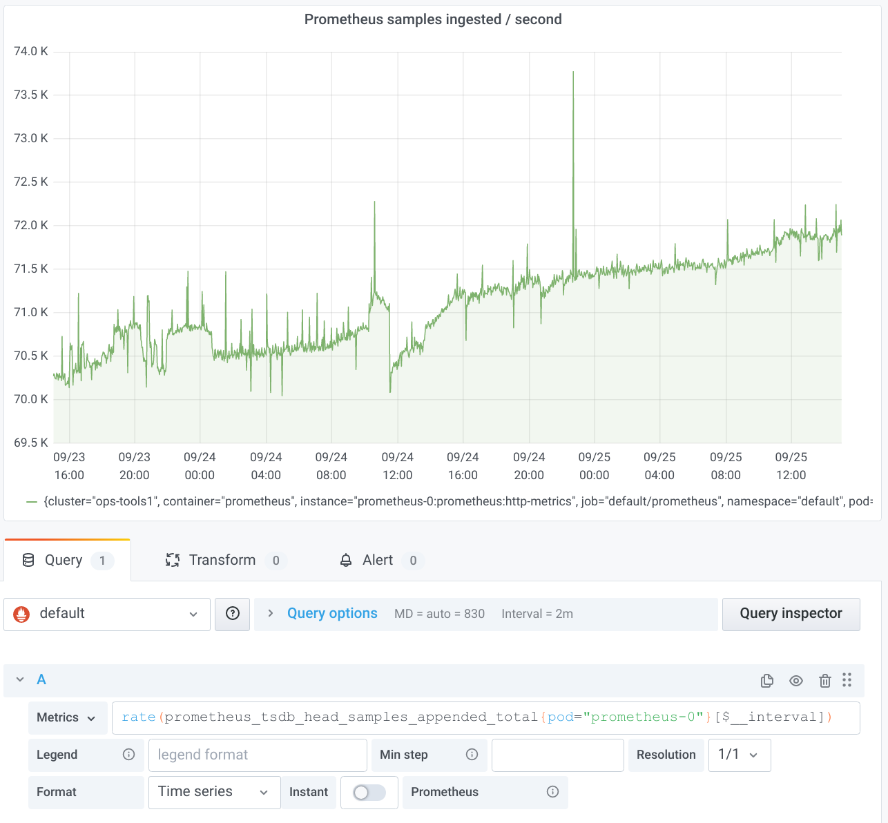
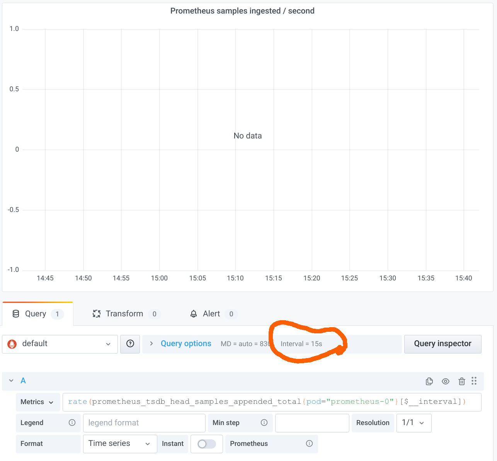
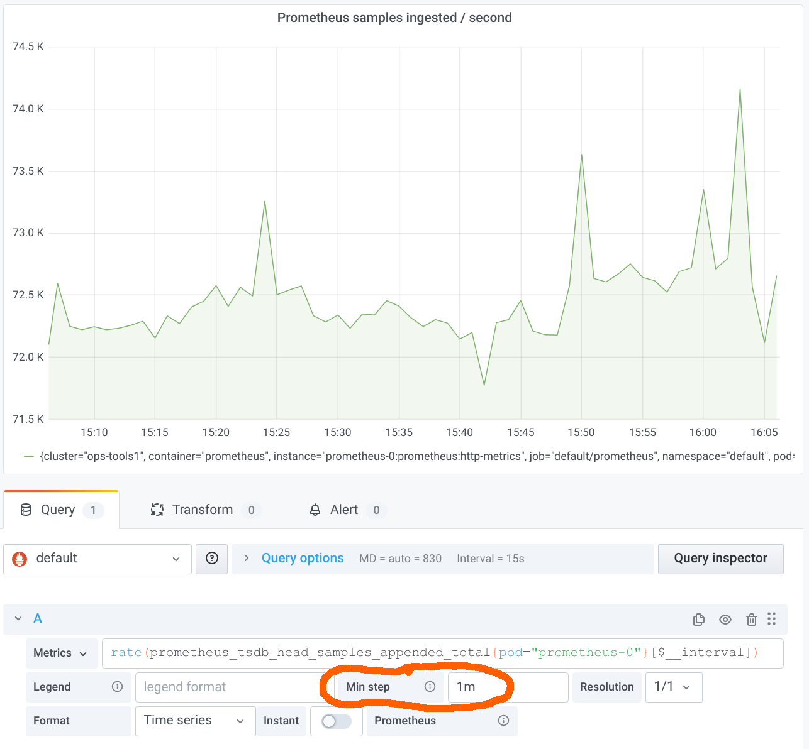
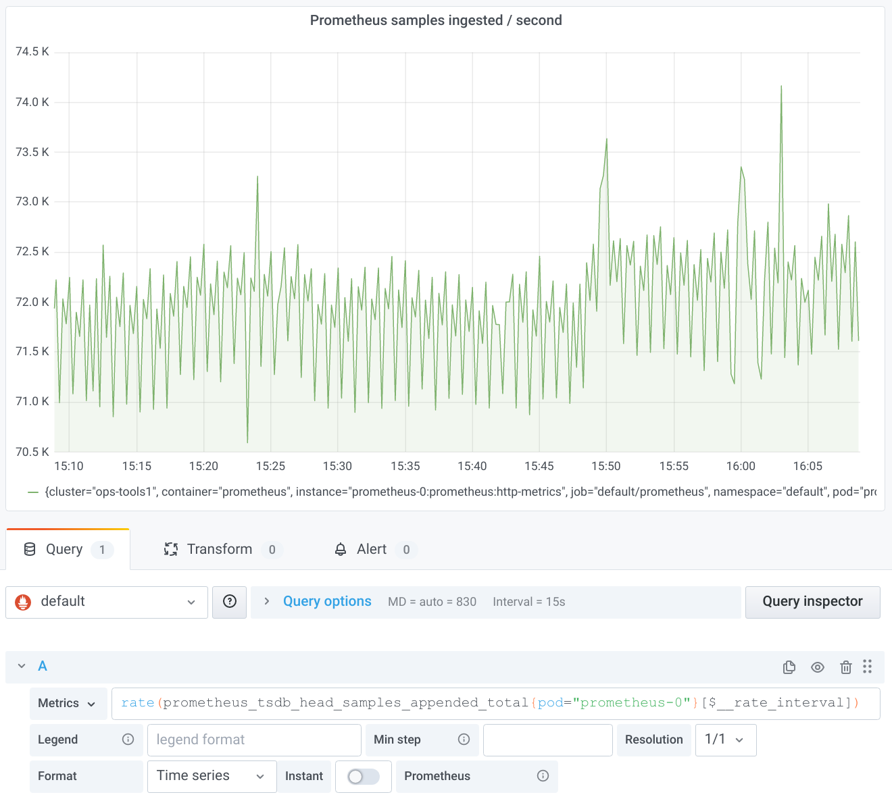
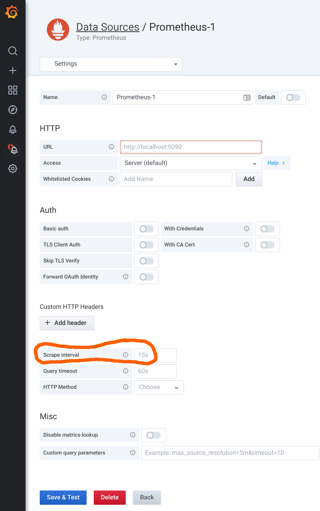
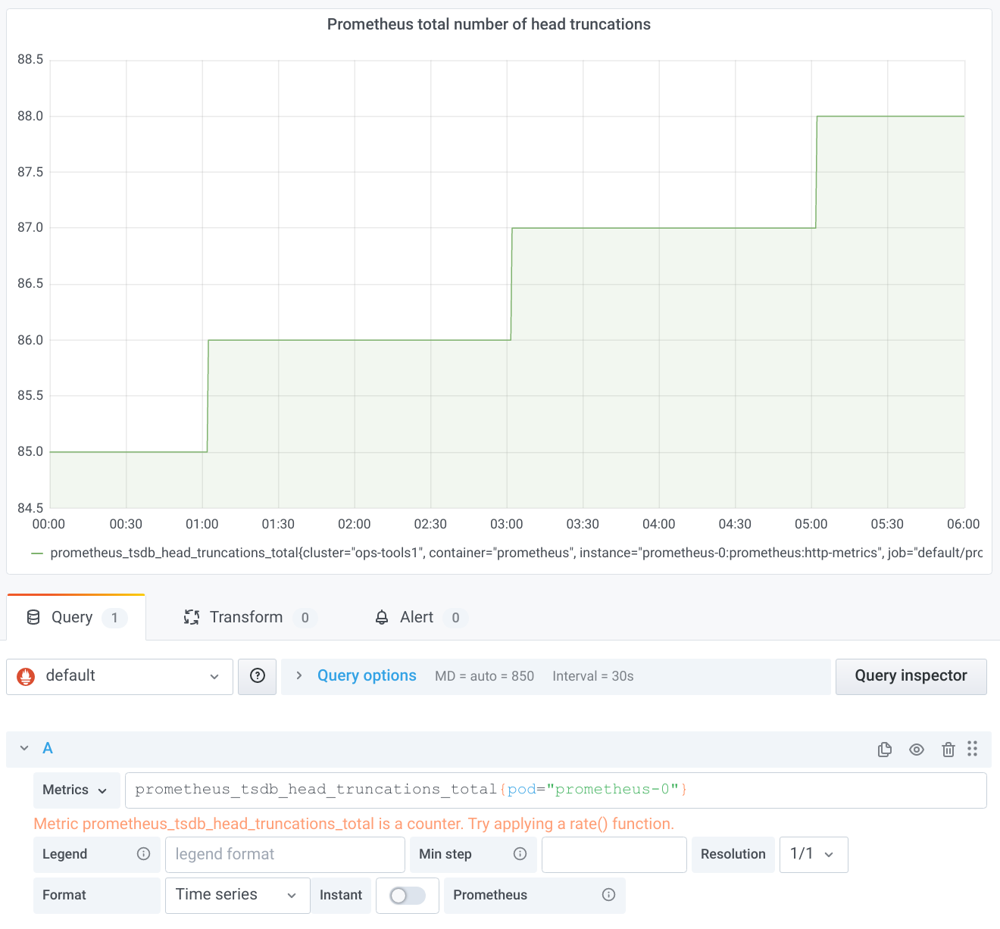
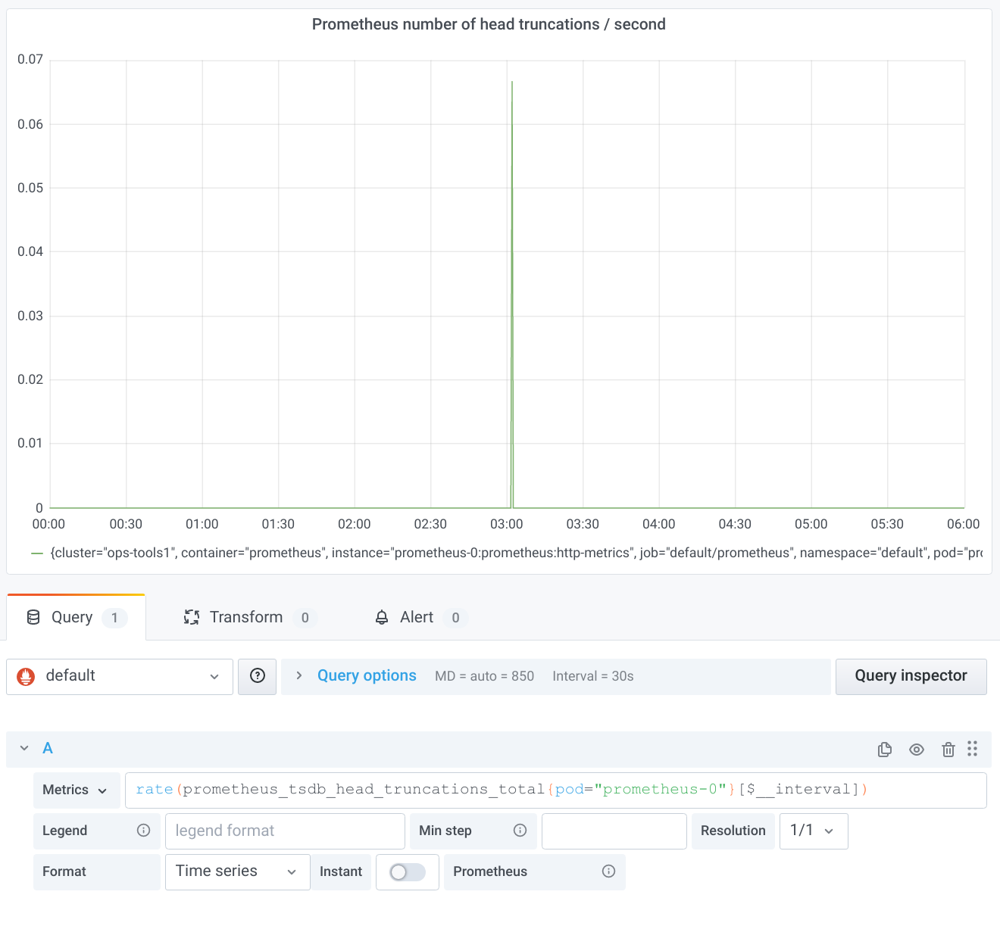
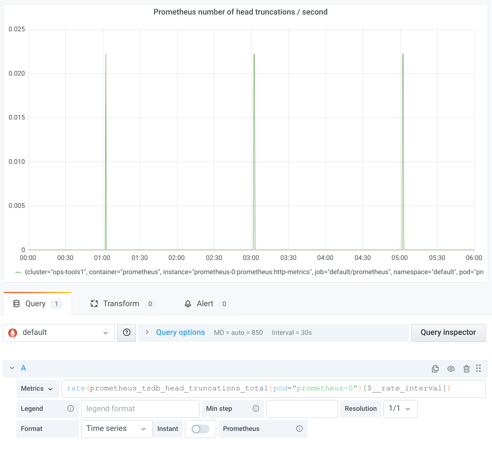

# Step and query_range - 步长与查询范围

> [https://www.robustperception.io/step-and-query_range/](https://www.robustperception.io/step-and-query_range/)

Graphs from Prometheus use the `query_range` endpoint, and there's a non-trivial amount of confusion that it's more magic than it actually is.

The [query range](https://prometheus.io/docs/prometheus/2.11/querying/api/#range-queries) endpoint isn't magic, in fact it is quite dumb. There's a query, a `start time`, an `end time`, and a `step`.

The provided query is evaluated at the `start time`, as if using the [query endpoint](https://prometheus.io/docs/prometheus/2.11/querying/api/#instant-queries). Then it's evaluated at the start time plus one `step`. Then the `start time` plus two `steps`, and so on stopping before the evaluation time would be after the end time. The results from all the evaluations are combined into time series, so if say samples for `series A` were present in the 1st and 3rd evaluations then both those samples would be returned in the same time series.

That's it. The query range endpoint is just syntactic sugar on top of the query endpoint*. Functions like `rate` don't know whether they're being called as part of a `range query`, nor do they know what the `step` is. `topk` is across each step, [not the entire graph](https://www.robustperception.io/graph-top-n-time-series-in-grafana).

One consequence(结果) of this is that you must take a little care when choosing the `range` for functions like `rate` or `avg_over_time`, as if it's smaller then the step then you'll undersample(欠采样) and skip over some data. If using Grafana, you can use `$__interval` to choose an appropriate value such as `rate(a_metric_total[$__interval])`.

 

**This <mark>was</mark> the case until Prometheus 2.3.0, where I made significant performance improvements to PromQL. Query is now a special case of query range, however conceptually and semantically it's all still the same.**


## Grafana global-variables


> [https://grafana.com/docs/grafana/latest/dashboards/variables/add-template-variables/#global-variables](https://grafana.com/docs/grafana/latest/dashboards/variables/add-template-variables/#global-variables)


### $__interval

You can use the `$__interval` variable as a parameter to group by time (for InfluxDB, MySQL, Postgres, MSSQL), Date histogram interval (for Elasticsearch), or as a _summarize_ function parameter (for Graphite).

Grafana automatically calculates an interval that can be used to group by time in queries. When there are more data points than can be shown on a graph, then queries can be made more efficient by grouping by a larger interval. It is more efficient to group by 1 day than by 10s when looking at 3 months of data and the graph will look the same and the query will be faster. The `$__interval` is calculated using the `time range` and the `width of the graph` (the number of pixels).

Approximate Calculation: `(to - from) / resolution`

For example, when the time range is 1 hour and the graph is full screen, then the interval might be calculated to `2m` - points are grouped in 2 minute intervals. If the time range is 6 months and the graph is full screen, then the interval might be `1d` (1 day) - points are grouped by day.

In the InfluxDB data source, the legacy variable `$interval` is the same variable. `$__interval` should be used instead.

The InfluxDB and Elasticsearch data sources have `Group by time interval` fields that are used to hard code the interval or to set the minimum limit for the `$__interval` variable (by using the `>` syntax -> `>10m`).

### $__interval_ms
This variable is the `$__interval` variable in milliseconds, not a time interval formatted string. For example, if the `$__interval` is `20m` then the `$__interval_ms` is `1200000`.

### $__range

Currently only supported for Prometheus and Loki data sources. This variable represents the range for the current dashboard. It is calculated by `to - from`. It has a millisecond and a second representation called `$__range_ms` and `$__range_s`.

### $__rate_interval

Currently only supported for Prometheus data sources. The `$__rate_interval` variable is meant to be used in the rate function. Refer to [Prometheus query variables](https://grafana.com/docs/grafana/latest/datasources/prometheus/#using-__rate_interval) for details.

## Using interval and range variables

> [https://grafana.com/docs/grafana/latest/datasources/prometheus/](https://grafana.com/docs/grafana/latest/datasources/prometheus/#using-__rate_interval:~:text=Using%20interval%20and%20range%20variables)


### Using interval and range variables

> Support for `$__range`, `$__range_s` and `$__range_ms` only available from Grafana v5.3

You can use some global built-in variables in query variables, for example, `$__interval`, `$__interval_ms`, `$__range`, `$__range_s` and `$__range_ms`. See [Global built-in variables](https://grafana.com/docs/grafana/latest/dashboards/variables/add-template-variables/#global-variables) for more information. They are convenient to use in conjunction with the `query_result` function when you need to filter variable queries since the `label_values` function doesn’t support queries.

Make sure to set the variable’s `refresh` trigger to be `On Time Range Change` to get the correct instances when changing the time range on the dashboard.

**Example usage:**

Populate a variable with the busiest 5 request instances based on average QPS over the time range shown in the dashboard:

```
Query: query_result(topk(5, sum(rate(http_requests_total[$__range])) by (instance)))
Regex: /"([^"]+)"/
```

Populate a variable with the instances having a certain state over the time range shown in the dashboard, using `$__range_s`:

```
Query: query_result(max_over_time(<metric>[${__range_s}s]) != <state>)
Regex:
```

### Using `$__rate_interval`

> **Note:** Available in Grafana 7.2 and above

`$__rate_interval` is the recommended interval to use in the `rate` and `increase` functions. It will “just work” in most cases, avoiding most of the pitfalls that can occur when using a fixed interval or `$__interval`.

```
OK:       rate(http_requests_total[5m])
Better:   rate(http_requests_total[$__rate_interval])
```

Details: `$__rate_interval` is defined as max(`$__interval` + _Scrape interval_, 4 \* _Scrape interval_), where _Scrape interval_ is the Min step setting (AKA query_interval, a setting per PromQL query) if any is set. Otherwise, the Scrape interval setting in the Prometheus data source is used. (The Min interval setting in the panel is modified by the resolution setting and therefore doesn’t have any effect on \_Scrape interval_.) [This article](https://grafana.com/blog/2020/09/28/new-in-grafana-7.2-__rate_interval-for-prometheus-rate-queries-that-just-work/) contains additional details.

## New in Grafana 7.2: $__rate_interval for Prometheus rate queries that just work
> [https://grafana.com/blog/2020/09/28/new-in-grafana-7.2-__rate_interval-for-prometheus-rate-queries-that-just-work/](https://grafana.com/blog/2020/09/28/new-in-grafana-7.2-__rate_interval-for-prometheus-rate-queries-that-just-work/)

Let’s dive a bit deeper into this topic to understand how `$__rate_interval` manages to pick the right range.

In both my talk and in RP’s blog post, you’ll notice two important takeaways:

1. The range in a `rate` query should be at least four times the scrape interval.
2. For graphing with Grafana, the variable `$__interval` is really useful to specify the range in a `rate` query.

So let’s create a Grafana panel with a typical `rate` query, for example, to find out how many samples per second our Prometheus server ingests (I love using Prometheus to monitor Prometheus):



That worked just fine. But what happens if we zoom in a lot? Let’s go from the two days above to just one hour.



The result is very disappointing: “No data”! The reason is that we have breached(违反) the first of the takeaways listed above. The `$__interval` variable expands to the duration between two data points in the graph. Grafana helpfully tells us about the value in the panel editor, as marked in the screenshot above. As you can see, the interval is only 15s. Our Prometheus server is configured with a `scrape interval` of 15s, so we should use a range of at least 1m in the rate query. But we are using only 15s in this case, so the range selector will just cover one sample in most cases, which is not enough to calculate the rate.

Let’s fix this situation by setting a `Min` step of four times the scrape interval, i.e. 1m:



This approach is following the recommended best practice so far. It works quite well, but it has two issues:

1. It requires you to fill in a *Min step* in every panel that is using `rate` queries.
2. It limits the resolution at which Grafana requests the evaluation results from Prometheus. One might argue that it doesn’t make a lot of sense to request a `rate` over 1m at a resolution higher than one data point per minute. A higher resolution essentially results in a moving average. But that’s what some users want.

The new `$__rate_interval` variable addresses both of the issues above. Let’s remove the *Min step* entry again and change `$__interval` to `$__rate_interval`:



Now all looks great again. The moving average effect described above even reveals some higher resolution structure not visible before. (Pro tip: If you want the smoother graph back as before, don’t despair. Just open the *Query options* and set a *Min interval* of 1m.)

So what’s the magic behind `$__rate_interval`? It is simply guaranteed to be at least four times the `scrape interval`, no matter what. But how does it know what the `scrape interval` is? That’s actually a very good question, because Prometheus itself only knows the currently configured scrape interval and doesn’t store the scrape interval used for historical data anywhere. (Perhaps that will change in the future, but that’s a story for another day.) Grafana can only rely on the scrape interval as configured in its Prometheus data source. If you open the settings of a Prometheus data source, you’ll find the *`Scrape interval`* field in the lower half:




It is recommended you use the same scrape interval throughout your organization. If you do that, it’s easy to just fill it in here. (The default value is 15s, by the way.) But what to do if you have the odd metric that has been scraped with a different scrape interval? In that case, use the *Min step* field to enter the special scrape interval, and everything will just work again. (Pro tip: Note that the *Min interval* setting in the *Query options* does not change the scrape interval used for the `$__rate_interval` calculation. You can use it to get lower-resolution graphs without changing the assumed scrape interval.)

But that’s not all. `$__rate_interval` solves yet another problem. If you look at a slowly moving counter, you can sometimes observe a weird effect. Let’s take `prometheus_tsdb_head_truncations_total` as yet another metric Prometheus exposes about itself. Head truncations in Prometheus happen every two hours, as can be nicely seen by graphing the raw counter:



Since we are looking at a quite long time range, the old `$__interval` should just work out of the box. Let’s try it:




This is surprising. We would have expected one peak in the rate every two hours. The reason for the missing peaks is subtle: A range selector in PromQL only looks at samples strictly within the specified range. With `$__interval`, the ranges are perfectly aligned; i.e., the end of the range for one data point is the beginning of the range of the next data point. That means, however, that the increase between the last sample in one range and the first sample in the next range is never taken into account by any of the `rate` calculations. With a bit of bad luck, just the one important counter increase you are interested in gets swallowed by this effect. At the end of my aforementioned [talk](https://grafana.com/go/grafanaconline/prometheus-rate-queries-in-grafana/), you can enjoy a more detailed explanation of the whole problem, for which, as promised in the talk, the new `$__rate_interval` once more provides a solution:



Again, this magic turns out to be quite simple on closer inspection. `$__rate_interval` extends the usual `$__interval` by one scrape interval so that the ranges overlap just enough to ensure complete coverage of all counter increases. (Note for pros: This only works if the scrapes have happened at the intended points in time. The more jitter there is, the more likely you run into problems again. There is unfortunately no single best way to deal with delayed or missing scrapes. This topic is once more a story for another day…)

The wonderful [Grafana documentation](https://grafana.com/docs/grafana/latest/features/datasources/prometheus/#using-__rate_interval-variable) summarizes the whole content of this blog post very concisely: “The `$__rate_interval` variable is \[…\] defined as max( `$__interval` + _Scrape interval_, 4 \* _Scrape interval_), where _Scrape interval_ is the _Min step_ setting \[…\], if any is set, and otherwise the _Scrape interval_ as set in the Prometheus data source (but ignoring any _Min interval_ setting \[…\]).”

The good thing about `$__rate_interval`: Even if you haven’t fully understood every single aspect of it, in most cases it should “just work” for you. If you still run into weird problems, well, then you have hopefully bookmarked this blog post to return to it and deepen your understanding.
