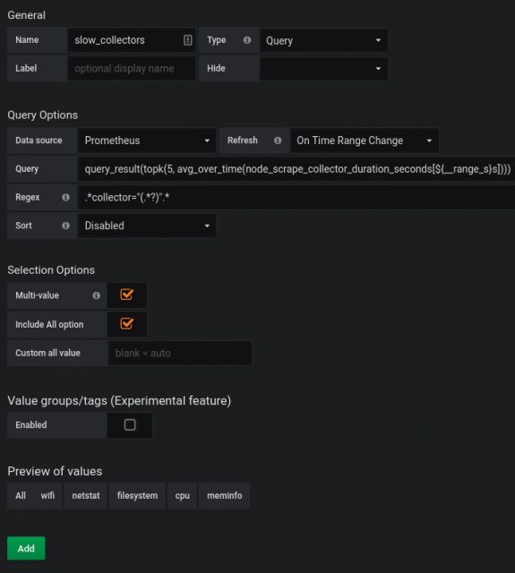
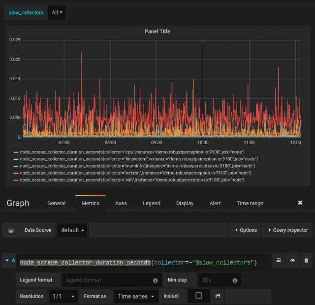

# Top

> [https://www.robustperception.io/graph-top-n-time-series-in-grafana/](https://www.robustperception.io/graph-top-n-time-series-in-grafana/)

As of Grafana 5.3.0 there's a feature that allows correct graphing of the top N series over a duration.

The `query_range` API endpoint in Prometheus which is used for graphing evaluates each step independently, so a graph like `topk(5, node_scrape_collector_duration_seconds)` can display far more than 5 time series. To show the top 5 over the range of a graph, you'd need to first do a query to determine which 5 those are, and then graph them.

In Grafana 5.3.0 has added `$__range_s` which you can use when determining your variables. So for example if you wanted the 5 series that were highest on average you could create a variable like:

The `query_result(topk(5, avg_over_time(node_scrape_collector_duration_seconds[${__range_s}s])))` is the key, and Multi-value, Include All and Refresh On Time Range Change are also set.

 

You can now use `$slow_collectors` in a regex matcher to pick out the right time series, you'll also want to select All:

There's now exactly 5 results, and if you adjust the dashboard time selector the series will be updated automatically!

As a small cleanup, now that All is selected you can go back to the variable definition and set Hide to Variable so that the variable selection doesn't clutter the top of your dashboard. Depending on your use case you might use functions such as `min_over_time`, or `max_over_time` rather than `avg_over_time`.
