# Istio mTLS 自动识别说明(Smartness Explained)


> [https://vikaschoudhary16.com/2022/06/20/undeistio-permissive-authz-magic/](https://vikaschoudhary16.com/2022/06/20/undeistio-permissive-authz-magic/)

## Introduction

Consider there is a large cluster with lots of services/pods running across numerous namespaces. If you want to enable Istio service mesh in this cluster, a saner approach would be to enable it gradually service by service. Doing so means until the migration to Istio mesh is not complete, there would be a mix of sidecar-injected pods and pods without sidecars.

Istio documentation explains it at Istio api level in the [Mutual TLS migration task](https://istio.io/latest/docs/tasks/security/authentication/mtls-migration/). This blog post is taking a deep-dive and further discussing the underlying concepts behind the Istio’s automatic mTLS. Knowing details is required for troubleshooting silly configuration errors in real environments.

**DISCLAIMER**: I assume that you have basic familiarity with Istio and [envoyproxy configs ](https://www.envoyproxy.io/docs/envoy/latest/configuration/listeners/listeners)like listeners, filterchains etc. If you have just started exploring Istio, this post might not be helpful for you.

Alright, let’s get started!!!

During migration to Istio mtls, traffic flows between the services can be divided into the following three scenarios:

1. clients and servers, both are without sidecars

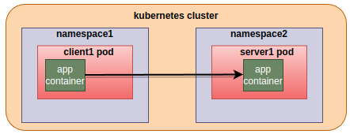

2. Client is without sidecar and servers are of both the types, sidecar-injected and without sidecars. Sidecar envoy on the server side lets the traffic “passthrough” transparently without any Istio mtls encryption. “Passthrough” means sidecar envoy copies tcp bytes back-and-forth between the connection to the downstream client and the connection to the app running in the same pod.

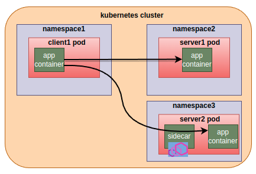

**Question**: **How** server2’s sidecar figures out that the client is not sidecar-injected and it must NOT expect Istio mtls handshake?

3. Client is sidecar-injected and servers are of both the types, sidecar-injected and without sidecars. client sidecar will initiate Istio-mtls connection to the sidecar-injected servers and forwards the application traffic to the server side sidecar Istio-mtls encrypted. Otherwise, forward the traffic to the server as it is. 

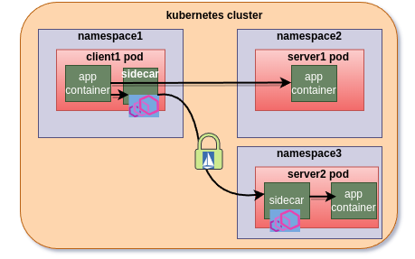

sidecar injected server engages in the tls handshake initiated by the client.

**Questions**:

**How** does the client sidecar figures out that only for server2, istio-mtls is to be initiated and NOT for server1?
**How** server2’s sidecar, unlike non-injected client case, figures out that traffic is Istio-mtls encrypted and it must engage in tls handshake?

This blog post will answer the “How”s with the help of a demo from my local environment.

## Environment details

- Kubernetes cluster 1.20 up and running
- Istiod version 1.12.8 up and running

To start with, I have a client and a server running without Istio sidecar proxies.

```
$ kubectl get pod -n client-8-52032 -o wide
NAME                              READY   STATUS    RESTARTS   AGE   IP   
http-client-v1-6cc6c9df79-2brww   1/1     Running   0          29m   10.10.0.29

$ kubectl get pod -n echo-7-41958
NAME                                         READY   STATUS    RESTARTS   AGE
echo-v1-7b79ccb7f7-bhpc4                     1/1     Running   0          35s

$ kubectl get svc echo -n echo-7-41958 
NAME   TYPE        CLUSTER-IP      EXTERNAL-IP   PORT(S)   AGE
echo   ClusterIP   10.255.10.235           80/TCP    90s

$ kubectl get svc echo -n echo-7-41958 -o yaml | yq .spec.ports
- name: http
  port: 80
  protocol: TCP
  targetPort: 8090
```

We will verify mtls through:

\1. [X-Forwarded-Client-Cert](https://www.envoyproxy.io/docs/envoy/latest/configuration/http/http_conn_man/headers#x-forwarded-client-cert) header in the curl response.

Presence of this header in the curl response will indicate that traffic between sidecar proxies was Istio-mtls

\2. Wireshark

## Scenario 1, no sidecars on either side


*$ kubectl exec deploy/http-client-v1 -n client-8-52032 — `curl http://echo.echo-7-41958.svc.cluster.local`*

```
ServiceVersion=v1
ServicePort=8090
Host=echo.echo-7-41958.svc.cluster.local
URL=/
Cluster=cluster-0
IstioVersion=
Method=GET
Proto=HTTP/1.1
IP=10.10.0.29
Alpn=
Accept=*/*
User-Agent=curl/7.68.0
Hostname=echo-v1-7b79ccb7f7-bhpc4
```

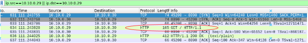captures taken at server sidecar

## Scenario 2, non-injected client to injected and non-injected services

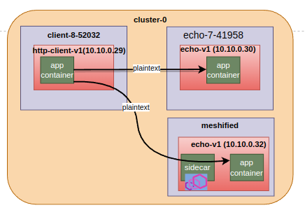

Accessing non-injected echo-v1 service from non injected client is same as scenario 1, so its already discussed.

Lets analyse non-injected(**http-client-v1**) to injected service(**echo-v1.meshified**) connection case.

*$ kubectl exec deploy/http-client-v1 -n client-8-52032 — `curl http://echo.meshified.svc.cluster.local`*

```
ServiceVersion=v1
ServicePort=8090
Host=echo.meshified.svc.cluster.local
URL=/
Cluster=cluster-0
IstioVersion=
Method=GET
Proto=HTTP/1.1
IP=127.0.0.6
Alpn=
Accept=*/*
User-Agent=curl/7.68.0
X-B3-Sampled=0
X-B3-Spanid=2210ba86d012f0dc
X-B3-Traceid=a25bdfbd8241b4432210ba86d012f0dc
X-Forwarded-Proto=http
X-Request-Id=c1eefa51-8e80-4563-a1f1-ca7b6acff445
Hostname=echo-v1-7b79ccb7f7-9jfv4
```

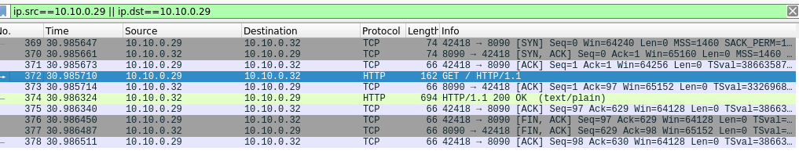

sidecar envoy logs show that traffic is really going via envoy. Plain-text application traffic is being “passthrough” by server sidecar:

```
[2022-07-06T02:53:25.034Z] "GET / HTTP/1.1" 200 - via_upstream - "-" 0 387 0 0 "-" "curl/7.68.0" "c1eefa51-8e80-4563-a1f1-ca7b6acff445" "echo.meshified.svc.cluster.local" "10.10.0.32:8090" inbound|8090|| 127.0.0.6:41505 10.10.0.32:8090 10.10.0.29:42418 - default
```

### Why is Istio/envoy allowing plain text?

By default Istio enables Mutual TLS in [PERMISSIVE mode](https://istio.io/latest/docs/concepts/security/#peer-authentication). Permissive mode means if client is within the mesh(i.e sidecar injected), server side envoy will authenticate Istio mutual TLS, otherwise envoy will forward received traffic as-is to the app container. The Latter, i.e passthrough, is happening in our case. 

### Enable STRICT mode

Let’s apply STRICT mode peer authentication and see if curl still works(it should not be).

```
apiVersion: security.istio.io/v1beta1
kind: PeerAuthentication
metadata:
  name: "strict-policy"
  namespace: meshified
spec:
  mtls:
    mode: STRICT
```

curl fails after applying STRICT policy which is expected because client is sending plain text

```
$ kubectl exec deploy/http-client-v1 -n client-8-52032 -- curl http://echo.meshified.svc.cluster.local
curl: (56) Recv failure: Connection reset by peer
command terminated with exit code 56
```

server side envoy logs have the following error message:

```
[2022-07-06T03:33:58.083Z] "- - -" 0 NR filter_chain_not_found - "-" 0 0 0 - "-" "-" "-" "-" "-" - - 10.10.0.32:8090 10.10.0.29:43434 - -
```

hmmm.. filter_chain_not_found, what filter chain was there in PERMISSIVE mode which is missing now?

#### STRICT mode filter chains

iptables in the container namespace at sidecars redirects all the incoming traffic, targeting any port like 8090(targetPort for 80) in our case, to 15006. Therefore we need to look at 15006 listener

```
$ istioctl pc listeners deploy/echo-v1 -n meshified --port 15006
ADDRESS PORT  MATCH                                                                  DESTINATION
0.0.0.0       15006  Addr: *:15006                                                            Non-HTTP/Non-TCP
0.0.0.0       15006  Trans: tls; App: istio-http/1.0,istio-http/1.1,istio-h2; Addr: ::0/0     InboundPassthroughClusterIpv6
0.0.0.0       15006  Trans: tls; Addr: ::0/0                                                  InboundPassthroughClusterIpv6
0.0.0.0       15006  Trans: tls; App: istio-http/1.0,istio-http/1.1,istio-h2; Addr: 0.0.0.0/0 InboundPassthroughClusterIpv4
0.0.0.0       15006  Trans: tls; Addr: 0.0.0.0/0                                              InboundPassthroughClusterIpv4
0.0.0.0       15006  Trans: tls; Addr: *:8090                                                 Cluster: inbound|8090||
```

Each line in the above output represents a filter chain on 15006 listener. So there are 6 filter chains in total at the listener which is listening at port 15006. In the following discussion, I would be referring to these filter chains by numbers 1 to 6.

Above istioctl output is too brief for the further discussion, so I extracted more information from the config dump(using `-o json` with the istioctl command shared above) of sidecar envoy. These are the same filter chains with just some more details extracted from config-dump:

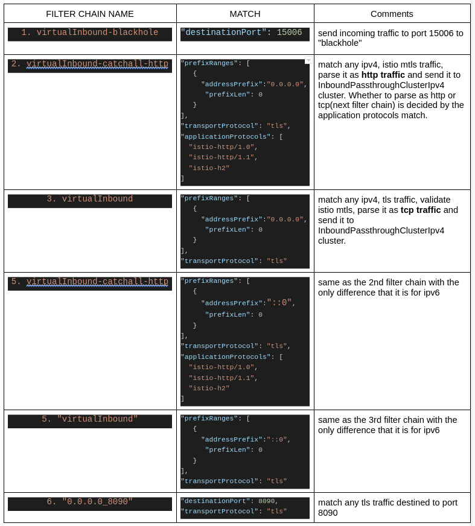

As we can see, there is no filter chain matching plain-text traffic and hence envoy log message `NR filter_chain_not_found` is not surprising anymore.

### FilterChain matching

Before discussing next scenario(scenario 3), we will discuss a little on filter chain matching. In the previous section, we saw STRICT mode filter chains. We will see PERMISSIVE mode filter chains in the next section. Having a basic idea on filter chain matching, will help us comparing the filter chain match conditions between these two modes.

**FilterChains are not matched in the order that they appear in the config-dump or in the `istioctl` output.** Incoming connection’s properties are matched in a specific order to find out the matched FilterChain. From the [envoy documentation](https://www.envoyproxy.io/docs/envoy/latest/api-v3/config/listener/v3/listener_components.proto#envoy-v3-api-msg-config-listener-v3-filterchainmatch):

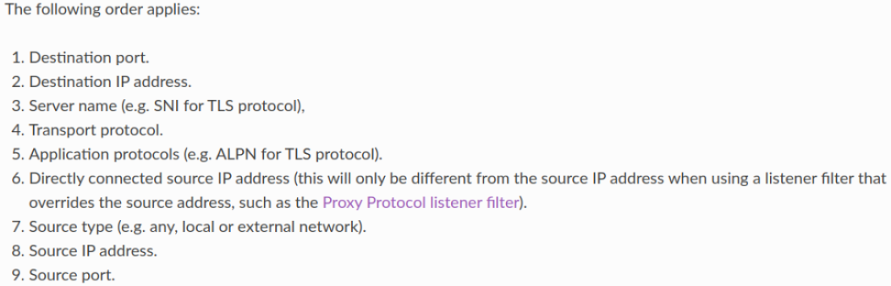

#### ALPN

[Application protocols](https://en.wikipedia.org/wiki/Application-Layer_Protocol_Negotiation) or ALPN is an TLS extension, which is ideally used by clients and servers to negotiate application level protocol for example for http2 upgrade if server supports http2. Standard ALPN values are h2, http1.1. Client sets the supported application protocols in the tls client hello message. For example: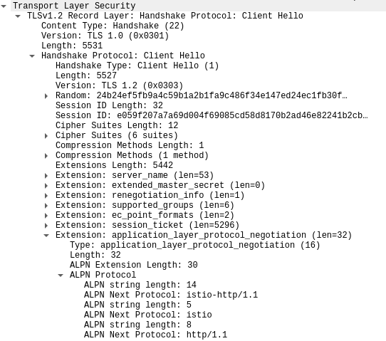       

Istio leveraged this TLS extension for communicating from client sidecar to server sidecar that TLS encryption is using Istio issued certs and not the custom certs setup by the user. Client sidecar sets Istio-defined alpn values, which then helps at server sidecar to match the appropriate filter chain.

##### How client sidecar adds Istio-defined ALPNs in the TLS client hello message

It depends on whether the client envoy is parsing and forwarding app traffic as http or as tcp. FilterChain matching with connection properties will decide whether traffic will be treated as http or tcp.

###### http traffic

Istiod manages envoy proxies in the mesh by using Envoy’s [xDS protocol](https://www.envoyproxy.io/docs/envoy/latest/api-docs/xds_protocol) to send configurations. Istiod pushes this http filter as one of the httpFilters under the HttpConnectionManager network filter, [istio.alpn](https://github.com/istio/istio/blob/6b85b0576697e6b52d40ceda113c0e66a4d17fa1/pilot/pkg/xds/filters/filters.go#L131-L151), over xds(listeners) to all the envoys. If the client sidecar has parsed and forwarded app traffic as http traffic, this filter overrides the standard alpn values by Istio-defined alpns before forwarding the traffic to the other side.

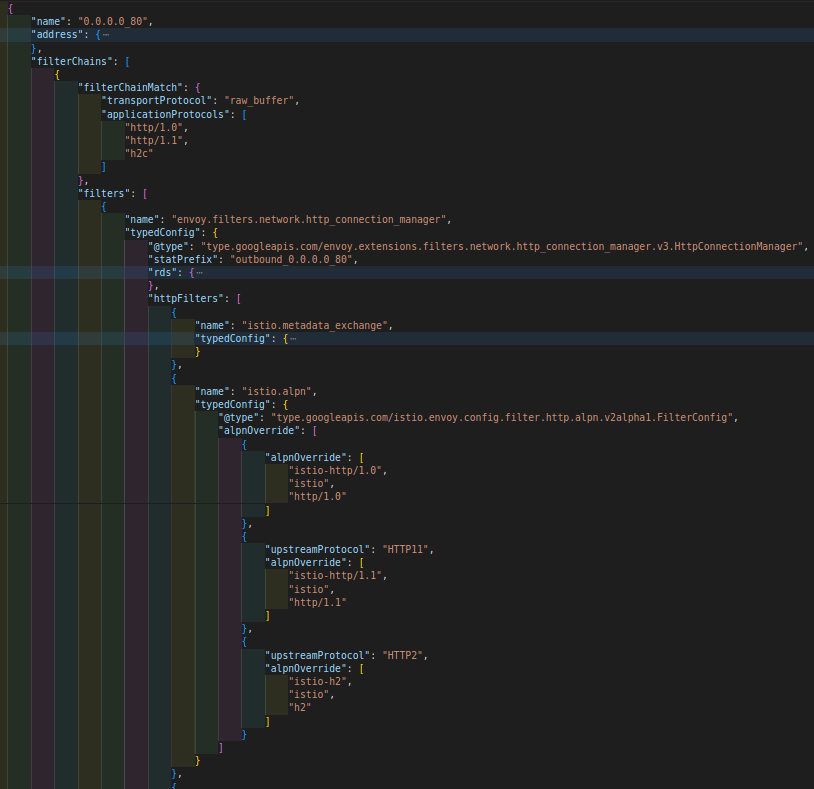istio.alpn filter in the HttpConnectionManager network filter

###### tcp traffic

If the traffic is matched and parsed as tcp traffic, there will be no HttpConnectionManager network filter in the filter chain. Incoming app traffic will be handled by TcpProxy network filter. This network filter has no option to configure ALPNs. It only has the configuration to forward the tcp bytes to an upstream envoy cluster. For example:

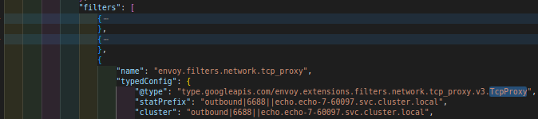

Envoy [Cluster api ](https://www.envoyproxy.io/docs/envoy/v1.22.2/api-v3/config/cluster/v3/cluster.proto#config-cluster-v3-cluster)actually has a list of network filters.

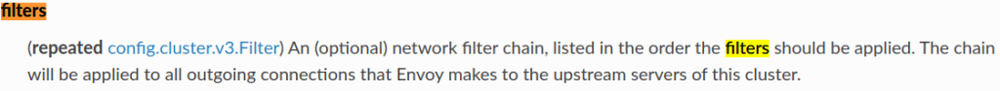

These network filters from the cluster state are executed only in the tcp case i.e when network filter is TcpProxy.

Istiod while preparing envoy clusters from the discovered service entries and kubernetes services, fills this `filters` with `metadata-exchange` filter which has `istio-peer-exchange` application protocol configured. Net result is that when client sidecar initiates Istio MTLS connection for forwarding tcp traffic to the upstream envoy, `istio-peer-exchange` application protocol gets set in the TLS client hello message.

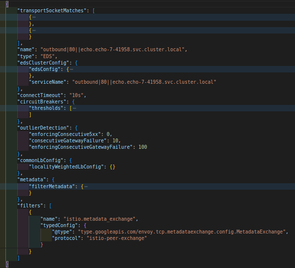envoy cluster with metadata_exchange filter

### Switch back to PERMISSIVE mode

Just deleting the peer authentication policy is enough to enable the permissive mode because as I mentioned earlier, permissive is the default mode.

$ k delete peerauthentication -n meshified strict-policy peerauthentication.security.istio.io “strict-policy” deleted

#### PERMISSIVE mode filter chains

I have filtered out passthrough filter chains matching ipv6 traffic for brevity because those behave the same as the corresponding ipv4 filterchains.

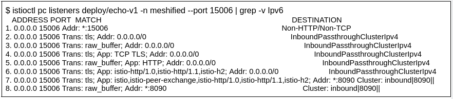

Entries in the following table are in the same order as in the above istioctl output

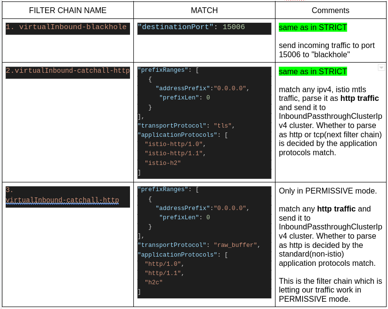

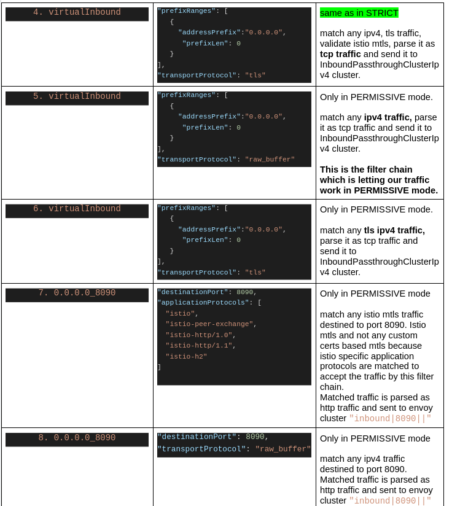

Last i.e the 8th filter chain is the one which matches our current case i.e no sidecar at client and plain-text http traffic. This filter chain is not there in STRICT mode filter chains and hence we see that error in `curl` response if STRICT mode policy is applied in `meshified` namespace. Also note that though there is “catch-all” filter chain in the config-dump before the `0.0.0.0_8090`, `0.0.0.0_8090` is tried first because FilterChains are matched as per the priority order of incoming connection’s properties and `destination_port` has the highest priority.

## Scenario 3 i.e injected client talking to injected and non-injected servers

$ kubectl get pod -n client-8-52032 -o wide NAME          READY  STATUS  RESTARTS  AGE  IP http-client-v1-6cc6c9df79-rrz49  2/2   Running  0     24s  10.10.0.33 

sidecar injected client

Now our client is sidecar-injected

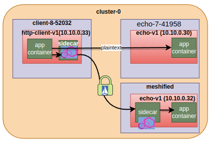

Ability of the client sidecar to start mtls with injected server and at the same time forward app traffic as it is (plain-text or encrypted) to the non-injected sidecar is controlled by two things:

\1. Istio feature called [enableAutoMtls](https://istio.io/latest/docs/reference/config/istio.mesh.v1alpha1/#MeshConfig), enabled by default

> This flag is used to enable mutual `TLS` automatically for service to service communication within the mesh, default true. If set to true, and a given service does not have a corresponding `DestinationRule` configured, or its `DestinationRule` does not have ClientTLSSettings specified, Istio configures client side TLS configuration appropriately. More specifically, If the upstream authentication policy is in `STRICT` mode, use Istio provisioned certificate for mutual `TLS` to connect to upstream. If upstream service is in plain text mode, use plain text. If the upstream authentication policy is in PERMISSIVE mode, Istio configures clients to use mutual `TLS` when server sides are capable of accepting mutual `TLS` traffic. If service `DestinationRule` exists and has `ClientTLSSettings` specified, that is always used instead.

\2. workload(pod) label `**security.istio.io/tlsMode=istio`**

Istiod’s sidecar-injector webhook, which is Istiod itself, applies this label to any workload which is sidecar injected. 

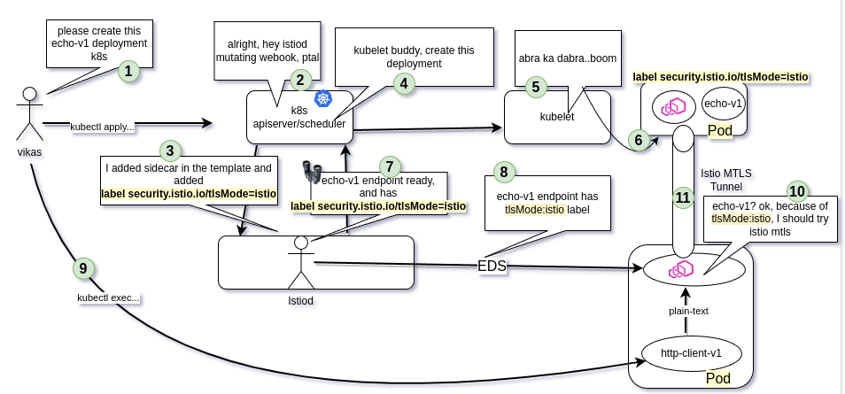

Istiod runs a k8s controller/watcher to watch for all the services and pods(endpoints) and maintains this info in an in-memory cache. Istiod keeps converting watched k8s services or ServiceEntries into envoy clusters and updating all the connected envoys(sidecar/gateways) over the cds(cluster discovery service) grpc stream. Istiod fills two `transportSocketMatches` in the envoy cluster, `tlsMode-istio` and `tlsMode-disabled`. Client sidecar starts Istio-mtls if `tlsMode-istio` gets matched at runtime. match criteria is that endpoint must have `tlsMode: istio` label In our case, `echo-v1.meshified` is sidecar-injected and therefore envoy endpoints have the `tlsMode: istio` label, which results in initiation of Istio-mtls.

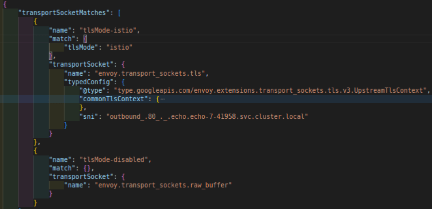

### Injected client to injected sever

As explained above, because of the `tlsMode: istio` label, client sidecar initiates Istio mtls connection. Also `istio.alpn` http filter at the client side overrides standard alpns by Istio-defined ALPNs. `destination_port` and Istio-defined ALPNs match the FilterChain number 7 to properly terminate the Istio MTLS.

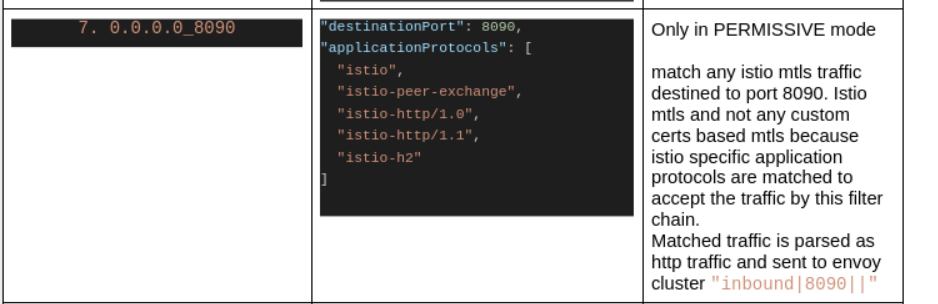

$ kubectl exec deploy/http-client-v1 -n client-8-52032 — curl [http://echo](http://echo/).**meshified**.svc.cluster.local ServiceVersion=v1 ServicePort=8090 … **X-Forwarded-Client-Cert**=By=spiffe://cluster-0/ns/meshified/sa/default;Hash=84ea8b0b2562099aece28e5582fc6e615fa1f1ab8aac1430d03949f6bec80c97;Subject=””;URI=spiffe://cluster-0/ns/client-8-52032/sa/default X-Forwarded-Proto=http X-Request-Id=5f0fc5ab-c72c-465e-bc38-fb7e4ee454e8 Hostname=echo-v1-7b79ccb7f7-9jfv4

**X-Forwarded-Client-Cert** with value as Istio generated client Spiffe ID in response

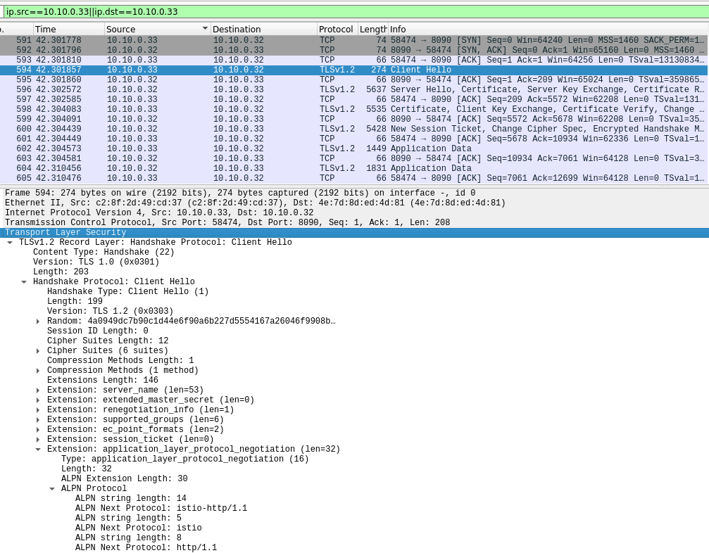capture taken at server sidecar. Note the application protocols in client hello

### Injected client to non-injected sever

Since the service `echo.echo-7-41958` is not sidecar injected, client sidecar will not find its endpoints with `tlsMode:istio`. That means data path falls back to`tlsMode-disabled` transport socket. At server side, there is no sidecar, so nothing to explain.

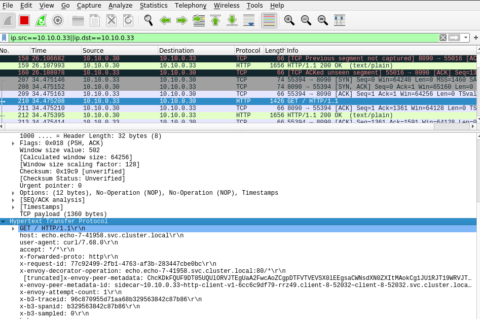

$ kubectl exec deploy/http-client-v1 -n client-8-52032 — curl [http://echo.echo-7-41958.svc.cluster.local](http://echo.echo-7-41958.svc.cluster.local/) ServiceVersion=v1 ServicePort=8090 Host=echo.echo-7-41958.svc.cluster.local URL=/Cluster=cluster-0 …

No **X-Forwarded-Client-Cert** in response

## Summary

In this blog post, we learned:

- FilterChains at server sidecar corresponding to `PERMISSIVE` and `STRICT` modes.
- FilterChain matching logic
- What is ALPN, how Istio uses ALPN in FilterChain matching to create PERMISSIVE magic
- Importance of `tlsMode` label and how it is set and distributed to envoy proxies in the mesh.

Please let me know if something important I skipped or you want me to zoom-in more onto something.