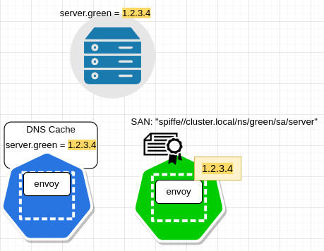

# Understanding Istio’s Secure Naming

> [https://vikaschoudhary16.com/2022/05/26/secure-naming-in-istio/](https://vikaschoudhary16.com/2022/05/26/secure-naming-in-istio/)

Secure naming is the name given to the validation of the `SAN` field value in the X.509 certificate(which is presented by the service running inside the mesh during tls handshake) at the client envoys. This definition will become clearer by the end of this post.

## Certificates

Each workload in the mesh is provisioned with a  X.509 certificate. Specifically SAN in the certificate identifies the workload uniquely. SAN(SubjectAltName) is a string in [SPIFFE format](http://spiffe.io/) which encodes:

1. Trust domain in which workload is running
2. Namespace
3. Service Account

## Istio Mutual TLS Authentication

Mesh traffic is mtls(Mutual TLS) authenticated. Envoy on both the sides of connection validates if the peer certificate is trusted by the mesh CA. Secure Naming extends mtls authentication a step further by verifying SAN field additionally of the trusted server certificate.

## Example

Lets understand with the help of an example.

There are two services running in the cluster, client in the `blue` namespace and server in the `green` namespace.

*X.509 Certificate identities*

server is serving `green-server.com` and this hostname is exposed to other mesh workloads through a Istio` virtual service` resource.

Istiod, which is watching k8s apiserver, picks up this virtual service and translates it into [envoy cluster](https://www.envoyproxy.io/docs/envoy/latest/api-v3/config/cluster/v3/cluster.proto#config-cluster-v3-cluster), “`outboud|80||green-server.com` :

outboud|80||green-server.com

Pay attention to the `matchSubjectAltName` section in the envoy cluster above. This is exactly the secure naming part. Through this configuration, client envoy is being asked to match the SAN from the server certificate to the specified value.

How Istiod is able to predetermine the server SAN and configure the same in the translated envoy cluster?

Thats because Istiod determined destination service name from the virtual service i.e `server.green.cluster.local`. Remember Istiod is provisioning identity certificates to all the mesh workloads. Therefore, Istiod knows service name to Spiffe id mapping.

### What all happens at data path?

#### DNS Resolution

#### mTLS Handshake with resolved address

server SAN from the certificate matches the value configured in the envoy cluster

#### DNS Spoofing

Consider the scenario where dns server is hijacked by an attacker to map the server.green hostname to his/her malicious service address.

#### Secure Naming to rescue

mTLS handshake fails with malicious service because of server SAN mismatch with the value configured in the envoy cluster.

If SAN validation was not configured at client, malicious server would have completed tls handshake successfully because server certificate is trusted by the CA configured at client. Certificates to both the servers, genuine and malicious, are issued via Istiod from the same CA. But thanks to Istio’s secure naming, tls handshake will fail for the malicious service in this case as client rejects server certificate due to SAN mismatch.

## What about SAN validation for non-mesh services

In Istio mesh, external services are registered through `Service Entries`. Also we can use `destination rule` along with service entry for subset routing or setting up tls to external services. Both the service entry and the destination rule apis support configuration of server SAN value to be matched(`subjectAltNames` field in the[ service entry](https://istio.io/latest/docs/reference/config/networking/service-entry/#ServiceEntry) and in the [clientTLSSettings in the destination rule](https://github.com/istio/api/blob/64602ec8d64780ee79811e9978a32193c1f8ce17/networking/v1alpha3/destination_rule.pb.go#L1491)). Based on scenario, we can decide to configure server SAN in either of the two.

## Summary

We learned what is secure naming, how it provides additional security in dns spoofing attack. Also we learned how we can verify if secure naming is in place or not by looking at envoy cluster configuration at client side. We saw that SAN validation happens automatically for mesh services and how we can configure it manually for the external services.