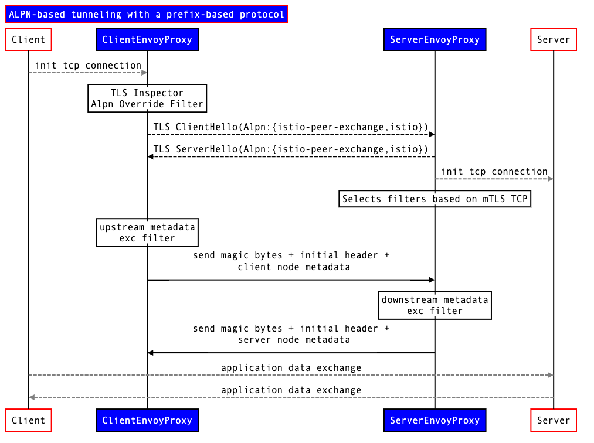
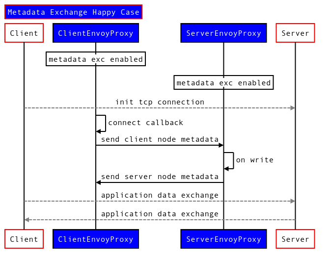

# TCP MX

`TCP MX` or `TCP Metadata Exchange` or `istio-peer-exchange`。即是在两个 sidecar 间，在正式开始 TCP 流量前，均需要先用 TCP 数据流量交换自己的 Metadata 给对方。

## metadata exchange plugin

> [https://techblog.cisco.com/blog/istio-mixerless-telemetry](https://techblog.cisco.com/blog/istio-mixerless-telemetry)

### Metadata exchange plugin

The first problem that had to be solved was how to make client/server metadata about the two sides of a connection available in the proxies.

- For HTTP-based traffic this is accomplished via custom HTTP headers (`envoy.wasm.metadata_exchange.upstream`, `envoy.wasm.metadata_exchange.downstream`) in the request/response that contains the metadata attributes of the other side.

- For generic TCP traffic the metadata exchange uses ALPN-based tunneling and a prefix based protocol. A new protocol `istio-peer-exchange` is defined, which is advertised and prioritized by the client and the server sidecars in the mesh. ALPN negotiation resolves the protocol to istio-peer-exchange for connections between Istio enabled proxies, but not between an Istio enabled proxy and any client. 

## TCP MX 设计文档

> [https://docs.google.com/document/d/1s6ou__qRL4UiWY1amyk5p8YzOMQvBhfR15o1U_ZLIow/edit#](https://docs.google.com/document/d/1s6ou__qRL4UiWY1amyk5p8YzOMQvBhfR15o1U_ZLIow/edit#)

Details of ALPN-based tunneling with a prefix-based protocolFor mTLS enabled connections, we can use ALPN mechanism in TLS 1.3 to define a new lightweight protocol that encapsulates TCP and prepends custom metadata to the raw streams.

In technical terms, we define a new protocol *istio-peer-exchange*, that is advertised and prioritized by the client and the server sidecars in the mesh. ALPN negotiation would resolve the protocol to *istio-peer-exchange* for connections between istio-enabled proxies, but not between an istio-enabled proxy and any other proxy.

This protocol extends TCP as follows:

1. TCP client, as a first sequence of bytes, sends a magic byte string and a length-prefixed payload.
2. TCP server, as a first sequence of bytes, sends a magic byte sequence and a length-prefix payload. These payloads are protobuf-encoded serialized metadata.
3. Client and server can write simultaneously and out-of-order. The `extension filter` in Envoy should hold the further processing in downstream and upstream until either the magic byte sequence is not matched or the entire payload is read.

Problem with this approach is that we need to support different alpn for HTTP and TCP, so that we can distinguish between HTTP and TCP traffic for `filterchain match`(Between TLS Inspector and HTTP Inspector). More details in this [doc](https://docs.google.com/document/d/1l0oVAneaLLp9KjVOQSb3bwnJJpjyxU_xthpMKFM_l7o/edit#). Currently, for HTTP we already have `istio-http-1.0`, `istio-http-1.1` and `istio-http2` so as to distinguish traffic between http-1.0, http-1.1 and http2.

### 内部实现细节

> [https://docs.google.com/document/d/1s6ou__qRL4UiWY1amyk5p8YzOMQvBhfR15o1U_ZLIow/edit#](https://docs.google.com/document/d/1s6ou__qRL4UiWY1amyk5p8YzOMQvBhfR15o1U_ZLIow/edit#)

Client First:

Server and client both have metadata exchange filters and are annotated  with  istio-peer-exchange metadata:

1. Client opens a tcp connection
2. In onNewConnection callbacks in client, we send the node metadata.
3. Server is expecting to read metadata exchange magic and header.
4. In a happy case, the server will read and extract the metadata exchange magic and header from the client and store it in it’s filter state. After that it will send it’s metadata to the client and the client will read the server metadata exchange magic and header and store it in it’s filter state.
5. If the backend server writes first then server proxy buffers the application data, till a configured timeout, expecting to read client metadata from client. If a client sends metadata within timeout, the server will then send its metadata and buffered data otherwise just send buffered data.

